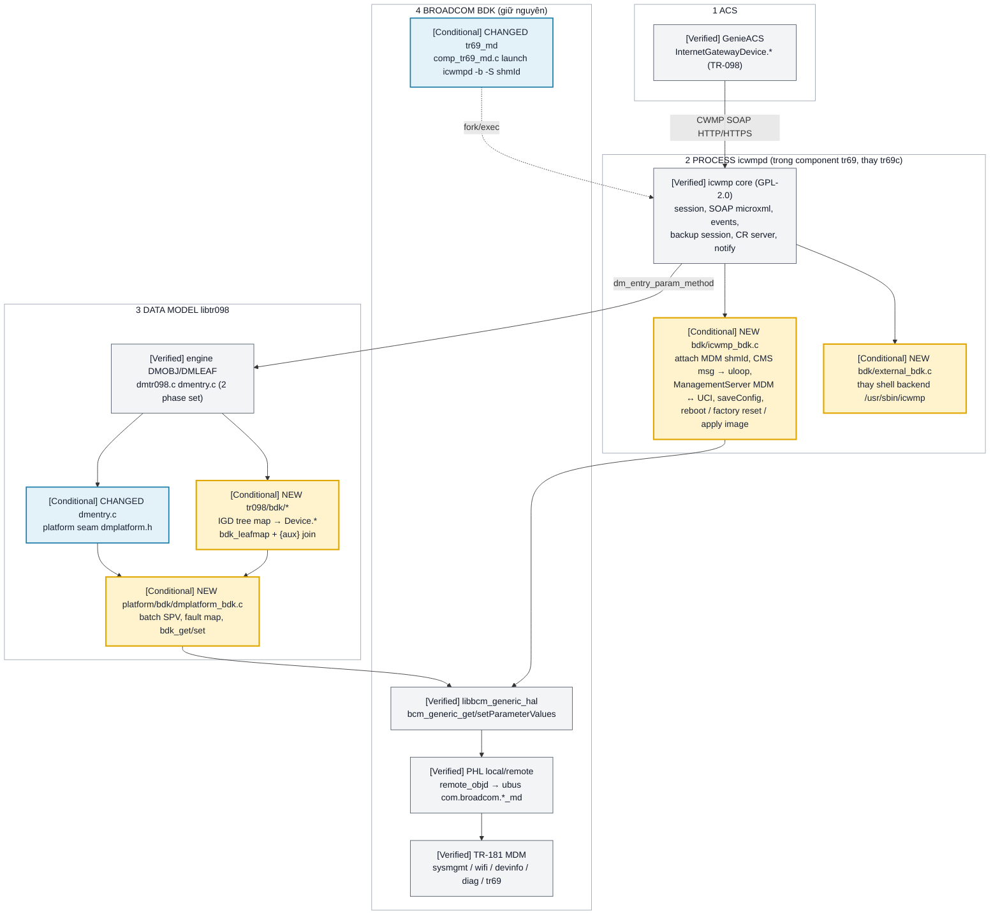

# iCWMP thay `tr69c` trên Broadcom BDK — thiết kế port TR-098 lên TR-181 Distributed MDM

Scope: đưa bản port iCWMP (fork `nvta2/icwmp` `51513f5`, dòng iopsys 3.x) + `libtr098`
(iopsys `bbf/tr-098` `dca7ba5`) mà user đã chạy thử trên Airoha OpenWrt SDK vào project
`brcm_ap_wifi7_mvn` (BDK `bcm963xx`, profile `MO77300EB`), để: build được trong SDK, chạy trong
component `tr69` thay `tr69c`, trình bày **TR-098** cho ACS trên nền **TR-181 Distributed MDM**,
và giữ lớp core độc lập platform để sau này chạy TR-181 hoặc đưa sang SDK khác.

Thay thế quyết định 2026-09-15 (IGD facade bên trong `tr69c`,
[tr098_facade_on_tr181_design.md](tr098_facade_on_tr181_design.md)): phần **bảng mapping
TR-098 → TR-181 và phân tích seam của `tr69c`** trong tài liệu đó vẫn dùng lại, phần "sửa
`tr69c`" không còn áp dụng.

Artifact: [issues/20260916_tr069_app_use_icwmp/](../issues/20260916_tr069_app_use_icwmp/README.md)
(`sdk-overlay/`, `0001-icwmp-bdk-integration.patch`, `install-overlay.sh`, `debug-commands.md`).

Trạng thái (cập nhật 2026-09-18): thiết kế 16/09 giữ nguyên, code overlay đã compile + link với
toolchain SDK 17/09 sau 8 commit fix (repo `sdk-overlay/userspace/`, build-fix HEAD `c23ee3d`, dọn 18/09 `7ae2ed5`, bảng ở README
issue mục *Lịch sử fix build*). Phase 0 chờ bằng chứng `fs.install/bin/icwmpd`, phase 1 chưa bắt đầu.

## START HERE — current tới proposed

**Chú thích màu:** ⬜ xám = giữ nguyên · 🟨 vàng = **MỚI** · 🟦 xanh = **BỊ SỬA**.



## 1. Current Flow

- [Verified] Trên BDK + Distributed MDM, `tr69_md` sở hữu component `tr69` (`libmdm2_tr69.so`,
  namespace `Device.ManagementServer.` …) và `compMd_launchTr69c()` fork `/bin/tr69c -m <shmId>
  -d -I 1` (`packages/common/mgmt/bcm_comp_md/comp_tr69_md.c:262-278`). SHM của MDM tạo bằng
  `shmget(0, …)` (`cms_core/linux/oal_mdm.c:279`) nên **shmId chỉ truyền được qua launcher**,
  không tự tìm được.
- [Verified] `tr69c` attach MDM bằng `cmsMsg_initOnBus(EID_TR69C, 0, TR69_MSG_BUS)` +
  `cmsMdm_initWithConfig{eid=EID_TR69C, accessBit=NDA_ACCESS_TR69C,
  shmAttachAddr=MDM_SHM_ATTACH_ADDR_TR69, lockKeyOffset=TR69_KEY_OFFSET}` sau khi ngủ 20 s chờ
  `sysmgmt` (`tr69c/main/mainCms.c:1969-2014`).
- [Verified] Mọi Get/Set của ACS đi qua **một boundary**: `bcmGeneric_get/setParameterValuesFlags`
  (`tr69c/SOAPParser/dmCms.c:298-731`), tức PHL. `libbcm_generic_hal` là wrapper public của đúng
  boundary đó (`packages/common/mgmt/bcm_generic_hal/generic_hal.c`).
- [Verified] SetParameterValues là **một batch**: PHL validate tên/kiểu/writable/giá trị cho
  toàn bộ mảng rồi mới apply, lỗi từng param nằm trong `BcmGenericParamInfo.errorCode` và mã
  `BcmRet 9000..9032` trùng mã fault CWMP (`bcm_retcodes.h:56-154`). Kiểu param phải khớp chuỗi
  type của MDM (`cms_core/phl.c:803-815`).
- [Verified] Kết thúc session `tr69c` gọi `cmsMgm_saveConfigToFlash()`; reboot bằng
  `bcmUtl_loggedBusybox_reboot`; factory reset bằng `cmsMgm_invalidateConfigFlash()`; firmware
  bằng `cmsImg_validateImage → cmsImg_writeImageIncremental → reboot(SOFTWARE_UPGRADE)`
  (`tr69c/bcmLibIF/bcmWrapperCms.c:109-145,340-490`).
- [Verified] Event vào `tr69c`: `tr69_md` chuyển `CMS_MSG_ACS_CONFIG_CHANGED`,
  `CMS_MSG_TR69_ACTIVE_NOTIFICATION`, `CMS_MSG_WAN_CONNECTION_UP` tới `EID_TR69C`, và **relaunch
  nếu process không còn** (`tr69_md/tr69_md.c:567-620,703-716`). Đăng ký interest gửi tới
  `EID_SMD` được `tr69_md` trả lời (`tr69_md.c:646-670`).
- [Verified] Bản port của user trên Airoha OpenWrt: icwmp `--enable-icwmp_tr098` link `libtr098`
  thay `libbbfdm`; libtr098 là cây IGD đọc/ghi **UCI + ubus OpenWrt** (`tr098/*.c`), hành động hệ
  thống qua script `/usr/sbin/icwmp` (pipe JSON, `external.c`). Diff local chỉ là sửa compile
  (`static inline`, `is_error`, `struct cwmp_namespaces ns` static).

## 2. Problem or Limitation

- [Verified] BDK không có `libuci`, `libmicroxml`, rpcd `uci` object, `netifd`, `sysupgrade`,
  `/etc/config` ghi được (rootfs squashfs, `/data` là partition bền), nên bản OpenWrt không chạy
  nguyên trạng. icwmp truy cập `node->value.opaque` 294 chỗ → không dùng được mxml 3.3.1 của SDK
  (struct private), phải mang microxml.
- [Verified] Toàn bộ `tr098/*.c` của libtr098 (landevice 4278 dòng, wandevice 2585 …) gắn với
  `struct uci_section` của OpenWrt; không có cách "đổi prefix" IGD ↔ Device (đã chứng minh ở
  [tr098_facade_on_tr181_design.md](tr098_facade_on_tr181_design.md) và
  `knowledge/protocol/broadcom-bdk-cwmp-data-model-boundary.md`).
- [Verified] icwmp là multi-thread (session, uloop, notify, periodic, download…), còn
  `cmsMsg`/PHL của BDK không thread-safe (`tr69c` single-thread select).
- [Not established] Instance TR-181 trên MO77300EB (`IP.Interface.1` = br0, `DHCPv4.Server.Pool.1`,
  `WiFi.SSID.{i}` ↔ `AccessPoint.{i}`) mới lấy từ dump reference board
  `logs/20260828_referenceBoard`, chưa dump trên MO77300EB.

## 3. Proposed Flow

- [Conditional] Khi overlay được build: `tr69_md` launch `/bin/icwmpd -b -S <shmId>`
  (`SUPPORT_ICWMP`); icwmpd attach MDM y như `tr69c`; mọi GPV/SPV/GPN/Add/Del của ACS đi
  `xml.c → dm_entry_param_method → cây IGD (tr098/bdk) → bdk_map_get/set → libbcm_generic_hal`;
  SPV gom thành một `bcm_generic_setParameterValues` ở `dm_platform_commit()`; hết session
  `icwmp_bdk_end_session()` đồng bộ ManagementServer UCI→MDM rồi `saveConfig`.

**Chú thích màu:** ⬜ giữ nguyên · 🟨 **MỚI** · 🟦 **BỊ SỬA**. Gate hình thoi.

```mermaid
flowchart TB
    subgraph START["A. START trong component tr69"]
        direction TB
        MD["[Verified] tr69_md compMd_initTr69<br/>cmsMdm_initWithConfig libmdm2_tr69.so"]
        L{"[Conditional] SUPPORT_ICWMP?"}
        T69["[Verified] fork tr69c -m shmId -d -I 1"]
        IC["[Conditional] NEW fork icwmpd -b -S shmId"]
        INIT["[Conditional] NEW icwmp_bdk_init<br/>cmsMsg_initOnBus TR69_MSG_BUS<br/>sleep 20 s, cmsMdm_initWithConfig<br/>REGISTER_EVENT_INTEREST x4"]
        EN{"[Conditional] Device.ManagementServer.<br/>EnableCWMP?"}
        EXIT["[Conditional] exit (tr69_md relaunch<br/>khi ACS_CONFIG_CHANGED)"]
        SYNC["[Conditional] NEW sync MDM → UCI cwmp<br/>URL, user, pwd, periodic, CR, BoundIfName"]
        MD --> L
        L -->|"không"| T69
        L -->|"có"| IC --> INIT --> EN
        EN -->|"false"| EXIT
        EN -->|"true"| SYNC
    end

    subgraph RPC["B. RPC từ ACS"]
        direction TB
        GPV["[Verified] xml.c GetParameterValues<br/>dm_entry_param_method CMD_GET_VALUE"]
        WALK["[Verified] dm_browse cây IGD<br/>browse*Inst → DM_LINK_INST_OBJ(objctx)"]
        MAP["[Conditional] NEW bdk_map_get<br/>refparam → {i} → bdk_leafmap → path TR-181"]
        HAL["[Verified] bcm_generic_getParameterValues<br/>PHL local hoặc remote_objd → ubus *_md"]
        SPV["[Verified] SetParameterValues<br/>VALUECHECK từng param"]
        CHK["[Conditional] NEW bdk_check_writable<br/>GPV lấy type + writable"]
        APPLY["[Verified] dm_entry_apply VALUESET"]
        Q["[Conditional] NEW bdk_queue_set<br/>pending list"]
        COMMIT{"[Conditional] NEW dm_platform_commit<br/>1 batch bcm_generic_setParameterValues"}
        OK["[Conditional] SetParameterValuesResponse<br/>Status 1"]
        FLT["[Conditional] Fault 9003 + per-param<br/>errorCode → list_fault_param"]
        GPV --> WALK --> MAP --> HAL
        SPV --> CHK --> APPLY --> Q --> COMMIT
        COMMIT -->|"BCMRET_SUCCESS"| OK
        COMMIT -->|"INVALID_ARGUMENTS"| FLT
    end

    subgraph END["C. HẾT SESSION / EVENT"]
        direction TB
        ES["[Verified] run_session_end_func<br/>apply_end_session, restart_services (no-op BDK)"]
        SAVE["[Conditional] NEW icwmp_bdk_end_session<br/>sync UCI → MDM ManagementServer<br/>bcm_generic_databaseOp saveConfig"]
        RB{"[Verified] END_SESSION_REBOOT /<br/>FACTORY_RESET?"}
        RBX["[Conditional] NEW external_bdk<br/>bcmUtl_loggedBusybox_reboot /<br/>cmsMgm_invalidateConfigFlash"]
        MSG["[Conditional] NEW uloop fd CMS msg<br/>ACS_CONFIG_CHANGED → sync + reload<br/>TR69_ACTIVE_NOTIFICATION → notify thread<br/>WAN_CONNECTION_UP → sync"]
        ES --> SAVE --> RB
        RB -->|"có"| RBX
        RB -->|"không"| MSG
    end

    SYNC --> GPV
    HAL --> SPV
    OK --> ES
    FLT --> ES

    classDef unchanged fill:#f3f4f6,stroke:#4b5563,stroke-width:1px,color:#111827
    classDef new fill:#fff3cd,stroke:#e0a800,stroke-width:2.5px,color:#1a2233
    classDef changed fill:#e3f2f9,stroke:#1c7ca8,stroke-width:2px,color:#1a2233
    class MD,T69,GPV,WALK,HAL,SPV,APPLY,ES unchanged
    class IC,INIT,SYNC,MAP,CHK,Q,COMMIT,OK,FLT,SAVE,RBX,MSG,EXIT new
    class L,EN,RB changed
    style START fill:#ffffff,stroke:#9ca3af,stroke-width:1px,color:#111827
    style RPC fill:#ffffff,stroke:#9ca3af,stroke-width:1px,color:#111827
    style END fill:#ffffff,stroke:#9ca3af,stroke-width:1px,color:#111827
```



### Ba lớp và ranh giới portable

| Lớp | Thư mục | Biết gì | Không biết gì |
|---|---|---|---|
| CWMP core | `apps/icwmp/icwmp/*.c` | SOAP, session, event, backup, CR, `dm_entry_*` API | NVRAM, MDM, UCI (trừ config của chính nó) |
| Data model | `libs/libtr098/libtr098/{dmtr098,dmentry}.c` + `tr098/bdk/*` | cây IGD, mapping semantic → path TR-181 | cách đọc/ghi TR-181 |
| Platform | `libtr098/platform/bdk/`, `icwmp/bdk/` | `libbcm_generic_hal`, CMS msg, flash, reboot | TR-098 |

Port sang SDK khác = viết lại hai thư mục `platform/<sdk>/` và `icwmp/<sdk>/`, giữ nguyên hai
lớp trên. Chạy TR-181 trên BDK = một `root_bdk_tr181.c` pass-through `Device.*` (chưa làm).

### Mapping table — cách thêm một tham số

```c
/* tr098/bdk/landevice_bdk.c */
static const struct bdk_leafmap wlan_map[] = {
	{"SSID",     "SSID",                                   BDK_MAP_RW},   /* relative: base = Device.WiFi.SSID.{i}. */
	{"Channel",  "Device.WiFi.Radio.{aux0}.Channel",       BDK_MAP_RW},   /* join sang Radio qua aux0 */
	{"WMMEnable","Device.WiFi.AccessPoint.{aux1}.WMMEnable", BDK_MAP_RW | BDK_MAP_BOOL},
	{"SpecVersion", "1.0",                                 BDK_MAP_CONST},
	{0}
};
DMLEAF tWLANConfigurationParam[] = {
{"SSID", &DMWRITE, DMT_STRING, bdk_map_get, bdk_map_set, NULL, NULL},
...
```

`browseWLANConfigurationInst()` tạo `struct bdk_objctx{tr181_base="Device.WiFi.SSID.N.",
aux[0]=radio, aux[1]=accesspoint}` từ `LowerLayers`/`SSIDReference` và đưa vào
`DM_LINK_INST_OBJ`. Tham số cần logic (BeaconType ↔ `Security.ModeEnabled`, Status Up/Down ↔
Up/Disabled, DNSServers gộp `DNS.Client.Server.*`) là getter/setter tay cạnh bảng.

## 4. Detailed Changes

| Delta | Module/symbol | Input/output hoặc state | Lý do |
|---|---|---|---|
| NEW | `userspace/public/libs/microxml` (`80a15162`) | `libmicroxml.so`, `microxml.pc` | icwmp dùng struct node public của mxml 2.x |
| NEW | `userspace/public/libs/uci` (`5781664d`, `uci.h` CONFDIR `/data/icwmp/config`) | `libuci.so`, `/bin/uci` | config icwmp bền trên rootfs read-only |
| NEW | `libtr098/platform/dmplatform.h`, `dmplatform_uci.c`, `platform/bdk/dmplatform_bdk.c` | `dm_platform_ctx_init/clean/commit/revert/restart_services` | seam platform, batch SPV |
| NEW | `libtr098/platform/bdk/dmbdk.h` | `bdk_get_value*`, `bdk_set_value_now`, `bdk_get_instances`, `bdk_add/del_object`, `bdk_leafmap`, `bdk_map_get/set`, `bdk_queue_set`, `bdk_check_writable`, `bdk_lock` | API cho object BDK |
| NEW | `libtr098/tr098/bdk/{root,deviceinfo,landevice,wandevice}_bdk.c` | cây IGD: DeviceInfo, ManagementServer (dùng lại uci impl), LANDevice.1 (LANHostConfigManagement, IPInterface.1, LANEthernetInterfaceConfig.{i}, WLANConfiguration.{i}+PreSharedKey.1+AssociatedDevice.{i}, Hosts.Host.{i}), WANDevice.1 (WANCommonInterfaceConfig, WANEthernetInterfaceConfig, WANConnectionDevice.1.WANIPConnection.{i}) | phase 1-3 coverage |
| CHANGED (17/09, user) | `landevice_bdk.c` `get/set_lan_dns_servers` | `LANHostConfigManagement.DNSServers` ← danh sách `Device.DNS.Client.Server.{i}.DNSServer` thay vì `DHCPv4.Server.Pool.1.DNSServers` (dump ref: `0.0.0.0,0.0.0.0`) | ACS thấy DNS thật thay vì `0.0.0.0`; setter ghi ngược DNS.Client chưa kiểm |
| CHANGED (17/09, user) | `deviceinfo_bdk.c` `lookup_vcf_name()` | stub trả `""` | icwmp `xml.c:2491` cần symbol này khi link, `deviceinfo.c` gốc không compile ở bdk |
| CHANGED (17/09, user) | `libtr098/dmuci.h`, `configure.ac` ×2, dọn warning | wrapper `NEW_UCI_PATH` có `return`, bỏ `AM_INIT_AUTOMAKE` trùng | `BRCM_WERROR_CFLAGS` (`-Werror=return-type -Werror=uninitialized`) và autoconf mới |
| CHANGED | `libtr098/dmentry.c` | hook 5 chỗ | gọi seam |
| CHANGED | `libtr098/dmuci.h`, `dmtr098.h`, `dmcommon.c` | path `#ifndef`, `TR098_CONFIG "/%s"` | override path `/data` |
| CHANGED | `libtr098/configure.ac`, `bin/Makefile.am` | `--with-platform=bdk`, source list | build hai platform |
| NEW | `icwmp/bdk/icwmp_bdk.c/.h` | `-S shmId -X`, attach MDM, uloop fd, sync MS ↔ UCI, saveConfig, reboot, factory reset, apply image/config | thay `mainCms.c` + `bcmWrapperCms.c` |
| NEW | `icwmp/bdk/external_bdk.c` | cùng API `external.h`, download libcurl vào `/tmp/icwmp/download.bin` | thay script `/usr/sbin/icwmp` |
| CHANGED | `icwmp/config.c`, `cwmp.c`, `ubus.c`, `event.c`, `configure.ac`, `bin/Makefile.am` | `#ifdef ICWMP_BDK` | cắm glue |
| NEW | `apps/icwmp/files/cwmp` | seed UCI, `cpe.port=30005` (cổng firewall đã mở cho tr69c, `rut_iptables.c:2361-2365`) | CR qua firewall SDK |
| CHANGED (patch) | `targets/MO77300EB/MO77300EB` | `MGMT_TR69C=y`, `BUILD_TR69C*=dynamic`, `BUILD_ICWMP=y` | build `tr69_md`, `libmdm_cbk_tr69` thật, overlay |
| CHANGED (patch) | `make.common` | `BUILD_ICWMP` → `SUPPORT_ICWMP`, `BUILD_LIBUCI/LIBMICROXML/LIBTR098` | wiring |
| CHANGED (patch) | `comp_tr69_md.c compMd_launchTr69c` | exe `icwmpd`, args `-b [-X] -S shmId` | supervisor |

## 5. Impact and Risk

- **License**: icwmp fork và libtr098 là GPL-2.0, glue link in-process với `libcms_core`,
  `libmdm_cbk_tr69`, `libbcm_generic_hal` (proprietary Broadcom). Đây là xung đột license khi
  phân phối. Giảm thiểu: seam `dmplatform.h`/`icwmp_bdk.h` đủ hẹp để tách phần BDK ra process
  `cwmp-bdk-adapter` (IPC ubus/unix socket) sau khi PoC chạy, hoặc chuyển core sang iCWMP 7.x
  (BSD-3). Cần legal review trước khi ship; tài liệu này không kết luận pháp lý.
- **Thread-safety**: `bdk_lock()` (mutex recursive) bọc mọi call generic HAL và xử lý CMS msg,
  nhưng `dmmem` arena của libtr098 và `dm_ctx` global không có lock — cùng vấn đề đã có ở icwmp
  gốc (notify thread vs session thread). Nếu thấy crash ngẫu nhiên khi ACS gửi RPC trùng thời
  điểm value-change, thêm mutex ở `dm_ctx_init`/`dm_ctx_clean`.
- **Compatibility**: `tr69c` vẫn build nhưng không launch; `tr69_mdmcli`, WebUI, `libmdm_cbk_tr69`
  (ConnectionRequestURL của MDM tính cho port 30005 path `/`) giữ nguyên. icwmp tự tính
  `ConnectionRequestURL` của nó (path ngẫu nhiên) từ IP interface `cwmp.cpe.interface`; MDM
  `ConnectionRequestURL` sẽ **lệch** với giá trị ACS thấy — chấp nhận ở phase 1, ghi vào
  Chưa chứng minh.
- **Error/rollback**: SPV batch fail → PHL không apply gì (`local_setParamValuesFlags` validate
  trước), icwmp trả 9003 + per-param fault. Firmware: chỉ FileType 1 và 3; `rutFwImg_updateFirmwareObject`
  (cms_core private) chưa gọi → `Device.DeviceInfo.FirmwareImage` không cập nhật sau upgrade.
- **Persistence/upgrade**: `/data/icwmp/` sống qua reboot và upgrade image; factory reset xóa
  cả `/data/icwmp/config/cwmp`, notify list, backup session. Seed lấy từ `/etc/icwmp/cwmp`.
- **Performance**: mỗi leaf = 1 GPV qua PHL (remote → ubus). `GetParameterValues
  InternetGatewayDevice.` full walk trên 48 SSID × ~30 leaf ≈ 1500 GPV remote; chấp nhận cho PoC,
  phase 4 gộp bằng `bcm_generic_getParameterValues` subtree một lần per object.

## 6. Validation and Regression

Phase và gate (mỗi phase phải qua gate mới sang phase sau):

| Phase | Nội dung | Gate pass |
|---|---|---|
| 0 Build | `install-overlay.sh --apply-patch`, `make PROFILE=MO77300EB BRCM_MAX_JOBS=1` | 4 package build, `/bin/icwmpd` + 3 lib có trong `fs.install` — **17/09: đã tới link icwmpd, `ls fs.install` chưa ghi lại** |
| 1 Attach + Inform | boot, `tr69_md` launch icwmpd, attach MDM, Inform DeviceId từ `Device.DeviceInfo.*` | GenieACS thấy device `InternetGatewayDevice`, `0 BOOTSTRAP` → `1 BOOT`, GPV `DeviceInfo.` đúng serial/version |
| 2 ManagementServer + SPV | WebUI đổi URL → icwmpd reload; ACS SPV `PeriodicInformInterval`, `ProvisioningCode` | giá trị đổi trong MDM (`tr69_mdmcli`) và sống qua reboot |
| 3 LAN/WAN/Wi-Fi read | GPN/GPV `LANDevice.1.`, `WANDevice.1.` | instance/giá trị khớp `dumpmdm` |
| 4 Wi-Fi write + CR | SPV `WLANConfiguration.{i}.SSID/Enable/Channel/KeyPassphrase`, Connection Request port 30005 | Wi-Fi đổi thật (`wl ssid`), CR → session mới |
| 5 Ops | Reboot, FactoryReset, Download FW/config, HTTPS verify, soak 24-72 h | theo `debug-commands.md` |

Regression tối thiểu: WebUI ManagementServer page, `tr69_mdmcli`, boot time (icwmpd ngủ 20 s như
tr69c), WAN up/down không làm icwmpd chết, `ps` không còn `tr69c`.

## 7. Chưa chứng minh được

- [Conditional] Build với toolchain vendor: 17/09 đã qua compile `microxml`/`uci`/`libtr098`/`icwmp`
  và tới bước link `icwmpd` (commit cuối `c23ee3d` sửa undefined reference). Chưa có log/`ls`
  chứng minh image hoàn chỉnh — gate 0 trong `debug-commands.md`.
- [Not established] `set_lan_dns_servers` ghi `Device.DNS.Client.Server.{1,2}.DNSServer`: entry
  này trên reference board do DHCP client WAN sinh (`Type=DHCPv4`), MDM có nhận set và có giữ qua
  lease renew không.
- [Not established] Instance TR-181 và giá trị boolean ("1"/"0" vs "TRUE") trên MO77300EB — code
  chuẩn hoá cả hai nhưng chưa thấy runtime.
- [Not established] `CMS_MSG_TR69_ACTIVE_NOTIFICATION` có đến icwmpd không khi param đổi ở
  `wifi_md` (đường pubsub `mdm_notification:<comp>` → `tr69_md` → `EID_TR69C`).
- [Not established] Hành vi `tr69_md` relaunch icwmpd với `-b` (BOOT event lặp) sau khi
  `EnableCWMP` toggle.
- [Not established] Firewall cổng 30005 với nftables profile (`BUILD_IPTABLES` tắt) — chỉ đọc
  `rut_iptables.c`, chưa xem biến `ipt` resolve ra gì.

## 8. Tài liệu và patch liên quan

- Current trace: [tr069_cwmp_request_flow.md](tr069_cwmp_request_flow.md) (tr69c),
  [tr098_facade_on_tr181_design.md](tr098_facade_on_tr181_design.md) (mapping IGD ↔ Device),
  `issues/20260914_tr069_app_current_build_profile/opensource-cwmp-agent-evaluation.md`.
- Patch artifact: [issues/20260916_tr069_app_use_icwmp/](../issues/20260916_tr069_app_use_icwmp/README.md)
  — `sdk-overlay/`, `0001-icwmp-bdk-integration.patch`, `install-overlay.sh`, `debug-commands.md`.
- Kiến thức tái dùng: `knowledge/protocol/portable-cwmp-agent-platform-boundary.md`,
  `knowledge/protocol/icwmp-on-broadcom-bdk-adapter-pattern.md`.
