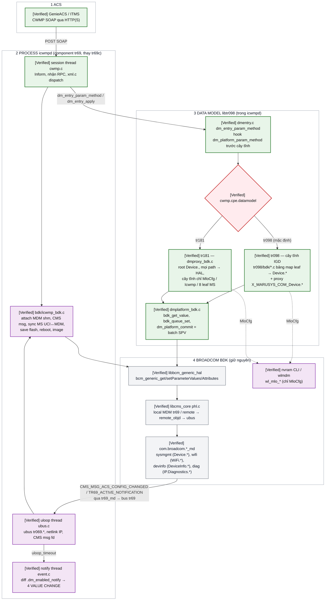
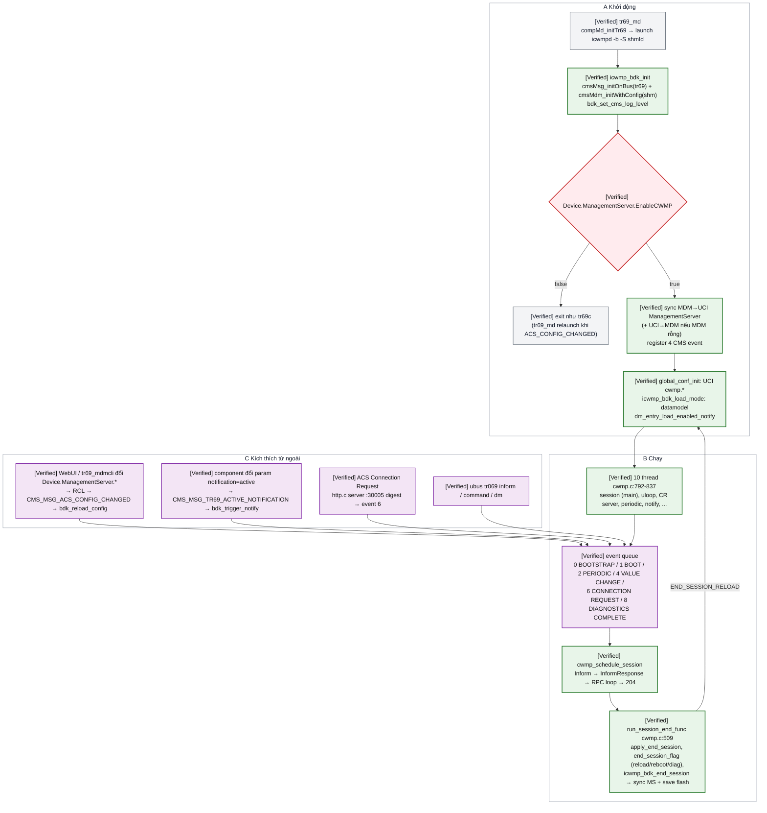
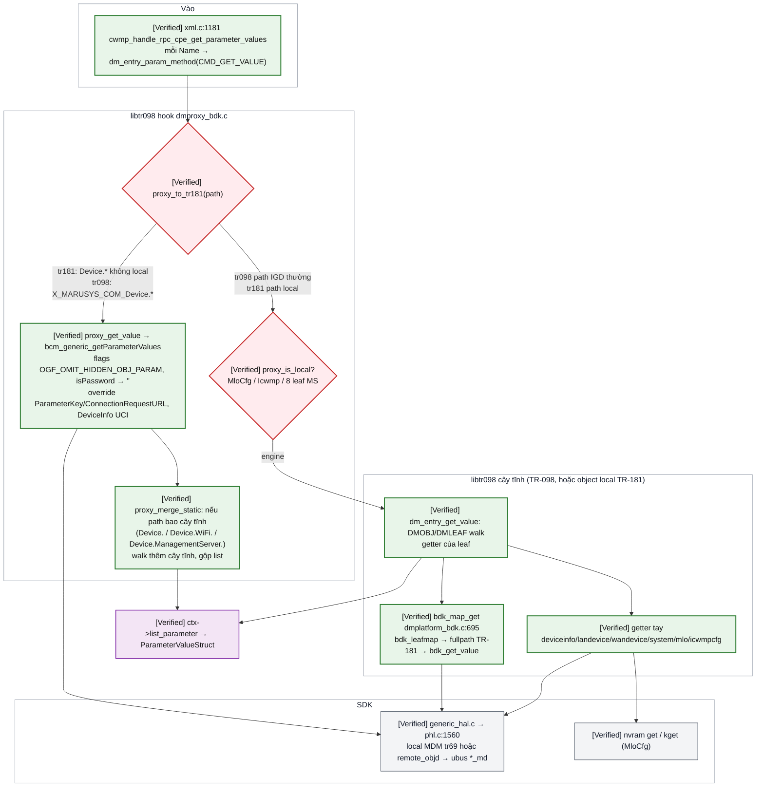
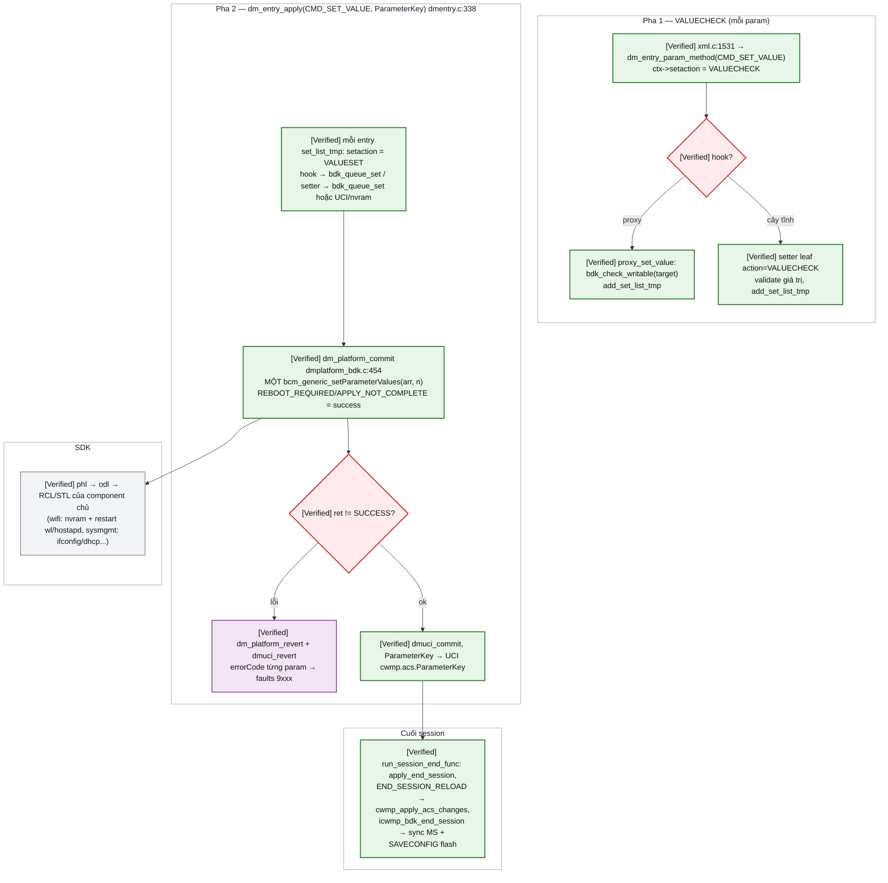
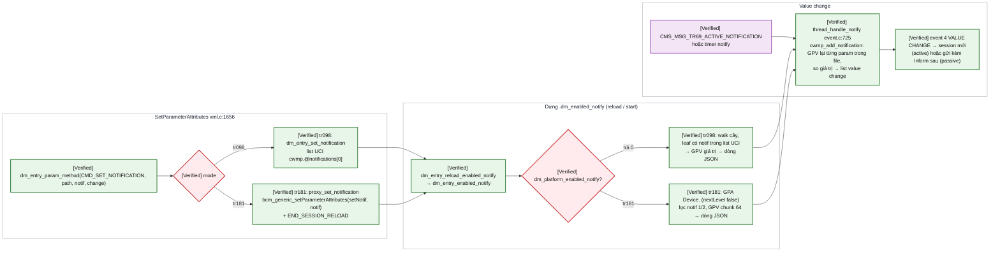

# iCWMP trên Broadcom BDK — flow runtime: process, giao tiếp, xử lý RPC theo data model TR-098 / TR-181

Scope: `icwmpd` (iopsys 3.x, GPL) + `libtr098` backend BDK chạy trong component `tr69` thay `tr69c`
trên `MO77300EB`. Tài liệu này trả lời: process nào chạy, chúng nói chuyện với nhau bằng gì, một RPC
từ ACS đi qua những hàm/boundary nào, và **khác nhau ở đâu khi `cwmp.cpe.datamodel` = `tr098` hay
`tr181`**. Bản so sánh nhanh hai model: [icwmp_datamodel_tr098_tr181_matrix.md](icwmp_datamodel_tr098_tr181_matrix.md).
Lệnh debug/dump/giả lập ACS: [icwmp_bdk_debug_guide.md](icwmp_bdk_debug_guide.md).

Nhãn: **[Verified]** = đã đọc caller + callee trong snapshot; **[Conditional]** = đúng theo build
flag/config; **[Not established]** = chưa chứng minh. Toàn bộ code overlay `0017`..`0028` **chưa
build-test đầy đủ / chưa board-test** (không có toolchain trên host, xem issue README) — "Verified"
ở đây là verified **trên source**, không phải trên board, trừ khi ghi "board".

## START HERE — flow một màn hình

**Chú thích màu:** 🟩 xanh lá = đường chính của RPC · 🟪 tím = dữ liệu/config · 🟥 đỏ = gate quyết
định · ⬜ xám = thành phần SDK giữ nguyên.



## Kết luận chính

- **[Verified]** Chỉ có **một process mới**: `icwmpd` (thay `tr69c`, do `tr69_md` fork/exec với
  `-b -S <shmId>`, patch SDK `0001` `comp_tr69_md.c`). Mọi thứ khác của SDK giữ nguyên:
  `tr69_md`, `bcm_msgd`, `remote_objd`, `sys_directory`, `sysmgmt_md`, `wifi_md`, `devinfo_md`,
  `diag_md`. `libtr098` là thư viện **trong** process `icwmpd`, không phải process.
- **[Verified]** Đường ghi/đọc data model của cả hai mode kết thúc ở **cùng một chỗ**: generic HAL
  (`bcm_generic_*`, `generic_hal.c`) → PHL (`phl.c:1560`) → MDM local của tr69 hoặc `remote_objd` →
  ubus `com.broadcom.<comp>_md`. Khác nhau chỉ ở **tầng libtr098**: TR-098 đi qua cây tĩnh + bảng map
  (`tr098/bdk/*.c`), TR-181 đi thẳng hook `dm_platform_param_method()` (`dmproxy_bdk.c:631`).
- **[Verified]** Chọn model bằng UCI `cwmp.cpe.datamodel`, đọc lại mỗi `dm_platform_ctx_init()` (libtr098,
  `bdk_proxy_load_mode()`) và mỗi `cwmp_config_reload()` (icwmpd, `icwmp_bdk_load_mode()`), nên đổi
  model = `uci set` + `ubus call tr069 command '{"command":"reload"}'`, không restart, không rebuild.
- **[Verified]** Ba object do icwmpd tự phục vụ ở cả hai model, không có trong MDM:
  `X_MARUSYS_COM_MloCfg.` (nvram `wl_mlo_*` + SPV các link BSS qua HAL), `ManagementServer.X_MARUSYS_COM_Icwmp.`
  (UCI `cwmp.cpe.*`), và 8 leaf `ManagementServer.*` icwmp-only (HTTPCompression*, LightweightNotification*,
  AliasBasedAddressing, InstanceMode — UCI). `ManagementServer.*` còn lại: TR-098 lưu UCI rồi đẩy lên MDM
  cuối session; TR-181 ghi thẳng MDM rồi kéo về UCI cuối session.
- **[Verified]** Notification/value-change: TR-098 lưu list UCI `cwmp.@notifications[0]`; TR-181 lưu
  attribute trong MDM (`bcm_generic_get/setParameterAttributes`) như tr69c. Cả hai mode đều dựng file
  `/data/icwmp/tr098/.dm_enabled_notify` và thread notify của icwmp diff file đó — cơ chế `4 VALUE CHANGE`
  không đổi; trigger chủ động là `CMS_MSG_TR69_ACTIVE_NOTIFICATION` từ MDM.
- **[Verified board 19/09, image 0016]** Tới ACS đã đến bước `InformResponse`… rồi 401 (ACS-side). Mọi flow
  RPC dưới đây **chưa chạy trên board với ACS thật**; test không cần ACS bằng `ubus call tr069 dm`.

## Tài liệu / case đã có và phần dùng lại

| Tài liệu | Dùng lại gì |
|---|---|
| [tr069_cwmp_request_flow.md](tr069_cwmp_request_flow.md) | Bản đồ process SDK (`tr69_md`, `remote_objd`, `sys_directory`, `*_md`), namespace ownership (`Device.WiFi.` = wifi_md…), message bus `CMS_MSG_*`, ubus `getParameterValues{fullpath_array,nextlevel,flags}`. Phần **tầng dưới HAL** của tài liệu này lấy nguyên từ đó, không trace lại |
| [icwmp_bdk_port_design.md](icwmp_bdk_port_design.md) | Kiến trúc 3 lớp (icwmp core / libtr098 seam / backend BDK), lý do chọn iCWMP + libtr098 |
| [icwmp_tr098_bdk_mapping_matrix.md](icwmp_tr098_bdk_mapping_matrix.md) | Bảng map từng leaf TR-098 → TR-181 (phần 1–8) |
| [tr181_parameter_development_guide.md](tr181_parameter_development_guide.md) | Thêm param **vào MDM** (XML + RCL/STL) khi cần param TR-181 mới thật sự |
| Issue [20260916_tr069_app_use_icwmp](../issues/20260916_tr069_app_use_icwmp/README.md) | Lịch sử patch `0001`..`0028`, trạng thái test, log board |

## Snapshot và build provenance

| Cây | Snapshot | Ghi chú |
|---|---|---|
| SDK `src/bcm963xx` | lguplus `9f2a56abd0de9172bfe1283a8718a56cbce87e4e`, profile `MO77300EB` | chỉ đổi bởi patch `0001` (`make.common`, `comp_tr69_md.c`, profile) |
| Overlay `issues/20260916_tr069_app_use_icwmp/sdk-overlay/userspace/` | HEAD `0237b39` (patch `0028`, 20/09) | repo git riêng, source root `userspace/` |
| iopsys icwmp / libtr098 | icwmp 3.x + libtr098 `0.1` (pivasoftware) | GPL-2 |

Đường dẫn dưới đây relative tới `sdk-overlay/userspace/public/` (icwmp: `apps/icwmp/icwmp/`, libtr098:
`libs/libtr098/libtr098/`) trừ khi ghi `bcm963xx/`. Số dòng = anchor của snapshot trên.

## Bản đồ process và thành phần

| Process / lib | Ở đâu | Vai trò | Nhãn |
|---|---|---|---|
| `tr69_md` | `bcm963xx/userspace/private/apps/tr69_md/`, `comp_tr69_md.c` (patch `0001`) | Component manager bus `tr69`: tạo `bcm_msgd`, MDM `libmdm2_tr69.so`, đăng ký namespace `Device.ManagementServer.` …, **launch `icwmpd -b -S <shmId>`** thay `tr69c`, forward event bus → CMS msg cho `EID_TR69C` | Verified (patch `0001`) |
| `icwmpd` | `apps/icwmp/icwmp/` (binary `icwmp_tr098d`, cài tên `icwmpd`) | CWMP engine: HTTP client (libcurl) / CR server, SOAP (microxml), events, backup session, notify; **thread**: main = session thread (`cwmp.c`), uloop (`ubus.c`), CR server (`http.c`), periodic/notify/scheduleInform/download… (`cwmp.c:792-837`) | Verified |
| `bdk/icwmp_bdk.c` (trong icwmpd) | `apps/icwmp/icwmp/bdk/` | Attach MDM shm (`cmsMdm_initWithConfig`, `icwmp_bdk_init` :283), CMS msg fd vào uloop, xử lý `ACS_CONFIG_CHANGED`/`TR69_ACTIVE_NOTIFICATION`/`WAN_CONNECTION_UP`/`PING_STATE_CHANGED` (`bdk_handle_msg` :407), sync `ManagementServer` MDM↔UCI (:578/:625), `icwmp_bdk_end_session` (:717), save flash, reboot, factory reset, apply image | Verified |
| `bdk/icwmp_bdk_dm.c` | cùng trên | ubus `tr069 dm`: GPV/GPN/SPV/Add/Del/GPA/SPA/Inform-list trên board không cần ACS (`0017`, mở rộng `0028`) | Verified |
| `libtr098.so` | `libs/libtr098/libtr098/` | Engine DMOBJ/DMLEAF (`dmtr098.c`, `dmentry.c`), UCI của icwmp (`dmuci.c`, config `/data/icwmp/config`), seam `platform/dmplatform.h` | Verified |
| `tr098/bdk/*.c` | libtr098 | Cây tĩnh `InternetGatewayDevice.` cho BDK: bảng map leaf → TR-181 (`bdk_leafmap`), getter/setter tay (`deviceinfo_bdk.c`, `landevice_bdk.c`, `wandevice_bdk.c`, `system_bdk.c`), `mlo_bdk.c`, `icwmpcfg_bdk.c`, `root181_bdk.c` (cây tĩnh của mode TR-181) | Verified |
| `platform/bdk/dmplatform_bdk.c` | libtr098 | `bdk_get_value*` (GPV 1 path, :100), `bdk_queue_set` (:359) + `dm_platform_commit` (batch SPV, :454), `bdk_add/del_object`, `bdk_map_get/set` (:695/:734), lock `bdk_lock` | Verified |
| `platform/bdk/dmproxy_bdk.c` | libtr098 | Proxy: TR-098 `X_MARUSYS_COM_Device.<rest>` ↔ `Device.<rest>`, TR-181 toàn bộ `Device.` (`dm_platform_param_method` :631), attributes/inform/enabled-notify TR-181 | Verified |
| `libbcm_generic_hal` → `libcms_core` (PHL/ODL/MDM) | `bcm963xx/packages/common/mgmt/bcm_generic_hal/generic_hal.c`, `cms_core/phl.c:1560` | `bcm_generic_getParameterValues` → `bcmGeneric_getParameterValuesFlags` → PHL split local/remote | Verified |
| `remote_objd`, `sys_directory`, `sysmgmt_md`, `wifi_md`, `devinfo_md`, `diag_md` | SDK | như [tr069_cwmp_request_flow.md](tr069_cwmp_request_flow.md#bản-đồ-module--process) | Verified (doc đó) |
| `nvram` CLI (unfnvram / wlmdm) | SDK | chỉ cho `MloCfg`: `nvram get/set/commit` (user nvram trong MDM qua wlmdm), `kget/kset/kcommit` (kernel nvram `wl_mlo_config`) — `libnvram.so` link `-lmdm_cbk_wifi` nên không link được vào icwmpd | Verified |
| `wldataeld`, WBD (`wbd_master`/`wbd_slave`) | SDK | điền `Device.WiFi.DataElements.*` (mesh/MLO trạng thái) — chỉ khi `wldataeld_enable=1` | Conditional |

### Giao tiếp giữa các thành phần

| Kênh | Giữa | Nội dung | Nhãn |
|---|---|---|---|
| HTTP(S) POST / SOAP | ACS ↔ `icwmpd` session thread (libcurl `http.c`) | Inform, RPC, Connection Request (server `http.c` port `cwmp.cpe.port`=30005, digest) | Verified |
| Shared memory MDM `tr69` (`-S shmId`) + lock CMS | `icwmpd` ↔ MDM local của component tr69 (`Device.ManagementServer.*`) | `bcm_generic_*` đọc/ghi local | Verified |
| CMS msg bus `tr69` (`/tmp/tr69_msg_bus`, `cmsMsg_initOnBus` `EID_TR69C`) | `tr69_md` → `icwmpd` (uloop fd `bdk_msg_cb`) | `CMS_MSG_ACS_CONFIG_CHANGED` `0x1000025A`, `TR69_ACTIVE_NOTIFICATION` `0x1000025D`, `WAN_CONNECTION_UP`, `PING/TRACERT_STATE_CHANGED`; chiều ngược PHL → `remote_objd`: `CMS_MSG_REMOTE_OBJ_GET/SET_PARAMS` | Verified |
| ubus `com.broadcom.<comp>_md` | `remote_objd` (tr69) → component chủ | `getParameterValues{fullpath_array,nextlevel,flags}`, `setParameterValues{fullpath_type_value_array,flags}`, `getParameterAttributes`, `setParameterAttributes`, `addObject`, `deleteObject` (`ubus_mdm.c:67-186`) | Verified |
| ubus object `tr069` | shell / script → `icwmpd` | `status`, `inform{event,GetRPCMethods}`, `command{reload,exit,reload_end_session,reboot_end_session,action_end_session}`, `notify`, `dm{cmd,path,value,key,next_level,file}` (`ubus.c:327-333`) | Verified |
| UCI `/data/icwmp/config/cwmp` (+ `/var/state` cho `cwmp.cpe.ip/ipv6`) | icwmpd ↔ libtr098 (cùng process, hai reader) | ACS URL/cred, periodic, `ParameterKey`, `cpe.*` (identity override, `datamodel`, `log_severity`, `amd_version`…), list `@notifications[0]` | Verified |
| File `/data/icwmp/tr098/.dm_enabled_notify` (JSON lines) | libtr098 ghi (`dm_entry_enabled_notify`), notify thread icwmp đọc | param có notification 1/2 + giá trị lần cuối | Verified |
| nvram (`wl_mlo_*`, kernel `wl_mlo_config`) | `mlo_bdk.c` ↔ WebUI `cgi_marusys_mlo.c` ↔ driver wl (đọc `wl_mlo_config` lúc module init) | trạng thái MLO chung với WebUI, link set cho driver (reboot) | Verified |
| Flash config (`bcm_generic_databaseOp(SAVECONFIG)`) | icwmpd → MDM | cuối mỗi session / mỗi `tr069 dm set` | Verified |

## Config / data tại các boundary

| Dữ liệu | Nơi | Ai ghi | Ai đọc |
|---|---|---|---|
| `cwmp.cpe.datamodel` (`tr098`\|`tr181`) | UCI | user / ACS qua `…X_MARUSYS_COM_Icwmp.DataModel` | `bdk_proxy_load_mode()` mỗi dm ctx, `icwmp_bdk_load_mode()` mỗi reload |
| `Device.ManagementServer.*` | MDM tr69 (+ flash) | WebUI, `tr69_mdmcli`, ACS (TR-181 trực tiếp, TR-098 qua sync cuối session) | icwmpd sync về UCI lúc start / `ACS_CONFIG_CHANGED` / cuối session TR-181 |
| `cwmp.acs.*`, `cwmp.cpe.*` | UCI | icwmpd sync từ MDM, setter libtr098 (`managementserver.c`, `icwmpcfg_bdk.c`) | `global_conf_init()` (start + reload), getter libtr098 |
| `cwmp.cpe.ip` / `ipv6` | `/var/state` (uci state) | netlink watcher `netlink.c:123-147` (uloop) | `get_management_server_connection_request_url` (BDK), `icwmp_bdk_sync_uci_only_to_mdm` |
| `cwmp.acs.ParameterKey` | UCI | libtr098 sau SPV/Add/Del (cây tĩnh và proxy) | GPV `ManagementServer.ParameterKey` (override đọc), đẩy lên MDM cuối session |
| Notification | TR-098: UCI `cwmp.@notifications[0]` · TR-181: attribute MDM | SPA | `dm_entry_enabled_notify` → file `.dm_enabled_notify` |
| Identity DeviceId | UCI `cwmp.cpe.{manufacturer,oui,product_class,serial_number,…}` (rỗng = MDM `Device.DeviceInfo.*`) | user (bring-up) | Inform DeviceId (`cwmp_get_deviceid`), `DeviceInfo.*` cả hai model (`devinfo_uci_override`) |
| `wl_mlo_bss_enabled/selected_config/ssid/security_mode/wpa_psk/description/interface`, `wl_mlo_bss_index` (mới), kernel `wl_mlo_config` | nvram | `mlo_bdk.c`, WebUI | `mlo_bdk.c` getter, driver wl (kernel nvram, lúc boot) |
| Backup session, crash log | `/data/icwmp/.icwmpd_backup_session.xml`, `/data/icwmp/crash.log` | icwmpd | icwmpd, người debug |
| Log | `/var/log/icwmpd.log` (icwmp, `cwmp.cpe.log_severity`), syslog `/var/log/messages` (CMS log của glue/libtr098/HAL, app name `icwmpd`) | — | — |

## Flow tổng quan — vòng đời icwmpd

**Chú thích màu:** 🟩 đường chính · 🟥 gate · 🟪 dữ liệu/state · ⬜ SDK.



Citation: `icwmp_bdk_init` `bdk/icwmp_bdk.c:283-355` (attach, EnableCWMP, sync, register event),
`bdk_handle_msg` `:407-447`, `cwmp_config_reload` `config.c:1270-1297`, `run_session_end_func`
`cwmp.c:509-653`, `icwmp_bdk_end_session` `bdk/icwmp_bdk.c:717-742`, thread `cwmp.c:792-837`,
notify thread `event.c:725`, netlink `netlink.c:123-147`.

## Flow chi tiết theo RPC

Điểm chung của mọi RPC (**[Verified]** `xml.c` → `dmentry.c:180`): handler trong `xml.c` tạo
`dmctx` (`cwmp_dm_ctx_init` → `dm_ctx_init` → `dm_platform_select_root()` chọn root + cây tĩnh theo
`cwmp.cpe.datamodel`, `dmentry.c:115`), gọi `dm_entry_param_method(ctx, CMD_*, path, arg1, arg2)`.
Hàm này gọi **hook `dm_platform_param_method()` trước** (`dmentry.c:204`): hook trả 1 = đã xử lý
(proxy), trả 0 = engine walk cây tĩnh. Với SET còn bước hai `dm_entry_apply()` (`dmentry.c:332`).

### 1. GetParameterValues

**Chú thích màu:** 🟩 đường chính · 🟥 gate · 🟪 dữ liệu · ⬜ SDK.



Chi tiết theo mode:

| Bước | TR-098 (`InternetGatewayDevice.`) | TR-181 (`Device.`) |
|---|---|---|
| Path vào hook | chỉ `InternetGatewayDevice.X_MARUSYS_COM_Device.<rest>` được proxy → `Device.<rest>` (`PROXY_PREFIX` `dmproxy_bdk.c:74`); path khác trả 0 → engine | mọi path `Device.*` (và `""` = `Device.`) trừ object local (`proxy_local_objs[]` :98, `proxy_static_leaves[]` :109) |
| Engine | walk `tEntry098Obj` (`root_bdk.c:25`), leaf gọi `bdk_map_get` (bảng `bdk_leafmap` đăng ký bởi `*_bdk_register()`) hoặc getter tay | walk `tEntry181Obj` (`root181_bdk.c`) chỉ khi path là local hoặc bao local (merge) |
| Gọi HAL | mỗi leaf một `bcm_generic_getParameterValues` (1 path, `bdk_gpv_one` :100) — N leaf = N GPV | một GPV cho cả object (`proxy_get_values`, chunk 64 path khi Inform/enabled-notify) |
| Sau HAL | chuẩn hóa bool (`bdk_normalise_bool`), ghép giá trị theo map (ví dụ `Standard` từ `OperatingStandards`) | đổi type xsd (`proxy_xsd_type`), `isPassword` → `""`, override `ManagementServer.ParameterKey/ConnectionRequestURL` (UCI/varstate), `DeviceInfo.<leaf>` theo UCI override |
| Fault | 9005 khi leaf không trong map (`leaf X not in BDK map` syslog) hoặc HAL 9005 | map `BcmRet` → 9002/9005/9007/9008 (`bdk_fault_from_ret`) |

### 2. SetParameterValues

**Chú thích màu:** 🟩 đường chính · 🟥 gate · 🟪 dữ liệu · ⬜ SDK.



| Bước | TR-098 | TR-181 |
|---|---|---|
| Ai nhận giá trị | setter leaf: `bdk_map_set` (map → `bdk_queue_set`) hoặc setter tay (`managementserver.c` → UCI, `mlo_bdk.c` → nvram + `bdk_queue_set` cho link BSS, `icwmpcfg_bdk.c` → UCI + `END_SESSION_RELOAD`) | `proxy_set_value` → `bdk_queue_set(target)` cho mọi `Device.*` không local; object local như TR-098 |
| Batch | `bdk_queue_set` dedupe theo fullpath (giá trị cuối thắng), `dm_platform_commit` gửi **một** SPV — SDK RCL chạy trong cùng transaction như tr69c | giống hệt |
| `ManagementServer.*` | UCI trước, `icwmp_bdk_sync_uci_to_mdm()` cuối session đẩy lên MDM (WebUI thấy sau session) | vào MDM ngay, `icwmp_bdk_sync_mdm_to_uci()` cuối session kéo về UCI + reload config nếu đổi |
| ParameterKey | `dm_entry_apply` ghi UCI (engine) | hook Add/Del ghi UCI (`dmproxy_bdk.c:655-668`), SPV qua `dm_entry_apply` như trên |
| Áp dụng thật | RCL/STL của component chủ (ví dụ Wi-Fi: `wifi_md` nvram + `wlssk` restart) — **không** cần icwmpd làm gì thêm | giống |
| Persist flash | `icwmp_bdk_end_session()` → `bcm_generic_databaseOp(SAVECONFIG)` cuối session (như `tr69c acsDisconnect`) | giống |

### 3. GetParameterNames

**[Verified]** `xml.c:1291` → `CMD_GET_NAME` (arg1 = NextLevel). TR-098: engine liệt kê cây tĩnh
(`tRoot_098_Obj` `root_bdk.c:31` — DeviceInfo, ManagementServer, LANDevice, WANDevice, Time,
IPPing/TraceRoute, Layer3Forwarding, `X_MARUSYS_COM_Device` (object rỗng chỉ để ACS thấy), `X_MARUSYS_COM_MloCfg`);
`writable` từ `permission` DMLEAF. TR-181: `proxy_get_name` = `bcm_generic_getParameterNames`
(`writable` từ MDM) + merge cây tĩnh cho `Device.` / `Device.WiFi.` / `Device.ManagementServer.`.
`InternetGatewayDevice.` trong mode TR-181 (và ngược lại) → 9005.

### 4. AddObject / DeleteObject

**[Verified]** `xml.c:1759` → `CMD_ADD_OBJECT` (arg1 = ParameterKey). TR-098: object có `addobj/delobj`
trong DMOBJ (DHCPStaticAddress, DHCPOption, PortMapping, Layer3Forwarding.Forwarding) gọi
`bdk_add_object(Device.…)`/`bdk_del_object` → `bcm_generic_add/deleteObject` → PHL `addObjInstance`
(instance TR-181 = instance TR-098 trả về ACS). TR-181: hook gọi thẳng `bdk_add_object(target)`
(`dmproxy_bdk.c:655`). Cả hai: `ParameterKey` → UCI, save flash cuối session.

### 5. Get/SetParameterAttributes, enabled-notify, `4 VALUE CHANGE`

**Chú thích màu:** 🟩 đường chính · 🟥 gate · 🟪 dữ liệu · ⬜ SDK.



**[Verified]** TR-181 GPA đọc `bcm_generic_getParameterAttributes` (`proxy_get_notification`
`dmproxy_bdk.c:431`, notif MDM 0/1/2 → chuỗi); TR-098 vendor subtree `X_MARUSYS_COM_Device.*`
không có attribute (9001). Việc GPV lại từng param của thread notify đi qua `dm_entry_param_method`
nên cùng override/mask như GPV thường. **[Not established]** timer/độ trễ giữa
`TR69_ACTIVE_NOTIFICATION` và session `4 VALUE CHANGE` trên board.

### 6. Inform và DeviceId

**[Verified]** `cwmp_rpc_acs_prepare_message_inform` `xml.c:728`: DeviceId từ `cwmp_main.deviceid`
(`cwmp_get_deviceid` — `get_deviceid_*` của `deviceinfo_bdk.c`: UCI override rồi MDM
`Device.DeviceInfo.*`), rồi `CMD_INFORM` (`xml.c:822`) lấy ParameterList:

| | TR-098 | TR-181 |
|---|---|---|
| Forced inform | leaf có `&DMFINFRM` trong cây tĩnh (`deviceinfo_bdk.c:170-181`: Manufacturer, ManufacturerOUI, ModelName, ProductClass, SerialNumber, HardwareVersion, SoftwareVersion, SpecVersion, ProvisioningCode; `managementserver.c`: ParameterKey, ConnectionRequestURL, AliasBasedAddressing; `system_bdk.c:66` `DeviceSummary`) | `proxy_inform_params[]` (`dmproxy_bdk.c:86`) = 6 param của `tr69c informParameters_TR181`: `RootDataModelVersion`, `DeviceInfo.HardwareVersion/SoftwareVersion/ProvisioningCode`, `ManagementServer.ParameterKey/ConnectionRequestURL` |
| Event | `event.c` — BOOTSTRAP khi URL đổi, BOOT, PERIODIC, VALUE CHANGE, CONNECTION REQUEST, DIAGNOSTICS COMPLETE, TRANSFER COMPLETE | giống (event.c dùng `dmroot` cho `ManagementServer.URL`) |
| Namespace | `cwmp-1-<amd_version-1>` (`cwmp.cpe.amd_version`, seed 3 = `cwmp-1-2`) | giống |

### 7. Reboot / FactoryReset / Download

**[Verified]** `xml.c:2109/1967/3915` → cờ `END_SESSION_REBOOT/FACTORY_RESET`, thread download;
`bdk/external_bdk.c` thay shell backend: reboot = `bcmUtl_loggedBusybox_reboot(REBOOT_REASON_MANAGEMENT_REBOOT)`,
factory reset = `cmsMgm_invalidateConfigFlash`, firmware/vendor-config = `icwmp_bdk_apply_*`.
Không phụ thuộc data model.

### 8. Đổi cấu hình ACS từ WebUI / tr69_mdmcli (không qua ACS)

**[Verified]** RCL `rcl_dev2ManagementServerObject` (SDK) → `CMS_MSG_ACS_CONFIG_CHANGED` → `tr69_md`
forward → `bdk_handle_msg` (`bdk/icwmp_bdk.c:407`) → `icwmp_bdk_sync_mdm_to_uci()`; nếu đổi →
`bdk_reload_config()` (giữ `mutex_session_send`, `cwmp_apply_acs_changes`) → URL mới → session
`0 BOOTSTRAP`/`1 BOOT` theo `event.c`. Giống nhau hai mode.

## Ví dụ theo lĩnh vực — get/set đi đâu

Cột "Ai trả lời" = component chủ TR-181 theo namespace (`tr069_cwmp_request_flow.md`).

| Lĩnh vực | Path TR-098 | Path TR-181 | Backend trong icwmpd | Ai trả lời / áp dụng | Nhãn |
|---|---|---|---|---|---|
| **WAN** IP hiện tại | `InternetGatewayDevice.WANDevice.1.WANConnectionDevice.1.WANIPConnection.{i}.ExternalIPAddress` (`{i}` = instance `IP.Interface` WAN, MO77300EB `eth1.1` = 2) | `Device.IP.Interface.2.IPv4Address.1.IPAddress` | TR-098: `wandevice_bdk.c` map → `bdk_get_value`; TR-181: proxy GPV | `sysmgmt_md` (`Device.`) | Verified source, chưa board |
| **WAN** set MTU | `…WANIPConnection.2.MaxMTUSize` = 1400 | `Device.IP.Interface.2.MaxMTUSize` | `bdk_map_set` → `bdk_queue_set` / proxy → batch SPV | `sysmgmt_md` RCL IP.Interface | Verified source |
| **WAN** port mapping | `…WANIPConnection.2.PortMapping.` Add → set 5 leaf → `PortMappingEnabled=1` | `Device.NAT.PortMapping.` Add → `Enable/ExternalPort/InternalPort/Protocol/InternalClient` | TR-098 `wandevice_bdk.c` addobj → `bdk_add_object("Device.NAT.PortMapping.")`; TR-181 hook | `sysmgmt_md` (iptables/nft) | Verified source |
| **Wi-Fi** SSID | `…LANDevice.1.WLANConfiguration.{i}.SSID` (`{i}` = `WiFi.SSID.{i}`) | `Device.WiFi.SSID.{i}.SSID` | `landevice_bdk.c` map SSID/Radio/AccessPoint join / proxy | `wifi_md` (namespace `Device.WiFi.`) → nvram + `wlssk` restart | Verified source |
| **Wi-Fi** security | `…WLANConfiguration.{i}.BeaconType/IEEE11iAuthenticationMode/KeyPassphrase` | `Device.WiFi.AccessPoint.{a}.Security.ModeEnabled/KeyPassphrase` | map nhiều leaf TR-098 → `ModeEnabled` (`landevice_bdk.c`) / proxy | `wifi_md` | Verified source |
| **Wi-Fi** client | `…WLANConfiguration.{i}.AssociatedDevice.{k}.` (8 leaf) hoặc `InternetGatewayDevice.X_MARUSYS_COM_Device.WiFi.AccessPoint.{a}.AssociatedDevice.` (đầy đủ) | `Device.WiFi.AccessPoint.{a}.AssociatedDevice.{k}.` | map / proxy | `wifi_md` | Verified source |
| **Mesh** (EasyMesh DataElements, kể cả STA trên agent) | `InternetGatewayDevice.X_MARUSYS_COM_Device.WiFi.DataElements.Network.Device.{d}.Radio.{r}.BSS.{b}.STA.{s}.` | `Device.WiFi.DataElements.Network.Device.{d}.…` | proxy (không có cây tĩnh nào) | `wifi_md`, dữ liệu từ `wldataeld` — **[Conditional]** chỉ khi `nvram wldataeld_enable=1` và WBD chạy | Conditional |
| **Mesh** config WBD | `…X_MARUSYS_COM_Device.WiFi.X_BROADCOM_COM_WbdCfg.*` | `Device.WiFi.X_BROADCOM_COM_WbdCfg.*` | proxy SPV | `wifi_md` RCL Wbd → nvram | Verified source |
| **MLO** trạng thái | `…X_MARUSYS_COM_Device.WiFi.DataElements.Network.Device.{d}.APMLD.{m}.` | `Device.WiFi.DataElements.Network.Device.{d}.APMLD.{m}.` | proxy | `wifi_md`/`wldataeld` | Conditional |
| **MLO** cấu hình | `InternetGatewayDevice.X_MARUSYS_COM_MloCfg.{Enable,LinkRadios,SSID,SecurityMode,KeyPassphrase,…}` | `Device.WiFi.X_MARUSYS_COM_MloCfg.{…}` | `mlo_bdk.c` (cùng bảng leaf): VALUECHECK dựng topology từ `Device.WiFi.Radio/SSID/AccessPoint` (HAL), VALUESET → `nvram set wl_mlo_*` + `bdk_queue_set` `SSID.{i}.SSID`, `AccessPoint.{i}.Security.*`, `SSID.{i}.Enable` (batch SPV) + `nvram kset wl_mlo_config` + `kcommit`; `Status=RebootRequired` | nvram CLI (wlmdm), `wifi_md` RCL cho link BSS, driver wl đọc `wl_mlo_config` lúc boot | Verified source, **chưa board** |
| **icwmp** đổi model/log | `InternetGatewayDevice.ManagementServer.X_MARUSYS_COM_Icwmp.DataModel/LogSeverity` | `Device.ManagementServer.X_MARUSYS_COM_Icwmp.…` | `icwmpcfg_bdk.c` → UCI + `END_SESSION_RELOAD` | icwmpd tự reload cuối session (`tr069 dm` reload ngay) | Verified source |

Lệnh chạy thử từng dòng trên: [icwmp_bdk_debug_guide.md](icwmp_bdk_debug_guide.md) mục 5.

## Boundary data và lệnh kiểm tra

Thu gọn — chi tiết ở debug guide:

```sh
ps | grep -E 'tr69_md|icwmpd'                          # process
ubus list | grep -E 'tr069|com.broadcom'              # bus: tr069 (icwmpd) + com.broadcom.*_md
ubus call tr069 status                                 # session/statistics
ubus call tr069 dm '{"cmd":"names","path":"InternetGatewayDevice.","next_level":true}'   # root đang phục vụ
grep -E 'data model|attached to tr69 MDM|sync (MDM|UCI)|batch SPV|saved to flash' /var/log/messages | tail
tail -f /var/log/icwmpd.log                            # SOAP in/out khi log_severity=DEBUG
```

## Chưa chứng minh được

- **[Not established]** Toàn bộ flow chạy trên board với ACS thật sau `InformResponse` (GPV/SPV/Add/Del/GPA/SPA
  thật, `4 VALUE CHANGE`, Connection Request) — image `0016` dừng ở 401 phía ACS; `0017`..`0028` chưa
  flash.
- **[Not established]** Hiệu năng GPV cả cây `Device.` qua proxy (một GPV lớn) và thời gian
  `dm_platform_enabled_notify` khi có nhiều param notification.
- **[Not established]** `wldataeld` điền `DataElements` trên MO77300EB (mặc định `wldataeld_enable=0`),
  và `APMLD/STAMLD` có dữ liệu khi MLO bật.
- **[Not established]** `mlo_bdk.c` trên board: `nvram set` qua wlmdm có đồng bộ vào `Device.WiFi.…WlNvram`
  như WebUI, và link BSS `wl<u>.1` có instance `Device.WiFi.SSID.{i}` với `Name` đúng trên MO77300EB
  (ref board có).
- **[Not established]** Race giữa thread uloop (`bdk_reload_config`, `tr069 dm`) và session thread ngoài
  `mutex_session_send` — đã sửa crash #2 (`0012`), chưa soak-test.

## Patch/debug artifact liên quan

- Code + patch: `issues/20260916_tr069_app_use_icwmp/sdk-overlay/` (`0001`..`0028`), tarball
  `icwmp_bdk_port_overlay.tar.gz`; patch SDK duy nhất `0001-icwmp-bdk-integration.patch`.
- Lệnh: [icwmp_bdk_debug_guide.md](icwmp_bdk_debug_guide.md) (bền), issue
  [debug-commands.md](../issues/20260916_tr069_app_use_icwmp/debug-commands.md) (theo gate/bản test).
- So sánh model: [icwmp_datamodel_tr098_tr181_matrix.md](icwmp_datamodel_tr098_tr181_matrix.md).
