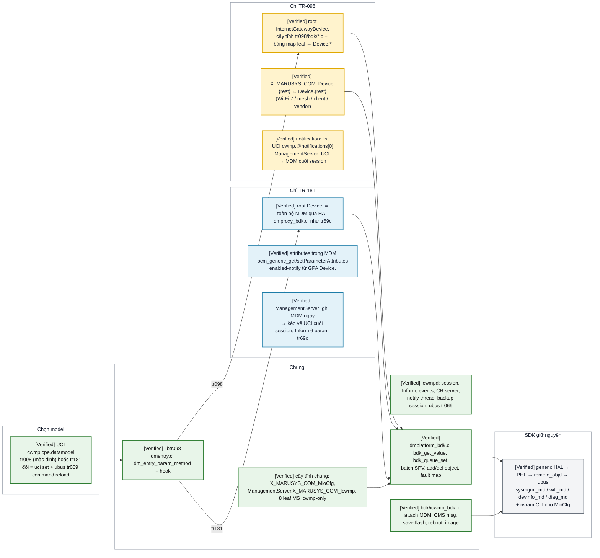

# iCWMP trên BDK — TR-098 vs TR-181: chung gì, khác gì khi cấu hình và chạy (bản nhìn nhanh)

Scope: một trang để chọn/đổi data model và biết ngay thành phần nào tham gia, xử lý nào giống nhau,
xử lý nào khác nhau, kèm ví dụ get/set WAN / Wi-Fi / mesh / MLO ở cả hai model. Flow đầy đủ:
[icwmp_bdk_runtime_flow.md](icwmp_bdk_runtime_flow.md). Lệnh chạy: [icwmp_bdk_debug_guide.md](icwmp_bdk_debug_guide.md).
Map từng leaf TR-098: [icwmp_tr098_bdk_mapping_matrix.md](icwmp_tr098_bdk_mapping_matrix.md).

Snapshot: overlay HEAD `0237b39` (patch `0028`, 20/09/2026), SDK `bcm963xx` lguplus `9f2a56ab`,
profile `MO77300EB`. Mọi dòng **[Verified]** = verified trên source, **chưa board-test** (`0017`..`0028`
chưa flash). Đường dẫn relative `sdk-overlay/userspace/public/`.

## START HERE — hai model, một đường xuống SDK

**Chú thích màu:** 🟩 xanh lá = chung cả hai model · 🟨 vàng = chỉ TR-098 · 🟦 xanh dương = chỉ TR-181 · ⬜ xám = SDK.

## Kết luận chính

- **[Verified]** Chọn model là **một option UCI**, không rebuild, không restart: `cwmp.cpe.datamodel`.
  ACS cũng tự đổi được qua `…ManagementServer.X_MARUSYS_COM_Icwmp.DataModel` (hiệu lực session sau).
- **[Verified]** ~80 % đường đi giống nhau (icwmpd, glue BDK, engine libtr098, backend `dmplatform_bdk.c`,
  SDK). Khác nhau nằm gọn trong: **root + cách tìm leaf** (cây tĩnh + map vs passthrough HAL), **nơi lưu
  notification**, **chiều sync ManagementServer**, **danh sách forced-inform**.
- **[Verified]** TR-098 là view **có chọn lọc** (chỉ object đã port, xem matrix phần 1–8) nhưng có cửa
  `X_MARUSYS_COM_Device.` ra toàn bộ TR-181. TR-181 là **toàn bộ MDM** (đúng như tr69c) cộng 3 object
  riêng của icwmp.
- Chọn: ACS/ITMS nói TR-098 → `tr098`; GenieACS hoặc ACS TR-181 → `tr181` (không cần preset, ít code
  icwmp hơn, mọi param SDK có sẵn kể cả `X_BROADCOM_COM_*`).

## Cấu hình — giống và khác

| Mục | Chung | TR-098 | TR-181 |
|---|---|---|---|
| Bật/chọn | `uci -c /data/icwmp/config set cwmp.cpe.datamodel=…` + `commit` + `ubus call tr069 command '{"command":"reload"}'` | `tr098` (mặc định seed `files/cwmp`) | `tr181` |
| ACS URL/credential/periodic | nguồn sự thật = MDM `Device.ManagementServer.*` (WebUI / `tr69_mdmcli`); icwmpd sync về UCI lúc start và mỗi `ACS_CONFIG_CHANGED` | ACS SPV `InternetGatewayDevice.ManagementServer.*` → UCI → đẩy lên MDM cuối session | ACS SPV `Device.ManagementServer.*` → MDM ngay → kéo về UCI cuối session + reload |
| Identity DeviceId | UCI `cwmp.cpe.{manufacturer,oui,product_class,serial_number,…}` rỗng = MDM | `DeviceInfo.*` cũng override (`deviceinfo_bdk.c`) | `Device.DeviceInfo.<leaf>` override khi GPV/Inform (`dmproxy_bdk.c` `devinfo_uci_override`) |
| Interface / CR port | `cwmp.cpe.interface` (= `X_BROADCOM_COM_BoundIfName`), `cwmp.cpe.port` 30005, IP từ netlink → `/var/state` | ConnectionRequestURL = libtr098 getter (varstate) | giống, override khi đọc MDM |
| Amendment / log / timeout | `cwmp.cpe.amd_version` (3), `log_severity`, `session_timeout` — hoặc từ ACS qua `X_MARUSYS_COM_Icwmp.*` | path `InternetGatewayDevice.ManagementServer.X_MARUSYS_COM_Icwmp.` | path `Device.ManagementServer.X_MARUSYS_COM_Icwmp.` |
| Mesh/Wi-Fi 7 dữ liệu | `nvram set wldataeld_enable=1; nvram commit; wlssk restart` (một lần) | qua `X_MARUSYS_COM_Device.WiFi.DataElements.` | `Device.WiFi.DataElements.` |
| MLO | nvram `wl_mlo_*` dùng chung WebUI; `LinkBssIndex` mặc định 1 (`wl<u>.1`) | `InternetGatewayDevice.X_MARUSYS_COM_MloCfg.` | `Device.WiFi.X_MARUSYS_COM_MloCfg.` |

## Runtime — giống và khác theo RPC

| RPC / cơ chế | Chung (cả hai) | TR-098 | TR-181 |
|---|---|---|---|
| Vào RPC | `xml.c` handler → `dm_entry_param_method` → hook `dm_platform_param_method` trước, engine sau (`dmentry.c:204`) | hook chỉ nhận `X_MARUSYS_COM_Device.*`, còn lại engine walk `tEntry098Obj` | hook nhận mọi `Device.*` trừ object local (`proxy_is_local`), engine chỉ walk `tEntry181Obj` cho local/merge |
| GPV | HAL `bcm_generic_getParameterValues` (`OGF_OMIT_HIDDEN_OBJ_PARAM`), bool chuẩn hóa | N leaf = N GPV 1-path (`bdk_gpv_one`), ghép/đổi tên theo `bdk_leafmap`, getter tay | 1 GPV cho cả object, type xsd từ MDM, `isPassword` → `""`, override ParameterKey/CR URL/DeviceInfo, merge cây tĩnh khi path bao local |
| GPN | `writable` trong kết quả | từ `permission` DMLEAF; `X_MARUSYS_COM_Device` là object rỗng (ACS phải hỏi tiếp vào trong) | từ `bcm_generic_getParameterNames`; `Device.`/`Device.WiFi.`/`Device.ManagementServer.` gộp thêm object local |
| SPV | 2 pha (VALUECHECK → `dm_entry_apply` VALUESET), `bdk_queue_set` dedupe, **một** batch `bcm_generic_setParameterValues`, RCL/STL SDK áp dụng, `dmuci_revert` khi fault, ParameterKey → UCI, flash cuối session | setter leaf: `bdk_map_set` hoặc tay (UCI/nvram) | `proxy_set_value`: `bdk_check_writable` rồi queue |
| Add/Del | `bcm_generic_add/deleteObject`, instance TR-181 = instance trả ACS | chỉ object có `addobj/delobj` (DHCPStaticAddress, DHCPOption, PortMapping, Forwarding) | mọi object writable của MDM |
| GPA/SPA | `.dm_enabled_notify` dựng lại lúc reload; thread notify diff | list UCI `cwmp.@notifications[0]`; `X_MARUSYS_COM_Device.*` → 9001 | attribute MDM `bcm_generic_get/setParameterAttributes` (0/1/2), SPA → `END_SESSION_RELOAD` để dựng lại file |
| Value change | `CMS_MSG_TR69_ACTIVE_NOTIFICATION` → `bdk_trigger_notify` → thread notify GPV lại từng param | giá trị lấy qua cây tĩnh | giá trị lấy qua HAL (`bdk_get_value_buf`) |
| Inform ParameterList | DeviceId từ `cwmp_get_deviceid` (UCI override / MDM) | leaf `DMFINFRM` cây tĩnh (DeviceInfo 9 leaf, ParameterKey, ConnectionRequestURL, AliasBasedAddressing, DeviceSummary) | 6 param tr69c: `RootDataModelVersion`, `DeviceInfo.HardwareVersion/SoftwareVersion/ProvisioningCode`, `ManagementServer.ParameterKey/ConnectionRequestURL` |
| Cuối session | `apply_end_session`, cờ `END_SESSION_*`, `icwmp_bdk_end_session` → save flash | `sync_uci_to_mdm` (MS) + `sync_uci_only_to_mdm` (ParameterKey, CR URL) | `sync_uci_only_to_mdm` + `sync_mdm_to_uci` → reload nếu MS đổi |
| Reboot / FactoryReset / Download | `external_bdk.c` (SDK reboot, invalidate flash, apply image) | — | — |
| Không có | — | object TR-098 chưa port (`Layer2Bridging`, `QueueManagement`, `X_BROADCOM_COM_*`) → 9005 | root `InternetGatewayDevice.` → 9005 |

## Ví dụ get/set — cùng một việc, hai path

`D` = `ubus call tr069 dm` (chi tiết ở debug guide). Instance `{i}` tra bằng `names`/`get` object cha trước.

| Việc | TR-098 | TR-181 | Backend chung sau libtr098 |
|---|---|---|---|
| **WAN** đọc IP/gateway/DNS | `get InternetGatewayDevice.WANDevice.1.WANConnectionDevice.1.WANIPConnection.2.` | `get Device.IP.Interface.2.IPv4Address.` + `Device.IP.Interface.2.` + `Device.DNS.Client.Server.` | `sysmgmt_md` (Device. catch-all) |
| **WAN** set MTU | `set …WANIPConnection.2.MaxMTUSize 1400` | `set Device.IP.Interface.2.MaxMTUSize 1400` | batch SPV → RCL `IP.Interface` |
| **WAN** port mapping | `add …WANIPConnection.2.PortMapping.` → `set …PortMapping.N.{ExternalPort,InternalPort,PortMappingProtocol,InternalClient,PortMappingEnabled}` | `add Device.NAT.PortMapping.` → `set Device.NAT.PortMapping.N.{ExternalPort,InternalPort,Protocol,InternalClient,Enable}` | `bcm_generic_addObject` + SPV → `sysmgmt_md` NAT RCL |
| **Wi-Fi** đọc SSID/radio/security | `get InternetGatewayDevice.LANDevice.1.WLANConfiguration.1.` (join SSID+Radio+AP) | `get Device.WiFi.SSID.1.` + `Device.WiFi.Radio.1.` + `Device.WiFi.AccessPoint.1.Security.` | `wifi_md` |
| **Wi-Fi** set SSID | `set …WLANConfiguration.1.SSID TestSSID` | `set Device.WiFi.SSID.1.SSID TestSSID` | SPV → `wifi_md` RCL → nvram `wl0_ssid` + restart |
| **Wi-Fi** set WPA3 + key | `set …WLANConfiguration.1.BeaconType 11i` + `IEEE11iAuthenticationMode` + `KeyPassphrase` (map → `ModeEnabled`) | `set Device.WiFi.AccessPoint.1.Security.ModeEnabled WPA3-Personal` + `KeyPassphrase` | `wifi_md` RCL Security |
| **Wi-Fi** client list | `get …WLANConfiguration.1.AssociatedDevice.` (8 leaf chuẩn) / `get InternetGatewayDevice.X_MARUSYS_COM_Device.WiFi.AccessPoint.1.AssociatedDevice.` (đủ) | `get Device.WiFi.AccessPoint.1.AssociatedDevice.` | `wifi_md` |
| **Mesh** topology / STA toàn mạng | `get InternetGatewayDevice.X_MARUSYS_COM_Device.WiFi.DataElements.Network.` | `get Device.WiFi.DataElements.Network.` | `wifi_md` ← `wldataeld` (**[Conditional]** `wldataeld_enable=1`, WBD chạy) |
| **Mesh** WBD msglevel (SPV vô hại để test đường ghi) | `set …X_MARUSYS_COM_Device.WiFi.X_BROADCOM_COM_WbdCfg.WbdMsgLevel 1` | `set Device.WiFi.X_BROADCOM_COM_WbdCfg.WbdMsgLevel 1` | `wifi_md` RCL Wbd |
| **MLO** trạng thái link/STA MLD | `get …X_MARUSYS_COM_Device.WiFi.DataElements.Network.Device.1.APMLD.` | `get Device.WiFi.DataElements.Network.Device.1.APMLD.` | như mesh |
| **MLO** cấu hình AP MLD | `get InternetGatewayDevice.X_MARUSYS_COM_MloCfg.` → `set …MloCfg.SSID`, `.KeyPassphrase`, `.LinkRadios 1,2,3`, `.Enable 1` → `Status` = `RebootRequired` → reboot | `get Device.WiFi.X_MARUSYS_COM_MloCfg.` → cùng leaf | `mlo_bdk.c`: nvram `wl_mlo_*` (+ `kset wl_mlo_config`), SPV `Device.WiFi.SSID.{i}.SSID/Enable`, `AccessPoint.{i}.Security.KeyPassphrase/WlAuthAkm/WlWpaEncryption/WlMFP` → `wifi_md`; driver đọc `wl_mlo_config` lúc boot |
| **icwmp** đổi sang model kia từ ACS | `set InternetGatewayDevice.ManagementServer.X_MARUSYS_COM_Icwmp.DataModel tr181` | `set Device.ManagementServer.X_MARUSYS_COM_Icwmp.DataModel tr098` | UCI + reload cuối session |

## Khi nào phải sửa code, khi nào chỉ cấu hình

| Nhu cầu | TR-098 | TR-181 |
|---|---|---|
| ACS hỏi param SDK đã có trong MDM nhưng chưa port | thêm dòng `bdk_leafmap` / object vào `tr098/bdk/*.c` (matrix) **hoặc** ACS dùng `X_MARUSYS_COM_Device.<path TR-181>` ngay | không sửa gì |
| Param chưa có trong MDM (vendor mới) | thêm vào MDM theo [tr181_parameter_development_guide.md](tr181_parameter_development_guide.md) **hoặc** object riêng trong libtr098 (mẫu `mlo_bdk.c`) | giống; object riêng trong libtr098 phải thêm vào `proxy_local_objs[]` + `root181_bdk.c` |
| Đổi tên `X_MARUSYS_COM_*` | `CUSTOM_PREFIX` (Makefile.am) + tên trong bảng leaf | giống — cùng bảng |
| Notification mặc định cho param | list UCI seed `files/cwmp` | attribute MDM (XML `notification` hoặc `setpa`) |

## Chưa chứng minh được

- **[Not established]** Toàn bộ bảng trên trên board (chưa flash `0017`..`0028`); ACS thật chưa qua 401.
- **[Not established]** Instance `Device.IP.Interface` WAN trên MO77300EB (`eth1.1` = 2 lấy từ ref board),
  instance SSID/AP của link MLO `wl<u>.1`.
- **[Not established]** ACS TR-181 (GenieACS) xử lý `Device.` từ device từng Inform `InternetGatewayDevice.`
  — cần xóa/tạo lại device trên ACS khi đổi model.

## Patch/debug artifact liên quan

- `issues/20260916_tr069_app_use_icwmp/sdk-overlay/` `0024` (chọn model), `0025` (MloCfg + attributes TR-181),
  `0026` (Icwmp cfg + 8 leaf MS), `0028` (`tr069 dm` attr/setattr/inform/file).
- Lệnh: [icwmp_bdk_debug_guide.md](icwmp_bdk_debug_guide.md), issue `debug-commands.md` gate 3 phần 6–8.
