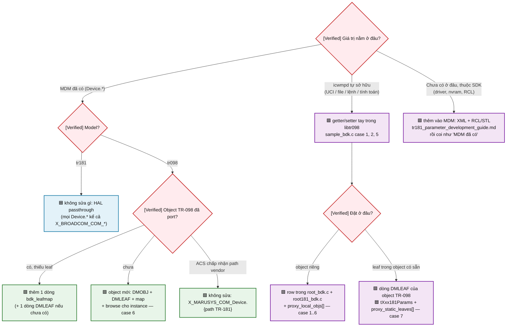

# Phát triển tham số cho icwmpd trên BDK — mới hoặc có sẵn, riêng cho TR-098 và TR-181

Scope: cách thêm một tham số/object **mới** hoặc sửa một tham số **có sẵn** trong data model mà
`icwmpd` + `libtr098` backend BDK phục vụ cho ACS, tách riêng hai model `InternetGatewayDevice.`
(TR-098) và `Device.` (TR-181), kèm **patch mẫu chạy được**: `sdk-overlay/0031-…Sample-developer-template.patch`
(file [sample_bdk.c](../issues/20260916_tr069_app_use_icwmp/sdk-overlay/userspace/public/libs/libtr098/libtr098/tr098/bdk/sample_bdk.c))
— object `X_MARUSYS_COM_Sample.` với 7 case, cùng bảng dưới cả hai root. Copy case cần dùng, đổi
tên, xóa phần còn lại. Flow bên trong: [icwmp_bdk_runtime_flow.md](icwmp_bdk_runtime_flow.md);
so sánh model: [icwmp_datamodel_tr098_tr181_matrix.md](icwmp_datamodel_tr098_tr181_matrix.md);
test: [icwmp_bdk_debug_guide.md](icwmp_bdk_debug_guide.md).

Snapshot: overlay HEAD `f191e18` (patch `0031`, 21/09/2026), đường dẫn relative
`sdk-overlay/userspace/public/libs/libtr098/libtr098/`. **Chưa build-test / board-test** — mọi
lệnh test là kỳ vọng theo source.

## START HERE — giá trị nằm ở đâu thì làm cách nào

**Chú thích màu:** 🟥 gate quyết định · 🟩 TR-098 · 🟦 TR-181 · 🟪 dùng chung cả hai.



## Kết luận chính

- **[Verified]** TR-181: tham số MDM đã có → **không phải viết gì** (`dmproxy_bdk.c` passthrough).
  Chỉ viết code khi giá trị do icwmpd sở hữu, hoặc muốn **đè** cách đọc/ghi một param MDM.
- **[Verified]** TR-098: mọi leaf phải nằm trong cây tĩnh `tr098/bdk/*.c`. Cách rẻ nhất là **một
  dòng `bdk_leafmap`** trỏ sang path TR-181 (`bdk_map_get/bdk_map_set` lo GPV/SPV/kiểu bool/const).
  Getter/setter tay chỉ khi cần join, tính toán, hay nguồn ngoài MDM.
- **[Verified]** Một bảng `DMLEAF` phục vụ được **cả hai root**: row object viết ở `root_bdk.c` và
  `root181_bdk.c`, tên object đưa vào `proxy_local_objs[]`; bảng map đăng ký dưới cả hai prefix.
- **[Verified]** Setter luôn 2 pha: `VALUECHECK` (chỉ validate, `FAULT_9007`) rồi `VALUESET` (áp
  dụng). Ghi MDM = `bdk_queue_set()` để vào **một** batch SPV; ghi UCI = `dmuci_set_value()`
  (engine commit); cần icwmpd đọc lại config = `cwmp_set_end_session(END_SESSION_RELOAD)`.
- **[Verified]** Chuỗi trả về qua `**value` phải là dm-allocated (`dmstrdup`, `dmasprintf`,
  `dmuci_get_*`, `bdk_get_value*`) hoặc literal — engine free ở `dm_ctx_clean`; **không** `strdup`/`free`.
- Mẫu `X_MARUSYS_COM_Sample.` chỉ build với `-DBDK_SAMPLE_OBJECT` (đang bật trong `bin/Makefile.am`,
  bỏ khi production) và chỉ hiện khi `cwmp.sample.enable=1` → dev image giữ được mẫu mà ACS
  không thấy.

## Bản đồ file — sửa ở đâu

| File | Vai trò | Sửa khi |
|---|---|---|
| `tr098/bdk/<topic>_bdk.c` | getter/setter, bảng `DMLEAF`/`DMOBJ`, bảng `bdk_leafmap`, browse instance, `<topic>_bdk_register()` | thêm leaf/object TR-098, object chung hai root |
| `tr098/bdk/root_bdk.c` | `tRoot_098_Obj[]` — object cấp 1 của `InternetGatewayDevice.`; `tr098_bdk_register_all()` | object mới TR-098 / chung |
| `tr098/bdk/root181_bdk.c` | `tRoot_181_Obj[]` — object tĩnh của `Device.` (chỉ phần icwmp sở hữu), `tXxx181Params[]` leaf tĩnh trong object HAL | object mới TR-181 / leaf tĩnh trong object MDM |
| `platform/bdk/dmproxy_bdk.c` | `proxy_local_objs[]` (object tĩnh TR-181), `proxy_static_leaves[]` (leaf tĩnh trong object HAL), `proxy_value_of()`/`proxy_ms_override()` (đè giá trị đọc), `proxy_set_value()` | mọi thay đổi TR-181 phía icwmp |
| `platform/bdk/dmbdk.h` / `dmplatform_bdk.c` | API: `bdk_get_value_default`, `bdk_get_subtree`, `bdk_get_instances`, `bdk_check_writable`, `bdk_queue_set`, `bdk_add/del_object`, `bdk_register_objmap`, `bdk_map_get/set`, `struct bdk_leafmap`, `struct bdk_objctx` | không sửa, chỉ gọi |
| `bin/Makefile.am` | danh sách source BDK, `-DBDK_SAMPLE_OBJECT` | thêm file `.c` mới (bắt buộc `Bcmbuild.mk clean`) |
| `apps/icwmp/files/cwmp` | seed UCI (`config sample`, `cwmp.cpe.*`) | option UCI mới (board cũ phải `uci set` tay) |
| SDK `data-model/cms-dm-tr181-*.xml` + `mdm_cbk_*` | tham số **trong MDM** | giá trị thuộc SDK — [tr181_parameter_development_guide.md](tr181_parameter_development_guide.md) |

## Bảy case của patch mẫu — cả hai model

| # | Leaf | Nguồn | Cơ chế | Ghi |
|---|---|---|---|---|
| 1 | `UciText` | UCI `cwmp.sample.text` | `dmuci_get_option_value_string` / `dmuci_set_value` | RW, validate ở VALUECHECK |
| 2 | `LoadAverage` | `/proc/loadavg` | `fopen` + `dmstrdup` | RO, lỗi đọc = `""` không fault |
| 3 | `MdmUpTime` | `Device.DeviceInfo.UpTime` | `bdk_get_value_default` | RO, 1 GPV |
| 4 | `MdmPeriodicInformInterval` | `Device.ManagementServer.PeriodicInformInterval` | `bdk_check_writable` (VALUECHECK) + `bdk_queue_set` (VALUESET) | RW qua batch SPV |
| 5 | `CallCount` | biến trong process | `dmasprintf` | RO |
| 6 | `Radio.{i}.{Name,Band,Enable,Channel,Kind}` | `Device.WiFi.Radio.{i}.*` | `browseSampleRadioInst` + `bdk_objctx.tr181_base` + bảng `sample_radio_map` (`bdk_map_get/set`, `BDK_MAP_RW/BOOL/CONST`) | instance = instance MDM |
| 7 | `DeviceInfo.X_MARUSYS_COM_SampleUpTimeMinutes` | tính từ MDM | TR-098: dòng trong `tDeviceInfoParams` (`deviceinfo_bdk.c`); TR-181: `tDeviceInfo181Params` (`root181_bdk.c`) + `proxy_static_leaves[]` | leaf mới trong object **có sẵn** |

Bật và thử (image từ `0031`):

```sh
U="uci -c /data/icwmp/config"; $U set cwmp.sample=sample; $U set cwmp.sample.enable=1; $U commit cwmp
D() { ubus call tr069 dm "$1"; }
# TR-098 (cwmp.cpe.datamodel=tr098)
D '{"cmd":"names","path":"InternetGatewayDevice.X_MARUSYS_COM_Sample.","next_level":false}'
D '{"cmd":"get","path":"InternetGatewayDevice.X_MARUSYS_COM_Sample."}'
D '{"cmd":"set","path":"InternetGatewayDevice.X_MARUSYS_COM_Sample.UciText","value":"hello"}'; $U get cwmp.sample.text
D '{"cmd":"set","path":"InternetGatewayDevice.X_MARUSYS_COM_Sample.Radio.1.Channel","value":"36"}'   # batch SPV → wifi_md
D '{"cmd":"get","path":"InternetGatewayDevice.DeviceInfo.X_MARUSYS_COM_SampleUpTimeMinutes"}'
# TR-181 (cwmp.cpe.datamodel=tr181 + reload)
D '{"cmd":"get","path":"Device.X_MARUSYS_COM_Sample."}'
D '{"cmd":"names","path":"Device.","next_level":true}' | grep -c Sample          # 1: gộp vào GPN của HAL
D '{"cmd":"get","path":"Device.DeviceInfo."}' | grep SampleUpTimeMinutes         # leaf tĩnh gộp cùng leaf MDM
$U set cwmp.sample.enable=0; $U commit cwmp                                     # ẩn lại (checkobj), không cần reload
```

## TR-098 — recipe

### A. Object đã port, thiếu leaf mà MDM có → 1 dòng map (+ 1 dòng DMLEAF)

```c
/* tr098/bdk/wandevice_bdk.c — ví dụ WANIPConnection thiếu X_MARUSYS_COM_Foo ↔ Device.IP.Interface.{i}.Foo */
static const struct bdk_leafmap wanip_map[] = {
	...
	{CUSTOM_PREFIX"Foo", "Foo", BDK_MAP_RW},        /* relative tới tr181_base của objctx */
	{NULL, NULL, 0}
};
DMLEAF tWANIPConnectionParam[] = {
	...
	{CUSTOM_PREFIX"Foo", &DMWRITE, DMT_STRING, bdk_map_get, bdk_map_set, NULL, NULL},
	{0}
};
```

Cờ: `BDK_MAP_RO` (mặc định) / `BDK_MAP_RW` / `BDK_MAP_BOOL` (chuẩn hóa true/false↔1/0) /
`BDK_MAP_EMPTY` (write-only, đọc `""`) / `BDK_MAP_CONST` (literal). Path `"Device...."` là tuyệt đối,
còn lại nối vào `bdk_objctx.tr181_base` (object instance) hoặc `base_default` của `bdk_register_objmap`
(object tĩnh); `{aux0}..{aux3}` = `bdk_objctx.aux[]` cho join nhiều object TR-181 (ví dụ WLANConfiguration
= SSID + Radio + AccessPoint, `landevice_bdk.c`).

### B. Leaf cần logic → getter/setter tay

Mẫu case 3–4. Đọc nhiều leaf của cùng object: `bdk_get_subtree("Device.X.Y.", &arr, &n)` một lần
rồi lọc `arr[k].fullpath` (mẫu `mlo_bdk.c` `mlo_build_topo`), `bcm_generic_freeParamInfoArray(&arr, n)`.
Setter ghi MDM: VALUECHECK `bdk_check_writable(path)` (9005/9008), VALUESET `bdk_queue_set(ctx, refparam,
path, value)`; nhiều path trong một setter = nhiều `bdk_queue_set` (dedupe theo fullpath, cùng batch).

### C. Object mới

`DMLEAF tXxxParam[]` + (nếu có con) `DMOBJ tXxxObj[]` trong `<topic>_bdk.c`, row vào `tRoot_098_Obj[]`
(`root_bdk.c`) hoặc vào `nextobj` của object cha. Instance: hàm browse (mẫu case 6 / `browseVendorConfigFileInst`)
— `bdk_get_instances(obj TR-181)` → mỗi instance `dmcalloc(struct bdk_objctx)`, `tr181_base`, `aux[]`,
`DM_LINK_INST_OBJ(dmctx, parent_node, oc, sinst)`; instance TR-098 = instance MDM (ổn định qua reboot).
Add/Delete: hàm `addobj/delobj` gọi `bdk_add_object(obj TR-181, &inst)` / `bdk_del_object(path instance)`
(mẫu `landevice_bdk.c` DHCPStaticAddress). Đăng ký map trong `<topic>_bdk_register()` gọi từ
`tr098_bdk_register_all()`.

### D. Sửa tham số có sẵn

| Muốn | Sửa |
|---|---|
| Đổi nguồn (path TR-181 khác) | sửa cột `tr181` của dòng map |
| RO → RW hoặc ngược | cờ `BDK_MAP_RW` **và** `&DMWRITE`/`&DMREAD` + `bdk_map_set`/`NULL` trong DMLEAF (permission quyết định 9008 trước khi tới setter) |
| Đè giá trị đọc (ví dụ identity) | getter bọc: thử nguồn riêng rồi `bdk_map_get` (mẫu `get_devinfo` + `devinfo_uci_override`) |
| Validate thêm khi ghi | setter bọc: VALUECHECK kiểm rồi gọi `bdk_map_set(..., VALUECHECK)`, VALUESET gọi `bdk_map_set(..., VALUESET)` |
| Vào Inform / notification mặc định | cột `forced_inform` = `&DMFINFRM`, `notification` = `&DMACTIVE`/`&DMPASSIVE` |
| Bỏ khỏi cây | xóa dòng DMLEAF (map thừa vô hại) |

### E. Không muốn viết code

ACS gọi `InternetGatewayDevice.X_MARUSYS_COM_Device.<path TR-181>` — proxy phục vụ toàn bộ MDM.

## TR-181 — recipe

### A. Tham số MDM đã có → không làm gì

Kiểm nhanh: `ubus call tr069 dm '{"cmd":"get","path":"Device.X.Y.Z"}'` (hoặc `tr69_mdmcli` `mdm getpv`).
Có = xong. Không có = tham số chưa tồn tại trong MDM → mục D.

### B. Leaf icwmpd sở hữu **trong object MDM có sẵn** (case 7)

1. Bảng `DMLEAF tXxx181Params[]` trong `root181_bdk.c` (khai `extern` ở `icwmpcfg_bdk.h`), getter/setter
   ở file topic.
2. Row object trong `tRoot_181_Obj[]` (chỉ để engine walk tới leaf; `nextobj` NULL, không cần browse
   nếu object không instance). Object có instance (`Device.WiFi.SSID.{i}.`) → cần `browse` liệt kê
   instance MDM như case 6.
3. `proxy_static_leaves[]` (`dmproxy_bdk.c`) thêm `{"Device.Xxx.", tXxx181Params}` — proxy chuyển đúng
   tên leaf đó cho engine, GPV/GPN cả object gộp leaf tĩnh với leaf HAL (`proxy_covers_local`, sửa ở `0031`).

### C. Object icwmpd sở hữu (case 1–6)

Cùng bảng với TR-098: row trong `tRoot_181_Obj[]` (`root181_bdk.c`) hoặc `nextobj` của object tĩnh cha
(`tWiFi181Obj` cho `Device.WiFi.X`, `tManagementServerBdkObj` cho `Device.ManagementServer.X`), tên đầy
đủ vào `proxy_local_objs[]`, map (nếu dùng) đăng ký thêm dưới prefix `Device.`.

### D. Đè cách đọc/ghi một tham số MDM

- Đọc: `proxy_value_of()` / `proxy_ms_override()` (`dmproxy_bdk.c`) — mẫu `ParameterKey`,
  `ConnectionRequestURL`, `DeviceInfo.*` (UCI override), `isPassword` → `""`.
- Ghi: `proxy_set_value()` — chặn/chuyển hướng theo `target` trước `bdk_queue_set`.
- Tham số chưa có trong MDM nhưng thuộc SDK (driver/nvram): thêm vào MDM theo
  [tr181_parameter_development_guide.md](tr181_parameter_development_guide.md) — sau đó TR-181 tự có,
  TR-098 thêm 1 dòng map.

## Checklist trước khi giao

- [ ] Getter trả dm-allocated/literal, không `malloc`/`free`; lỗi đọc → giá trị mặc định, không fault (trừ khi ACS phải biết).
- [ ] Setter: VALUECHECK không đổi trạng thái; VALUESET không gọi HAL SPV trực tiếp (dùng `bdk_queue_set`).
- [ ] Permission `&DMWRITE` chỉ khi có setter; kiểu `DMT_*` đúng (ACS validate xsd).
- [ ] Object chung hai root: row ở **cả** `root_bdk.c` và `root181_bdk.c`, tên trong `proxy_local_objs[]`,
      map đăng ký **cả hai** prefix.
- [ ] File `.c` mới → `bin/Makefile.am` + `make -C … libtr098 -f Bcmbuild.mk clean`.
- [ ] UCI option mới → `files/cwmp` + ghi chú board cũ phải `uci set`.
- [ ] Test bằng `tr069 dm` `names/get/set/attr` ở **cả hai** model; SPV kiểm 3 tầng (icwmp → MDM → runtime,
      debug guide 6.3); `grep 'batch SPV\|SPV fault' /var/log/messages`.
- [ ] Tên `X_MARUSYS_COM_*` (`CUSTOM_PREFIX`) — đổi tên chỉ ở bảng DMLEAF/DMOBJ, không ở map (map dùng
      tên leaf TR-098 để tra, phải đổi cùng).
- [ ] Cập nhật [icwmp_tr098_bdk_mapping_matrix.md](icwmp_tr098_bdk_mapping_matrix.md) (TR-098) và BDK-CHANGES.md.

## Chưa chứng minh được

- **[Not established]** Patch `0031` chưa compile: `checkobj` với object không instance (engine bỏ qua object
  ở cả GPN/GPV — theo `dmtr098.c:299`, chưa chạy); merge `Device.DeviceInfo.` sau khi sửa `proxy_covers_local`.
- **[Not established]** Hiệu năng `checkobj` đọc UCI mỗi walk (rẻ, nhưng chưa đo).

## Patch/debug artifact liên quan

- `issues/20260916_tr069_app_use_icwmp/sdk-overlay/0031-libtr098-bdk-X_MARUSYS_COM_Sample-developer-template.patch`
  (trong overlay từ HEAD `f191e18`, tarball `1987dea2…`); mẫu thực tế đã dùng cùng cơ chế: `mlo_bdk.c`
  (`0025`), `icwmpcfg_bdk.c` (`0026`), `landevice_bdk.c`/`wandevice_bdk.c` (`0018`/`0019`).
- Test: [icwmp_bdk_debug_guide.md](icwmp_bdk_debug_guide.md) mục 5–7, issue `debug-commands.md` gate 3.
