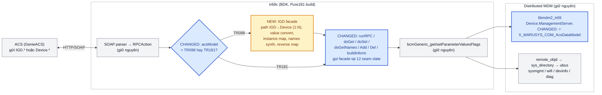
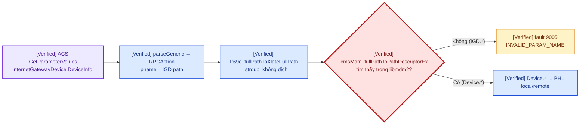
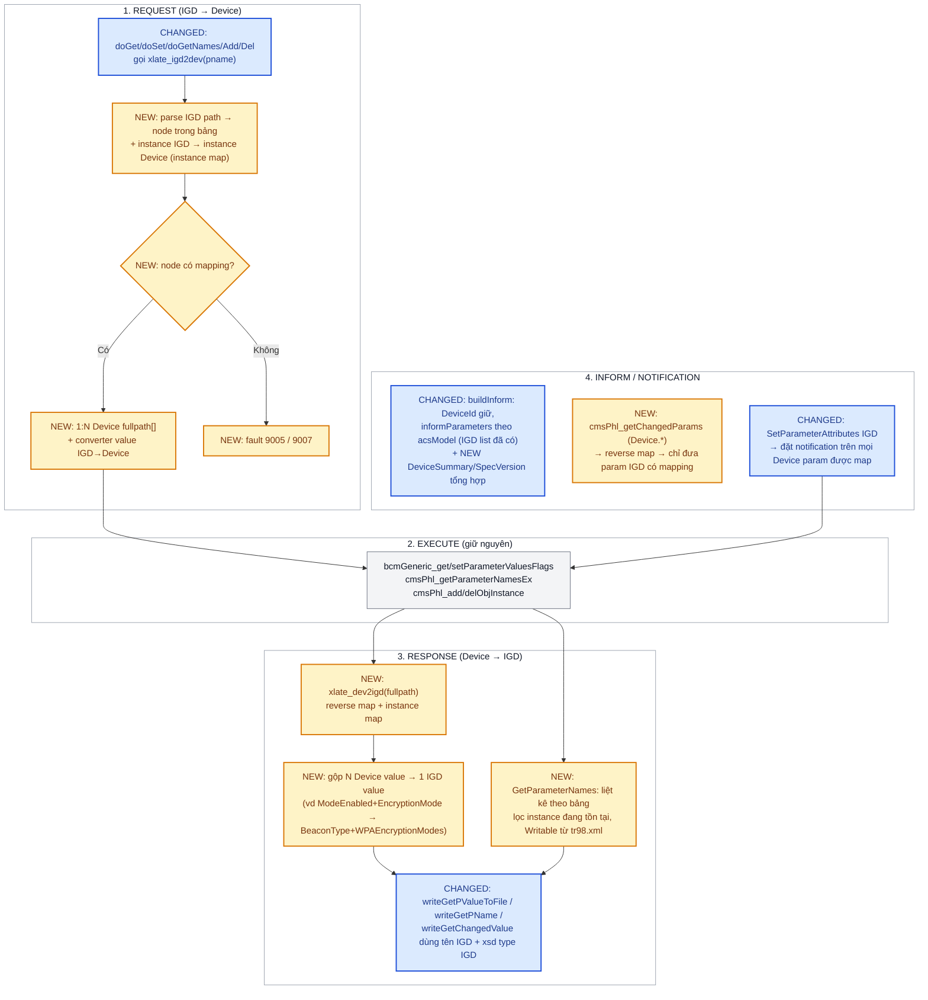

# TR-098 facade trên nền BDK TR-181 — phương án chốt, ước lượng và kế hoạch giai đoạn

Scope: phương án đã chốt (2026-09-15) cho `MO77300EB`: **giữ `tr69c` + kiến trúc BDK/Distributed
MDM/Pure TR-181 hiện tại, thêm một lớp facade trong `tr69c` để trình bày data model TR-098
(`InternetGatewayDevice.`) cho ACS, chọn được một model tại một thời điểm bằng config.** Tài liệu
này là Current/Proposed design + bảng "đã có / phải làm" + kế hoạch 5 giai đoạn có gate.

Tiền đề đã verify ở các tài liệu trước (không lặp lại bằng chứng):

- Build/start `tr69c` trên BDK, cấu hình GenieACS: [issue README](../issues/20260914_tr069_app_current_build_profile/README.md).
- Luồng RPC trong `tr69c` và boundary PHL/remote_objd/ubus: [tr069_cwmp_request_flow.md](tr069_cwmp_request_flow.md).
- Vì sao **không** side-load, **không** đổi prefix, và CMS Legacy98 là đổi platform:
  [tr098-compatibility.md](../issues/20260914_tr069_app_current_build_profile/tr098-compatibility.md) (Codex).
- Agent opensource đã đánh giá và **không** chọn:
  [opensource-cwmp-agent-evaluation.md](../issues/20260914_tr069_app_current_build_profile/opensource-cwmp-agent-evaluation.md) (Codex).
- Cách thêm/sửa param trong data model BDK: [tr181_parameter_development_guide.md](tr181_parameter_development_guide.md).

Snapshot: `src/bcm963xx`, branch `lguplus`, commit `9f2a56abd0de9172bfe1283a8718a56cbce87e4e`.

## START HERE — flow một màn hình (Proposed)

**Chú thích màu:** 🟨 nền vàng = thành phần **MỚI** · 🟦 nền xanh = thành phần **BỊ SỬA** · xám =
giữ nguyên.

## Quyết định chốt và lý do

| Phương án | Trạng thái | Lý do |
|---|---|---|
| **A. IGD facade trong `tr69c`** (tài liệu này) | **CHỐT** | Giữ nguyên platform BDK/TR-181 đang chạy Wi-Fi 7/MLO/WBD; `tr69c` đã có sẵn seam xlate và nhánh TR-98 (root, Inform list); rủi ro khoanh vùng trong một process; đổi model bằng config không cần image khác |
| B. Sửa GenieACS provision sang path-aware | Vẫn dùng **song song** cho giai đoạn 0-1 | Nhanh nhất để test; nhưng user chốt server không đổi model lâu dài |
| C. Image CMS Classic Legacy98 | Loại | Đổi platform: mất `tr69_md`, Distributed MDM, nftables path, default config IGD phải viết lại, chưa có precedent Wi-Fi 7 (`tr098-compatibility.md`) |
| D. Agent opensource (EasyCwmp/iCWMP) | Loại | Vẫn phải viết adapter TR-098 ↔ BDK MDM y như A, cộng thêm port agent, dual-daemon, license (`opensource-cwmp-agent-evaluation.md`) |
| E. Component `igd_md` ảo (libmdm2_igd + STL/RCL proxy sang Device.*) | Dự phòng cho giai đoạn sau | Cây IGD thật trong MDM, PHL lo names/attributes; nhưng cần data model IGD sinh cho BDK, STL/RCL cho ~100 object, notification hai chiều — lớn hơn A, chỉ cân nhắc nếu A vướng ở GetParameterNames/notification |

### Nguyên tắc thiết kế đã khóa

1. **Tách "internal model" và "ACS model".** `acsState.dataModel` **giữ TR181** vì nó chọn OID
   MDM nội bộ (`bcmWrapperCms.c:910-1358`, `updateCredentialsInfo` dùng `MDMOID_MANAGEMENT_SERVER`
   khi TR98, OID này không tồn tại trong `libmdm2_tr69`). Thêm field mới `acsState.acsModel` chỉ
   dùng tại các điểm ACS-facing: `RootDevice` (`mainCms.c:2052-2063`), Inform list
   (`dmCms.c:1645,1857,1892`), `handleNotificationLimit` path (`mainCms.c:1661`), scratch-pad reset
   khi đổi model (`bcmWrapperCms.c:796-812`), và facade.
2. **Facade là stateless per RPC + một instance map** dựng lại khi session bắt đầu (và khi có
   `TR69_ACTIVE_NOTIFICATION`/`WAN_CONNECTION_UP`), không cache giá trị.
3. **Bảng mapping là dữ liệu sinh ra**, không viết tay trong C: một CSV/YAML trong repo
   (`igd_path, dev_path_template, type, rw, converter`) → script sinh `dmXlateTable.c`. Schema
   IGD (tên, kiểu, writable, validValues) lấy từ `data-model/cms-dm-tr98.xml` (133 object,
   1913 param) để không phải tự gõ.
4. **Không mapping = không tồn tại.** Param IGD không có dòng mapping thì `GetParameterNames`
   không liệt kê, `Get` trả 9005. Không được "đoán" giá trị.
5. **Đổi model = bootstrap lại với ACS.** Khi `AcsDataModel` đổi: xóa scratch-pad acsState (cơ
   chế có sẵn), gửi Inform `0 BOOTSTRAP` + `1 BOOT`, và trên GenieACS xóa/refresh device record.
   Không hỗ trợ hai model trong cùng một session.

## Current Flow — hôm nay ACS gửi IGD path thì gì xảy ra

**Chú thích màu:** 🟥 gate · 🟨 lỗi · 🟦 main path · 🟪 dữ liệu.

Anchor: `SOAPParser/dmCms.c:365,381` (xlate no-op trong build này, `mainCms.c:549-586`),
`phl.c:626-675` → `mdm_binaryHelper.c:1882-1978` không resolve `InternetGatewayDevice.`.

## Problem

- `tr69c` chọn root theo `cmsMdm_isDataModelDevice2()` lúc attach MDM — compile-time `Pure181`
  trả 1 (`mdm_dataModelHelper.c:96-154`), không có cách chọn runtime.
- Toàn bộ nhánh TR-98 trong `tr69c` (`bcmConfig.c`, `updateTr69cCfgInfo_igd`) giả định MDM
  monolithic IGD (`libmdm.so`), không dùng được với `libmdm2_*`.
- Không có code dịch IGD ↔ Device ở bất kỳ tầng nào (tr69c, PHL, remote_objd).

## Proposed Flow — chi tiết theo RPC

**Chú thích màu:** 🟨 nền vàng = **MỚI** · 🟦 nền xanh = **BỊ SỬA** · xám = giữ nguyên.

### Seam có sẵn trong `tr69c` mà facade cắm vào (Verified)

| Seam | Vị trí | Dùng cho |
|---|---|---|
| `tr69c_fullPathToXlateFullPath(pname)` | `dmCms.c:365,381` (getpv), `:560` (setpv), `:857,873` (getpa), `:975` (setpa), `:1314` (add), `:1399` (del) | Request IGD → Device. Hôm nay là `strdup` (`mainCms.c:549-586`), thiết kế sẵn cho xlate của `MULTIPLE_TR69C` |
| `tr69c_xlateFullPathToStdFullPath(fullpath)` | `dmCms.c:185` (getpv writer), `:740` (getpa writer), `:1550` (changed value) | Response Device → IGD |
| `tr69c_pathDescriptorToStdFullPath` | `dmCms.c:267` (getpn writer), `:1469` (inform param) | Response names |
| `tr69c_fullPathToPathDescriptor` | `dmCms.c:1068,1086` (getpn), `:1873` (inform) | GetParameterNames cần thay bằng đường riêng (synth) vì `cmsPhl_getParameterNamesEx` nhận raw path |
| `stdOid2EeOid`, `sOidParamMap`, `isPnameRecognized` | `mainCms.c:264-517` | Mẫu bảng map OID/param có sẵn để mô phỏng |
| `RootDevice`, `acsState.dataModel` | `mainCms.c:2052-2063`, `main.c:104` | Tách thành `acsModel` |
| `informParameters_TR98`, `informDevIds_TR98` | `dmCms.c:138-160` | Danh sách Inform TR-98 đã có, chỉ cần dịch path |
| Reset scratch-pad khi model đổi | `bcmWrapperCms.c:796-812` | Đổi model không mang state cũ |
| `DeviceSummary` format | `cms_core/linux/stl_main.c:98-110` | Chuỗi mẫu `InternetGatewayDevice:1.5` |
| Schema IGD | `data-model/cms-dm-tr98.xml` | Tên/kiểu/writable/validValues cho bảng sinh |
| Handler IGD cũ | `cms_core/linux/rcl_lan.c`, `rcl_wan.c`, `stl_wan.c`… | **Tham chiếu ngữ nghĩa** (không tái dùng code) khi viết converter |

## Detailed Changes — đã có / phải làm và ước lượng

Ước lượng là **person-day của một kỹ sư quen CMS/MDM**, chưa gồm chờ build/board. Kích thước
S ≤ 3 ngày, M 3-8, L > 8. Cột "Phụ thuộc inventory" = khối lượng thay đổi theo danh sách path ACS
thật sự dùng (chưa có, xem Phase 0).

| # | Hạng mục | Đã có trong code | Phải làm | Size | Ước lượng |
|---|---|---|---|---|---|
| 1 | Param chọn model `Device.ManagementServer.X_MARUSYS_COM_AcsDataModel` (`TR181`/`TR098`) | `cms-dm-tr181-managementserver.xml`, `rcl2_tr69c.c` gửi `ACS_CONFIG_CHANGED` | Thêm param (guide luật 1-5), **thêm vào danh sách so sánh** `rcl2_tr69c.c:94-107`, đọc vào `acsState.acsModel` trong `updateTr69cCfgInfo_dev2`, xử lý đổi model = reset scratch-pad + BOOTSTRAP | S | 2 |
| 2 | Tách `acsModel` khỏi `dataModel` trong `tr69c` | 20+ chỗ dùng `dataModel` (`bcmWrapperCms.c:910-1358`, `dmCms.c`, `mainCms.c`) | Sửa đúng 6 điểm ACS-facing (mục Nguyên tắc 1), giữ nguyên các chỗ chọn OID nội bộ; test build Pure181 | S | 2 |
| 3 | Facade core: parser path IGD, bảng lookup, instance map, converter framework, reverse map | Seam xlate + mẫu OID map | Module mới `tr69c/xlate/` (~1.5-2k dòng C), generator CSV→C, unit test host | L | 12-15 |
| 4 | Tích hợp facade vào 8 RPC + 3 writer + Inform | 12 seam đã liệt kê | Sửa `dmCms.c` tại các seam, 1:N expansion cho get, gộp N→1 cho response, fault mapping | M | 5-6 |
| 5 | `GetParameterNames` tổng hợp + partial-path walk | `cmsPhl_getParameterNamesEx` chỉ cho Device | Liệt kê từ bảng, lọc instance tồn tại (walk Device tương ứng), `Writable` từ tr98.xml, NextLevel semantics | M | 4-5 |
| 6 | Notification / attributes hai chiều | `cmsPhl_getChangedParams`, `bcmGeneric_setParameterAttributesFlags`, snoop | Set attr IGD → N Device param; changed Device → reverse → dedupe IGD; persist qua reboot | M | 3-4 |
| 7 | `AddObject`/`DeleteObject` cho bảng ACS dùng (thường `WANIPConnection.PortMapping`) | `cmsPhl_addObjInstanceByFullPath` | Mapping table→table 1:1 trước (PortMapping ↔ `Device.NAT.PortMapping`), 1:N (`WANConnectionDevice`) để sau | M | 3-5 |
| 8 | **Mapping content — DeviceInfo, ManagementServer, Time, DeviceSummary/SpecVersion** | `informParameters_TR98`, `stl_main.c:110` | Bảng CSV, converter đơn giản | S | 2 |
| 9 | **Mapping content — WANDevice/WANConnectionDevice/WANIPConnection (DHCP/static, DNS, NAT, ExternalIPAddress, Stats)** | `rcl_wan.c`, `stl_wan.c` làm tham chiếu; `Device.IP.Interface.2`, `Ethernet.Link`, `DHCPv4.Client.1` | Instance map qua `InterfaceStack`; WAN `eth1.1` một connection; PPP chỉ nếu ACS dùng | M-L | 5-7 (+2 PPP) |
| 10 | **Mapping content — LANDevice.1 (LANHostConfigManagement DHCP server, IPInterface, Hosts)** | `rcl_lan.c`; `Device.DHCPv4.Server.Pool.1`, `IP.Interface` LAN, `Hosts.Host` | Converter DHCP range, lease, DNS; Hosts 1:1 | M | 3-4 |
| 11 | **Mapping content — LANDevice.1.WLANConfiguration.{i} (3 radio × 4 BSS)** | `Device.WiFi.Radio/SSID/AccessPoint/Security/WPS`, [wifi_config_update_flow.md](wifi_config_update_flow.md) | Nặng nhất: `BeaconType`+`WPAEncryptionModes`+`IEEE11iAuthenticationMode` ↔ `Security.ModeEnabled`+`EncryptionMode`; `PreSharedKey.1.`/`WEPKey.{i}.`; Channel/AutoChannel/Standard ↔ Radio; AssociatedDevice; Stats | L | 6-8 |
| 12 | **Mapping content — Diagnostics (IPPing, TraceRoute, Download/Upload)** | `diag_md` `Device.IP.Diagnostics.*`, `CMS_MSG_*_DIAG_COMPLETE` đã về tr69c | Path 1:1, `DiagnosticsState` giống nhau | S | 2 |
| 13 | Mapping content — Layer3Forwarding, Layer2Bridging, QueueManagement, Firewall, X_BROADCOM/X_MARUSYS | `Device.Routing`, `Bridging`, `QoS`, vendor objects | **Chỉ nếu inventory yêu cầu**; mỗi nhóm M | M/nhóm | 3-5/nhóm |
| 14 | Test: unit test bảng map trên host, GenieACS preset hai model, kịch bản đổi model, RPCDBG | Patch `0000` RPCDBG, `debug-commands.md` | Harness + bộ case | M | 4-6 |
| 15 | Tài liệu: mapping matrix, giới hạn, hướng dẫn vận hành đổi model | | | S | 2 |

**Tổng cho scope "server-driven subset" (1-12, 14, 15): ≈ 55-70 person-day.** Full IGD tree
(thêm 13 toàn bộ + PPP + QoS) ≈ 2×. Con số này là ước lượng từ đọc source, chưa có inventory
ACS và chưa build — Phase 0 sẽ chốt lại.

### Không phải làm (đã có sẵn, dùng lại nguyên)

- CWMP transport, auth, session state machine, retry, Connection Request, Download/Reboot/
  FactoryReset — `tr69c` không đổi.
- Kết nối tới component chủ (`remote_objd`, `sys_directory`, ubus) — không đổi.
- Data model TR-181 và mọi RCL/STL hiện có — không đổi; facade chỉ đọc/ghi `Device.*` như một
  client bình thường.

## Impact and Risk

| Rủi ro | Mức | Giảm thiểu |
|---|---|---|
| Ngữ nghĩa không 1:1 (ví dụ `BeaconType=WPAand11i` + `IEEE11iEncryptionModes`) → set sai security | Cao | Converter có unit test bảng chân trị; ACS chỉ được set tổ hợp có trong bảng, còn lại 9007 |
| Instance IGD không ổn định sau reboot (WLANConfiguration.{i} lệch radio/BSS) | Cao | Instance map suy từ index `Device.WiFi.SSID.{i}` (tạo lúc init theo hardware, `mdm2_initwifi.c:378`) — không dùng thứ tự runtime |
| `GetParameterNames InternetGatewayDevice.` chậm vì walk nhiều component | Trung bình | Chỉ walk object có mapping; đo bằng RPCDBG `done … ms=` |
| Value change: param Device đổi nhưng không có IGD tương ứng → Inform thiếu | Trung bình | Reverse map + log RPCDBG mức 2 để phát hiện lỗ hổng mapping |
| ACS cache cây cũ khi đổi model | Trung bình | Quy trình vận hành: đổi `AcsDataModel` → CPE gửi BOOTSTRAP → xóa device record GenieACS |
| `-Werror` và ABI SHM: thêm field vào `ACSState` không ảnh hưởng MDM; thêm param vào `ManagementServer` đổi struct `_Dev2ManagementServerObject` → clean build `mdm2_tr69` + `mdm_cbk_tr69` + `tr69c` | Thấp | Theo guide luật 6 |
| Mode TR098 dùng cùng `Device.ManagementServer` cho config → ACS TR-98 set `InternetGatewayDevice.ManagementServer.URL` phải map về `Device.ManagementServer.URL` (1:1) — nếu quên, ACS mất khả năng đổi URL | Thấp | Nằm trong hạng mục 8, test đầu tiên ở Phase 1 |

## Kế hoạch giai đoạn — mỗi phase có gate đo được

| Phase | Mục tiêu | Deliverable | Gate để sang phase sau |
|---|---|---|---|
| **0. Baseline + inventory** (1-2 tuần lịch, phụ thuộc board/ACS) | Chạy được `tr69c` TR-181 với GenieACS trên image thật; lấy danh sách path IGD mà ACS thực sự Get/Set/Attr/Add | Image với `0001` (+`0000` debug); output `collect-tr069-state.sh`; pcap một session; **file inventory** `acs-igd-path-inventory.md` trong issue; bảng map nháp chia theo hạng mục 8-13 | Inform → InformResponse → 204 verified trên board; inventory có chủ sở hữu ký; ước lượng mục Detailed Changes được cập nhật |
| **1. Mode switch + facade tối thiểu** | ACS thấy CPE là `InternetGatewayDevice.`; đổi qua lại TR181/TR098 bằng một `setpv` | Hạng mục 1, 2, 3 (core), 4 (getpv/setpv/getpn cơ bản), 8; unit test bảng; patch `1000-*` version 1 trong issue (cơ chế mới, tách khỏi `0000/0001`) | GenieACS discover device IGD, `GetParameterNames IGD.` NextLevel đúng, GPV/SPV `ManagementServer.*`+`DeviceInfo.*` đúng, `PeriodicInform` chạy; đổi về TR181 và ngược lại không cần reflash; RPCDBG không có `fault` ngoài kịch bản |
| **2. WAN + LAN** | Provisioning mạng cơ bản qua IGD | Hạng mục 9, 10, 6 (notification cho WAN/LAN), 12 | ACS đọc `ExternalIPAddress`, set DNS/DHCP pool, nhận `4 VALUE CHANGE` khi WAN IP đổi; IPPing từ ACS chạy và Inform `8 DIAGNOSTICS COMPLETE` |
| **3. Wi-Fi** | SSID/security/channel qua `WLANConfiguration.{i}` | Hạng mục 11; bảng chân trị security; regression theo [mlo_throughput_test_matrix.md](mlo_throughput_test_matrix.md) để chắc MLO không vỡ | Set SSID+WPA2/WPA3 từ ACS, `wl`/hostapd phản ánh đúng; đổi channel; đọc AssociatedDevice; WBD/MLO smoke test đạt |
| **4. Bảng + hardening** | PortMapping Add/Delete, Layer3/QoS nếu inventory cần, hiệu năng, tài liệu | Hạng mục 7, 13 (theo inventory), 14 (đủ bộ), 15; đóng issue, cập nhật `knowledge/` | Regression hai model đạt; walk `IGD.` < ngưỡng đo ở Phase 1 ×1.5; tài liệu mapping matrix + limitation list ký |

Quy tắc chung mỗi phase:

- Patch theo version: Phase 1 mở bộ `1000-tr098-facade-*.patch` (cơ chế mới), giữ nguyên
  `0000/0001`; các phase sau `1001-`, `1002-`… cùng version 1 (mở rộng mapping, không đổi cơ
  chế). README issue có bảng version.
- Không build được trong workspace → mỗi patch giao kèm "chưa build-test", build/board test là gate
  của user.
- Mọi bảng map đi kèm test chân trị chạy trên host (Python/C thuần) trước khi vào board.

## Chưa chứng minh được

- **[Not established]** Danh sách path IGD mà GenieACS đang dùng — quyết định 30-50% khối lượng.
- **[Not established]** Phụ lục mapping TR-098 → TR-181 của BBF (TR-181 Issue 2) chưa được mở lại để
  đối chiếu; bảng map phải lấy nó làm nguồn chuẩn, tài liệu này chỉ nêu ví dụ.
- **[Not established]** Có build được `tr69c` trên host (`DESKTOP_LINUX` trong `main.c`) với SDK
  này để unit test facade hay không; nếu không, test bảng bằng script tách rời.
- **[Not established]** GenieACS xử lý CPE đổi root giữa hai session thế nào nếu không xóa device
  record — cần thử ở Phase 1.
- **[Conditional]** Ước lượng person-day dựa trên kỹ sư đã quen CMS/MDM; người mới cộng 30-50%.

## Patch/debug artifact liên quan

- Hiện có: [`0001-enable-tr069-client.patch`](../issues/20260914_tr069_app_current_build_profile/0001-enable-tr069-client.patch),
  [`0000-tr069-cwmp-request-debug-only.patch`](../issues/20260914_tr069_app_current_build_profile/0000-tr069-cwmp-request-debug-only.patch).
- Sẽ có: bộ `1000-tr098-facade-*` trong issue directory từ Phase 1, backlink về tài liệu này.
- **Hiện thực của Marusys (2026-09-16):** commit vendor `7f837f5f6` `[BRCMAP-54] Bidirectional Data
  Model Bridge` làm phương án A với thư viện `userspace/marusys/libs/tr69_xlate`. Review 2026-09-21 tại
  [`issues/20260921_tr098_tr181_bridge_review/`](../issues/20260921_tr098_tr181_bridge_review/README.md):
  cắm đúng seam, nhưng **chưa có hạng mục 1-2 (runtime `acsModel`)**, có generic fallback trái
  nguyên tắc 4, chưa có converter giá trị (hạng mục 11). Bộ patch `0001..0005` trong issue đó bổ sung
  hạng mục 1, 2, 4 (strict), 8 (DeviceSummary/SpecVersion), 11 (converter security) — chưa build-test.
