# Tạo mới / sửa tham số TR-181 trên Broadcom BDK — Wi-Fi, WAN, LAN, object riêng

Scope: cách một parameter đi từ file XML data-model → code sinh tự động → MDM của đúng component →
handler RCL/STL → NVRAM/daemon, và những chỗ **bắt buộc** phải sửa khi thêm mới hoặc mở rộng tham
số trên profile `MO77300EB` (BDK, Distributed MDM, Pure TR-181, UBUS). Kết luận rút từ source;
chưa có build-test trong workspace này.

Đọc kèm: [tr069_cwmp_request_flow.md](tr069_cwmp_request_flow.md) (ACS đọc/ghi param đi qua đâu)
và [wifi_config_update_flow.md](wifi_config_update_flow.md) (MDM → NVRAM → wlconf/hostapd).

## START HERE — flow một màn hình

**Chú thích màu:** 🟥 gate phải đúng nếu không build/runtime fail · 🟨 bẫy hay quên · 🟦 file bạn
sửa · 🟪 file sinh tự động (không sửa tay) · 🟩 kết quả.

```mermaid
flowchart LR
    subgraph EDIT["1. BẠN SỬA (data-model/)"]
        direction TB
        X["[Verified] cms-dm-*.xml<br/>object + parameter + validstringarray"]
        M["[Verified] merge-dev2.d/NNNN.txt<br/>và merge-dev2-{comp}.d/NNNN.txt<br/>addLastChildObjToObj"]
        F["[Verified] make.common<br/>CMS_DMP_FLAGS += -DDMP_{PROFILE}"]
        X --> M
    end

    subgraph GEN["2. SINH TỰ ĐỘNG (generate_from_dm.pl)"]
        direction TB
        G1{"[Verified] OID unique<br/>trong range?"}
        G2["[Verified] cms-data-model-merged2-{comp}.xml"]
        G3["[Verified] mdm2_object.h struct _Dev2XxxObject<br/>mdm2_objectid.h MDMOID_*<br/>mdm2_validstrings.h MDMVS_*"]
        G4["[Verified] mdm_cbk_{comp}/mdm2_oidInfoArray.c<br/>trỏ rcl_xxx / stl_xxx"]
        G1 -->|"Có"| G2 --> G3 --> G4
    end

    subgraph CODE["3. HANDLER + CONSUMER"]
        direction TB
        H{"[Verified] Có rcl_ + stl_<br/>cho shortObjectName?"}
        H1["[Verified] mdm_cbk_{comp}/rcl2_*.c stl2_*.c<br/>hoặc cms_core/linux/device2/"]
        H2["[Verified] Wi-Fi: unfwlcfg tags xml<br/>param → nvram key, wlmdm sinh bảng"]
        H3["[Verified] WAN/LAN: rut2_* so sánh field<br/>rồi apply (dnsmasq, ip, iptables)"]
        H -->|"Không"| LINKERR["[Verified] link error<br/>undefined rcl_/stl_"]
        H -->|"Có"| H1
        H1 --> H2
        H1 --> H3
    end

    subgraph RUN["4. RUNTIME"]
        direction TB
        R1["[Verified] {comp}_md init MDM<br/>libmdm2_{comp}.so + đăng ký namespace"]
        R2["[Verified] mdm getpv / ubus call /<br/>ACS GetParameterValues thấy param"]
        R1 --> R2
    end

    M --> G1
    F -.->|"profile ifdef"| G3
    G4 --> H
    H2 --> R1
    H3 --> R1

    classDef critical fill:#fee2e2,stroke:#b91c1c,stroke-width:3px,color:#7f1d1d
    classDef warning fill:#fef3c7,stroke:#d97706,stroke-width:2px,color:#78350f
    classDef primary fill:#dbeafe,stroke:#1d4ed8,stroke-width:2px,color:#1e3a8a
    classDef success fill:#dcfce7,stroke:#15803d,stroke-width:2px,color:#14532d
    classDef data fill:#ede9fe,stroke:#6d28d9,stroke-width:2px,color:#4c1d95
    class G1,H critical
    class LINKERR,F warning
    class X,M,H1,H2,H3 primary
    class G2,G3,G4 data
    class R1,R2 success
    style EDIT fill:#ffffff,stroke:#9ca3af,stroke-width:1px,color:#111827
    style GEN fill:#ffffff,stroke:#9ca3af,stroke-width:1px,color:#111827
    style CODE fill:#ffffff,stroke:#9ca3af,stroke-width:1px,color:#111827
    style RUN fill:#ffffff,stroke:#9ca3af,stroke-width:1px,color:#111827
```



## Kết luận chính — 6 luật không được bỏ

1. **[Verified] Một param sống trong đúng một component.** Phải thêm object vào **cả**
   `merge-dev2.d/` (data model đầy đủ `libmdm2.so`, dùng để resolve path remote) **và**
   `merge-dev2-<comp>.d/` của component chủ (`libmdm2_<comp>.so`). Thiếu một bên: local component
   không có object, hoặc component khác không resolve được path. Marusys đã làm đúng vậy cho
   `X_MARUSYS_COM_System` (`merge-dev2.d/8001-tr181-marusys-system.txt` và
   `merge-dev2-sysmgmt.d/8001-tr181-marusys-system.txt`).
2. **[Verified] OID phải nằm đúng range và unique.** `1000-1999` TR-181, `2600-2699` Wi-Fi,
   `3000-3999` Broadcom, **`4000-4999` Customer** (`data-model/README.txt:1-30`). Chỉ object đầu
   tiên trong một file XML cần `oid=`, các object sau tự tăng. Generator dừng build nếu trùng.
3. **[Verified] `profile="Name:1"` trong XML thành `#ifdef DMP_NAME_1`** (`Utils.pm:75-85`:
   `:`→`_`, viết hoa, prefix `DMP_`). Object chỉ tồn tại khi `make.common` có
   `CMS_DMP_FLAGS += -DDMP_NAME_1` (ví dụ `make.common:2932-2937`). Quên flag = object biến mất
   không báo lỗi.
4. **[Verified theo generator] Mỗi object bắt buộc có `rcl_<shortObjectName>` và `stl_<shortObjectName>`**
   (chữ đầu viết thường, `generate_from_dm.pl:1636-1660`); `mdm2_oidInfoArray.c` sinh wrapper
   `rcl_xxx_wrap()` gọi thẳng `rcl_xxx()` (`:1740`). Thiếu hàm → undefined reference khi link.
   File `.c` chứa handler cũng phải được thêm vào Makefile của lib (ví dụ `DEVICE2_OBJS` trong
   `cms_core/Makefile.fullsrc:183` cho `rcl2_maru_system.o`).
5. **[Verified] Thêm field vào object có sẵn không tự có tác dụng.** Struct được sinh lại, nhưng
   RCL chỉ hành động theo logic đang có. Wi-Fi: RCL gọi `rut2_sendWifiChange()` cho mọi thay đổi
   nhưng NVRAM chỉ nhận param có trong **tags xml**. LAN: `rutLan_isDhcpv4ServerPoolChanged_dev2()`
   so sánh **danh sách field cố định** (`rut2_lan.c:195-215`) — param mới không nằm trong đó thì
   `SetParameterValues` trả 0 mà không apply gì.
6. **[Conditional — khuyến nghị kỹ thuật] Sau khi đổi data model nên clean build** data-model +
   `mdm2_<comp>` + `mdm_cbk_<comp>` + app attach SHM, vì struct `_Dev2XxxObject` đổi layout và mọi
   process attach cùng SHM phải cùng layout. Chưa có bằng chứng dependency của build system tự
   rebuild đủ; lệch layout là lỗi khó chẩn đoán.

## Snapshot và build provenance

| Hạng mục | Giá trị |
|---|---|
| Source root | `src/bcm963xx`, branch `lguplus`, commit `9f2a56abd0de9172bfe1283a8718a56cbce87e4e` |
| Generator | `data-model/generate_from_dm.pl` (+ `GenObjectNode.pm`, `GenParamNode.pm`, `Utils.pm`), gọi từ `data-model/Makefile.fullsrc` |
| Component đang build | `sysmgmt`, `wifi`, `devinfo`, `diag`, `sys_directory`; `tr69` sau patch 0001 của issue |
| Profile flag Marusys | `make.common:2895-2939` (`MARUSYS_CODE`, `MARUSYS_SYSTEM`, `MARUSYS_SYSTEMLED`, `MARUSYS_FIREWALLD`, `MARUSYS_SUPER_DMZ`) |

## Bản đồ file — sửa ở đâu, sinh ra gì

| Việc | File | Ghi chú |
|---|---|---|
| Định nghĩa object/param | `data-model/cms-dm-tr181-*.xml` (chuẩn), `cms-dm-bcm-*.xml` (Broadcom), `cms-dm-*marusys*.xml` (customer) | Một file = một cây con, root giả `InternetGatewayDevice.` / `InternetGatewayDevice.Device.` với `shortObjectName="FakeParentObject"` |
| Gắn cây con vào model | `data-model/merge-dev2.d/NNNN-*.txt` + `merge-dev2-<comp>.d/NNNN-*.txt` | Lệnh `addLastChildObjToObj <xml> <parent.path.>`; xử lý theo thứ tự tên file, file phụ thuộc phải có số lớn hơn (`README.txt:34-72`) |
| Bật profile | `make.common` `CMS_DMP_FLAGS += -DDMP_<PROFILE>` | Thường gate bằng biến profile `BUILD_*`/`MARUSYS_*` |
| Wi-Fi ↔ NVRAM | `data-model/unfwlcfg/cms-dm-tr181-wifi-unfwlcfg-tags.xml` (`nvram=`, `ntype=`, `vmapper=`), `value-mapper-tr181.xml` | `wlmdm/Makefile.fullsrc:99-117` sinh `src/gen_wlmdm_mapping.c`, `gen_value_mapping.c`; prefix `wl%d_` / `wl%d.%d_` do `wlmdm/src/nvn.c:68-126` |
| Handler sysmgmt (WAN/LAN/bridge/NAT…) | `packages/common/mgmt/cms_core/linux/device2/rcl2_*.c`, `stl2_*.c`, `rut2_*.c` | Compile trong `libcms_core` (`cms_core/Makefile.fullsrc:123-183`, object mới phải thêm vào `DEVICE2_OBJS`); `userspace/private/libs/mdm_cbk_sysmgmt/` chỉ giữ init + vài rcl2 riêng |
| Handler Wi-Fi | `userspace/private/libs/mdm_cbk_wifi/rcl2_unfwifi.c`, `stl2_unfwifi.c`, `rut2_unfwifi.c`, instance init `mdm2_initwifi.c` | |
| Handler tr69 / devinfo / diag | `userspace/private/libs/mdm_cbk_tr69/`, `mdm_cbk_devinfo/`, `mdm_cbk_diag/` | |
| Sinh tự động — **không sửa tay** | `$(BCM_FSBUILD_DIR)/private/include/mdm2_<comp>/Device2_*.c`, `mdm_cbk_<comp>/mdm2_oidInfoArray.c`, `mdm2_object.h`, `mdm2_objectid.h`, `mdm2_validstrings.h`, `mdm2_params.h`, `rclstl.h` | `data-model/Makefile.fullsrc:156-200` |
| Skeleton handler | `./generate_from_dm.pl skeletons <BUILD_DIR> <merged.xml>` → `rcl_skel.c`, `stl_skel.c` | `generate_from_dm.pl:4561-4582`; copy hàm cần dùng ra file thật |
| Giá trị mặc định theo board | `targets/defaultcfg/MO77300EB.conf` | XML instance tree, chỉ cần khi default khác `defaultValue` trong data model hoặc cần tạo instance sẵn |
| Namespace component | `userspace/private/apps/<comp>_md/<comp>_md.c` `myNamespaces[]` | Object mới nằm **dưới** namespace đã có thì không cần sửa; cây mới ở top-level cần thêm dòng |

## Thuộc tính XML quan trọng (đọc từ `GenParamNode.pm` / `GenObjectNode.pm`)

| Thuộc tính | Trên | Ý nghĩa đã verify |
|---|---|---|
| `shortObjectName` | object | Tên struct `_<Name>` và handler `rcl_<name>`/`stl_<name>`. Convention `Dev2Xxx…Object` |
| `oid` | object đầu file | Xem luật 2 |
| `profile` | object/param | → `DMP_*` ifdef; `Unspecified` = luôn có |
| `supportLevel` | object/param | `ReadWrite`, `ReadOnly`, `Present` (object), `NotSupported` (bỏ hẳn khỏi model) |
| `requirements` | param | Chỉ để tài liệu (`W`/`R`/`P`), không sinh code |
| `type` | param | `string`, `boolean`, `int`, `unsignedInt`, `long`, `unsignedLong`, `dateTime`, `base64`, `hexBinary` → kiểu C tương ứng (`convert_typeName`, `generate_from_dm.pl:684`) |
| `defaultValue` | param | Giá trị khi tạo object; string thì được strdup |
| `validValuesArray` | param string | Tên `<validstringarray>` trong cùng file; sinh `MDMVS_*` và PHL validate khi set |
| `minValue` / `maxValue` | param số | PHL validate range |
| `maxLength` | param string | PHL validate độ dài |
| `hideParameterFromAcs` / `hideObjectFromAcs` | param/object | tr69c get với `OGF_OMIT_HIDDEN_OBJ_PARAM` sẽ không trả về; vẫn thấy qua `mdm getpv` |
| `isTr69Password` | param | tr69c trả rỗng cho ACS (`dmCms.c:179-250` `isPassword`) |
| `isConfigPassword` | param | Đánh dấu để mask trong config dump |
| `alwaysWriteToConfigFile` | param | Luôn ghi vào config flash kể cả bằng default (Marusys dùng cho LED cfg) |
| `neverWriteToConfigFile` | param | Runtime-only, không persist (ví dụ `X_BROADCOM_COM_LastChange`) |
| `pruneWriteToConfigFile` | object | Không ghi object nếu toàn default |
| `denyActiveNotification` / `mayDenyActiveNotification` / `forcedActiveNotification` | param | Chính sách notification với ACS |
| `notifySskLowerLayersChanged` | object | RCL trong ssk được gọi lại khi `LowerLayers` đổi (interface stack) |
| `autoOrder` | object | Cột `Order` tự normalize (QoS, policy) |
| `lockZone` | object | Zone lock riêng (ví dụ `Tr69cCfg` `lockZone="7"`), mặc định zone 0 |
| `callRclPreHook` / `callRclPostHook` / `callStlPostHook` | object | Sinh thêm `rcl_pre_/rcl_post_/stl_post_` wrapper (`generate_from_dm.pl:1646-1665`) |
| `multiCompObj` | object | Object được nhiều component cùng chủ (`Device.`, `Device.IP.`, `QoS.Queue`) — không dùng cho object mới |

## Cookbook A — thêm param Wi-Fi vào object có sẵn (ví dụ `Device.WiFi.SSID.{i}.X_MARUSYS_COM_Foo`)

> **Callout:** Wi-Fi có thêm một tầng so với WAN/LAN: NVRAM. Không thêm dòng tags thì
> `SetParameterValues` thành công, MDM lưu, wlssk restart, nhưng `nvram get wl0.1_foo` vẫn rỗng.

1. **XML** — `data-model/cms-dm-tr181-wifi.xml`, trong block object `Device.WiFi.SSID.{i}.`
   (`shortObjectName="Dev2WifiSsidObject"`), thêm:

   ```xml
   <parameter name="X_MARUSYS_COM_Foo" type="string" specSource="Custom" profile="Device2_WiFiRadio:1"
              requirements="W" supportLevel="ReadWrite" maxLength="32" defaultValue="" />
     <description source="custom">Ví dụ tham số mới cho mỗi BSS.</description>
   ```

   Dùng profile của object cha để không phải thêm `DMP_` flag. Muốn tắt/bật riêng thì đặt
   `profile="X_MARUSYS_COM_WiFiFoo:1"` và thêm `CMS_DMP_FLAGS += -DDMP_X_MARUSYS_COM_WIFIFOO_1` vào
   `make.common` dưới `ifneq ($(strip $(MARUSYS_CODE)),)`.
2. **Tags NVRAM** — `data-model/unfwlcfg/cms-dm-tr181-wifi-unfwlcfg-tags.xml`, trong block
   `<object name="Device.WiFi.SSID.{i}." />` (dòng ~194) thêm
   `<parameter name="X_MARUSYS_COM_Foo" nvram="foo"/>`. wlmdm sẽ map thành `wl<r>.<b>_foo`
   (BSS chính là `wl<r>_foo`). Giá trị enum cần đổi dạng thì thêm `vmapper="..."` và một `<mapper>`
   trong `value-mapper-tr181.xml`.
3. **Handler** — không cần sửa: `rcl_dev2WifiSsidObject()` đã gọi `rut2_sendWifiChange()` cho mọi
   thay đổi (`mdm_cbk_wifi/rcl2_unfwifi.c:634-696`). Nếu muốn validate chéo (ví dụ Foo chỉ hợp lệ khi
   `Enable=true`) thì thêm check vào đầu hàm này và trả `CMSRET_INVALID_PARAM_VALUE` kèm
   `*errorParam`.
4. **Consumer** — ai đọc `wl0.1_foo`? `wlconf`, `hostapd_config.c`, hoặc app riêng qua
   `nvram get`. Không có consumer thì param chỉ là chỗ chứa.
5. **Không đụng** `mdm2_initwifi.c` — instance SSID được tạo lúc init theo hardware
   (`addWifiSsidInstance`, `:378`); param mới nhận `defaultValue`.
6. **Build**: `make clean` rồi build lại data-model, `mdm2_wifi`, `mdm_cbk_wifi`, `wlmdm`, và app
   consumer.
7. **Verify trên board** (mục *Verify*): `mdm getpv Device.WiFi.SSID.1.X_MARUSYS_COM_Foo 0` qua
   `wifi_mdmcli`, `nvram get wl0_foo`, rồi ACS `GetParameterNames Device.WiFi.SSID.1.`.

## Cookbook B — WAN / LAN (sysmgmt): thêm param vào `Device.IP.Interface.{i}.` hoặc `Device.DHCPv4.Server.Pool.{i}.`

> **Callout:** sysmgmt không có tầng NVRAM. Param có tác dụng **chỉ khi RCL/RUT đọc nó**. Ví dụ
> mẫu có sẵn: `X_BROADCOM_COM_Upstream`, `X_BROADCOM_COM_GroupName` trên IP.Interface
> (`cms-dm-tr181-ipinterface.xml:41-105`, dùng trong `rcl2_ip.c:168-188`).

1. **XML** — WAN: `data-model/cms-dm-tr181-ipinterface.xml`, object `Device.IP.Interface.{i}.`
   (`Dev2IpInterfaceObject`). LAN DHCP: `cms-dm-tr181-networking.xml`, object
   `Device.DHCPv4.Server.Pool.{i}.` (`Dev2Dhcpv4ServerPoolObject`). Thêm `<parameter …/>` như
   Cookbook A, `profile` theo object cha (`Device2_Baseline:1` hoặc profile đang có).
2. **RCL** — `packages/common/mgmt/cms_core/linux/device2/rcl2_ip.c` `rcl_dev2IpInterfaceObject()`
   hoặc `rcl2_dhcpv4.c` `rcl_dev2Dhcpv4ServerPoolObject()` (`:360-425`). Mẫu chuẩn:

   ```c
   if (ADD_NEW(newObj, currObj)) { /* tạo mới */ }
   else if (DELETE_EXISTING(newObj, currObj)) { /* xóa */ }
   else if (POTENTIAL_CHANGE_OF_EXISTING(newObj, currObj) &&
            cmsUtl_strcmp(newObj->X_MARUSYS_COM_Foo, currObj->X_MARUSYS_COM_Foo))
   {
      ret = rutXxx_applyFoo(newObj);   /* apply thật: ip/iptables/dnsmasq */
   }
   ```

   Macro ở `cms_core/linux/rut_util.h:374-430`. Trả lỗi → PHL rollback toàn bộ RPC ở local MDM,
   ACS nhận fault `9007`.
3. **Bẫy LAN**: `rcl_dev2Dhcpv4ServerPoolObject` chỉ apply khi
   `rutLan_isDhcpv4ServerPoolChanged_dev2()` trả TRUE — hàm này so sánh **danh sách field cố định**
   (`rut2_lan.c:195-215`: minAddress, maxAddress, subnetMask, DNSServers, domainName…). Param mới
   phải được thêm vào so sánh này, nếu không `rutLan_updateDhcpd()` không được gọi.
4. **STL** — chỉ cần sửa khi param là **trạng thái runtime** (ReadOnly lấy từ kernel/daemon):
   `stl_dev2IpInterfaceObject()` trong `stl2_ip.c`, điền `obj->X_MARUSYS_COM_Foo` rồi trả
   `CMSRET_SUCCESS` (đổi) hoặc `CMSRET_SUCCESS_OBJECT_UNCHANGED`. Với param ReadWrite persist,
   để nguyên STL.
5. **Default theo board** — nếu default khác `defaultValue` trong XML, thêm vào
   `targets/defaultcfg/MO77300EB.conf` đúng instance (`<Interface instance="2">…`).
6. **Build**: clean data-model + `mdm2_sysmgmt` + `mdm_cbk_sysmgmt` + `sysmgmt_md`/`ssk`.

## Cookbook C — object mới của khách hàng (mẫu Marusys `Device.X_MARUSYS_COM_System.Led.`)

**[Verified]** Đây là bộ file Marusys đã thêm, dùng làm khuôn:

| Bước | File | Bằng chứng |
|---|---|---|
| 1. XML mới, root giả + object `oid="3890"` + profile riêng | `data-model/cms-dm-tr181-marusys-system.xml` | `profile="Device2_MaruSystem:1"`, con `Device2_MaruSystemLed:1`, `alwaysWriteToConfigFile="true"` |
| 2. Merge vào cả hai model | `merge-dev2.d/8001-tr181-marusys-system.txt`, `merge-dev2-sysmgmt.d/8001-tr181-marusys-system.txt` | `addLastChildObjToObj cms-dm-tr181-marusys-system.xml Device.` |
| 3. Bật profile | `make.common:2932-2937` | `CMS_DMP_FLAGS += -DDMP_DEVICE2_MARUSYSTEM_1` / `_MARUSYSTEMLED_1` gated bằng `MARUSYS_SYSTEM`, `MARUSYS_SYSTEMLED` |
| 4. Handler rỗng nhưng bắt buộc + thêm vào Makefile | `cms_core/linux/device2/rcl2_maru_system.c`, `stl2_maru_system.c`, `cms_core/Makefile.fullsrc:183` | `rcl_dev2MaruSystemObject`, `rcl_dev2MaruSystemLedObject` bọc `#ifdef DMP_DEVICE2_MARUSYSTEM_1`; `DEVICE2_OBJS += …rcl2_maru_system.o stl2_maru_system.o` |
| 5. Consumer | `userspace/marusys/apps/ledcontrol/ledcontrol.c` | app đọc object qua `cmsObj_get` |

Khi làm object mới:

- Chọn OID trong `4000-4999` (Customer). Marusys dùng `3890` (range Broadcom) — vẫn chạy vì unique,
  nhưng object mới nên theo README.
- Đặt ở component đúng: object Wi-Fi mới (ví dụ `Device.WiFi.X_MARUSYS_COM_Mlo.`) → merge vào
  `merge-dev2-wifi.d/` + `merge-dev2.d/`, handler trong `mdm_cbk_wifi/`, số file merge phải **lớn
  hơn** `1250-tr181-wifi.txt`. Object hệ thống → `merge-dev2-sysmgmt.d/` + `cms_core/linux/device2/`.
- Namespace: object dưới `Device.WiFi.` được `wifi_md` chủ tự động (`myNamespaces[]` là prefix).
  Cây top-level mới do component không phải sysmgmt chủ thì phải thêm vào `myNamespaces[]` của
  `<comp>_md.c`; nếu không, `sysmgmt` (`Device.` catch-all) nhận request và fail.
- Object có instance (`{i}`): ai tạo instance? Hoặc ACS `AddObject`, hoặc `mdm2_init_<comp>.c` lúc
  boot, hoặc `defaultcfg`. `supportLevel="Present"` + `requirements="P"` không tự tạo instance.
- Muốn ẩn khỏi ACS nhưng WebUI/app dùng: `hideObjectFromAcs="true"`.

## Cookbook D — sửa / phát triển tiếp param có sẵn

| Muốn | Sửa ở | Lưu ý [Verified] |
|---|---|---|
| ReadOnly → ReadWrite | `supportLevel` trong XML | Phải thêm nhánh apply trong RCL, nếu không set chỉ đổi MDM |
| Thêm giá trị hợp lệ (enum) | `<validstringarray>` cùng file + `MDMVS_*` sinh lại | RCL/RUT so sánh bằng `MDMVS_*`, thêm case mới ở chỗ dùng |
| Đổi default | `defaultValue` hoặc `defaultcfg/MO77300EB.conf` | Board đã có config flash sẽ giữ giá trị cũ; chỉ default cho board mới/factory reset |
| Không persist nữa | `neverWriteToConfigFile="true"` | Reboot mất giá trị |
| Ẩn khỏi ACS | `hideParameterFromAcs="true"` | `mdm getpv` vẫn thấy; ACS `GetParameterNames` không |
| Không lộ trong GetParameterValues | `isTr69Password="true"` | tr69c trả `""` cho ACS |
| Notification bắt buộc | `forcedActiveNotification="true"` | ACS không tắt được; cân nhắc tải Inform |
| Đổi hành vi khi set | RCL của object | Dùng `POTENTIAL_CHANGE_OF_EXISTING` + so sánh field cụ thể, không so sánh cả struct |
| Giá trị runtime | STL của object | Trả `CMSRET_SUCCESS_OBJECT_UNCHANGED` khi không đổi để tránh notification giả |
| Wi-Fi: đổi mapping NVRAM | `unfwlcfg/*-tags.xml`, `value-mapper-tr181.xml` | Build lại `wlmdm` (bảng sinh ở `src/gen_*.c`) |

## Verify trên board

```sh
# 1. Object/OID có trong MDM của component chủ?  (CLI: <comp>_mdmcli, ví dụ wifi_mdmcli, sysmgmt: mdmcli)
wifi_mdmcli
dumpoid                                   # liệt kê OID đang có trong libmdm2_wifi
mdm getpn Device.WiFi.SSID.1. 1           # NextLevel=1: thấy X_MARUSYS_COM_Foo và Writable?
mdm getpv Device.WiFi.SSID.1.X_MARUSYS_COM_Foo 0
mdm setpv Device.WiFi.SSID.1.X_MARUSYS_COM_Foo bar

# 2. Component khác resolve được path? (từ tr69 hoặc sysmgmt)
tr69_mdmcli
isLocalFullpath Device.WiFi.SSID.1.X_MARUSYS_COM_Foo    # kỳ vọng 0 (remote)
mdm getpv Device.WiFi.SSID.1.X_MARUSYS_COM_Foo 0        # đi qua remote_objd → wifi_md

# 3. Bus trực tiếp
ubus call com.broadcom.wifi_md getParameterValues \
  '{"fullpath_array":["Device.WiFi.SSID.1.X_MARUSYS_COM_Foo"],"nextlevel":false,"flags":4}'

# 4. Wi-Fi: NVRAM đã map?
nvram get wl0_foo ; nvram get wl0.1_foo

# 5. Persist: save rồi reboot
save            # lệnh top-level của mdm_cli (mdm_cmd.c:78), hoặc để tr69c save cuối session
reboot ; sau đó lặp lại bước 1

# 6. Từ ACS (GenieACS): GetParameterNames Device.WiFi.SSID.1. NextLevel=true,
#    rồi GetParameterValues / SetParameterValues; bật RPCDBG (debug-commands.md gate 9) để thấy
#    setpv <path> ... ret=<code> và local/remote split trong log tr69c.
```

Tên CLI `<comp>_mdmcli` là symlink tới `<comp>_md` (issue debug-commands gate 1 đã verify cho
`tr69_mdmcli`); tên cho các component khác **[Not established]** — kiểm `ls -l /bin/*mdmcli`.

## Chưa chứng minh được

- **[Not established]** Toàn bộ quy trình chưa được build trong workspace này (không có toolchain).
  Thứ tự `make` target cụ thể cho từng lib (`data-model` → `mdm2_<comp>` → `mdm_cbk_<comp>` →
  app) cần đối chiếu khi build thật.
- **[Not established]** Tên CLI của `wifi_md`/`sysmgmt_md` trên board.
- **[Not established]** `alwaysWriteToConfigFile` có ép ghi cả khi object ở remote component hay
  không — cần đọc `mdm_binaryHelper`/`mdm_db` phần save.
- **[Conditional]** Bảng thuộc tính XML lấy từ tên attribute mà generator parse; ngữ nghĩa một số
  attribute (`countPersistentForConfigFile`, `transferDataBuffer`, `uniqueKey*`) chưa đọc code sử
  dụng.

## Patch/debug artifact liên quan

- Debug patch quan sát RPC từ ACS trên param mới:
  [issues/20260914_tr069_app_current_build_profile/0000-tr069-cwmp-request-debug-only.patch](../issues/20260914_tr069_app_current_build_profile/0000-tr069-cwmp-request-debug-only.patch)
  và [debug-commands.md gate 9](../issues/20260914_tr069_app_current_build_profile/debug-commands.md).
- Luồng ACS → component chủ: [tr069_cwmp_request_flow.md](tr069_cwmp_request_flow.md).
