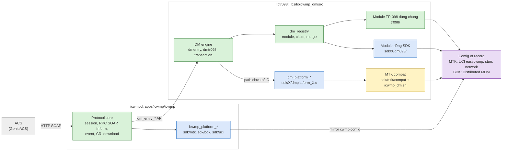
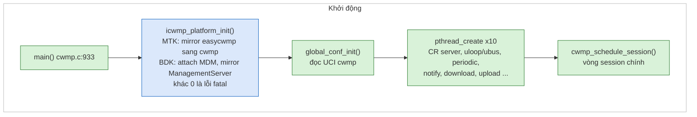
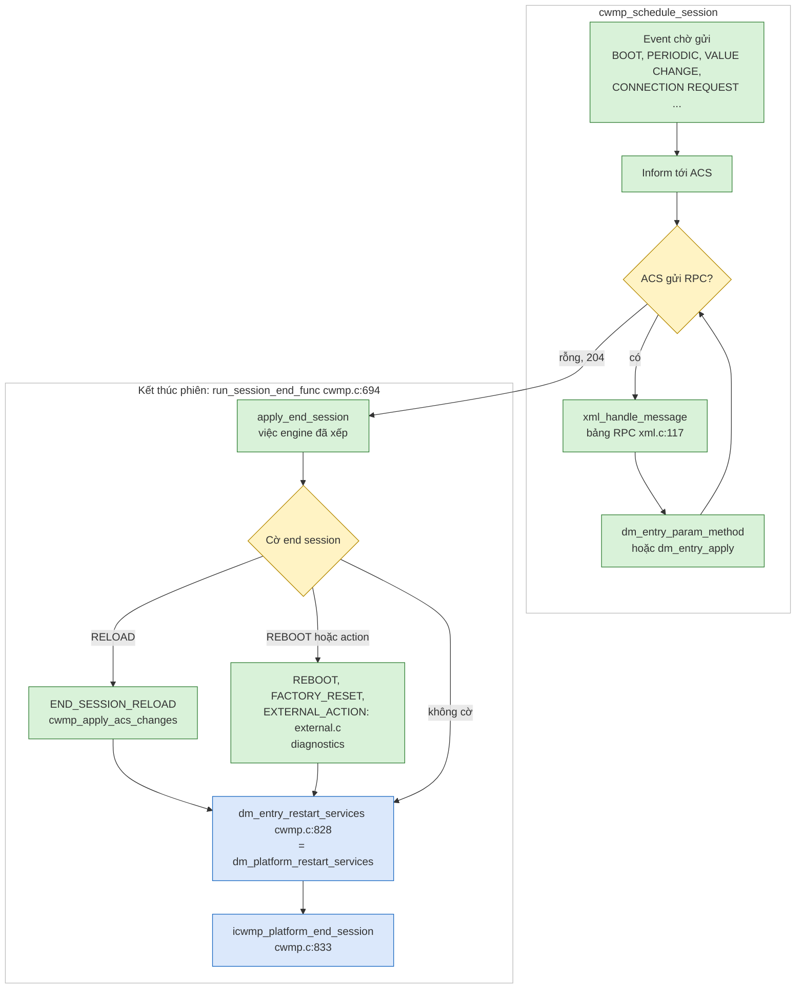
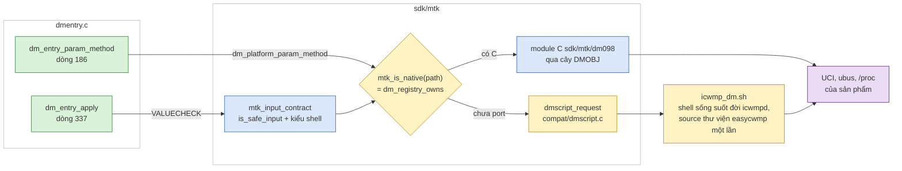

# icwmp multi-SDK: kiến trúc, cách chia code và flow xử lý

Tài liệu đào tạo và chuyển giao. Đọc file này trước. Sau đó đọc
[icwmp_progress_matrix.md](icwmp_progress_matrix.md) để biết đã làm gì, đang ở đâu và còn gì.

| | |
|---|---|
| Người đọc | Kỹ sư firmware nhận phát triển tiếp icwmp, chưa quen code này |
| Snapshot | repo `icwmpMultiSdk`, branch `dev`, sau `[icwmp 0083]` (2026-10-06) |
| Số dòng trích dẫn | anchor của snapshot này. Source đổi thì tìm lại theo tên hàm |
| Nhãn | **Verified** = đã đọc code hoặc chạy thật. **Target** = kiến trúc đích, chưa có trong code |

## START HERE — flow một màn hình

Chú thích màu: xanh lá = code dùng chung cho mọi SDK, xanh dương = code riêng từng SDK,
vàng = lớp chuyển tiếp sẽ bỏ (shell compat của MTK), tím = nơi lưu dữ liệu thật của sản phẩm,
xám = bên ngoài.



Ba câu cần nhớ:

1. **Một source, build riêng cho từng SDK.** Chọn SDK lúc build bằng `--with-sdk=<tên>`. Một firmware chỉ
   chứa đúng một backend.
2. **Code dùng chung không được nhắc tên SDK.** Mọi thứ riêng của SDK nằm trong `sdk/<tên>/` của lib và app,
   và đi qua hai hợp đồng hook: [lib sdk.h](../../userspace/public/libs/libicwmp_dm/src/sdk/sdk.h) và
   [app sdk.h](../../userspace/public/apps/icwmp/icwmp/sdk/sdk.h).
3. **ACS không được thấy khác biệt.** Tên, kiểu, giá trị, fault và side effect phải giống agent cũ của sản
   phẩm. Giống ở đây là giống trên board, không phải giống theo cảm tính.

---

## 1. Vì sao phát triển icwmp riêng

### 1.1 Bài toán trước khi có dự án

| SDK | Agent cũ | Vấn đề |
|---|---|---|
| MTK/Airoha OpenWrt (HP2236B) | `cwmpclient` + thư viện hàm shell easycwmp, khoảng 25 nghìn dòng shell | Mỗi RPC chạy shell rất chậm. Không test được ngoài board. Giá trị đi qua `eval` của shell nên phải có lớp chặn injection (`is_safe_input`). Nhiều phép kiểm trong shell **không bao giờ báo lỗi** do lỗi cú pháp busybox (ví dụ phần 3.4) |
| Broadcom BDK (MO77300EB) | `tr69c` của Broadcom, gắn chặt CMS/MDM | Đóng, khó thêm tham số của operator. Hành vi khác hẳn agent MTK |
| Cả hai | Hai agent khác nhau | Mỗi lỗi giao thức phải sửa hai lần. ACS thấy hai thiết bị cư xử khác nhau |

### 1.2 Mục tiêu và cách đo

| Mục tiêu | Đo bằng gì | Hiện trạng (2026-10-06) |
|---|---|---|
| Một CWMP core bằng C cho mọi SDK | Cùng `apps/icwmp/icwmp` build cho MTK, BDK, OpenWrt chuẩn | Đạt về source. MTK build và chạy board; BDK đã từng build (user báo), chưa build lại với 0067+ |
| Giữ nguyên cây tham số ACS đã provision | 783 param / 184 object của sản phẩm (ma trận `docs/issue/tr098_coverage_matrix.tsv`) | 458/783 bằng C, phần còn lại qua compat shell, không mất path nào (`verify-dm-paths.py`: thiếu 0) |
| Chuyển dần shell sang C, không phải chuyển một lần | Path nào có module C thì C trả lời, còn lại thì shell trả lời | Đạt (router native/compat của MTK) |
| Test được không cần board | `tests/host/run.sh all`: agent thật + ACS giả trên Linux host | Có, nhưng chưa chạy được trên máy build hiện tại (xem progress) |
| Thêm SDK mới không đụng code chung | Thêm `sdk/<tên>/` ở lib và app, chạy `tools/sdk-scan.sh` | Đạt về cấu trúc: `--sdk-only` xoá SDK khác mà vẫn build (0083) |
| Sau này hỗ trợ TR-181 | Model là chiều riêng, không gắn vào SDK | Mới có prototype trên BDK, kiến trúc đích ở PH1/PH6 |

### 1.3 Vì sao chọn icwmp (iopsys) làm core

- Core C có sẵn đủ RPC (GPV, SPV, GPN, SPA, GPA, Add/Delete, Download, Upload, ScheduleDownload, …),
  backup session, notification, Connection Request, STUN/XMPP, chạy trên OpenWrt (UCI, ubus).
- Engine data model kiểu `DMOBJ`/`DMLEAF` (họ libbbfdm) có sẵn TR-098, nên phần lớn công việc là
  **data model + platform adapter**, không phải viết lại giao thức.
- Bài học chung khi port agent CWMP: phần khó là data model, nơi lưu, notification, vòng đời firmware và
  process supervisor; HTTP/SOAP hiếm khi là phần khó.

---

## 2. Ba chiều thiết kế: SDK, data model, product

| Chiều | Câu hỏi nó trả lời | Ví dụ | Chọn lúc nào |
|---|---|---|---|
| **SDK** | Giá trị nằm ở đâu, ghi bằng cách nào | `mtk` (UCI + ubus + shell của product), `bdk` (Distributed MDM qua `libbcm_generic_hal`), `uci` (OpenWrt chuẩn) | Build: `--with-sdk` |
| **Data model** | Cây trông thế nào trước ACS | TR-098 (`InternetGatewayDevice.`), TR-181 (`Device.`) | Hiện: theo SDK. Đích (PH1): resolver trung tâm |
| **Product/operator** | Phần riêng của sản phẩm/nhà mạng | `X_AIS_*` của AIS, prefix `X_HNI_`, mặc định, tính năng bật/tắt | Hiện: lẫn trong `sdk/mtk`. Đích (PH4): lớp product riêng |

**Không trộn các chiều.** SDK không được quyết định model ACS thấy. Product policy không được nằm trong
backend SDK chung. Hiện code chưa đạt hết điều này, xem phần 8.

---

## 3. Kiến trúc tổng quan

### 3.1 Thành phần

| Thành phần | Thư mục | Vai trò | Gói build |
|---|---|---|---|
| **icwmpd** | [apps/icwmp/icwmp](../../userspace/public/apps/icwmp/icwmp) | Protocol core: session, RPC SOAP, Inform/event, backup session, Connection Request, download/upload, ubus `tr069` | MTK gói `icwmp_tr098` (binary `icwmp_tr098d`); BDK component `apps/icwmp` (binary `icwmpd`) |
| **libtr098** (source `libicwmp_dm`) | [libs/libicwmp_dm/src](../../userspace/public/libs/libicwmp_dm/src) | Engine data model, registry, helper lưu trữ (UCI/ubus/JSON), module TR-098, backend SDK | MTK gói `libtr098`; BDK component `libs/libicwmp_dm`. Cả hai ra `libtr098.so` (giữ ABI cũ) |
| microxml | [libs/microxml](../../userspace/public/libs/microxml) | Parser XML của SOAP | BDK cài từ repo; MTK dùng `libmicroxml` của SDK |
| libuci (BDK) | [libs/uci](../../userspace/public/libs/uci) | libuci upstream build cho BDK, vì icwmpd giữ config `cwmp` bằng UCI trên mọi SDK | chỉ BDK |
| Feed MTK | [feeds/](../../feeds) | Makefile OpenWrt của hai gói | chỉ MTK |
| Công cụ giao | [apply.py](../../apply.py), [export.py](../../export.py), `MANIFEST.json`, `SHA256SUMS` | Kiểm checksum bundle và cài vào SDK đích, có backup | — |

### 3.2 Phân lớp trong icwmpd

| Lớp | File chính | Ghi chú |
|---|---|---|
| Khởi động, thread, vòng session | [cwmp.c](../../userspace/public/apps/icwmp/icwmp/cwmp.c) — `main()` (dòng 933), `cwmp_schedule_session()` (338), `run_session_end_func()` (694) | 10 thread: CR HTTP server, uloop/ubus, periodic, notify, scheduleInform, download, ChangeDUState, ScheduleDownload (2), upload |
| RPC SOAP | [xml.c](../../userspace/public/apps/icwmp/icwmp/xml.c) — bảng RPC từ dòng 117 | Mỗi RPC gọi API `dm_entry_*` của lib |
| HTTP tới ACS / CR server | [http.c](../../userspace/public/apps/icwmp/icwmp/http.c), [digestauth.c](../../userspace/public/apps/icwmp/icwmp/digestauth.c) | curl phía client, digest auth cho Connection Request |
| Event, backup session | [event.c](../../userspace/public/apps/icwmp/icwmp/event.c), [backupSession.c](../../userspace/public/apps/icwmp/icwmp/backupSession.c) | BOOTSTRAP khi ACS URL đổi (`cwmp_root_cause_event_bootstrap`, dòng 794) |
| Hành động ngoài (reboot, factory reset, download apply) | [external.c](../../userspace/public/apps/icwmp/icwmp/external.c) | Gọi `/usr/sbin/icwmp` (script của SDK) hoặc hàm C của BDK |
| ubus `tr069` | [ubus.c](../../userspace/public/apps/icwmp/icwmp/ubus.c) — `notify`, `command`, `status`, `inform`, `dm` | `dm` ([icwmp_dm.c](../../userspace/public/apps/icwmp/icwmp/icwmp_dm.c)) cho tool/WebUI đọc ghi data model ngay trên thiết bị |
| Config | [config.c](../../userspace/public/apps/icwmp/icwmp/config.c) | Đọc UCI `cwmp`; `cwmp_config_reload()` dòng 1372 |
| Hook SDK | `sdk/<tên>/` | `icwmp_platform_init / config_reload / config_reloaded / uloop_register / end_session / cleanup` |

### 3.3 Phân lớp trong libtr098

| Lớp | File | Ghi chú |
|---|---|---|
| API cho app | [dmentry.c](../../userspace/public/libs/libicwmp_dm/src/dmentry.c) — `dm_ctx_init` (143), `dm_entry_param_method` (186), `dm_entry_apply` (337), `dm_entry_restart_services` (834) | Mọi RPC đi qua đây |
| Duyệt cây | [dmtr098.c](../../userspace/public/libs/libicwmp_dm/src/dmtr098.c) | Đi qua bảng `DMOBJ`/`DMLEAF`, gọi getter/setter |
| Registry | [dm_registry.c](../../userspace/public/libs/libicwmp_dm/src/dm_registry.c), [dm_registry.h](../../userspace/public/libs/libicwmp_dm/src/dm_registry.h) | Module tự đăng ký (`DM_MODULE_REGISTER`), gộp theo tên, module sau thắng ở lá trùng; `.paths` là claim; `dm_registry_owns()` cho router biết path nào có C |
| Helper lưu trữ | [dmuci.c](../../userspace/public/libs/libicwmp_dm/src/dmuci.c), [dmubus.c](../../userspace/public/libs/libicwmp_dm/src/dmubus.c), [dmjson.c](../../userspace/public/libs/libicwmp_dm/src/dmjson.c), [dmcommon.c](../../userspace/public/libs/libicwmp_dm/src/dmcommon.c), [dmmem.c](../../userspace/public/libs/libicwmp_dm/src/dmmem.c) | Xem phần 7 về tên `dmuci_*` |
| Module TR-098 dùng chung | [tr098/](../../userspace/public/libs/libicwmp_dm/src/tr098) | Chỉ dùng helper ở trên, phải compile trên mọi SDK |
| Backend SDK | `sdk/<tên>/` | `dm_platform_*` hook + module riêng (`dm098/`) + compat |

### 3.4 Cái gì chung, cái gì riêng

| Loại xử lý | Chung (mọi SDK) | Riêng từng SDK |
|---|---|---|
| Giao thức CWMP, SOAP, session, retry, event | `apps/icwmp/icwmp/*.c` | — |
| Nơi lưu ACS settings (URL, chu kỳ, credential) | icwmpd luôn đọc UCI `cwmp` | Mirror `cwmp` ↔ config of record: MTK `easycwmp` + `stun`; BDK `Device.ManagementServer.*` của MDM (`icwmp_platform_*`) |
| Reboot, factory reset, áp firmware | `external.c` gọi action | Script `/usr/sbin/icwmp` của SDK (MTK `sdk/mtk/scripts/icwmp.sh`), BDK làm bằng C |
| Init/procd, value monitoring | — | MTK `sdk/mtk/files/` (`icwmpd.init`, `value_monitoring`, `easycwmpd` shim) |
| Engine data model, transaction, registry | `dmentry.c`, `dmtr098.c`, `dm_registry.c` | Hook `dm_platform_commit/revert/restart_services` |
| Getter/setter tham số | `tr098/` (khi semantic giống nhau) | `sdk/mtk/dm098/` (24 file C, 458 param của sản phẩm), `sdk/bdk/dm098/` (TR-098 chiếu lên TR-181 MDM) |
| Path chưa port | — | MTK: `sdk/mtk/compat/` gọi thư viện shell của sản phẩm qua `icwmp_dm.sh` |
| Hợp đồng input trước setter | — | MTK `input_contract_mtk.c`: `is_safe_input` + kiểm theo kiểu shell |

---

## 4. Cách chia code: đặt cái gì ở đâu

### 4.1 Cây thư mục (chỉ phần cần biết)

```text
icwmpMultiSdk/
├── apply, apply.py, export.py, MANIFEST.json, SHA256SUMS   giao source vào SDK
├── feeds/{libtr098,icwmp_tr098}/Makefile                    gói OpenWrt của MTK
├── tests/host/                                              agent thật + ACS giả trên host
├── docs/                                                    tài liệu, plan, trạng thái
└── userspace/
    ├── sdk-prune.sh                                         giữ một SDK cho cả lib và app
    └── public/
        ├── libs/libicwmp_dm/          Bcmbuild.mk, Makefile (glue BDK)
        │   └── src/
        │       ├── dmentry.c dmtr098.c dm_registry.c        engine
        │       ├── dmuci.c dmubus.c dmjson.c dmcommon.c      helper lưu trữ
        │       ├── tr098/                                    module TR-098 dùng chung
        │       ├── bin/Makefile.am  configure.ac             build chung, không tên SDK
        │       ├── tools/sdk-scan.sh sdk-prune.sh            sinh sdk/enabled.*
        │       └── sdk/
        │           ├── sdk.h  enabled.mk  enabled.m4         hợp đồng + file sinh
        │           ├── uci/   OpenWrt chuẩn (backend tham chiếu)
        │           ├── bdk/   dmplatform_bdk.c dmproxy_bdk.c dm098/
        │           └── mtk/   dmplatform_mtk.c dmmtk.c input_contract_mtk.c
        │                      dm098/ (module C)  compat/ (shell bridge)
        ├── libs/microxml/  libs/uci/                         dependency của BDK
        └── apps/icwmp/                Bcmbuild.mk, Makefile (glue BDK)
            └── icwmp/
                ├── cwmp.c xml.c http.c event.c config.c ubus.c icwmp_dm.c ...
                ├── stun/ xmpp/ twamp/ udpechoserver/ bulkdata/   daemon phụ (tùy chọn)
                └── sdk/{uci,bdk,mtk}/                        icwmp_platform_* + files/ + scripts/
```

### 4.2 Quy tắc đặt code

| Tôi cần … | Đặt ở | Không được |
|---|---|---|
| Sửa giao thức, RPC, session | `apps/icwmp/icwmp/*.c` | Gọi thẳng UCI/MDM/shell của sản phẩm từ protocol core |
| Thêm tham số có cùng semantic trên mọi SDK | `tr098/` (TR-098) | Dùng `#ifdef` SDK trong file chung |
| Thêm tham số đọc ghi kho riêng của một SDK | `sdk/<tên>/dm098/<object>_<tên>.c`, đăng ký bằng `DM_MODULE_REGISTER` + `.paths`, thêm vào `sdk/<tên>/sdk.mk` | Sửa bảng gốc của module khác; claim chồng với module khác (`verify-dm-paths.py --claims` phải ra 0) |
| Thay hành vi đồng bộ config ACS, reboot, lưu flash | `apps/icwmp/icwmp/sdk/<tên>/` (hook `icwmp_platform_*`) | Sửa `cwmp.c` theo SDK |
| Thêm cả một SDK mới | `sdk/<mới>/` ở lib **và** app (`sdk.m4`, `sdk.mk`, hook, `README.md`), rồi `tools/sdk-scan.sh` | Sửa `configure.ac` hay `bin/Makefile.am` chung |
| Phần riêng của operator (`X_AIS_*`) | Hiện: `sdk/mtk/dm098/`. Đích: lớp product (PH4) | Trộn policy operator vào backend chung mới |
| Lệnh ngoài trong lib | `dmcmd()` (`posix_spawn`, đọc output trong lúc lệnh chạy) | Tự `fork()` + `waitpid()` rồi mới đọc pipe |

Quy tắc code rút ra từ các lỗi đã gặp (0062–0077) nằm ở
[sync-main-dev.md §6.5](../plan/sync-main-dev.md#65-quy-tắc-code-rút-ra-từ-00620077). Ví dụ: tiến trình nền
do init sinh ra phải đóng fd 1000; JSON từ ubus phải kiểm kiểu trước `foreach`; mọi đường lỗi sau
`pthread_mutex_lock` phải unlock; mọi field RPC từ ACS có thể vắng.

### 4.3 Cơ chế plugin SDK (Verified)

- Mỗi `sdk/<tên>/` có `sdk.m4` (configure: `AM_CONDITIONAL`, `AC_DEFINE`) và `sdk.mk` (automake: thêm
  source, CFLAGS).
- [tools/sdk-scan.sh](../../userspace/public/libs/libicwmp_dm/src/tools/sdk-scan.sh) sinh `sdk/enabled.m4` và
  `sdk/enabled.mk` từ các thư mục **đang có**. `configure.ac` và `bin/Makefile.am` không biết tên SDK nào.
- Feed MTK và Makefile wrapper của BDK đều chạy `sdk-scan.sh` trước `autoreconf`, nên xoá một
  `sdk/<tên>/` vẫn build được.
- `apply --sdk-only` (0083) và `userspace/sdk-prune.sh` dùng đúng cơ chế này để giao cây chỉ có một SDK.

---

## 5. Flow xử lý

### 5.1 Khởi động icwmpd

Chú thích màu: xanh lá = code chung, xanh dương = hook SDK, đỏ = điểm dễ lỗi đã gặp.



Trên MTK, [icwmpd.init](../../userspace/public/apps/icwmp/icwmp/sdk/mtk/files/icwmpd.init) (procd) chạy daemon
với `respawn 3 10 0` (dòng 200): daemon chết thì procd khởi động lại. Boot thường thấy hai lần start: `-g`
(lấy RPC methods) rồi `-b` (boot). Nhiều lần start hơn thì có vấn đề: crash, hoặc procd restart như K17.
Log khởi động: `/tmp/icwmpd_boot.log`.

### 5.2 Một phiên ACS

Chú thích màu: xanh lá = code chung, xanh dương = hook SDK, vàng = gate quyết định.



Bài học K17 (sửa ở 0080): hook restart services của MTK từng gọi `ubus call uci commit easycwmp`. Việc đó
kích reload trigger của procd và **khởi động lại chính icwmpd** sau mỗi lần ACS ghi ManagementServer. Giờ
`easycwmp` được bỏ qua ở hook đó, và icwmpd tự đọc lại config bằng `END_SESSION_RELOAD`.

### 5.3 GPV/SPV đi qua engine và router MTK

Chú thích màu: xanh lá = engine chung, xanh dương = backend MTK, vàng = compat shell, tím = kho dữ liệu.



Nguồn: [dmplatform_mtk.c](../../userspace/public/libs/libicwmp_dm/src/sdk/mtk/dmplatform_mtk.c)
(`mtk_is_native` dòng 103). Path phủ cả hai phía (ví dụ GPV `InternetGatewayDevice.`) được hỏi cả hai rồi
gộp danh sách. Bản build `--disable-dm-script-compat` bỏ toàn bộ nhánh vàng: đó là đích PH5.

**Transaction của SPV**, theo [sdk.h](../../userspace/public/libs/libicwmp_dm/src/sdk/sdk.h):

1. `VALUECHECK` cho **mọi** param. Setter chỉ kiểm, không ghi. Một param sai thì cả RPC trả fault 9003 kèm
   fault từng param, không ghi gì.
2. `dm_entry_apply()` gọi `VALUESET` cho mọi param. Setter ghi vào UCI (chưa commit) hoặc xếp hàng.
3. `dm_platform_commit()` ghi một lần. Lỗi thì gọi `dm_platform_revert()`.
4. Cuối phiên, `dm_platform_restart_services()` commit UCI theo từng package và reload service.

### 5.4 Notification và value change

- `value_monitoring` (MTK, `sdk/mtk/files/`) gọi `ubus call tr069 notify` theo chu kỳ.
- Thread notify so giá trị với `DM_ENABLED_NOTIFY` (`/etc/tr098/.dm_enabled_notify`), thêm event
  `4 VALUE CHANGE` rồi mở phiên.
- Đã kiểm trên board: đổi `provisioning_code` bằng `uci`, 28 s sau có Inform `4 VALUE CHANGE` mang giá trị mới.

### 5.5 Connection Request

| Kiểu | Đường đi |
|---|---|
| HTTP | Thread `thread_http_cr_server_listen` (cwmp.c:888) nghe cổng 7547, kiểm digest bằng `easycwmp.@local[0].username/password` (mirror sang `cwmp`), rồi mở phiên `6 CONNECTION REQUEST` |
| UDP qua STUN (MTK) | `stun-client` của sản phẩm (`stuncd`) kiểm HMAC bằng `stun.@stun[0]`, rồi `ubus call tr069 inform '{"event":"6 connection request"}'`. Module `managementserver_mtk.c` đọc ghi `stun.@stun[0]` |

### 5.6 ubus `tr069 dm` (dùng tại chỗ)

[icwmp_dm.c](../../userspace/public/apps/icwmp/icwmp/icwmp_dm.c) cho WebUI và tool gọi `get / names / set /
add / del / inform` vào cùng engine, kể cả end-session (dòng 283–295). Đây là cách nhanh nhất để test
một tham số trên board:

```sh
ubus call tr069 dm '{"cmd":"get","path":"InternetGatewayDevice.DeviceInfo."}'
ubus call tr069 dm '{"cmd":"set","path":"InternetGatewayDevice.DeviceInfo.ProvisioningCode","value":"x","key":"k"}'
ubus call tr069 status
```

---

## 6. Tích hợp vào SDK và build

### 6.1 Apply

`./apply --sdk {mtk|bdk} [--sdk-only] [--dry-run] <SDK root>` ([apply.py](../../apply.py)):

1. Kiểm SHA256 từng file của bundle (`MANIFEST.json`). Có file lạ trong `userspace/` hay `feeds/` thì dừng.
2. Lập kế hoạch: thư mục chép, file sửa (profile config, feed Makefile, glue BDK), thư mục legacy cần cất.
3. `--sdk-only`: lược bản chép, chỉ giữ `sdk/<sdk>/` và sinh lại `enabled.*`.
4. Ghi có backup + journal ở `<SDK>/.icwmp-backups/<thời điểm>/`, lỗi thì rollback. Chạy lại khi không đổi
   gì thì báo "Already applied".

Giao một bản chỉ một SDK, ví dụ chỉ MTK/OpenWrt: `./export.py --sdk mtk <ngoài repo>/icwmp_mtk.tar.gz` (0085). Bundle lấy
từ HEAD đã commit, chỉ còn `sdk/mtk`, bỏ 33 file `tr098/` chỉ SDK `uci` dùng, bỏ libuci/glue BDK/docs BDK. Source
microxml vẫn đi kèm, vì test host (`tests/host/build.sh`) build nó (0087).
`MANIFEST.json` ghi đúng commit. Tarball tái lập được (hai lần export cho cùng sha256). Người nhận giải nén rồi
chạy `./apply --sdk mtk <2025q3>`; `--sdk bdk` bị từ chối.

| SDK | Đích cài |
|---|---|
| MTK | `tclinux_phoenix/apps/hni/libicwmp_dm` ← `libicwmp_dm/src`; `.../icwmp_tr098` ← `apps/icwmp/icwmp`; hai feed Makefile; `config_7583` bật `libtr098`, `icwmp_tr098`, `libmicroxml`, tắt `cwmpclient` |
| BDK | `userspace/public/libs/{microxml,uci,libicwmp_dm}`, `userspace/public/apps/icwmp`; sửa `make.common` + `comp_tr69_md.c` theo `bdk-integration.json`; profile bật `BUILD_ICWMP`, TR69 SSL |

### 6.2 Build nhanh

| SDK | Lệnh |
|---|---|
| MTK (trong docker build) | `make package/libtr098/{clean,compile} V=sc -j1 && make package/icwmp_tr098/{clean,compile} V=sc -j1`, rồi `make -j16 MSDK=1 V=s` ra `bin/targets/airoha/an7583/tclinux.bin` |
| BDK | `make -C userspace/public/libs/libicwmp_dm -f Bcmbuild.mk`, `make -C userspace/public/apps/icwmp -f Bcmbuild.mk`, rồi `make PROFILE=MO77300EB` |

Feed MTK là `src-cpy`. Khi chỉ build gói lẻ, refresh **đúng hai** Makefile như apply in ra, đừng chạy
`feeds update airoha` (từng làm hỏng build image).

---

## 7a. Bảng tên: một thứ, nhiều tên (MTK)

Rà soát 2026-10-06. Tên cũ được giữ vì nó là **giao diện với sản phẩm**: package trong `config_7583`,
đường dẫn WebUI/HAL đang gọi, SONAME. Đổi tên không mang lại gì khi chạy mà phải sửa cùng lúc feed,
profile, init và mọi nơi sản phẩm gọi tới. Việc đó để cho PH8 (release/ABI).

| Thứ | Trong source | Trên SDK MTK / board | Vì sao tên như vậy |
|---|---|---|---|
| Thư viện data model | `libs/libicwmp_dm/src` | gói `libtr098`, `/usr/lib/libtr098.so.3` | Source đổi tên ở A1 (0034) cho trung lập về model. Package và SONAME giữ tên cũ để không phải đổi profile và các thứ link vào |
| Header của thư viện | `libicwmp_dm/src/*.h` | `<icwmp_dm/...>` trong staging; `<libtr098/...>` chỉ là header chuyển tiếp | `tools/install-headers.sh` |
| Agent | `apps/icwmp/icwmp` | gói `icwmp_tr098`, binary `/usr/sbin/icwmp_tr098d` | Gói thay `cwmpclient` (`CONFLICTS:=cwmpclient`) |
| Init | `sdk/mtk/files/icwmpd.init` | `/etc/init.d/icwmpd` | procd, `respawn 3 10 0` |
| Shim cho sản phẩm | `sdk/mtk/files/easycwmpd` | `/etc/init.d/easycwmpd` → gọi `icwmpd` | WebUI, `hal_gateway`, `stuncd` vẫn gọi tên cũ |
| Script hành động | `sdk/mtk/scripts/icwmp.sh` | `/usr/sbin/icwmp` | `external.c` gọi tên này (SDK `uci`, `mtk`); BDK làm hành động bằng C |
| Compat shell | `sdk/mtk/compat/icwmp_dm.sh` | `/usr/share/icwmp/icwmp_dm.sh` | Mất đi khi build `--disable-dm-script-compat` (PH5) |
| Config | `sdk/mtk/files/cwmp` | `/etc/config/cwmp` (của icwmpd) + `/etc/config/easycwmp` (config of record của sản phẩm) | Xem mirror ở phần 3.4 |
| Object ubus | `ubus.c` | `tr069` | Giữ tên của cwmpclient cũ; `stun-client` (`tr069 inform`) và `value_monitoring` (`tr069 notify`) gọi tên này |

**Tên file trong `sdk/mtk/`** theo một luật: `<object>_mtk.c` cho module data model (`wanip_mtk.c`,
`wlansec_mtk.c`), `dmplatform_mtk.c` cho hook `dm_platform_*`, `dmmtk.c`/`dmmtk.h` cho helper dùng chung của
backend, `input_contract_mtk.c` cho hợp đồng input, `compat/` cho phần sẽ bỏ. Riêng
`managementserver_core_mtk.c` (29 dòng) chỉ đăng ký bảng lá ManagementServer dùng chung từ
`tr098/managementserver.c`, để `managementserver_mtk.c` ghi đè các lá của sản phẩm; tên hơi tối nghĩa nhưng
vai trò ghi rõ trong file.

**Tiền tố hàm** phân lớp rõ: `cwmp_*` protocol core, `dm_entry_*`/`dm_ctx_*` API engine, `dm_registry_*`
registry, `dm_platform_*` hook của lib, `icwmp_platform_*` hook của app, `mtk_*` helper của backend MTK,
`dmuci_*`/`dmubus_*`/`dmjson_*` adapter kho dữ liệu (phần 7).

## 7. Quy ước tên: `dmuci_*`, `uci_foreach_element` có nên đổi không

**Khuyến nghị: giữ nguyên tên. Vấn đề thật là `dmcommon.c` đang trộn hai loại helper; tách file đó ở PH2.**

| Điểm | Sự thật trong code (Verified) | Kết luận |
|---|---|---|
| `uci_foreach_element` | Macro của chính libuci ([uci.h:544](../../userspace/public/libs/uci/uci/uci.h#L544)) | Không phải tên của ta, không đổi được |
| `dmuci_*` | Adapter mỏng trên libuci. UCI là kho thật trên **cả ba** SDK: OpenWrt có sẵn, BDK build libuci từ `libs/uci` vì icwmpd giữ config `cwmp` bằng UCI | Tên mô tả đúng việc nó làm. Bỏ tiền tố `uci` thì gây hiểu nhầm là lớp trừu tượng kho dữ liệu |
| Số chỗ gọi | `dmuci_*` khoảng 2000 chỗ (lib dùng chung 1666, `sdk/mtk` 195, app 127) | Đổi tên = sửa hàng nghìn dòng, rủi ro cao, không có lợi chức năng |
| Nguồn gốc | Tên từ họ libbbfdm/icwmp của iopsys | Giữ tên giúp đối chiếu và cherry-pick từ upstream |
| `dmcommon.c` | 80 hàm public: **32 hàm gắn schema UCI của OpenWrt** (`dhcp_option`, firewall zone, wlan, vlan bridge), chỉ `tr098/` và `dmtr098.c` gọi; `sdk/bdk` không gọi hàm nào trong đó. **34 hàm không có ai gọi trong lib** | Tên file "common" nói dối: một phần là helper của OpenWrt, không phải của mọi SDK |

Việc nên làm (đã đưa vào [progress](icwmp_progress_matrix.md), PH2):

1. Tách `dmcommon.c` thành helper trung lập (chuỗi, IP, MAC, …) và helper schema OpenWrt (chỉ cho
   `uci`/`mtk`), ví dụ `openwrt/dmopenwrt.c`.
2. Rà 34 hàm không có ai gọi (kiểm cả app) rồi xoá.
3. Nếu sau này có kho không phải UCI cho cùng một semantic, ví dụ ManagementServer trên BDK MDM, thì làm
   **service contract** (PH3), không đổi tên `dmuci_*`.

---

## 8. Chỗ code chưa đạt kiến trúc (biết trước khi sửa)

| Điểm | Ở đâu | Kế hoạch |
|---|---|---|
| File chung nhắc tên SDK | [tr098/managementserver.c:238](../../userspace/public/libs/libicwmp_dm/src/tr098/managementserver.c#L238) `#ifdef DM_PLATFORM_BDK` | PH3 (service ManagementServer) |
| Model do SDK quyết | `dm_platform_select_root()`: BDK đổi root sang `Device.` | PH1 resolver trung tâm |
| Compat provider + prefetch nằm trong `dmplatform_mtk.c` (K7) | `sdk/mtk/dmplatform_mtk.c` | PH2 tách `sdk/mtk/compat/` sau interface provider |
| Policy operator trong backend MTK | `x_ais_mesh_mtk.c`, prefix `X_HNI_` | PH4 lớp product |
| ~~`.icwmp-release.json` ghi commit của baseline cũ~~ | — | **Đã sửa ở 0085** (K19): apply ghi `git HEAD` khi chạy từ repo, ghi commit của export khi chạy từ bundle |
| `dmcommon.c` trộn helper | phần 7 | 27 hàm không ai tham chiếu đã gỡ ở 0086; phần tách helper còn lại để PH2 |

---

## 9. Kiểm thử và mức bằng chứng

Không ghi trạng thái cao hơn bằng chứng thấp nhất trên commit HEAD
([sync-main-dev.md §4](../plan/sync-main-dev.md#4-thang-bằng-chứng)).

| Mức | Công cụ | Ghi chú |
|---|---|---|
| STATIC | `docs/issue/check-c-sanity.py`, `verify-dm-paths.py` (`--phase`, `--claims`), `check-automake-conds.py`, `update-sums.py --check` | Chạy trước mọi commit |
| Cross-gcc của SDK | `docs/issue/check-cc-syntax.py --sdk-root <2025q3>` | Bắt lỗi mà build SDK chỉ cảnh báo (cắt con trỏ 64 bit) |
| HOST | `tests/host/run.sh all` trong container dùng một lần | Cần container Ubuntu mới, có mạng tới GitHub |
| SDK build | apply + build hai gói | — |
| BOARD | runbook gate G1–G9 ([ph0_gate_runbook.md](../plan/ph0_gate_runbook.md)) | Kiểm bằng `ubus call tr069 …` trên board và phiên ACS thật |
| SOAK | sampler 24 h: VmRSS, fd, thread | — |

Mỗi lỗi đã sửa phải có test host bắt được nó (§6.3 của plan).

## 10. Checklist: thêm một tham số TR-098 trên MTK

1. Tìm path trong `docs/issue/tr098_coverage_matrix.tsv`: kiểu, quyền, hàm shell cũ đang trả lời nó.
2. Đọc hàm shell cũ trong thư viện easycwmp của sản phẩm: nó đọc ghi option UCI nào, side effect gì, kiểm gì.
   **Chạy chính hàm đó trên board** để biết hành vi thật, vì shell hay có kiểm không bao giờ chạy.
3. Viết getter/setter trong `sdk/mtk/dm098/<object>_mtk.c`. Ghi vào **config of record của sản phẩm**, không
   ghi vào `cwmp`.
4. Khai `.paths` claim, thêm file vào `sdk/mtk/sdk.mk`.
5. Chạy: `verify-dm-paths.py` (thiếu 0, chồng 0), `check-c-sanity.py`, `check-cc-syntax.py`.
6. Thêm ca vào `tests/host/run.sh` nếu là bản sửa lỗi.
7. Build gói, kiểm trên board bằng `ubus call tr069 dm` rồi bằng ACS.
8. Commit `[icwmp NNNN] <phạm vi>: <việc>`; bundle đổi thì chạy `update-sums.py --staged`
   ([sync-main-dev.md §6.2](../plan/sync-main-dev.md#62-commit)).

## 11. Tài liệu chi tiết

| Muốn biết | Đọc |
|---|---|
| Trạng thái, việc còn lại | [icwmp_progress_matrix.md](icwmp_progress_matrix.md) |
| Kế hoạch PH0–PH8, quy ước commit, cổng PR | [plan/sync-main-dev.md](../plan/sync-main-dev.md) |
| Kiến trúc đích chi tiết | [plan/v2/icwmp_multisdk_design_v2.md](../plan/v2/icwmp_multisdk_design_v2.md), [plan/v2/icwmp_mtk_openwrt_design_v2.md](../plan/v2/icwmp_mtk_openwrt_design_v2.md) |
| Backend từng SDK | `sdk/<tên>/README.md` ở lib và app |
| BDK: thiết kế, runtime, debug | [bdk/](../bdk) |
| Gate board PH0 | [plan/ph0_gate_runbook.md](../plan/ph0_gate_runbook.md) |
| Bằng chứng theo thời gian | [issue/analysis.md](../issue/analysis.md) |
| Test host | [tests/host/README.md](../../tests/host/README.md) |
