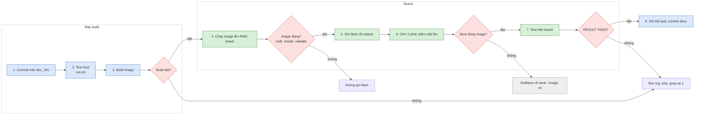

# Vòng dev trên lab: build → nạp → kiểm board (MTK và BDK)

Tài liệu này ghi lại cách một vòng dev được chạy tự động trên lab: kết nối, build, kiểm image, nạp, chờ boot, test và
đọc kết quả. Mọi lệnh ở đây đã chạy thật trong các ngày 08–10/10/2026 (dev_181, analysis §74–§95). Mỗi bước có một
**cổng đạt**. Cổng không đạt thì dừng ở đó, không làm bước sau.

Không có mật khẩu nào trong tài liệu này. Mật khẩu chỉ đi qua biến môi trường và script askpass (mục 1).

## START HERE — một vòng trên một màn hình

Chú thích màu: xanh dương = máy build, xanh lá = board, đỏ = cổng (không đạt thì dừng), xám = rollback.



| Bước | MTK HP2236B | BDK MO77300EB | Cổng đạt |
|---|---|---|---|
| 2. Test host | `tests/host/run.sh all` trong container | (dùng chung host test) | rc 0, không có dòng `FAIL` |
| 3. Build | `sdkbuild.sh <tag>` trong docker `nvtu-openwrt` | `build.sh` qua tmux `bdk1` trên `192.168.100.38` | MTK `ICWMP_IMAGE_RC=0`; BDK `DONE_OK` + `Image MO77300EB has been built` |
| 4. Chép, kiểm image | `ssh … 'cat > /var/tmp/tclinux.bin'` | `nc -l` trên board + `push.py` | md5 hai đầu trùng; MTK `Model validation successful`, `"valid": true`, `sysupgrade -T` rc 0 |
| 5. Ghi flash | `sysupgrade` qua `start-stop-daemon` | `bcm_flasher` → `bcm_bootstate 3` → `reboot` | MTK `Commencing upgrade`; BDK `Image flash complete` |
| 6. Kiểm boot | chờ 180 s, rồi kiểm | chờ 180 s, rồi kiểm | md5 thư viện = bản build; `tr069 status` `up`; BDK `Booted Partition` là bank mới, commit 1 |
| 7. Test board | `parity_dump.sh` + `parity.py`, `tr181_window.sh` + `tr181-map.py equiv`, `tr181-bbf-check.py` | `bdk_apply_check.sh` | mọi công cụ in `RESULT: PASS` |

## 0. Lab

| Tên | Giá trị | Vào bằng |
|---|---|---|
| Máy build (host) | `Dell-Slim`, có docker | — |
| Repo | `.../issues/20260922_icwmp_multiplatform_tr098/icwmpMultiSdk`, branch `dev_181` | — |
| Cây SDK MTK | `/home/nvtu/workspace/openwrt/2_src/2025q3`, container `nvtu-openwrt` (user `nvtu`) | `docker exec` |
| Board MTK HP2236B | `192.168.10.1`, qua card USB-Ethernet của host (host `192.168.10.141`) | SSH tài khoản dev của patch dev-access |
| Máy build BDK | `network@192.168.100.38`, cây `/home/vtanh/workspaceBRCM/tunv/2_src/bcm963xx`, container `vtanh-brcm` | SSH mật khẩu, build qua tmux `bdk1` |
| Board BDK MO77300EB | `192.168.1.1`, qua Wi-Fi `wlp2s0` của host (host `192.168.1.101`) | SSH `admin` (vào CLI CMS) |
| Console BDK | `/dev/ttyUSB6` 115200 (Prolific, by-id `…DVA_b131R01…`) | `picocom -b 115200 /dev/ttyUSB6` |
| ACS | GenieACS `172.16.0.15` (CWMP 7547, NBI 7557), chỉ board tới được | chỉ GET đọc, không tạo task |

**Mật khẩu ở đâu** (không chép vào file nào):

| Tài khoản | Nguồn |
|---|---|
| SSH board MTK | dòng `DEV_USER`/`DEV_PASS` của `patches/20261005_board_dev_access_feature/1000-board-dev-access-feature.patch` (workspace, không nằm trong repo) |
| `network@192.168.100.38`, `admin@` board BDK, Wi-Fi BDK | user đưa trong chat, chatlog ghi `<masked>` |

## 1. Kết nối tự động

Host không có `sshpass`/`expect`. Cách làm là **mở một SSH master một lần bằng askpass**. Các lệnh sau đi qua master với
`BatchMode=yes`, nên không cần mật khẩu nữa và mở kết nối rất nhanh.

```sh
S=<thư mục tạm của phiên>                 # chmod 700, xoá khi xong
printf '#!/bin/sh\nprintf "%%s\\n" "$PW"\n' > $S/askpass.sh; chmod 700 $S/askpass.sh

# mở master (một lần); PW chỉ sống trong lệnh này
PW='<mật khẩu>' SSH_ASKPASS=$S/askpass.sh SSH_ASKPASS_REQUIRE=force DISPLAY=:0 \
  setsid -w ssh -4 -o ControlMaster=yes -o ControlPath=/tmp/claude-1000/cm-%C -o ControlPersist=60m \
  -o ConnectTimeout=15 -fN user@host </dev/null
rm -f $S/askpass.sh                        # master đã mở, askpass không cần nữa

# mọi lệnh sau
ssh -4 -o ControlPath=/tmp/claude-1000/cm-%C -o BatchMode=yes user@host '<lệnh>'

# đóng (user@host phải đúng như lúc mở, vì %C băm theo host)
ssh -O exit -o ControlPath=/tmp/claude-1000/cm-%C user@host
```

- `setsid -w` tách khỏi terminal để ssh buộc phải hỏi askpass, `-w` chờ ssh xong mới trả về.
- ControlPath để ở `/tmp/claude-1000/`: đường dẫn socket dài quá 108 byte thì ssh báo lỗi.
- Host key: máy build BDK và board BDK dùng `UserKnownHostsFile` riêng trong `$S` với `StrictHostKeyChecking=yes`
  (`accept-new` lần đầu). Board MTK đổi host key sau mỗi lần nạp, nên dùng `StrictHostKeyChecking=no
  -o UserKnownHostsFile=/dev/null` (chỉ trong lab).

### 1.1 Board MTK: `bssh.sh`

```sh
#!/bin/sh
# bssh.sh '<lệnh>': SSH vào board MTK bằng tài khoản dev của patch dev-access, không in mật khẩu
P=<workspace>/projects/mtk_openwrt_wifi7/patches/20261005_board_dev_access_feature/1000-board-dev-access-feature.patch
U=$(sed -n 's/^+DEV_USER=//p' "$P")
PW=$(sed -n 's/^+DEV_PASS=//p' "$P"); export PW
export SSH_ASKPASS=$S/askpass.sh SSH_ASKPASS_REQUIRE=force DISPLAY=:0
exec setsid -w ssh -o StrictHostKeyChecking=no -o UserKnownHostsFile=/dev/null -o LogLevel=ERROR \
  -o ConnectTimeout=10 -o ControlMaster=auto -o ControlPath=/tmp/claude-1000/cm-%C -o ControlPersist=30m \
  "$U@192.168.10.1" "$@"
```

Kiểm: `bssh.sh 'uptime; uci -q get cwmp.cpe.datamodel'` → in uptime và `tr098`/`tr181`. Không có `</dev/null` trong
script, nên `bssh.sh 'cat > f' < file` dùng để chép file lên được.

### 1.2 Board BDK: SSH vào CLI CMS, chạy lệnh qua PTY

SSH `admin@192.168.1.1` vào CLI CMS (dấu nhắc ` > `), không phải shell. `ssh host 'lệnh'` **treo** vì CLI không có exec.
Cách làm: mở PTY (`ssh -tt`), gõ `sh`, gửi lệnh bọc giữa hai dấu mốc, rồi cắt output giữa hai dấu mốc đó.

```sh
#!/bin/bash
# run.sh '<lệnh>' [giây chờ]: chạy lệnh trong shell board BDK, chỉ in output của lệnh
W=${2:-5}
{ sleep 2; printf 'sh\n'; sleep 2; printf '%s\n' "echo __B__; $1; echo __E__"; sleep "$W"
  printf 'exit\n'; sleep 1; printf 'exit\n'; sleep 1; } |
  timeout $((W + 20)) ssh -tt -4 -o StrictHostKeyChecking=yes -o UserKnownHostsFile=$S/bdk_known_hosts \
    -o ControlPath=/tmp/claude-1000/cmk-%C admin@192.168.1.1 2>&1 |
  tr -d '\r' | sed -n '/^__B__$/,/^__E__$/p' | sed '1d;$d'
```

- Giây chờ phải đủ cho lệnh chạy xong (đọc cả cây data model: 8–10 s).
- **Busybox của board thiếu** `head`, `wc`, `strings`, `base64`, `iptables`, `nohup`, `setsid`, và `nc` không có `-w`. Dùng
  `sed -n 1p` thay `head`, `grep -c` thay `wc -l`.
- Việc chạy lâu hoặc làm rớt Wi-Fi: tách khỏi phiên bằng `( trap '' HUP; sh /tmp/x.sh ) > /tmp/x.log 2>&1 < /dev/null &`,
  rồi đọc log ở lần gọi sau.
- Đẩy script text lên board: gửi heredoc qua cùng PTY (đổi TAB thành space trước, vì TAB trong PTY bị hiểu là gõ
  completion), rồi so `md5sum` hai đầu.

### 1.3 Máy build BDK

Mở master như mục 1 tới `network@192.168.100.38`. User `network` **không ghi được vào cây** SDK. Build chạy trong
container `vtanh-brcm` qua tmux `bdk1`, pane này đã đứng sẵn trong container (user `vtanh`). Cách gửi lệnh:

```sh
bdkssh.sh "tmux send-keys -t bdk1 'bash $T/build.sh' Enter"     # chạy, không chờ
bdkssh.sh "cat $T/step.log"                                      # đọc tiến độ
```

Thư mục stage `$T` tạo bằng `mktemp -d /home/vtanh/workspaceBRCM/tunv/icwmp_bdk_stage_XXXXXXXX`, sau đó `chgrp vtanh` và
`chmod 2775`. Thiếu bước này thì `vtanh` trong container không ghi log được (`Permission denied`). Ghi `$T` vào file
handoff ngay, xoá khi xong.

### 1.4 Console

Console chỉ cần khi board không lên mạng (lúc boot hoặc rollback). User phải thuộc group `dialout`.

```sh
picocom -b 115200 /dev/ttyUSB6        # BDK; thoát Ctrl-A Ctrl-X
```

Một vòng bình thường không cần console. Nạp và kiểm đều đi qua SSH.

## 2. Build

### 2.0 Trước khi build (host)

```sh
git status --short                                  # sạch, mọi thay đổi đã commit
python3 docs/issue/check-c-sanity.py                # kiểm tĩnh cây thư viện: "0 vấn đề"
for s in mtk bdk uci; do python3 docs/issue/check-c-sanity.py --tree app --sdk $s; done   # cây app, đủ ba SDK
# container đã chạy tests/host/setup.sh --yes một lần (icwmp_mtk_build_verify_guide.md bước C)
docker exec icwmp-hosttest-181 sh -c 'cd /repo && tests/host/build.sh && tests/host/run.sh all > /tmp/all.log 2>&1; echo rc=$?; grep -c ^PASS /tmp/all.log; grep ^FAIL /tmp/all.log'
```

Cổng: mỗi lần kiểm tĩnh in `0 vấn đề`, `run.sh all` in `rc=0` và không có dòng `FAIL` (exit code = số nhóm FAIL; valgrind nằm trong `all`). Các kiểm tĩnh
khác (cross-gcc `-fsyntax-only`, DEPENDS, automake) ở [build-commands.md §2b](../issue/build-commands.md). Bundle luôn xuất từ một commit sạch, để image
truy được về đúng commit.

### 2.1 MTK — `sdkbuild.sh <tag>`

```sh
#!/bin/sh
# export bundle từ HEAD -> apply vào 2_src -> chép Makefile feed -> clean 2 gói icwmp -> build image
R=<repo>; T=/home/nvtu/workspace/openwrt/2_src/2025q3; TAG=${1:?log tag}
rm -rf "${S:?}/export"; mkdir -p "$S/export"
python3 "$R/export.py" --sdk mtk "$S/export/b.tar.gz" | tail -n 2 || exit 1
tar -xzf "$S/export/b.tar.gz" -C "$S/export" && B=$(ls -d "$S"/export/icwmp_mtk_*/) || exit 1
(cd "$B" && ./apply --sdk mtk "$T" 2>&1 | grep -E '^(Release|Applied|Backup|Already|ERROR)')
docker exec -u nvtu nvtu-openwrt bash -lc "
  export PATH=/home/nvtu/.nvm/versions/node/v12.0.0/bin:\$PATH
  cd $T/openwrt-21.02/openwrt-21.02.1_dev && L=$T/.icwmp-build-logs/$TAG.log
  for p in libtr098 icwmp_tr098; do cmp -s ../../airoha_feeds/package/airoha/apps/\$p/Makefile feeds/airoha/package/airoha/apps/\$p/Makefile ||
    cp -v ../../airoha_feeds/package/airoha/apps/\$p/Makefile feeds/airoha/package/airoha/apps/\$p/Makefile; done > \$L 2>&1
  { make package/libtr098/clean package/icwmp_tr098/clean V=s; echo ICWMP_CLEAN_RC=\$?
    make -j 16 MSDK=1 V=s; echo ICWMP_IMAGE_RC=\$?; } >> \$L 2>&1" </dev/null >/dev/null 2>&1
echo "build done: $TAG"
```

Image build mất 6–10 phút. Chạy nền, rồi chờ marker trong log:

```sh
L=/home/nvtu/workspace/openwrt/2_src/2025q3/.icwmp-build-logs/<tag>.log
until grep -q ICWMP_IMAGE_RC $L; do sleep 10; done; grep '^ICWMP_' $L
```

| Kiểm | Lệnh | Đạt |
|---|---|---|
| rc | `grep '^ICWMP_' $L` | `ICWMP_CLEAN_RC=0` và `ICWMP_IMAGE_RC=0` |
| Lỗi đầu tiên (khi rc khác 0) | `grep -n -E 'Error [0-9]\|error:\|No such file' $L \| head` | đọc dòng **đầu tiên**, không đọc dòng cuối |
| Image | `ls -l $OWRT/bin/targets/airoha/an7583/tclinux.bin` | khoảng 58 MB, giờ vừa build |
| Đúng code | `strings <root-airoha>/usr/lib/libtr098.so.3.0.0 \| grep -c <symbol mới>` | ≥ 1 (symbol/chuỗi của thay đổi vừa làm) |
| Không còn shell | E6 trong [icwmp_mtk_build_verify_guide.md](icwmp_mtk_build_verify_guide.md) | `0`, `0` |

Lưu image kèm tag và commit: `cp tclinux.bin $T/.icwmp-images/tclinux_<tag>_<commit>_devaccess.bin`, rồi ghi md5.

Bẫy:
- `bash -lc` không nạp nvm, nên gói WebUI `backend` gãy `yarn: not found` (`Error 127`). Phải có dòng `export PATH=…nvm…`.
- Không có `V=s` thì build từng gãy ở `target/linux`. Nguyên nhân gốc chưa xác định (Not established), vì vậy luôn chạy
  với `V=s`.
- Cây mới tinh chưa bật gói icwmp trong `.config`. Chạy một lần `airoha-compile.sh -c 7583 -f -m HP2236B -w Griffin_logan`.

### 2.2 BDK — `build.sh` qua tmux

Host: `export.py --sdk bdk` → chép bundle vào `$T` → `sha256sum -c` → giải nén → `chgrp -R vtanh`, `chmod -R g+rwX`. Sau đó
đặt `build.sh` vào `$T` và gửi lệnh qua tmux:

```sh
#!/bin/bash
T=<stage>; B=/home/vtanh/workspaceBRCM/tunv/2_src/bcm963xx
L=$T/build.log; P=$T/step.log; : > $L; : > $P
step() { echo "== $(date +%T) $*" >> $L; "$@" >> $L 2>&1; rc=$?; echo "$(date +%T) rc=$rc $*" >> $P; return $rc; }
cd $T/icwmp_bdk_<commit> || { echo "no bundle DONE_FAIL" >> $P; exit 1; }
step python3 -I apply.py --sdk bdk --sdk-only $B || { echo DONE_FAIL >> $P; exit 1; }
cd $B || exit 1
step make -C userspace/public/libs/microxml -f Bcmbuild.mk || { echo DONE_FAIL >> $P; exit 1; }
step make -C userspace/public/libs/uci                     || { echo DONE_FAIL >> $P; exit 1; }
step make -C userspace/public/libs/libicwmp_dm -f Bcmbuild.mk clean
step make -C userspace/public/libs/libicwmp_dm -f Bcmbuild.mk || { echo DONE_FAIL >> $P; exit 1; }
step make -C userspace/public/apps/icwmp -f Bcmbuild.mk clean
step make -C userspace/public/apps/icwmp -f Bcmbuild.mk       || { echo DONE_FAIL >> $P; exit 1; }
for i in 1 2 3; do   # profile_saved_check: FORCE=1 chỉ touch cookie rồi vẫn exit 1, nên make thêm lần nữa
  if [ $i -eq 2 ]; then step make PROFILE=MO77300EB FORCE=1 && break; else step make PROFILE=MO77300EB && break; fi
done
grep -q 'rc=0 make PROFILE' $P && echo DONE_OK >> $P || echo DONE_FAIL >> $P
```

| Kiểm (qua `bdkssh.sh`) | Lệnh | Đạt |
|---|---|---|
| Xong chưa | `grep -E 'DONE_(OK\|FAIL)' $T/step.log` | `DONE_OK`; mọi dòng `rc=0` |
| Image | `grep -c 'Image MO77300EB has been built' $T/build.log` | ≥ 1 |
| Lỗi | `grep -c -E ' error: \|undefined reference' $T/build.log` | `0` |
| Đúng bundle | `grep commit $B/.icwmp-release.json` | commit vừa xuất |
| Sản phẩm | `md5sum targets/MO77300EB/fs/lib64/libtr098.so.3.0.0 fs/bin/icwmpd bcmMO77300EB_emmc_squashfs_update.pkgtb` | ghi lại để so ở bước 4 và 6 |

So md5 với `targets/MO77300EB/fs/` (bản strip, giống trên board), không so với `fs.install/`. Sau khi đọc xong, lưu
`step.log` và tóm tắt vào `logs/` của workspace, rồi xoá `$T` (`tmux send-keys -t bdk1 'rm -rf -- $T' Enter`).

## 3. Chép image lên board và kiểm trước khi ghi

### 3.1 MTK

```sh
bssh.sh 'cat > /var/tmp/tclinux.bin' < tclinux_<tag>.bin
bssh.sh 'md5sum /var/tmp/tclinux.bin
  /userfs/bin/hni_validate_image.sh /var/tmp/tclinux.bin 2>&1 | tail -2
  /usr/libexec/validate_firmware_image /var/tmp/tclinux.bin | grep "\"valid\""
  sysupgrade -T /var/tmp/tclinux.bin; echo rc=$?'
```

Cổng: md5 trùng bản build, `Model validation successful: HP-2236B`, `"valid": true`, `rc=0`. Đây là đúng các bước kiểm
mà đường nạp WebUI chạy trước khi ghi.

### 3.2 BDK

Host chặn kết nối đi vào, nên board không `wget` từ host được. Cách làm ngược lại là board nghe, host đẩy:

```sh
# board: nghe, ghi ra /tmp (tách khỏi phiên để không chết khi PTY đóng)
run.sh "rm -f /tmp/img.pkgtb; ( trap '' HUP; nc -l -p 5710 > /tmp/img.pkgtb ) & sleep 1; echo listening" 15 &
sleep 8; python3 -I push.py 5710 bcmMO77300EB_emmc_squashfs_update.pkgtb
run.sh 'sleep 3; kill $(pidof nc); ls -l /tmp/img.pkgtb; md5sum /tmp/img.pkgtb' 30
```

```python
# push.py <port> <file>: nối tới listener của board, gửi file, đóng chiều ghi
import socket, sys, time
for _ in range(15):
    try:
        c = socket.create_connection(("192.168.1.1", int(sys.argv[1])), timeout=5); break
    except OSError:
        time.sleep(1)
else:
    sys.exit("no connection")
with open(sys.argv[2], "rb") as f:
    c.sendfile(f)
c.shutdown(socket.SHUT_WR); time.sleep(2); c.close(); print("sent")
```

Lấy file từ board về (`pull.py`) dùng cùng cách: board chạy `( trap '' HUP; nc -l -p P < file ) &`, host nối tới rồi đọc
cho tới khi 3 s không có dữ liệu.

**Trước khi ghi, bắt buộc làm ba việc:**

| # | Lệnh (board) | Để làm gì | Đạt |
|---|---|---|---|
| a | `bcm_bootstate 2>&1 \| grep -v rd_metadata` | ghi lại bank đang boot và số seq | ví dụ `Booted Partition: First`, First seq 968 commit 1 |
| b | kéo `/data/.kernel_nvram.setting`, `/mnt/nvram/nvram.nvm`, `nvram show` về host (`pull.py`) | backup NVRAM | md5 hai đầu trùng; lưu ở `/home/nvtu/workspace/bdk_backups/<ngày>/`, **ngoài git** (có mật khẩu Wi-Fi) |
| c | `md5sum /tmp/img.pkgtb` | image chép đủ | trùng md5 pkgtb ở bước 2.2 |

Chỉ nạp file `bcmMO77300EB_emmc_squashfs_update.pkgtb` (hoặc bản `.enc` của Marusys). **Không bao giờ** dùng file có
`_loader`: file đó ghi bootloader, và đó là cách duy nhất làm hỏng board.

## 4. Ghi flash và khởi động

### 4.1 MTK — `sysupgrade`, giống đường WebUI

```sh
bssh.sh 'rm -f /tmp/sysupg.pid; start-stop-daemon -S -b -m -p /tmp/sysupg.pid -x /bin/sh -- \
  -c "/sbin/sysupgrade /var/tmp/tclinux.bin > /tmp/sysupgrade.log 2>&1"; sleep 3; tail -2 /tmp/sysupgrade.log'
```

Cổng: `Commencing upgrade. Closing all shell sessions.` SSH tự đóng sau khoảng 4 s là bình thường. Board không có
`setsid`/`nohup`, và `sysupgrade &` chết theo phiên SSH, nên phải dùng `start-stop-daemon`. `/etc/config` được giữ qua
lần nạp.

### 4.2 BDK — dual bank, boot thử một lần

```sh
run.sh "( trap '' HUP; bcm_flasher /tmp/img.pkgtb ) > /tmp/flash.log 2>&1 < /dev/null & echo started" 4
# khoảng 30 s sau
run.sh 'grep -v rd_metadata /tmp/flash.log | grep -i -E "error|fail|compat|complete"' 8
run.sh 'bcm_bootstate 3 2>&1 | grep -E "BOOT_SET|Partition"' 8          # boot bank mới MỘT lần
{ sleep 2; printf 'sh\n'; sleep 2; printf 'rm -f /tmp/img.pkgtb; sync; reboot\n'; sleep 3; } | timeout 20 ssh -tt … admin@192.168.1.1
```

Cổng của `flash.log`:
- có `Using configuration conf_6765_a0+_emmc_squashfs with compatibility <…chip=6765;model=MO77300EB…>`, nghĩa là
  bcm_flasher đã kiểm chip/flash/rev và chấp nhận;
- có `Incremental flashing completed` cho `bootfs` và `rootfs`;
- dòng cuối là `Image flash complete, you may reboot the board`;
- không có `error`/`fail`.

Vì sao an toàn:
- `bcm_flasher` luôn ghi vào bank **không** đang chạy, nên bank đang chạy không bị đụng tới.
- `bcm_bootstate 3` chỉ cho bank mới boot một lần. Bank mới không lên thì U-Boot tự quay về bank cũ. Bank mới lên tốt thì
  CMS tự commit.
- WebUI chuyển hẳn sang bank mới, còn cách này chỉ thử một lần. Kết quả cuối giống nhau, chỉ khác là có đường lui.

## 5. Chờ và kiểm boot xong

**Chờ một lần 180 s rồi mới kiểm.** Đừng ping liên tục: lúc mới boot mạng lên xuống vài lần, và service chưa chạy xong.
Nếu lúc đó chưa lên, chờ thêm 1–2 phút rồi kiểm lại.

```sh
sleep 180; ping -c1 -W2 <board>
```

BDK đi qua Wi-Fi: sau reboot, host phải nối lại SSID. Kiểm bằng `nmcli -t -f DEVICE,STATE,CONNECTION dev | grep wlp2s0`,
mong thấy `connected`. Master SSH cũ đã chết theo board, nên phải mở lại (mục 1).

| Kiểm | MTK (`bssh.sh`) | BDK (`run.sh`) | Đạt |
|---|---|---|---|
| Đã reboot | `cat /proc/uptime` | `cat /proc/uptime` | vài trăm giây |
| Đúng image | `md5sum /usr/lib/libtr098.so.3.0.0 /usr/sbin/icwmp_tr098d` | `md5sum /lib64/libtr098.so.3.0.0 /bin/icwmpd` | trùng md5 bản build |
| Bank (BDK) | — | `bcm_bootstate 2>&1 \| grep -v rd_metadata \| sed -n 1,14p` | `Booted Partition` là bank vừa ghi, seq mới, `commit flag: 1` |
| NVRAM (BDK) | — | `md5sum /data/.kernel_nvram.setting /mnt/nvram/nvram.nvm` | trùng bản backup |
| Agent | `ubus call tr069 status` | như MTK | `"status": "up"`, `failure_sessions` 0, `success_sessions` ≥ 1 |
| Model | `uci -q get cwmp.cpe.datamodel` | `uci -c /data/icwmp/config get cwmp.cpe.datamodel` | đúng model đang thử |
| Không còn shell (MTK) | `ls /usr/share/icwmp; ps w \| grep '[i]cwmp'` | — | `No such file`, chỉ một `icwmp_tr098d` |

## 6. Test trên board và đọc PASS/FAIL

**Luật chung:** không làm ảnh hưởng ACS. Test có ghi dữ liệu hoặc đổi model thì phải chặn đường ra ACS trong lúc chạy và
mở lại khi xong. Các script dưới đây tự làm việc đó. Phía ACS chỉ được dùng GET đọc NBI, không tạo task.

| Board | Chặn ACS | Mở lại |
|---|---|---|
| MTK | `iptables -I OUTPUT 1 -d 172.16.0.15 -j REJECT` | `iptables -D OUTPUT -d 172.16.0.15 -j REJECT` |
| BDK (không có iptables) | `ip route add blackhole 172.16.0.15/32` | `ip route del blackhole 172.16.0.15/32` |

| Test | Board | Chạy | Kết quả đạt |
|---|---|---|---|
| Parity TR-098: cây C so với shell của sản phẩm | MTK | `sh parity_dump.sh /tmp/icwmp_parity` trên board, kéo thư mục về, `python3 tests/board/parity.py <dir>` | `RESULT: PASS`, 0 `UNEXPECTED` |
| Cửa sổ TR-181: cùng board đọc bằng hai model | MTK | `tr181_window.sh` (chạy tách bằng `start-stop-daemon`, xem đầu script), rồi trên host `python3 docs/issue/tr181-map.py equiv tr098.gpv tr181.gpv` | `RESULT: PASS`, `TR-181 not reached 0`; `config_before` = `config_after` |
| Đúng chuẩn TR-181 2.19.1 | MTK, BDK | `python3 -I docs/issue/tr181-bbf-check.py <bbf-dir> tr181.gpn tr181.gpv` | `RESULT: PASS` (BDK: phần lệch nào đến từ MDM thì ghi lại, §92) |
| Cấu hình ghi xuống hệ thống, cả hai model | BDK | đẩy `tests/board/bdk_apply_check.sh` lên `/tmp`, chạy `( trap '' HUP; sh /tmp/bdk_apply_check.sh ) > /tmp/bdk_apply.log 2>&1 < /dev/null &`, đọc log sau khoảng 6 phút | dòng cuối `RESULT: PASS`, không có dòng `FAIL` (10/10: 87 PASS / 0 FAIL) |
| Chạy dài (G9) | MTK | `soak_sample.sh 600 150` qua `start-stop-daemon`, kéo `/tmp/g9.csv` về | pid không đổi; RSS, fd, thread phẳng giữa các phiên; `failure` không tăng |

Đọc kết quả: lọc các dòng không phải PASS, ví dụ `grep -v '^PASS' bdk_apply.log`. Đếm số PASS bằng `grep -c '^PASS'`.

**Sau mọi test, kiểm board đã sạch.** Nếu phiên bị cắt giữa chừng, script có thể chưa kịp trả trạng thái:

```sh
# BDK
ip route | grep -c blackhole                      # 0
uci -c /data/icwmp/config get cwmp.cpe.datamodel  # đúng model trước test
nft list ruleset | grep -c 4000                   # 0 (rule port mapping thử)
# MTK
iptables -S OUTPUT | grep -c 172.16               # 0
uci -q get cwmp.cpe.datamodel
```

## 7. Khi không đạt

| Không đạt ở | Làm gì |
|---|---|
| Build | đọc lỗi **đầu tiên** trong log, sửa, commit, build lại. Không nạp |
| Kiểm image (bước 3) | không ghi flash. md5 lệch thì chép lại; validate sai thì sai image/profile |
| Board không lên sau 5 phút | BDK: U-Boot tự về bank cũ sau một lần boot hỏng. Xem `picocom -b 115200 /dev/ttyUSB6`. MTK: kiểm cáp USB-Ethernet và IP host `192.168.10.141`, rồi xem console |
| Boot nhưng image hoặc agent sai | BDK: `bcm_bootstate 5` (bank First) hoặc `7` (bank Second), rồi `reboot`. MTK: nạp lại image trước (giữ trong `.icwmp-images/`) |
| Test FAIL | đọc dòng `FAIL <ca>: <lý do>`, đối chiếu runtime (nvram, wl, nft, udhcpd.conf, uci). Xác định lỗi của icwmp hay giới hạn SDK, rồi ghi vào analysis |

BDK, "flash một lần": khi đang chạy image mới mà nạp tiếp, `bcm_flasher` sẽ ghi đè bank đang giữ image cũ. Muốn giữ một
image chắc chắn tốt thì quay về bank đó trước khi nạp bản kế.

## 8. Ghi lại

| Cái gì | Ở đâu |
|---|---|
| Build: commit, rc, md5 các sản phẩm | `docs/issue/analysis.md` (mục mới) + log trong `logs/` của issue (workspace) |
| Nạp: bank/seq trước và sau, giờ reboot, giờ kiểm | cùng mục analysis |
| Test: số PASS/FAIL, log đầy đủ | analysis + `logs/<ngày>_<test>_<commit>.log` |
| Trạng thái | `docs/issue/implementation-status.json`, `docs/handover/icwmp_progress_matrix.md` |
| Commit | `[icwmp tr181-NNNN]` cho code, docs không đánh số; `python3 docs/issue/update-sums.py --staged`, rồi `git add MANIFEST.json SHA256SUMS` |
| Push (khi user bảo) | grep bí mật toàn cây và history trước; `GIT_SSH_COMMAND='ssh -4 -o StrictHostKeyChecking=yes' git push` |

Dọn khi xong: `ssh -O exit` các master, xoá askpass và stage `$T` trên máy build, xoá file tạm trên board (`/tmp/img.pkgtb`,
log test), xoá image trong thư mục tạm của host.

## Bẫy đã gặp

| Hiện tượng | Nguyên nhân | Cách làm |
|---|---|---|
| `ssh admin@BDK 'lệnh'` treo | CLI CMS không có exec | PTY + `sh` + dấu mốc (1.2) |
| Lệnh `nc -l` trên board chết khi PTY đóng | nhận SIGHUP | `( trap '' HUP; … ) &` |
| Board không `wget` được từ host | host chặn kết nối đi vào | board nghe, host đẩy (`push.py`) |
| Gói WebUI MTK gãy `yarn: not found` | `bash -lc` không nạp nvm | thêm PATH nvm |
| `make PROFILE=` của BDK exit 1 ở `profile_saved_check` | `FORCE=1` chỉ touch cookie | make lần nữa (vòng `for` trong build.sh) |
| `Permission denied` khi build BDK ghi log | stage do `network` tạo | `chgrp vtanh` + `chmod 2775` |
| `ssh -O exit` không đóng master | user@host khác lúc mở | gọi đúng user@host |
| Ping liên tục báo lên xuống sau reboot | board đang dựng mạng | chờ một lần 180 s |
| Kênh 2.4 GHz cố định bị đổi trên BDK | độ rộng Auto, acsd chuyển kênh vì 20/40 coex | đặt độ rộng 20 MHz khi cố định kênh (§94) |

## Chưa chứng minh được

- MTK: image build không có `V=s` gãy ở `target/linux`. Nguyên nhân chưa tìm, hiện chỉ biết `V=s` thì đạt.
- BDK: console chưa phải dùng trong vòng 10/10 (board boot tốt ngay lần thử). Đường rollback bằng U-Boot dựa trên
  knowledge `build/broadcom-bca-dual-image-safe-upgrade.md` của workspace (ngoài repo), chưa tập lại trên board này.
- BDK: `MaxMTUSize` mới có được áp xuống WAN sau reboot hay không chưa kiểm (§94).

## Tài liệu liên quan

- [icwmp_mtk_build_verify_guide.md](icwmp_mtk_build_verify_guide.md): từng bước A–H cho người làm tay trên MTK, kèm output mong đợi
- [build-commands.md](../issue/build-commands.md): build riêng gói icwmp (vòng lặp nhanh, không ra image)
- [icwmp_bdk_debug_guide.md](../bdk/icwmp_bdk_debug_guide.md): debug icwmp trên BDK (log, dump, giả lập ACS), §10 thay
  `icwmpd`/`libtr098.so` không cần nạp image
- [tests/board/README.md](../../tests/board/README.md): các script test trên board
- [icwmp_tr181_mtk_guide.md](icwmp_tr181_mtk_guide.md): đổi model, phạm vi TR-181 trên MTK
