# icwmp MTK (TR-098 full C): build và kiểm chứng từng bước

Bản giao: tag **`release/mtk-20261008`**, code `0104`. Gồm icwmp và data model TR-098 của sản phẩm (783/783 tham số)
viết bằng C, cho SDK MTK/Airoha 2025Q3, board HP2236B.

Mọi lệnh dưới đây đã chạy thật trên lab ngày 08/10/2026. Cột **Kết quả đạt** là kết quả thấy được hôm đó. Làm lần
lượt từ bước A tới H; bước nào không ra đúng kết quả thì dừng lại, xem mục 11.

## START HERE — các bước trên một màn hình

Chú thích màu: xanh dương = làm trên máy build, xanh lá = làm trên board, xám = tuỳ chọn.

```mermaid
flowchart LR
    A["A. Lấy code<br/>đúng tag"] --> B["B. Kiểm tĩnh"]
    B --> C["C. Test host<br/>container"]
    C --> D["D. Xuất bundle<br/>apply vào SDK"]
    D --> E["E. Build image"]
    E --> F["F. Nạp firmware"]
    F --> G["G. Kiểm trên board<br/>+ so với shell"]
    G --> H["H. Xem từ ACS<br/>chỉ đọc"]
    style A fill:#dbe8fb,stroke:#1565c0
    style B fill:#dbe8fb,stroke:#1565c0
    style C fill:#dbe8fb,stroke:#1565c0
    style D fill:#dbe8fb,stroke:#1565c0
    style E fill:#dbe8fb,stroke:#1565c0
    style F fill:#d8f0d8,stroke:#2e7d32
    style G fill:#d8f0d8,stroke:#2e7d32
    style H fill:#eeeeee,stroke:#888888
```



| Bước | Làm ở đâu | Mất khoảng | Cần board |
|---|---|---|---|
| A. Lấy code | máy build | 1 phút | không |
| B. Kiểm tĩnh | máy build | 2 phút | không |
| C. Test host | container `ubuntu:24.04` trên máy build | 15 phút lần đầu (gồm cài gói) | không |
| D. Xuất bundle, apply vào SDK | máy build | 1 phút | không |
| E. Build image | container build `nvtu-openwrt` | 6–10 phút | không |
| F. Nạp firmware | máy build → board | 5 phút (gồm 3 phút chờ boot) | có |
| G. Kiểm trên board | board (SSH) | 5–10 phút | có |
| H. Xem từ ACS (tuỳ chọn) | board → GenieACS | 1 phút | có |

## 1. Máy và tên dùng trong tài liệu

| Tên | Là gì | Giá trị ở lab |
|---|---|---|
| Máy build | Ubuntu, có docker | `Dell-Slim` |
| `REPO` | repo này | thư mục bạn clone (lab: `.../issues/20260922_icwmp_multiplatform_tr098/icwmpMultiSdk`) |
| `SDK` | cây build MTK | `/home/nvtu/workspace/openwrt/1_src/2025q3` |
| `OWRT` | thư mục OpenWrt trong SDK | `$SDK/openwrt-21.02/openwrt-21.02.1_dev` |
| Container build | docker có toolchain của SDK | `nvtu-openwrt`, user `nvtu` (đường dẫn trong container giống ngoài) |
| Board | HP2236B | `192.168.1.1`, cắm qua card USB-Ethernet của máy build |
| Tài khoản SSH board | chỉ có trên image lab có patch dev-access | `DEV_USER`/`DEV_PASS` trong patch của workspace `projects/mtk_openwrt_wifi7/patches/20261005_board_dev_access_feature/` (không ghi ở đây) |
| ACS | GenieACS của lab | `172.16.0.15`: CWMP `7547`, NBI `7557`. Chỉ tới được từ board |

Đặt biến một lần trên máy build:

```sh
export REPO=$HOME/icwmpMultiSdk          # đổi theo nơi bạn clone
export SDK=/home/nvtu/workspace/openwrt/1_src/2025q3
export OWRT=$SDK/openwrt-21.02/openwrt-21.02.1_dev
export BOARD=192.168.1.1
```

## 2. Bản giao này có gì

| Mục | Trạng thái | Kiểm ở bước |
|---|---|---|
| Data model TR-098 | 783/783 tham số bằng C trong `libtr098`, cả AddObject/DeleteObject | B1, C5, G-so sánh |
| Shell data model `icwmp_dm.sh` | không build, không cài (`--disable-dm-script-compat`) | C5, E6, G2, G5 |
| Đọc toàn cây (GPV `InternetGatewayDevice.`) | 1 s trên board (shell cũ 23 s) | G6 |
| Test host | `run.sh all` 24/24 PASS | C6 |
| Board | image `9f393e4`: phiên ACS không lỗi, so toàn cây với shell sản phẩm PASS | G, analysis §65 |

**Shell còn chạy, không thuộc data model.** Đây là các hành động của chính sản phẩm; firmware cũ cũng gọi y hệt.

| Gì | Khi nào chạy | Vì sao còn |
|---|---|---|
| `/etc/init.d/<dịch vụ> restart`, `/usr/sbin/hni_wan_reload.sh`, `start_wsl.sh` | cuối phiên, sau khi ACS ghi tham số liên quan | cách sản phẩm áp cấu hình |
| `/usr/share/easycwmp/functions/*_launch` (IPPing, TraceRoute, NSLookup, DNS, Download/Upload diagnostics) | khi ACS đặt `DiagnosticsState=Requested` | phần chạy chẩn đoán của sản phẩm; C chỉ ghi tham số và gọi launcher |
| `/usr/sbin/icwmp` (script hành động) | Download, Upload, nạp firmware, Reboot, FactoryReset | logic của sản phẩm, lấy từ `easycwmp.sh` |
| `sh -c "mwctl …"`, `sh -c "iw …"` | GET một số lá của `X_AIS_WiFiStatus` | chỉ để ghi output của lệnh ra file |

Muốn bỏ nốt các phần này thì phải port launcher chẩn đoán và các hành động sang C; bản giao này chưa làm.

## 3. Bước A — Lấy đúng code (máy build)

| # | Lệnh | Để làm gì | Kết quả đạt |
|---|---|---|---|
| A1 | `GIT_SSH_COMMAND='ssh -4' git clone git@github.com:tunguyenvanbn94/icwmpMultiSdk.git $REPO` | lấy repo | có thư mục `$REPO` |
| A2 | `cd $REPO && git checkout release/mtk-20261008` | về đúng bản giao | `HEAD is now at …` |
| A3 | `git tag -n30 release/mtk-20261008` | đọc ghi chú bản giao | có sha256 của bundle (dùng ở D1) và kết quả kiểm |
| A4 | `git status --short` | cây sạch | không in gì |

## 4. Bước B — Kiểm tĩnh (máy build, chưa cần board)

Chạy trong `$REPO`.

| # | Lệnh | Để làm gì | Kết quả đạt |
|---|---|---|---|
| B1 | `python3 docs/issue/verify-dm-paths.py --sdk mtk` | so cây C với 783 tham số của sản phẩm (`docs/issue/tr098_coverage_matrix.tsv`) | cuối có `thiếu  : 0`, `dôi    : 17`, 5 lá `DNSDiagnostics.Result` "không tới được" |
| B2 | `python3 docs/issue/verify-dm-paths.py --sdk mtk --claims` | không có hai module cùng giữ một object | `cặp chồng: 0` |
| B3 | `python3 docs/issue/check-c-sanity.py` | các lỗi C hay gặp (giải phóng sai, thiếu kiểm NULL…) | `[lib/mtk] 68 file kiểm, 0 vấn đề` |
| B4 | `python3 docs/issue/check-cc-syntax.py --sdk-root $SDK --tree all` | biên dịch thử bằng gcc của chính SDK | `0 file lỗi` cho lib (68 file) và app (17 file) |
| B5 | `python3 docs/issue/check-automake-conds.py` | `Makefile.am` hợp lệ | `0 vấn đề` |

17 tên "dôi" là: 11 lá `ManagementServer` của chuẩn mà cây sản phẩm không có (K3), và 6 lá `X_HNI_Icwmp` của chính
icwmpd.

## 5. Bước C — Test host (container trên máy build, chưa cần board)

Bước này chạy icwmpd thật trên Linux, nói chuyện với một ACS giả (`tests/host/acs.py`). `setup.sh` ghi đè
`/etc/config` của nơi nó chạy, vì vậy **chỉ chạy trong container, không chạy trên máy thật**.

| # | Lệnh | Để làm gì | Kết quả đạt |
|---|---|---|---|
| C1 | `docker run -d --name icwmp-hosttest -v $REPO:/repo:ro ubuntu:24.04 sleep infinity` | tạo container sạch | in id container |
| C2 | lệnh cài gói ở dưới | compiler, valgrind, thư viện | in `apt=0` |
| C3 | `docker exec icwmp-hosttest sh -c 'cd /repo && tests/host/build.sh'` | build libubox/uci/ubus, `libtr098` (không có shell, như sản phẩm), icwmpd | dòng cuối `ok: /tmp/icwmp-host/build/app/bin/icwmp_tr098d` |
| C4 | `docker exec icwmp-hosttest sh -c 'cd /repo && tests/host/setup.sh --yes'` | dựng CPE giả: UCI, ubusd | `ok: ubusd up, fake CPE ready` |
| C5 | `docker exec icwmp-hosttest sh -c 'cd /repo && tests/host/run.sh full'` | chứng minh không còn shell | `PASS full: backend mtk-c, no shell call, 1204 values, 1481 names, …, 0 unknown` |
| C6 | `docker exec icwmp-hosttest sh -c 'cd /repo && tests/host/run.sh all'` | toàn bộ test, khoảng 10 phút | 24 dòng `PASS`, không có `FAIL`, exit 0 |
| C7 | `docker rm -f icwmp-hosttest` | dọn | in `icwmp-hosttest` |

Lệnh C2:

```sh
docker exec icwmp-hosttest sh -c 'export DEBIAN_FRONTEND=noninteractive; apt-get update -qq >/dev/null && apt-get install -y -qq build-essential cmake autoconf automake libtool pkg-config rsync git python3 busybox valgrind libjson-c-dev libcurl4-openssl-dev libssl-dev zlib1g-dev ca-certificates >/tmp/apt.log 2>&1; echo apt=$?'
```

Mỗi test chạy riêng được, ví dụ `tests/host/run.sh p7`:

| Test | Kiểm gì |
|---|---|
| `unit` | đường gọi shell cũ (còn trong source để rollback) và `dmcmd` với output 0 B–3 MB |
| `full` | backend `mtk-c`, phiên ACS và GPV/GPN toàn cây không chạy shell, mọi tên nằm trong ma trận |
| `smoke` | 5 phiên ACS có GPV/GPN/SPV/SPA/GPA/Add/Delete, agent còn sống |
| `notify` | thông báo thay đổi giá trị (24 lá `X_AIS_Logging`) |
| `rpc` | Download/Upload/ScheduleDownload hợp lệ và sai |
| `msrv`, `stun`, `ptime` | ACS ghi `ManagementServer.*`, STUN, `PeriodicInformTime` vào đúng config của sản phẩm |
| `p6`, `fw`, `p7`, `p7c`, `p8`, `p8b`, `p8c` | ghi/đọc/fault của từng phase tham số |
| `wan` | AddObject/DeleteObject WAN connection |
| `valgrind` | 12 phiên dưới valgrind: 0 leak, 0 lỗi (gồm tải bắt lỗi K28) |

Chi tiết: [tests/host/README.md](../../tests/host/README.md).

## 6. Bước D — Xuất bundle và apply vào cây SDK (máy build)

| # | Lệnh | Để làm gì | Kết quả đạt |
|---|---|---|---|
| D1 | `cd $REPO && python3 export.py --sdk mtk /tmp/icwmp_mtk.tar.gz` | đóng gói đúng commit HEAD, chỉ phần MTK | `commit: <commit> sdks: mtk files: …` và `sha256: …`, trùng sha256 ghi trong tag (A3) |
| D2 | `mkdir -p /tmp/icwmp_rel && tar -xzf /tmp/icwmp_mtk.tar.gz -C /tmp/icwmp_rel` | giải nén | có `/tmp/icwmp_rel/icwmp_mtk_<commit 7 ký tự>/` |
| D3 | `cd /tmp/icwmp_rel/icwmp_mtk_*/ && sha256sum -c --quiet SHA256SUMS` | file trong bundle không bị sửa | không in gì |
| D4 | `./apply --sdk mtk --dry-run $SDK` | kiểm trước, không ghi | liệt kê path sẽ thay, không có `ERROR` |
| D5 | `./apply --sdk mtk $SDK` | cài vào cây SDK, có backup | `Applied:` cho `libicwmp_dm`, `icwmp_tr098`, feed `libtr098/Makefile`, `.icwmp-release.json`; `Backup: $SDK/.icwmp-backups/<thời điểm>` |
| D6 | `cat $SDK/.icwmp-release.json` | cây SDK ghi lại bản đã cài | `commit` trùng commit của tag |

Apply lại đúng bản đã cài thì in `Already applied` và không tạo backup mới.

## 7. Bước E — Build image (container build)

**Image lab hay image giao khách.** Image lab có patch dev-access (mục 1): SSH/telnet mở sẵn sau boot để làm bước
F cách 2 và bước G. **Không bao giờ dùng patch này cho image giao khách.** Kiểm cây đang ở loại nào:
`ls $OWRT/files/etc/init.d/dev_access`. Có file là image lab, không có là image sạch. Cách apply/gỡ: README của patch.

| # | Lệnh | Để làm gì | Kết quả đạt |
|---|---|---|---|
| E1 | lệnh đồng bộ feed ở dưới (máy build) | `feeds/airoha` là bản chép của `airoha_feeds`; sau D5 phải chép Makefile mới sang | in `'…' -> '…'` khi có đổi, không in gì khi đã giống |
| E2 | `docker exec -it -u nvtu nvtu-openwrt bash -c "cd $OWRT && exec bash"` | vào container build, đứng ở thư mục OpenWrt (`$OWRT` được thay ở máy build, đường dẫn trong container giống hệt) | prompt trong container |
| E3 | `make package/libtr098/{clean,compile} V=sc -j1` | build thư viện data model | không lỗi; log có `--disable-dm-script-compat` |
| E4 | `make package/icwmp_tr098/{clean,compile} V=sc -j1` | build agent icwmpd | không lỗi |
| E5 | `make -j 16 MSDK=1 V=s` | build image | không lỗi; có `$OWRT/bin/targets/airoha/an7583/tclinux.bin` (khoảng 58 MB); image lab có dòng `Enabling dev_access` |
| E6 | lệnh kiểm image ở dưới (máy build) | image không còn shell data model | `0`, `0`, rồi md5 của `libtr098` (ghi lại để so ở G1) |

Lệnh E1:

```sh
cd $OWRT
for p in libtr098 icwmp_tr098; do
    cmp -s ../../airoha_feeds/package/airoha/apps/$p/Makefile feeds/airoha/package/airoha/apps/$p/Makefile ||
        cp -v ../../airoha_feeds/package/airoha/apps/$p/Makefile feeds/airoha/package/airoha/apps/$p/Makefile
done
```

Lệnh E6:

```sh
Q=$OWRT/build_dir/target-aarch64_cortex-a53_musl/linux-airoha_an7583/root.squashfs
unsquashfs -l $Q | grep -c 'usr/share/icwmp'                 # 0: không còn icwmp_dm.sh
L=$OWRT/build_dir/target-aarch64_cortex-a53_musl/root-airoha/usr/lib/libtr098.so.3.0.0
grep -a -c -E 'icwmp_dm\.sh|set_apply' $L                    # 0: thư viện không còn đường gọi shell
md5sum $L $OWRT/bin/targets/airoha/an7583/tclinux.bin
```

## 8. Bước F — Nạp firmware

**Cách 1, WebUI:** vào trang nâng cấp firmware của WebUI, chọn `tclinux.bin` ở E5. Dùng cách này khi board chưa có
SSH (image không có dev-access).

**Cách 2, SSH:** dùng khi board đang chạy image lab. Mật khẩu SSH lấy ở mục 1. Mỗi lần nạp, key SSH của board đổi,
nên lệnh dưới bỏ qua kiểm host key (chỉ dùng trong lab).

| # | Chạy ở | Lệnh | Để làm gì | Kết quả đạt |
|---|---|---|---|---|
| F1 | máy build | lệnh chép ở dưới | đưa image lên RAM của board | nhập mật khẩu, không báo lỗi |
| F2 | board | `md5sum /var/tmp/tclinux.bin` | file chép đủ | trùng md5 của `tclinux.bin` ở E6 |
| F3 | board | `/userfs/bin/hni_validate_image.sh /var/tmp/tclinux.bin` | đúng model | `Model validation successful: HP-2236B` |
| F4 | board | `/usr/libexec/validate_firmware_image /var/tmp/tclinux.bin` | sysupgrade chấp nhận image | có `"valid": true` |
| F5 | board | `sysupgrade -T /var/tmp/tclinux.bin; echo rc=$?` | chạy thử, không ghi flash | `rc=0` |
| F6 | board | lệnh nạp ở dưới | nạp, tách khỏi phiên SSH | `Commencing upgrade. Closing all shell sessions.`; SSH tự đóng sau vài giây |
| F7 | máy build | chờ 3 phút rồi `ping -c1 $BOARD` | board lên lại | ping trả lời; SSH vào lại được (image lab) |

Lệnh F1 (máy build) và lệnh vào board:

```sh
ssh -o StrictHostKeyChecking=no -o UserKnownHostsFile=/dev/null <DEV_USER>@$BOARD 'cat > /var/tmp/tclinux.bin' < $OWRT/bin/targets/airoha/an7583/tclinux.bin
ssh -o StrictHostKeyChecking=no -o UserKnownHostsFile=/dev/null <DEV_USER>@$BOARD
```

Lệnh F6 (trên board). Busybox của board không có `setsid`/`nohup`; `sysupgrade &` thường sẽ chết theo phiên SSH nên
phải tách bằng `start-stop-daemon`:

```sh
rm -f /tmp/sysupg.pid
start-stop-daemon -S -b -m -p /tmp/sysupg.pid -x /bin/sh -- -c "/sbin/sysupgrade /var/tmp/tclinux.bin > /tmp/sysupgrade.log 2>&1"
sleep 3; tail -2 /tmp/sysupgrade.log
```

Cấu hình (`/etc/config`) được giữ qua `sysupgrade`.

## 9. Bước G — Kiểm trên board (SSH vào board)

### G1–G6: image đúng, không còn shell, agent chạy

| # | Lệnh | Để làm gì | Kết quả đạt |
|---|---|---|---|
| G1 | `md5sum /usr/lib/libtr098.so.3.0.0` | đúng thư viện vừa build | trùng md5 ở E6 |
| G2 | `ls /usr/share/icwmp` | không còn shell data model | `No such file or directory` |
| G3 | `ps w` rồi tìm dòng có `icwmp` | chỉ còn agent C | một dòng `/usr/sbin/icwmp_tr098d -b`, không có `icwmp_dm.sh` |
| G4 | `ubus call tr069 status` | agent chạy, phiên với ACS | `"status": "up"`, `"failure_sessions": 0`, `success_sessions` tăng dần |
| G5 | `ubus call tr069 dm '{"cmd":"get","path":"InternetGatewayDevice.X_HNI_Icwmp.DataModelBackend"}'` | backend đang dùng | `"value": "mtk-c"` (bản còn shell là `mtk-c+script`) |
| G6 | `ubus -t 120 call tr069 dm '{"cmd":"get","path":"InternetGatewayDevice.","file":"/tmp/dm_full.txt"}'` | đọc toàn cây ra file | trả về trong khoảng 1 s, `"fault": 0`, `"count": 1742` (số này đổi theo số instance) |
| G7 | `head /tmp/dm_full.txt` | xem dạng dữ liệu | mỗi dòng: tên, kiểu, giá trị, cách nhau bằng tab |

### G8–G13: đọc, ghi, giá trị sai, trả lại

Các lệnh đi cùng đường code với GetParameterValues/SetParameterValues của ACS. Ví dụ dùng `Time.NTPServer3` vì đổi
rồi trả lại được ngay.

| # | Lệnh | Để làm gì | Kết quả đạt |
|---|---|---|---|
| G8 | `uci get system.ntp.server` và `ubus call tr069 dm '{"cmd":"get","path":"InternetGatewayDevice.Time."}'` | so một nhánh với config | `NTPServer1..3` bằng 3 server trong uci, `NTPServer4/5` rỗng |
| G9 | `ubus call tr069 dm '{"cmd":"set","path":"InternetGatewayDevice.Time.NTPServer3","value":"1.asia.pool.ntp.org","key":"manual1"}'` | ghi | `"fault": 0`; `uci get system.ntp.server` có server mới ở vị trí 3 |
| G10 | `ubus call tr069 dm '{"cmd":"set","path":"InternetGatewayDevice.Time.NTPServer3","value":"3.asia.pool.ntp.org","key":"manual2"}'` | trả lại giá trị cũ (thay bằng giá trị G8 của bạn) | `"fault": 0`; uci như G8 |
| G11 | ghi một chuỗi 65 ký tự `a` vào `NTPServer3` (như G9) | giá trị sai bị từ chối | `"fault": 9007`, giá trị cũ giữ nguyên |
| G12 | `ubus call tr069 dm '{"cmd":"get","path":"InternetGatewayDevice.Time.NoSuchLeaf"}'` | tên sai | `"fault": 9005` |
| G13 | `ubus call tr069 dm '{"cmd":"names","path":"InternetGatewayDevice.Time.","next_level":true}'` | quyền ghi của từng lá | `NTPServer3` có `"writable": "1"` |

Ghi chuỗi rỗng bị từ chối `9007`. Đây là hợp đồng input của sản phẩm (`is_safe_input`), C giữ nguyên. Muốn xoá một NTP
server thì dùng `uci del_list system.ntp.server=<tên>; uci commit system; /etc/init.d/sysntpd restart`.

Dọn: `rm -f /tmp/dm_full.txt`.

### G-so sánh: so toàn cây C với shell của sản phẩm

Thư viện hàm easycwmp của sản phẩm vẫn có trên board (`/usr/share/easycwmp/functions`). Chép driver shell
`icwmp_dm.sh` từ repo lên `/tmp` để hỏi nó cùng câu, rồi so từng tham số.

| # | Chạy ở | Lệnh | Để làm gì | Kết quả đạt |
|---|---|---|---|---|
| S1 | máy build | 2 lệnh chép ở dưới | đưa driver shell và script dump lên board | không lỗi |
| S2 | board | `DM_SH=/tmp/icwmp_dm.sh sh /tmp/parity_dump.sh /tmp/icwmp_parity` | dump toàn cây từ C và từ shell | `c_get 1 s, c_names 1 s, sh_get 23 s, sh_names 2 s` |
| S3 | máy build | lệnh lấy về ở dưới | đem dump về máy build | có `/tmp/parity_out/icwmp_parity/` |
| S4 | máy build | `python3 $REPO/tests/board/parity.py /tmp/parity_out/icwmp_parity` | so từng tham số | `values: 1724 in both trees, …`, không có dòng `UNEXPECTED`, `RESULT: PASS` |
| S5 | board | `rm -rf /tmp/icwmp_parity /tmp/icwmp_dm.sh /tmp/parity_dump.sh` | dọn | không in gì |

```sh
# S1 (máy build)
ssh -o StrictHostKeyChecking=no -o UserKnownHostsFile=/dev/null <DEV_USER>@$BOARD 'cat > /tmp/icwmp_dm.sh' < $REPO/userspace/public/libs/libicwmp_dm/src/sdk/mtk/compat/icwmp_dm.sh
ssh -o StrictHostKeyChecking=no -o UserKnownHostsFile=/dev/null <DEV_USER>@$BOARD 'cat > /tmp/parity_dump.sh' < $REPO/tests/board/parity_dump.sh
# S3 (máy build): một lệnh riêng, không nối sau lệnh có in ra màn hình
ssh -o StrictHostKeyChecking=no -o UserKnownHostsFile=/dev/null <DEV_USER>@$BOARD 'cd /tmp && tar -czf - icwmp_parity' > /tmp/parity.tgz
mkdir -p /tmp/parity_out && tar -xzf /tmp/parity.tgz -C /tmp/parity_out
```

Đọc kết quả S4: mỗi khác biệt được xếp vào một lớp.

| Lớp | Nghĩa |
|---|---|
| `equal` | giống hệt |
| `dynamic` | bộ đếm, đồng hồ, nhiệt độ: đọc cách nhau vài giây nên khác |
| `known` | khác có chủ đích, có ghi lý do trong `parity.py` (ví dụ shell báo rate 2.4 GHz cho cả 5 GHz) |
| `quote` | shell in thừa dấu nháy (`"Synchronized"`), C trả đúng giá trị |
| `UNEXPECTED` | **lỗi port** cho tới khi giải thích được; PASS khi không có dòng nào |

`types differ` chỉ để xem: shell để trống kiểu ở nhiều tham số, C luôn có kiểu.

### G-soak (tuỳ chọn): chạy lâu, xem có rò rỉ không

| # | Chạy ở | Lệnh | Để làm gì | Kết quả đạt |
|---|---|---|---|---|
| K1 | máy build | `ssh -o StrictHostKeyChecking=no -o UserKnownHostsFile=/dev/null <DEV_USER>@$BOARD 'cat > /tmp/soak_sample.sh' < $REPO/tests/board/soak_sample.sh` | đưa script lên | không lỗi |
| K2 | board | `start-stop-daemon -S -b -m -p /tmp/g9.pid -x /bin/sh -- /tmp/soak_sample.sh 600 150` | lấy mẫu mỗi 10 phút, 25 giờ | có `/tmp/g9.csv` |
| K3 | board | `cat /tmp/g9.csv` | xem mẫu | `pid` và `starts` không đổi; `vmrss_kb`, `fds`, `threads` phẳng; `failure` = 0 |
| K4 | board | `start-stop-daemon -K -p /tmp/g9.pid` | dừng sớm | không in gì |

Mẫu trên image `9f393e4`: pid 10252, VmRSS khoảng 6100 kB, fd 12, 11 thread. `/tmp` mất khi reboot hoặc nạp lại.

## 10. Bước H (tuỳ chọn) — Xem từ ACS, chỉ đọc

GenieACS của lab dùng chung: chỉ gửi `GET`, không tạo task. Chạy trên board vì máy build không tới được ACS.

| # | Lệnh | Để làm gì | Kết quả đạt |
|---|---|---|---|
| H1 | lệnh ở dưới, phần `devices` | ACS có nhận Inform của board không | một thiết bị, `_lastInform` cách lúc chạy vài giây hoặc vài phút |
| H2 | lệnh ở dưới, phần `faults` | ACS có ghi lỗi nào của board không | `[ ]` |

```sh
S=$(ubus call tr069 dm '{"cmd":"get","path":"InternetGatewayDevice.DeviceInfo.SerialNumber"}' | sed -n 's/.*"value": "\(.*\)".*/\1/p')
date -u +%FT%TZ
wget -q -T 5 -O - "http://172.16.0.15:7557/devices/?query=%7B%22_id%22%3A%7B%22%24regex%22%3A%22$S%24%22%7D%7D&projection=_lastInform"; echo
wget -q -T 5 -O - "http://172.16.0.15:7557/faults/?query=%7B%22_id%22%3A%7B%22%24regex%22%3A%22$S%22%7D%7D"; echo
```

## 11. Lỗi hay gặp

| Hiện tượng | Nguyên nhân | Cách xử lý |
|---|---|---|
| `git clone`/`push` báo `REMOTE HOST IDENTIFICATION HAS CHANGED` | DNS mạng lab trả địa chỉ IPv6 lạ cho github.com, ssh đi vào dropbear của board | `GIT_SSH_COMMAND='ssh -4'`; không sửa `known_hosts` |
| SSH board báo host key đổi | mỗi lần nạp image key đổi | `-o StrictHostKeyChecking=no -o UserKnownHostsFile=/dev/null` (chỉ lab) |
| Nạp xong không SSH được | image không có dev-access: `svcboot` tắt SSH mỗi lần boot | nạp image lab, hoặc dùng console/WebUI |
| `sysupgrade` không chạy, không báo gì | chạy `setsid`/`nohup`/`&` trong SSH; board không có các lệnh đó | dùng lệnh F6 |
| Build xong mà board vẫn chạy code cũ | thiếu E1 (feed Makefile chưa chép sang `feeds/airoha`) hoặc nạp nhầm file | làm E1, so md5 ở E6, F2, G1 |
| `run.sh full` báo `DataModelBackend 'mtk-c+script'` | build host có `ICWMP_HOST_DM_COMPAT=1` (bản còn shell) | chạy lại `tests/host/build.sh` không có biến này |
| `tar` báo `not in gzip format` ở S3 | nối lệnh có in ra màn hình trước `tar -czf -` | chạy S3 thành lệnh riêng |
| Ghi chuỗi rỗng trả `9007` | hợp đồng input của sản phẩm | dùng `uci` (ghi chú ngay dưới bảng G8–G13) |
| `UNEXPECTED` ở S4 | C khác shell mà chưa có lý do | ghi lại tham số, so getter C với hàm shell cùng tên trong `/usr/share/easycwmp/functions` |

## 12. Quay lại bản trước

| Cách | Lệnh | Khi nào |
|---|---|---|
| Nạp image cũ | image lab còn shell: `$SDK/.icwmp-images/tclinux_parity_0fa9d31_devaccess.bin` (code 0101) | cần gấp |
| Cài lại một tag cũ | `git checkout baseline/ph0-mtk-tr098-20261008` (hoặc tag cũ hơn) → làm lại D, E | quay về source cũ bằng đúng công cụ apply |
| Build lại có shell | trong `feeds/libtr098/Makefile`: bỏ `--disable-dm-script-compat`, mở lại 2 dòng cài `icwmp_dm.sh` (đã ghi sẵn trong file) → D, E | muốn so hành vi với shell |

## Tài liệu liên quan

- Kết quả kiểm từng mốc: [../issue/analysis.md](../issue/analysis.md) §63 (so với shell), §64 (đóng băng PH0),
  §65 (tắt shell, K28).
- Tiến độ và việc còn lại: [icwmp_progress_matrix.md](icwmp_progress_matrix.md).
- Kiến trúc source: [icwmp_architecture_guide.md](icwmp_architecture_guide.md).
- Test: [../../tests/host/README.md](../../tests/host/README.md), [../../tests/board/README.md](../../tests/board/README.md).
