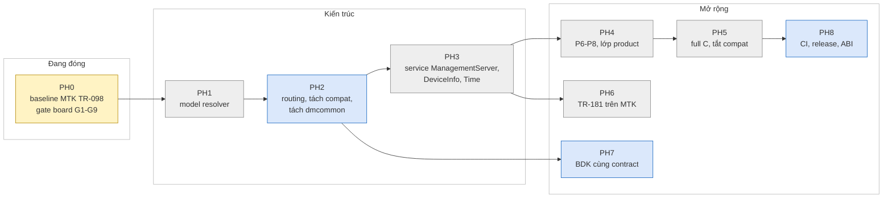

# icwmp multi-SDK: đã làm gì, đang ở đâu, còn gì

Tài liệu tiến độ để chuyển giao. Kiến trúc và cách chia code ở
[icwmp_architecture_guide.md](icwmp_architecture_guide.md).

| | |
|---|---|
| Cập nhật | 2026-10-06, repo `dev` sau `[icwmp 0083]` (`4c11ed3`), local, chưa push |
| Nguồn trạng thái có cấu trúc | [../issue/implementation-status.json](../issue/implementation-status.json), xem nhanh: `python3 docs/issue/progress.py` |
| Bằng chứng chi tiết | [../issue/analysis.md](../issue/analysis.md) (§ theo thời gian, mới nhất ở cuối) |
| Quy ước | Trạng thái không cao hơn bằng chứng thấp nhất trên HEAD. "Đạt" ở đây luôn ghi rõ mức: STATIC, SDK build, BOARD, HOST |

## START HERE — một màn hình

Chú thích màu: xanh lá = xong, vàng = đang làm, xám = chưa bắt đầu, xanh dương = có nền móng một phần.

| Hạng mục | Trạng thái | Mức bằng chứng cao nhất |
|---|---|---|
| Layout source multi-SDK, plugin `sdk/<tên>/`, apply có backup | Xong | MTK SDK build + board |
| Data model TR-098 bằng C trên MTK | **458/783** param (P1–P5). P6–P8: 320 param còn qua shell compat | MTK board: GPV toàn cây 1768 dòng / 15–16 s |
| Sửa lỗi runtime 0062–0080 (treo, leak, crash từ ACS, procd restart) | Xong | Board MTK (0080, K17 hết); host PASS tới 0079 |
| K13, K14 (kiểm input ManagementServer) | Xong ở source (0081, 0082) | MTK SDK build; board chưa |
| `apply --sdk-only` | Xong (0083) | MTK SDK build trên cây chỉ còn MTK |
| BDK | Prototype có; user báo build OK trước 0067 | Chưa build lại với 0067–0083 |
| Test host | Có harness | PASS tới 0079 ở môi trường cũ; máy build hiện tại không chạy được |
| **PH0 (đóng băng baseline)** | **Đang làm** | Còn các gate cần ACS, G9 24 h, BDK, test host |

---

## 1. Những gì đã làm

| Nhóm | Commit | Nội dung | Bằng chứng |
|---|---|---|---|
| Layout + giao source | 0034, 0035, 0042, 0049, 0064 | `libicwmp_dm/src` model-neutral (ABI vẫn `libtr098`), apply kiểm SHA256 + backup + rollback, chạy được Python 3.6 | MTK SDK build, board |
| Feed MTK | 0048, 0050, 0051 | DEPENDS zlib, PKG_SOURCE từ TRUNK_DIR, không `cp -fpR /.` | MTK SDK build |
| Engine | 0036 | Registry: claim, phát hiện chồng; rollback hành động end-session | STATIC, host |
| TR-098 C — P1 | baseline trước 0034 | DeviceInfo, ManagementServer, Time, … 65 param | board |
| TR-098 C — P2 | 0037 | LAN, DHCP, Hosts, Mesh: 70 param | MTK SDK build |
| TR-098 C — P3 | 0038, 0039, 0043, 0044 | WLANConfiguration + security: 67 param | MTK SDK build |
| TR-098 C — P4 | 0040, 0041, 0052–0056 | WANDevice: IP, PPP, IPv6, PortMapping, ServiceList: 173 param | MTK SDK build |
| TR-098 C — P5 | 0057–0060 | IPPing, TraceRoute, NSLookup, DNS, TR-143, Layer3Forwarding: 83 param; engine thêm `container_leaf`, `addressed_only` | MTK SDK build |
| Hợp đồng input (R8) | 0061 | `is_safe_input` + kiểm theo kiểu shell trước mọi setter C (`input_contract_mtk.c`) | board G5 |
| App build | 0045–0047 | Fragment SDK của app, tên static trùng, macro log có `;` | MTK SDK build |
| Runtime (R9) | 0062–0077 | Init đóng fd 1000; trace khởi động + crash report; AssociatedDevice segv; mutex leak ở notify; treo sau phiên đầu; leak mỗi phiên; tràn buffer log; `posix_spawn`/`dmcmd`; đọc output theo chunk; bớt vòng gọi shell; ACS làm crash agent bằng Download/Upload/ScheduleDownload | host `run.sh all` + valgrind; board 0080 |
| ManagementServer MTK (K1, K2) | 0078 | Đọc ghi config of record của sản phẩm (`easycwmp`, `stun.@stun[0]`) thay vì `cwmp` | host, board G6 phần mirror, G7 |
| PeriodicInformTime (K10) | 0079 | Đọc dạng dateTime, không `atol()` | host, **board K10 06/10** |
| procd restart (K17) | 0080 | Bỏ `ubus uci commit easycwmp` ở cuối phiên | **board G5 05/10** |
| K14 | 0081 | PeriodicInformTime chỉ nhận thời điểm có thật | MTK SDK build; unit 31 case |
| K13 | 0082 | URL và STUNServerAddress kiểm như shell | MTK SDK build; khớp hàm shell trên board 35/35 |
| Apply một SDK | 0083 | `--sdk-only` | MTK SDK build |
| Công cụ kiểm | — | `check-c-sanity`, `check-cc-syntax` (cross-gcc SDK), `verify-dm-paths` (`--phase`, `--claims`), `check-automake-conds`, `update-sums`, `progress.py`, `tests/host` | — |

## 2. Trạng thái hiện tại

### 2.1 Gate board PH0 trên MTK HP2236B

Runbook: [../plan/ph0_gate_runbook.md](../plan/ph0_gate_runbook.md).

| Gate | Nội dung | Trạng thái | Khi nào, ở đâu |
|---|---|---|---|
| G1 | Boot, `tr069` lên, Inform đầu | **PASS** | 05/10, analysis §48 |
| G2 | ≥3 phiên liên tiếp, định kỳ + Connection Request | **PASS** (định kỳ 6/6, HTTP CR 200, sai auth 401) | §48, §49 |
| G3 | Notify nhiều chu kỳ, `dm get` vẫn trả lời, value change | **PASS** | §48, §49 |
| G4 | GPV/GPN/SPV theo nhánh, SPV nhiều param có rollback | GPV từng nhánh **PASS**. GPN, SPV, rollback qua ACS **NOT RUN** | §48 |
| G5 | Hợp đồng input | **PASS** (cả K17); ghi IPv4 đúng NOT RUN vì board thiếu `routev4Common.max_rules`, shell cũ cũng lỗi y hệt | §50.2 |
| G6 | ACS ghi ManagementServer, còn sau phiên, WebUI thấy, còn sau reboot; K10 | Mirror qua `dm` **PASS**; **K10 PASS**; ACS + reboot + WebUI **NOT RUN** | §48, §52 |
| G7 | STUN, UDP Connection Request | Phía router **PASS** (UDP CR ký đúng đánh thức phiên, ký sai bị bỏ). ACS gửi qua NAT **NOT RUN** | §49 |
| G8 | Download/ScheduleDownload thiếu FileType hoặc 1 window | **NOT RUN** trên board (host 5/5 PASS) | — |
| G9 | Soak 24 h | Đang chạy từ 05/10 23:03 trên image 0080. 3h25 đầu phẳng: VmRSS 5344 kB, fd 14–15, thread 11 | §52 |

### 2.2 Known issue

| ID | Mức | Trạng thái | Tóm tắt |
|---|---|---|---|
| K1, K2 | BLOCKER | Fixed, host + board | ManagementServer/STUN ghi sai kho |
| K3 | HIGH | Accepted | 11 leaf ManagementServer có trong C, không có trong cây sản phẩm |
| K6 | MEDIUM | Accepted | Trace khởi động + crash handler luôn bật |
| K7 | ARCH | Open | Compat provider + prefetch nằm trong `dmplatform_mtk.c` → PH2 |
| K8 | LIFECYCLE | Open | AddObject/DeleteObject WAN connection vẫn qua compat |
| K9 | MULTI_SDK | Open | BDK chưa build với 0067+ |
| K10 | HIGH | **Fixed, board** | PeriodicInformTime căn sai mốc |
| K12 | LOW | Open | Download/Upload chờ mutex khi phiên nối tiếp liên tục |
| K13, K14 | HIGH, MEDIUM | Fixed source + SDK build, board chưa | Kiểm input ManagementServer |
| K15 | MEDIUM | Cần quyết định sản phẩm | Agent sau controller: `icwmpd.init` network mặc định `if0`, không chạy khi `opermode=auto` |
| K16 | MEDIUM | Open | `icwmp_stund` (không build trên MTK) đọc nhầm option mật khẩu |
| K17 | HIGH | **Fixed, board** | Ghi ManagementServer làm procd restart icwmpd |

Bảng đầy đủ: `python3 docs/issue/progress.py` hoặc JSON.

---

## 3. Việc còn lại

### 3.1 Để đóng PH0

| # | Việc | Ai | Ghi chú |
|---|---|---|---|
| 1 | Nạp image có 0081–0083, kiểm K13/K14 trên board: `PeriodicInformTime=2026-02-29T00:00:00Z` → 9007; URL không `://` → 9007; STUNServerAddress `localhost` → 9007 | dev + quyền nạp | Image hiện trên board là 0080 |
| 2 | G4 qua ACS: GPN `InternetGatewayDevice.` next level; SPV 2 param (`ProvisioningCode=g4ok` + `PeriodicInformInterval=abc`) → 9003, ProvisioningCode **không** đổi | người có ACS | ~5 phút |
| 3 | G6 qua ACS: SPV `PeriodicInformInterval`, `ConnectionRequestUsername` → kiểm `easycwmp`, `cwmp`, WebUI → reboot → kiểm lại | người có ACS + WebUI | — |
| 4 | G8: Download thiếu FileType, ScheduleDownload 1 TimeWindow → fault đúng, pid không đổi | người có ACS | — |
| 5 | G7: ACS gửi UDP CR qua NAT tới địa chỉ STUN map | người có ACS | — |
| 6 | G9: soak 24 h trên **image cuối của PH0** (0083), không có phiên ACS thì đặt chu kỳ ngắn để có cả đường session | dev | Mẫu hiện tại chạy trên 0080 |
| 7 | BDK: apply + build tại HEAD, chạy runbook §0.2 | người có cây BDK | K9 |
| 8 | Test host: dựng container Ubuntu mới (json-c ≥ 0.15, Python ≥ 3.10) có mạng tới GitHub, chạy `tests/host/run.sh all` | dev | Máy build hiện tại không vào GitHub/Docker Hub (analysis §52) |
| 9 | K15: quyết định sản phẩm cho agent sau controller | product | — |
| 10 | PH0.5: tag `baseline/ph0-mtk-tr098-<ngày>` trên `dev`, fast-forward `main`, JSON PH0 = DONE | sau khi 1–8 đạt, cần người duyệt | — |

### 3.2 Lộ trình PH1–PH8

Chi tiết: [../plan/sync-main-dev.md §5](../plan/sync-main-dev.md#5-lộ-trình-hợp-nhất).

| Phase | Mục tiêu | Xong khi |
|---|---|---|
| PH1 | Profile + model capability + **resolver trung tâm**: app và lib cùng một nguồn model; bỏ `dm_platform_select_root` | Test host có ca profile hợp lệ và không hợp lệ; model sai là lỗi khi khởi động, không âm thầm thành TR-098 |
| PH2 | Routing và build ownership thống nhất: tách compat provider khỏi `dmplatform_mtk.c` (K7), prefetch qua interface provider, **tách `dmcommon.c`** (helper trung lập / helper schema OpenWrt), xoá hàm không ai gọi | `verify-dm-paths --claims` = 0 là cổng PR; `run.sh unit` giữ số GPV root 417 getter / 9 request |
| PH3 | Service contract: ManagementServer (bỏ `#ifdef DM_PLATFORM_BDK` trong `tr098/managementserver.c`), rồi DeviceInfo/Time | Một service, backend MTK + adapter BDK |
| PH4 | P6 Firewall/UI (97), P7 operator `X_AIS_*` (79) vào lớp product, P8 còn lại (144) + lifecycle Add/Delete | Cần thư viện hàm easycwmp của sản phẩm làm tham chiếu |
| PH5 | Full C TR-098, build `--disable-dm-script-compat` | Không còn `icwmp_dm.sh` |
| PH6 | TR-181 trên MTK theo mapping manifest | — |
| PH7 | BDK lên cùng contract (TR-181 proxy, TR-098 facade) | Build + board BDK |
| PH8 | Ma trận build, CI, release, `.icwmp-release.json` ghi đúng commit đã cài, đổi tên ABI nếu đáng | — |

### 3.3 Danh sách cải thiện ghi nhận khi viết tài liệu chuyển giao

| Việc | Vì sao | Khi nào |
|---|---|---|
| Tách `dmcommon.c` | 32/80 hàm public là helper schema UCI của OpenWrt, chỉ `tr098/` gọi; tên "common" gây hiểu nhầm | PH2 |
| Xoá 34 hàm public của `dmcommon.c` không ai gọi trong lib | Code chết làm khó đọc; phải kiểm cả app trước khi xoá | PH2 |
| **Không** đổi tên `dmuci_*` | UCI là kho thật trên cả ba SDK, ~2000 chỗ gọi, giữ tên upstream | — (xem kiến trúc §7) |
| `tr098/managementserver.c:238` còn `#ifdef DM_PLATFORM_BDK` | Phạm quy tắc "file chung không nhắc tên SDK" | PH3 |
| `.icwmp-release.json` ghi commit baseline `b01ec72` thay vì HEAD đã cài | Không truy được bản đang chạy trong cây SDK | PH8, hoặc sớm hơn |
| Môi trường test host | Gate §6.3 bắt buộc `run.sh all` | Ngay (PH0 #8) |

---

## 4. Theo dõi và cập nhật

| Muốn | Làm |
|---|---|
| Xem nhanh tiến độ | `python3 docs/issue/progress.py` (`--watch`, `--json`) |
| Xem lịch sử sửa | `git log --reverse --oneline dev`, `git show <commit>` (thân commit ghi lỗi, cách sửa, bằng chứng) |
| Ghi kết quả mới | Bằng chứng: thêm mục cuối `docs/issue/analysis.md`. Trạng thái: `docs/issue/implementation-status.json`. Tóm tắt: file này |
| Quy ước commit, cổng PR | [../plan/sync-main-dev.md §6](../plan/sync-main-dev.md#6-quy-ước-phát-triển-và-bảo-trì) |
