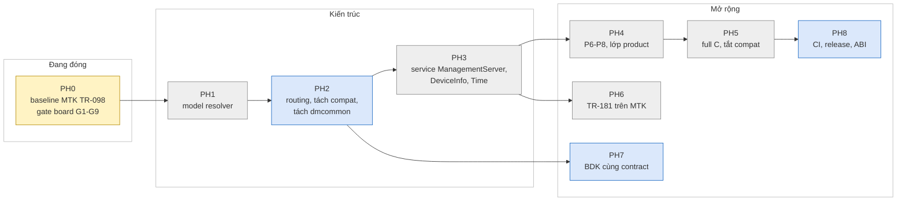

# icwmp multi-SDK: đã làm gì, đang ở đâu, còn gì

Tài liệu tiến độ để chuyển giao. Kiến trúc và cách chia code ở
[icwmp_architecture_guide.md](icwmp_architecture_guide.md).

| | |
|---|---|
| Cập nhật | 2026-10-06 08:00, repo `dev` sau `[icwmp 0083]`, local, chưa push; board chạy image 0083 |
| Nguồn trạng thái có cấu trúc | [../issue/implementation-status.json](../issue/implementation-status.json), xem nhanh: `python3 docs/issue/progress.py` |
| Bằng chứng chi tiết | [../issue/analysis.md](../issue/analysis.md) (§ theo thời gian, mới nhất ở cuối) |
| Quy ước | Trạng thái không cao hơn bằng chứng thấp nhất trên HEAD. "Đạt" ở đây luôn ghi rõ mức: STATIC, SDK build, BOARD, HOST |

## START HERE — một màn hình

Chú thích màu: xanh lá = xong, vàng = đang làm, xám = chưa bắt đầu, xanh dương = có nền móng một phần.

| Hạng mục | Trạng thái | Mức bằng chứng cao nhất |
|---|---|---|
| Layout source multi-SDK, plugin `sdk/<tên>/`, apply có backup | Xong | MTK SDK build + board |
| Data model TR-098 bằng C trên MTK | **783/783** param — toàn cây (P6 ở 0090 + 0092, P7 ở 0094 + 0095, P8 ở 0090 LTE + 0097–0099). Compat shell không còn tham số nào | MTK board: GPV toàn cây 1768 dòng / 15–16 s |
| Sửa lỗi runtime 0062–0080 (treo, leak, crash từ ACS, procd restart) | Xong | Board MTK (0080, K17 hết); host `run.sh all` PASS lại 06/10 tại 0086 |
| K13, K14 (kiểm input ManagementServer) | Xong (0081, 0082) | **Board** (image 0083, 06/10, analysis §53) |
| `apply --sdk-only` | Xong (0083) | MTK SDK build trên cây chỉ còn MTK |
| BDK | Prototype; **build image đạt 06/10 tại 0088** (bundle một SDK, analysis §56) | SDK build BDK; board BDK chưa (PH7) |
| Test host | Chạy được trên máy build: container `ubuntu:24.04` (§55) | **`run.sh all` PASS 06/10** trên repo (code 0086) và từ chính bundle MTK `e273359` |
| **PH0 (đóng băng baseline)** | **Đang làm** | Còn G9 24 h (07/10 08:15), rồi PH0.5 (user duyệt 07/10). K15 hoãn theo quyết định 07/10; xem WebUI (G6) chưa có tài khoản |

---

## 1. Những gì đã làm

| Nhóm | Commit | Nội dung | Bằng chứng |
|---|---|---|---|
| Layout + giao source | 0034, 0035, 0042, 0049, 0064 | `libicwmp_dm/src` model-neutral (ABI vẫn `libtr098`), apply kiểm SHA256 + backup + rollback, chạy được Python 3.6 | MTK SDK build, board |
| Feed MTK | 0048, 0050, 0051 | DEPENDS zlib, PKG_SOURCE từ TRUNK_DIR, không `cp -fpR /.` | MTK SDK build |
| Engine | 0036 | Registry: claim, phát hiện chồng; rollback hành động end-session | STATIC, host |
| TR-098 C — P1 | baseline trước 0034 | DeviceInfo, ManagementServer, Time, … 65 param | board |
| TR-098 C — P2 | 0037 | LAN, DHCP, Hosts, Mesh: 70 param | MTK SDK build |
| TR-098 C — P3 | 0038, 0039, 0043, 0044 | WLANConfiguration + security: 67 param | MTK SDK build |
| TR-098 C — P4 | 0040, 0041, 0052–0056 | WANDevice: IP, PPP, IPv6, PortMapping, ServiceList: 173 param | MTK SDK build |
| TR-098 C — P5 | 0057–0060 | IPPing, TraceRoute, NSLookup, DNS, TR-143, Layer3Forwarding: 83 param; engine thêm `container_leaf`, `addressed_only` | MTK SDK build |
| Hợp đồng input (R8) | 0061 | `is_safe_input` + kiểm theo kiểu shell trước mọi setter C (`input_contract_mtk.c`) | board G5 |
| App build | 0045–0047 | Fragment SDK của app, tên static trùng, macro log có `;` | MTK SDK build |
| Runtime (R9) | 0062–0077 | Init đóng fd 1000; trace khởi động + crash report; AssociatedDevice segv; mutex leak ở notify; treo sau phiên đầu; leak mỗi phiên; tràn buffer log; `posix_spawn`/`dmcmd`; đọc output theo chunk; bớt vòng gọi shell; ACS làm crash agent bằng Download/Upload/ScheduleDownload | host `run.sh all` + valgrind; board 0080 |
| ManagementServer MTK (K1, K2) | 0078 | Đọc ghi config of record của sản phẩm (`easycwmp`, `stun.@stun[0]`) thay vì `cwmp` | host, board G6 phần mirror, G7 |
| PeriodicInformTime (K10) | 0079 | Đọc dạng dateTime, không `atol()` | host, **board K10 06/10** |
| procd restart (K17) | 0080 | Bỏ `ubus uci commit easycwmp` ở cuối phiên | **board G5 05/10** |
| K14 | 0081 | PeriodicInformTime chỉ nhận thời điểm có thật | MTK SDK build; unit 31 case |
| K13 | 0082 | URL và STUNServerAddress kiểm như shell | MTK SDK build; khớp hàm shell trên board 35/35 |
| Apply một SDK | 0083 | `--sdk-only` | MTK SDK build |
| Dọn cho bản giao MTK | 0084 | Bỏ ghi chú "NOT BUILD-TESTED YET" ở code đã chạy board, sửa hai mô tả đã cũ, generator `shelltypes_mtk.h` in đường dẫn repo | STATIC, cross-gcc |
| Bản giao một SDK (K19) | 0085 | `export.py --sdk mtk` (HEAD, tái lập được, MANIFEST đúng commit); `--sdk-only` bỏ thêm 33 file `tr098/` chỉ SDK `uci` dùng; apply ghi commit thật vào `.icwmp-release.json` | MTK SDK build từ bundle export |
| Code chết (K18 một phần) | 0086 | Gỡ 27 hàm `dmcommon.c` không ai tham chiếu (519 dòng) | STATIC, cross-gcc, MTK SDK build, host `run.sh all` |
| Bản giao MTK test được trên host | 0087 | Bundle MTK giữ source microxml mà `tests/host/build.sh` build (bỏ glue BDK của nó); trước đó test host từ bundle dừng ở bước đầu | host `run.sh all` từ chính bundle |
| Công cụ kiểm | 0089 | `verify-dm-paths` đọc lá ở gốc (`.params`), `check-c-sanity` biết thêm 2 hàm json-c, ACS test ghi mã fault từng tham số | STATIC |
| TR-098 C — P6a–d (+ LTE) | 0090 | Object ẩn ở gốc + DeviceSummary, Account, UserInterface.CarrierLocking, X_AIS_WebUserInfo, XMPP, LTE: 58 param; test host `p6` | host `run.sh all`; MTK SDK build gói + image (§58) |
| Engine: fault ở VALUESET (K20), SPA lên object C (K21) | 0091 | Setter từ chối ở VALUESET giờ làm SPV fault 9003 và hoàn tác (trước đây trả thành công mà không ghi); hàng đợi apply cắt lại khi revert; object MTK nhận SetParameterAttributes như shell | host `p6`, `fw`, smoke |
| TR-098 C — P6e Firewall | 0092 | DisablePort, ServiceControl IPv4/IPv6, IPFilter: 51 param, Add/Delete theo vị trí như shell; test host `fw` | host `run.sh all`; MTK SDK build gói + image |
| Dọn repo | 0088 | Gỡ `tests/__pycache__/*.pyc` bị commit từ 0042 (có trong mọi bundle export trước đó) | `git ls-files` |
| Công cụ kiểm | — | `check-c-sanity`, `check-cc-syntax` (cross-gcc SDK), `verify-dm-paths` (`--phase`, `--claims`), `check-automake-conds`, `update-sums`, `progress.py`, `tests/host` | — |

### 1.1 Bản giao MTK/OpenWrt-only

| | |
|---|---|
| Lệnh tạo | `./export.py --sdk mtk <ngoài repo>/icwmp_mtk.tar.gz` |
| Tag | `release/mtk-20261006` → `8dea75b` (annotated, message ghi sha256). Lấy lại đúng bản giao: checkout tag rồi chạy lệnh tạo ở trên |
| Bản giao hiện hành | commit `8dea75b`, 327 file, sha256 `9c6ab9ad0e295b7eb5e082edd6a7017c1d6e9d26ee2c3b00bbaafc6565de53fc` (`release/icwmp_mtk_8dea75b.tar.gz` của issue workspace). So với bundle `e273359` ở dòng dưới chỉ khác 5 file tài liệu, `README.md`, `MANIFEST.json`, `SHA256SUMS`; `sha256sum -c` và `apply --dry-run` trên `1_src` OK |
| Đã kiểm (code 0087, bundle `e273359`, sha256 `e693ae29…`, 327 file) | Export hai lần cùng sha256; `apply --sdk mtk --dry-run` trên `1_src` OK; source lib/app/feed trùng byte với bản `a7549e7` đã apply và build `libtr098` + `icwmp_tr098` + image rc 0 (06/10 08:42); giải nén, `sha256sum -c`, rồi `tests/host` build + setup + `run.sh all` PASS ngay trong bundle (analysis §55) |
| Chưa kiểm | Nạp image lên board. Board đang chạy 0083, khác 0086 ở 27 hàm không ai gọi; hành vi chạy không đổi |
| Bản cũ `a7549e7` | sha256 `39c8bded…`, 305 file. Apply và build SDK vẫn đúng, nhưng `tests/host/build.sh` dừng vì thiếu source microxml (0087 sửa). Dùng bản `e273359` |

## 2. Trạng thái hiện tại

### 2.1 Gate board PH0 trên MTK HP2236B

Runbook: [../plan/ph0_gate_runbook.md](../plan/ph0_gate_runbook.md).

| Gate | Nội dung | Trạng thái | Khi nào, ở đâu |
|---|---|---|---|
| G1 | Boot, `tr069` lên, Inform đầu | **PASS** | 05/10, analysis §48 |
| G2 | ≥3 phiên liên tiếp, định kỳ + Connection Request | **PASS** (định kỳ 6/6, HTTP CR 200, sai auth 401) | §48, §49 |
| G3 | Notify nhiều chu kỳ, `dm get` vẫn trả lời, value change | **PASS** | §48, §49 |
| G4 | GPV/GPN/SPV theo nhánh, SPV nhiều param có rollback | **PASS**: GPV từng nhánh (ubus); qua GenieACS NBI: GPV, GPN (`refreshObject`), SPV 2 param một sai → 9003/9007, không ghi gì | §48, §54 |
| G5 | Hợp đồng input | **PASS** (cả K17); ghi IPv4 đúng NOT RUN vì board thiếu `routev4Common.max_rules`, shell cũ cũng lỗi y hệt | §50.2 |
| G6 | ACS ghi ManagementServer, còn sau phiên, WebUI thấy, còn sau reboot; K10 | **PASS** qua ACS: ghi, mirror, không restart, còn sau reboot; **K10 PASS**. WebUI **NOT RUN** (không có tài khoản) | §52, §54 |
| G7 | STUN, UDP Connection Request | Phía router **PASS** (UDP CR ký đúng đánh thức phiên, ký sai bị bỏ). ACS dùng HTTP CR trực tiếp được nên không gửi UDP CR; `NATDetected` do vendor ghi 0 dù địa chỉ map khác IP WAN | §49, §54 |
| G8 | Download/ScheduleDownload thiếu FileType hoặc 1 window | **NOT RUN** trên board (host 5/5 PASS) | — |
| G9 | Soak 24 h | Image 0080: 8 h 41 phẳng (VmRSS 5344→5352 kB, fd 14–15, thread 11). **Đang chạy lại trên image 0083** từ 06/10 08:14 (sau reboot G6), xong lúc 07/10 08:15 | §52–§54 |

### 2.2 Known issue

| ID | Mức | Trạng thái | Tóm tắt |
|---|---|---|---|
| K1, K2 | BLOCKER | Fixed, host + board | ManagementServer/STUN ghi sai kho |
| K3 | HIGH | Accepted | 11 leaf ManagementServer có trong C, không có trong cây sản phẩm |
| K6 | MEDIUM | Accepted | Trace khởi động + crash handler luôn bật |
| K7 | ARCH | Open | Compat provider + prefetch nằm trong `dmplatform_mtk.c` → PH2 |
| K8 | LIFECYCLE | Open | AddObject/DeleteObject WAN connection vẫn qua compat |
| K9 | MULTI_SDK | **Fixed, SDK build** | BDK build image đạt với 0067–0088 (06/10, §56); board BDK thuộc PH7 |
| K10 | HIGH | **Fixed, board** | PeriodicInformTime căn sai mốc |
| K12 | LOW | Open | Download/Upload chờ mutex khi phiên nối tiếp liên tục |
| K13, K14 | HIGH, MEDIUM | **Fixed, board** | Kiểm input ManagementServer |
| K15 | MEDIUM | **Hoãn** (quyết định 07/10) | Agent sau controller: `icwmpd.init` network mặc định `if0`, không chạy khi `opermode=auto`. Giữ nguyên; STUN dùng app có sẵn của sản phẩm; làm khi có yêu cầu hoặc lỗi |
| K16 | MEDIUM | **Hoãn** (07/10) | `icwmp_stund` đọc nhầm option mật khẩu; không build trên MTK vì dùng app STUN của sản phẩm |
| K17 | HIGH | **Fixed, board** | Ghi ManagementServer làm procd restart icwmpd |
| K20 | HIGH | **Fixed, host** (0091) | Setter từ chối ở VALUESET bị bỏ qua, SPV trả thành công mà không ghi |
| K21 | MEDIUM | **Fixed, host** (0091) | SetParameterAttributes lên object do C trả lời bị 9009 |
| K22 | LOW | Theo dõi | Một lần agent dưới valgrind không thoát hẳn sau SIGTERM, không lặp lại (§59) |

Bảng đầy đủ: `python3 docs/issue/progress.py` hoặc JSON.

---

## 3. Việc còn lại

### 3.1 Để đóng PH0

| # | Việc | Ai | Ghi chú |
|---|---|---|---|
| 1 | ~~Nạp image 0083, kiểm K13/K14 trên board~~ | — | **Xong 06/10**, 13/13 bị từ chối đúng, analysis §53 |
| 2 | ~~G4 qua ACS~~ | — | **Xong 06/10** qua GenieACS NBI, §54 |
| 3 | G6: ~~ACS ghi + reboot~~ xong (§54); còn **xem WebUI** | người có tài khoản WebUI | ConnectionRequestUsername không đổi để không làm hỏng CR của ACS |
| 4 | G8: Download thiếu FileType, ScheduleDownload 1 TimeWindow → fault đúng, pid không đổi | quyết định sau | User chọn bỏ khi test bằng NBI (GenieACS không gửi được Download sai nếu không upload file lên ACS) |
| 5 | G7: UDP CR từ ACS | — | Topology hiện tại ACS tới thẳng board bằng HTTP CR; chỉ cần nếu sản phẩm thật nằm sau NAT. Xem thêm `NATDetected` = 0 (§54) |
| 6 | G9: soak 24 h trên **image cuối của PH0** (0083) | dev | Đang chạy từ 06/10 08:14 (sau reboot G6); chu kỳ Inform 12 h nên đường session ít được thử |
| 7 | ~~BDK: apply + build tại HEAD, chạy runbook §0.2~~ | — | **Xong 06/10** trên máy `192.168.100.38`: apply bundle `--sdk bdk` tại `9b75ed9`, component + image `MO77300EB` rc 0 (§56) |
| 8 | ~~Test host: `tests/host/run.sh all`~~ | — | **Xong 06/10** trong container `ubuntu:24.04` trên máy build, cả repo lẫn bundle MTK (§55). Ghi chú cũ "không vào GitHub/Docker Hub" là sai |
| 9 | ~~K15: quyết định sản phẩm~~ | — | **07/10:** STUN chưa cần, dùng app STUN đang có; ưu tiên icwmp chạy ổn định và đủ tham số theo kế hoạch; agent sau controller làm khi cần hoặc có lỗi |
| 10 | PH0.5: tag `baseline/ph0-mtk-tr098-<ngày>` trên `dev`, fast-forward `main`, JSON PH0 = DONE | dev | **User duyệt 07/10** ("làm theo đề xuất"): làm khi G9 đạt |

### 3.2 Lộ trình PH1–PH8

Chi tiết: [../plan/sync-main-dev.md §5](../plan/sync-main-dev.md#5-lộ-trình-hợp-nhất).

| Phase | Mục tiêu | Xong khi |
|---|---|---|
| PH1 | Profile + model capability + **resolver trung tâm**: app và lib cùng một nguồn model; bỏ `dm_platform_select_root` | Test host có ca profile hợp lệ và không hợp lệ; model sai là lỗi khi khởi động, không âm thầm thành TR-098 |
| PH2 | Routing và build ownership thống nhất: tách compat provider khỏi `dmplatform_mtk.c` (K7), prefetch qua interface provider, **tách `dmcommon.c`** (helper trung lập / helper schema OpenWrt), xoá hàm không ai gọi | `verify-dm-paths --claims` = 0 là cổng PR; `run.sh unit` giữ số GPV root 417 getter / 9 request |
| PH3 | Service contract: ManagementServer (bỏ `#ifdef DM_PLATFORM_BDK` trong `tr098/managementserver.c`), rồi DeviceInfo/Time | Một service, backend MTK + adapter BDK |
| PH4 | P6 Firewall/UI (97), P7 operator `X_AIS_*` (79) vào lớp product, P8 còn lại (144) + lifecycle Add/Delete | Cần thư viện hàm easycwmp của sản phẩm làm tham chiếu |
| PH5 | Full C TR-098, build `--disable-dm-script-compat` | Không còn `icwmp_dm.sh` |
| PH6 | TR-181 trên MTK theo mapping manifest | — |
| PH7 | BDK lên cùng contract (TR-181 proxy, TR-098 facade) | Build + board BDK |
| PH8 | Ma trận build, CI, release, `.icwmp-release.json` ghi đúng commit đã cài, đổi tên ABI nếu đáng | — |

### 3.3 Danh sách cải thiện ghi nhận khi viết tài liệu chuyển giao

| Việc | Vì sao | Khi nào |
|---|---|---|
| Tách `dmcommon.c` | 32/80 hàm public là helper schema UCI của OpenWrt, chỉ `tr098/` gọi; tên "common" gây hiểu nhầm | PH2 |
| ~~Xoá hàm không ai dùng trong `dmcommon.c`~~ | Đếm lại theo mọi lần xuất hiện của tên (kể cả con trỏ hàm), trên lib, app, tests, feeds: 27 hàm | **Xong 0086** |
| **Không** đổi tên `dmuci_*` | UCI là kho thật trên cả ba SDK, ~2000 chỗ gọi, giữ tên upstream | — (xem kiến trúc §7) |
| `tr098/managementserver.c:238` còn `#ifdef DM_PLATFORM_BDK` | Phạm quy tắc "file chung không nhắc tên SDK" | PH3 |
| ~~`.icwmp-release.json` ghi commit baseline~~ | — | **Xong 0085** |
| ~~Môi trường test host~~ | Gate §6.3 bắt buộc `run.sh all` | **Xong 06/10** (§55) |

---

## 4. Theo dõi và cập nhật

| Muốn | Làm |
|---|---|
| Xem nhanh tiến độ | `python3 docs/issue/progress.py` (`--watch`, `--json`) |
| Xem lịch sử sửa | `git log --reverse --oneline dev`, `git show <commit>` (thân commit ghi lỗi, cách sửa, bằng chứng) |
| Ghi kết quả mới | Bằng chứng: thêm mục cuối `docs/issue/analysis.md`. Trạng thái: `docs/issue/implementation-status.json`. Tóm tắt: file này |
| Quy ước commit, cổng PR | [../plan/sync-main-dev.md §6](../plan/sync-main-dev.md#6-quy-ước-phát-triển-và-bảo-trì) |
