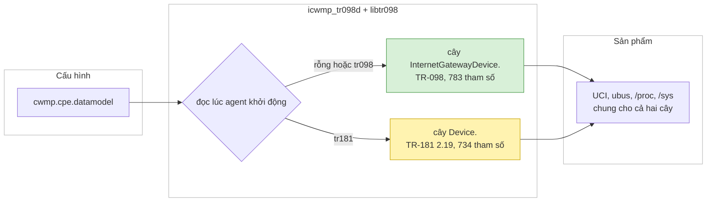

# icwmp TR-181 trên MTK HP2236B: bật, phạm vi hỗ trợ, khác biệt, cách kiểm

Tài liệu cho người nhận bản TR-181 (branch `dev_181`) và cho người cấu hình ACS. Trạng thái tại `tr181-0022` (09/10/2026),
board HP2236B image `c3be28a`. Bằng chứng chi tiết ở [../issue/analysis.md](../issue/analysis.md) §67–§91, kế hoạch ở
[../plan/tr181_mtk_design.md](../plan/tr181_mtk_design.md), kiến trúc ở [icwmp_architecture_guide.md](icwmp_architecture_guide.md).

## START HERE — một màn hình

Chú thích màu: xanh = đường mặc định (TR-098), vàng = đường TR-181, trắng = cấu hình/dữ liệu.



- Một image chạy được cả hai cây. Mặc định TR-098, ACS hiện tại không thấy gì khác.
- Hai cây đọc/ghi cùng cấu hình của sản phẩm: ghi qua TR-181 thì đọc qua TR-098 thấy giá trị mới, và ngược lại.
- Bật TR-181 trên một board:

```sh
uci set cwmp.cpe.datamodel=tr181
uci commit cwmp
/etc/init.d/icwmpd restart
```

Quay lại TR-098: `uci set cwmp.cpe.datamodel=tr098` (hoặc xoá option), commit, restart. Model chỉ đọc lúc agent khởi động.
DeviceID (OUI, ProductClass, SerialNumber) không đổi, nên ACS thấy cùng một thiết bị đổi cây gốc: cấu hình phía ACS (preset,
provision) phải viết theo tên TR-181 trước khi bật. Đã chạy một phiên GenieACS thật ở chế độ `tr181`: success, 0 fault (§74).

## Kết luận chính

| Mục | Trạng thái (mức bằng chứng) |
|---|---|
| Tên, kiểu, quyền ghi, enum, secured so với TR-181 2.19.1 (BBF `cwmp-full`) | **Đạt, BOARD**: 734 tham số (562 chuẩn, 172 vendor `X_AIS_`/`X_HNI_`), 0 unknown, 0 lệch access/type/status/enum/secured |
| Tương đương TR-098 | **Đạt, BOARD**: mọi tham số TR-098 có tên TR-181 hoặc ghi rõ không có; so cặp giá trị trên board 0 lệch không giải thích được |
| Tầng interface | **Đạt, BOARD**: `LowerLayers` là tham chiếu; `Ethernet.Link`, `VLANTermination`, `Bridging.Bridge`, `InterfaceStack` dựng từ cấu hình thật |
| `NumberOfEntries` | **Đạt, BOARD**: mọi lá đếm bằng số dòng bảng của nó |
| Profile | **16 khai được**, 13 đủ lá nhưng vướng create/delete, Routing:2 thiếu RIP (mục dưới) |
| TR-098 không đổi | **Đạt, BOARD**: parity TR-098 với shell của sản phẩm PASS trên cùng image |

## Profile

Khai được (đủ lá bắt buộc, không đòi create/delete mà sản phẩm không làm được):
Time:2, MemoryStatus:1, ProcessStatus:1, TempStatus:1, EthernetInterface:2, IPv6Interface:1, PPPInterface:2, WiFiRadio:1,
Optical:1, IPPing:1, TraceRoute:1, DownloadTCP:1, UploadTCP:1, NSLookupDiag:1, Download:1, Upload:1.

Đủ lá nhưng **không khai được**, vì profile đòi AddObject/DeleteObject trên bảng sản phẩm dựng từ cấu hình cố định:

| Profile | Bảng | Vì sao |
|---|---|---|
| Baseline:4 | `DNS.Client.Server` | server DNS là của từng kết nối WAN (DHCP/IPCP hoặc DNS tĩnh của kết nối); số dòng tính theo kết nối, không có kho số thứ tự |
| EthernetLink:1, VLANTermination:1, Bridge:1 | `Ethernet.Link`, `VLANTermination`, `Bridge.Port` | tầng interface do HAL dựng từ `wan.@entry`, tạo/xoá đi qua tạo/xoá kết nối |
| IPInterface:2 | `IP.Interface.{i}.IPv4Address` | một địa chỉ mỗi interface |
| Routing:2 | `Routing.Router` + thiếu `Routing.RIP` | một router; sản phẩm không chạy RIP |
| DHCPv4Server:1, DHCPv4Client:1, DHCPv6Server:1, RouterAdvertisement:1, NAT:1 | Pool, Client, InterfaceSetting | một pool LAN; client/NAT theo kết nối |
| WiFiSSID:2, WiFiAccessPoint:2 | `WiFi.SSID`, `AccessPoint` | 12 interface cố định của driver |

Các bảng này làm AddObject được khi nhà mạng có yêu cầu thật (ví dụ tạo kết nối IPoE qua TR-181, đang để sau).

## Hành vi ACS cần biết

**AddObject/DeleteObject có ở:** `NAT.PortMapping`, `IP.Interface`, `PPP.Interface`, `Routing.Router.{i}.IPv4Forwarding`,
`DynamicDNS.Client`, `Services.StorageService.{i}.LogicalVolume`, bảng firewall vendor (`Firewall.X_AIS_IPFilter`,
`X_AIS_ServiceControl`). Chú ý:
- `IP.Interface` AddObject chỉ tạo một section netifd `proto static`, `auto 0` (hành vi gốc của sản phẩm), **không** tạo kết nối
  WAN chạy được. Tạo kết nối IPoE qua TR-181 chưa làm.
- `PPP.Interface` AddObject tạo một `wan.@entry` như nhánh `Device.PPP` của sản phẩm.

**Set-same** (lá chuẩn là `readWrite` nhưng sản phẩm không có đường ghi): ghi đúng giá trị đang đọc ra thì nhận (0), giá trị
khác thì 9007. Trước đây nhiều lá loại này "nhận rồi bỏ" (trả 0 mà không làm gì). Danh sách gồm (theo tên lá): `LowerLayers`
ở IP.Interface, SSID, Link, VLANTermination, Bridge.Port (riêng `PPP.Interface.LowerLayers` ghi được: chọn `pon` hoặc
`pon.<vlan>` của kết nối), `Order`, `TPID`, `ReservedAddresses`, `IAPDAddLength`, `ConnectionTrigger`, `IPv6CPEnable`,
`ACName`, `ServiceName`, `ULAPrefix`, `ULAEnable`, `AllInterfaces`, `AdvMobileAgentFlag`, `AdvNDProxyFlag`, `MCS`,
`GuardInterval`, `ExtensionChannel`, `IEEE80211hEnabled`, `MLDUnit`, `WMMEnable`, `UAPSDEnable`, `MACAddressControlEnabled`,
`AllowedMACAddress`, các lá thời gian/cờ của `IPv6Address`/`IPv6Prefix`, … (75 setter, liệt kê trong source bằng
`grep -rn set_same_ userspace/public/libs/libicwmp_dm/src/sdk/mtk`).

**Secured** (`KeyPassphrase`, `PreSharedKey`, mật khẩu PON, mật khẩu DDNS, `RadiusSecret`…): luôn đọc rỗng như chuẩn yêu
cầu; ghi vẫn có tác dụng. ACS không đọc lại được giá trị đã ghi.

**Số thứ tự dòng theo vị trí, không cố định** (giống TR-098 của sản phẩm): `NAT.PortMapping` theo thứ tự rule trong
`firewall_clay`; xoá một rule làm các rule sau lùi số. `DNS.Client.Server` = `3 × id kết nối + vị trí + 1`. ACS nên đọc lại
bảng mỗi phiên trước khi ghi theo số dòng.

**NAT `PortMapping.Protocol`** (`tr181-0022`, §91): chuẩn chỉ có `TCP`, `UDP`. Rule `tcp/udp` của sản phẩm hiện thành hai dòng
liền nhau, TCP rồi UDP. Ghi bất kỳ lá nào của một dòng thì rule được tách: rule gốc thành `tcp`, bản sao `udp` chèn ngay sau,
số và giao thức các dòng giữ nguyên trong phiên. WebUI sau đó thấy hai rule. Xoá một dòng thì rule còn nửa kia. AddObject tạo
một dòng `TCP`. Ghi `TCP/UDP` → 9007.

**Alias:** lá `Alias` ghi được, lưu trong `cwmp.tr181_alias`, duy nhất trong từng bảng. Giá trị mặc định do CPE đặt, bắt
đầu bằng `cpe-`; ACS ghi giá trị bắt đầu bằng `cpe-` (hoặc không bắt đầu bằng chữ cái, dài quá 64) → 9007.

## Cách kiểm một image

Theo thứ tự, mọi bước không làm ACS thấy cây `Device.` (chi tiết lệnh và kết quả đạt:
[icwmp_mtk_build_verify_guide.md](icwmp_mtk_build_verify_guide.md), [../../tests/board/README.md](../../tests/board/README.md)):

1. Host: `tests/host/run.sh all` (25 bước, có `tr181`: so cặp, lá đếm, các ghi).
2. Build SDK: `make -j16 MSDK=1 V=s` (không `V=s` từng gãy `target/linux` mà không in lỗi, §91).
3. Board: parity TR-098 (`tests/board/parity_dump.sh` + `parity.py`) → `RESULT: PASS`.
4. Board: `tests/board/tr181_window.sh` (chặn ACS, chạy `tr181` khoảng 1 phút, trả lại model, sự kiện chờ, `/etc/config`; có bước
   NAT tách dòng với rule thử) → trên host:
   - `python3 docs/issue/tr181-map.py equiv tr098.gpv tr181.gpv` → `RESULT: PASS`;
   - `python3 -I docs/issue/tr181-bbf-check.py <bbf-dir> tr181.gpn tr181.gpv` → `RESULT: PASS`
     (`<bbf-dir>` chứa `tr-181-2-19-1-cwmp-full.xml`, `tr-135-1-4-1-…`, `tr-140-1-3-1-…` tải từ
     `https://cwmp-data-models.broadband-forum.org/`, không đưa vào repo);
   - `--profiles` / `--profile <P:v>` để xem profile;
   - `config_before.tgz` và `config_after.tgz` giống hệt.
5. Soak G9: `tests/board/soak_sample.sh` 24 h, pid/RSS/fd/thread phẳng, failure không tăng.

## Chưa chứng minh được / giới hạn

- **Chưa kiểm trên board** (chỉ đạt trên host): bảng `IPv6Address`/`IPv6Prefix` có địa chỉ global (lab không có IPv6
  global), bridge của kết nối bridged (board không có kết nối bridged), DynamicDNS khi bật.
- **Conditional:**
  - `DHCPv4.Client.LeaseTimeRemaining` tính từ lease và uptime của netifd (netifd không đặt lại uptime khi renew).
  - `TemperatureSensor` Min/Max chỉ cập nhật khi được đọc.
  - `Radio.MaxBitRate` là tốc độ đỉnh tính từ chế độ và số luồng, không phải đo.
- Chưa có danh sách tham số TR-181 nhà mạng dùng thật; khi có, đối chiếu với `--profile` và bảng ánh xạ
  [../issue/tr181_mapping.tsv](../issue/tr181_mapping.tsv).
- BDK: TR-181 của BDK chưa đưa lên cùng chuẩn này (làm khi được yêu cầu).
