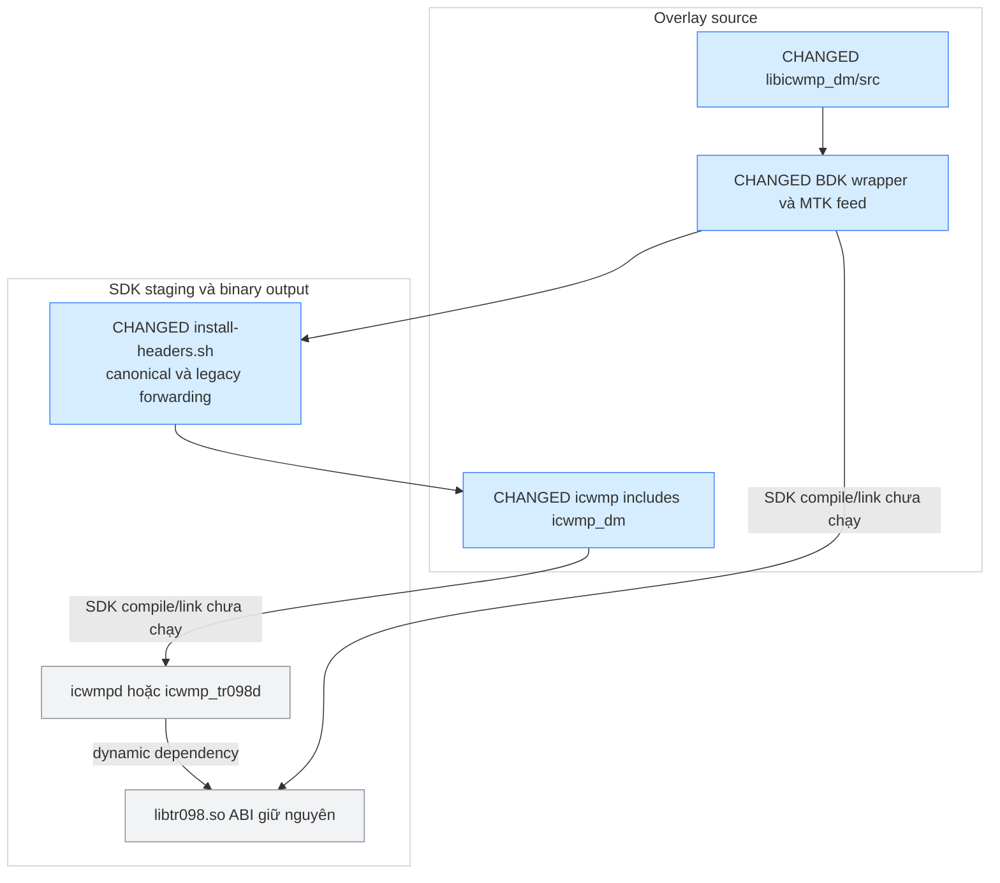

# A1 — source libicwmp_dm và public include namespace

**Implemented, static verification PASS. SDK build/board NOT RUN.** Baseline overlay
`cd93685595d4a52302d5b14adc9cbf38ac82553c` (0033), patch tiếp theo `0034`.
Source thay đổi nằm trong issue overlay, không apply vào vendor `src/`, không commit.

## Đã thực thi

| Phần | Source hiện tại | Tác dụng |
|---|---|---|
| Library directory | `userspace/public/libs/libicwmp_dm/src/` | Bỏ `libtr098/libtr098`, wrapper Makefile/Bcmbuild ở một cấp trên |
| SDK dependency | `public/apps/icwmp/autodetect`, `sdk-prune.sh` | Build/discovery/prune dùng đường dẫn mới |
| Public include | `<icwmp_dm/...>` | App dùng namespace mới, legacy `<libtr098/...>` forwarding giữ consumer cũ |
| Header installation | `src/tools/install-headers.sh` | BDK/MTK dùng cùng một script, chỉ SDK được chọn, xóa header staging cũ của library trước install |
| MTK feed | Package vẫn `libtr098`, source `$(TRUNK_DIR)/apps/hni/libicwmp_dm` | Không phụ thuộc `LIB_HNI_TR098_DIR` cũ của vendor, tăng package release |
| Installer MTK | `install-mtk.sh` | Source mới, archive legacy, cài lại/prune, hỗ trợ workspace và tarball |
| Installer BDK | `install-overlay.sh` | Preflight integration patch trước mutation, archive legacy ngoài discovery, bỏ Makefile generated cũ của app/DM |

Giữ **SONAME libtr098.so**, version-info, C symbols, schema và persisted state. Không sửa
getter/setter/transaction. A2 mới tách common/model/services, lựa chọn single-model và model pruning.
`include/icwmp_dm/` hiện là namespace được cài vào staging, header source chưa gom sang cây mới.

Archive legacy source luôn nằm ở `<SDK>/.icwmp-backup/<stamp>/libtr098`. BDK yêu cầu `--force`
khi thay một overlay đã có. MTK `--no-backup` chỉ bỏ backup đích mới, vẫn archive source legacy.

## Flow build/install đã implement trong A1

**Chú thích màu:** xanh = CHANGED trong A1, xám = ABI giữ nguyên. Đây là flow source/build,
không phải kết quả compile/link đã chạy.



## Theo dõi tiến độ trong workspace

```sh
./projects/mtk_openwrt_wifi7/issues/20260922_icwmp_multiplatform_tr098/progress.py
./projects/mtk_openwrt_wifi7/issues/20260922_icwmp_multiplatform_tr098/progress.py --watch
./projects/mtk_openwrt_wifi7/issues/20260922_icwmp_multiplatform_tr098/progress.py --json
```

File `implementation-status.json` là trạng thái thực thi đã lưu, không phải heartbeat AI.
Nó ghi riêng implemented/static/build/board, phần đang chờ và thứ tự kế tiếp. `--watch` chỉ đọc file.

## Cài trên máy SDK từ bundle A1

Không dùng tarball 0033 cũ để kiểm A1. Bundle mới là **icwmp_a1_port.tar.gz**, chứa cả hai
installer, feeds, toàn overlay và integration patch BDK. Tarball cũ được giữ nguyên.

```sh
tar -xzf icwmp_a1_port.tar.gz
cd icwmp_a1

# MTK: xem trước rồi cài trên cây build của bạn
./install-mtk.sh /path/to/2025q3 --dry-run --only-mtk
./install-mtk.sh /path/to/2025q3 --only-mtk

# BDK: integration patch đã có thì tự skip, overlay cũ dùng --force
./install-overlay.sh /path/to/bcm963xx --force --apply-patch
```

BDK source snapshot trong workspace đã bật TR69 theo profile khác preimage patch `0001`.
Installer sẽ từ chối trước khi chép nếu patch không khớp, không tự sửa profile đó.
Trên cây build đã cài overlay 0033 với integration patch đầy đủ, patch `0001` được reverse-check
và skip. Với profile khác, cần đối chiếu các thay đổi profile trước khi cài.

## Build gate trước A2

MTK giữ `CONFIG_PACKAGE_libtr098=y`, `CONFIG_PACKAGE_icwmp_tr098=y`, tắt cwmpclient.
Sau khi installer đã cài feed mới, chạy từ OpenWrt build root đã setup SDK environment:

```sh
make package/feeds/airoha/libtr098/clean V=s
make package/feeds/airoha/libtr098/compile V=s
make package/feeds/airoha/icwmp_tr098/clean V=s
make package/feeds/airoha/icwmp_tr098/compile V=s
```

BDK, sau khi source tree đã có full SDK build/dependencies:

```sh
make -C userspace/public/libs/libicwmp_dm -f Bcmbuild.mk clean
make -C userspace/public/libs/libicwmp_dm -f Bcmbuild.mk
make -C userspace/public/apps/icwmp -f Bcmbuild.mk clean
make -C userspace/public/apps/icwmp -f Bcmbuild.mk
make PROFILE=MO77300EB
```

Phải clean/rebuild cả app và lib, kiểm staging canonical + legacy headers và DT_NEEDED vẫn
`libtr098.so.*`. Trên board kiểm daemon/Inform/CR, GPN/GPV P1; BDK kiểm cả root 098/181 đã có.
Không dùng kết quả board 0031 để coi A1 đã chạy được.

## Patch overlay và kiểm tĩnh

Patch 0034 áp dụng trên **overlay userspace đã có 0033**, không phải vendor source chưa cài overlay.
Các move được biểu diễn delete/add để `patch -p1` dùng được. Trong workspace source A1 đã hiện
hữu, không apply patch lần nữa. Installer/feed đồng bộ được giao cùng bundle, không nằm trong
patch dành riêng cho overlay userspace.

```sh
cd /path/to/sdk-overlay/userspace
patch -p1 --dry-run --fuzz=0 < /path/to/0034-icwmp-dm-source-layout.patch
patch -p1 --fuzz=0 < /path/to/0034-icwmp-dm-source-layout.patch
```

Trong workspace có thể chạy lại verifier với một scratch riêng đã ghi vào handoff:

```sh
./projects/mtk_openwrt_wifi7/issues/20260922_icwmp_multiplatform_tr098/verify-a1.py \
  --scratch /path/to/empty-task-owned-directory
```

Verifier kiểm parity 228 C/header, SDK scanners, nguồn sau prune 3 SDK, canonical/legacy header,
MTK dry-run/migration/reinstall, BDK reject-before-write/integration/reinstall. BDK fixture có
profile preimage dựng lại từ patch để kiểm đường cài thành công, không phải full SDK build.
Kết quả và giới hạn lưu tại `a1-verification.md`. Các check không có compiler không chứng minh link.

## Còn lại

A2a profile resolver, A2b model/shared separation, A2c TR181 scaffold, A3 contracts/registry/
transaction, A4 migrate P1, P2–P8 domain port, A6 release. Gate tiếp theo là clean SDK build A1;
chưa thay semantics C trước gate này để không trộn lỗi layout với lỗi model/transaction.
