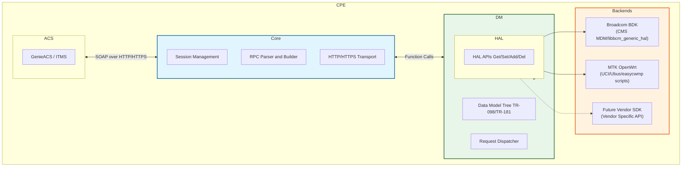
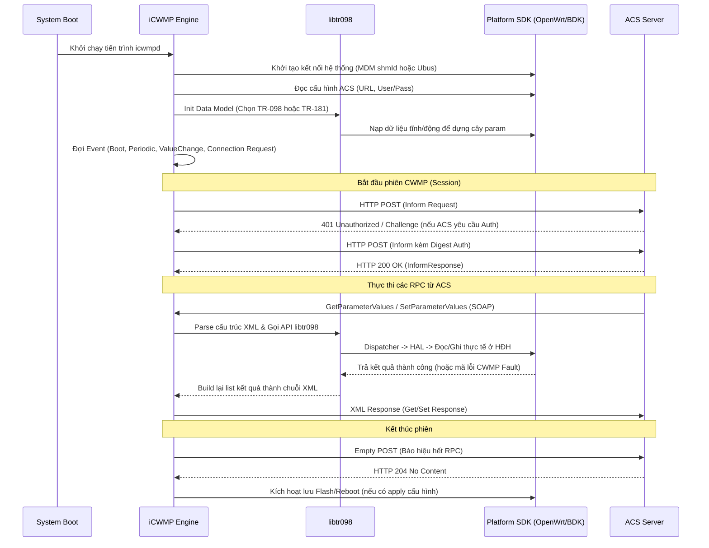
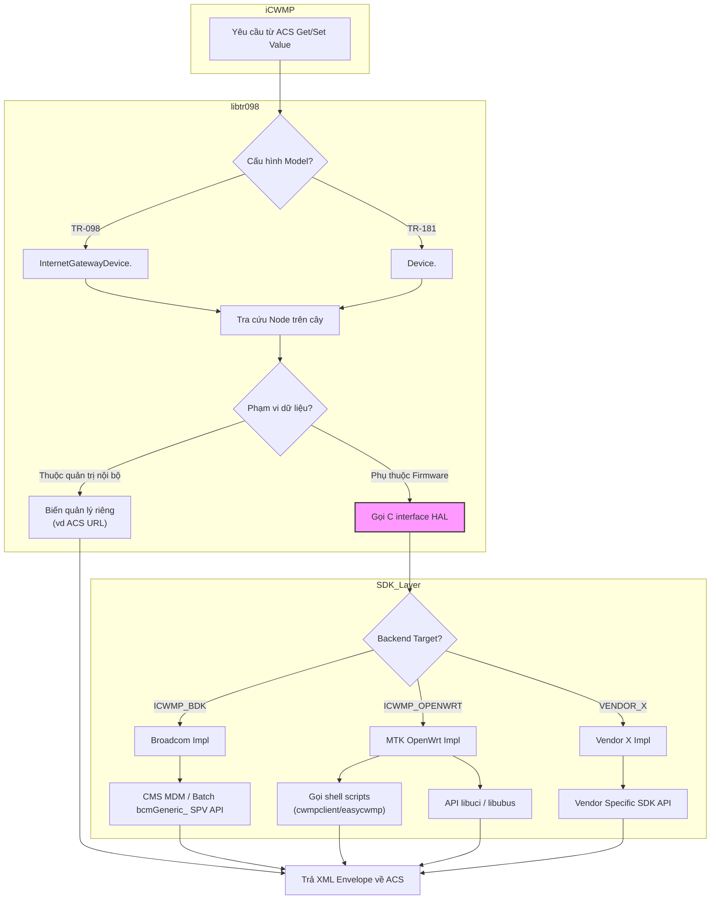

# Tổng quan kiến trúc đa nền tảng iCWMP & libtr098

Tài liệu này mô tả kiến trúc tổng quan, luồng hoạt động (flow), và cơ chế trừu tượng hoá (abstraction) giúp `icwmp` cùng data model `libtr098` có thể chạy trên nhiều nền tảng SDK khác nhau (hiện tại là Broadcom BDK và MTK OpenWrt).

---

## 1. Kiến trúc tổng thể các thành phần (Overall Architecture)

Kiến trúc chia hệ thống thành 3 tầng chính: **Core Engine** (xử lý giao thức), **Data Model Engine** (cây cấu trúc TR-098/TR-181) và **Platform Backends** (lớp giao tiếp với hệ điều hành/SDK bên dưới).

**Vai trò các tầng:**
1. **iCWMP Core Engine:** Quản lý vòng đời tiến trình, tạo session định kỳ (Periodic Inform) hoặc khi có sự kiện (Value Change, Connection Request). Quản lý chuỗi xác thực Digest/Basic với ACS và phân giải bản tin SOAP XML.
2. **libtr098 (Data Model):** Định nghĩa cấu trúc cây thư mục (ví dụ: `InternetGatewayDevice.DeviceInfo.`). Dịch các đường dẫn path từ SOAP thành các nút (node) cụ thể để xử lý.
3. **Platform Backends & HAL:** Trừu tượng hóa việc đọc/ghi cấu hình thực tế. Core sẽ không bao giờ gọi trực tiếp `uci` hay `cms_mdm`. Mọi thao tác đều qua HAL, và tuỳ vào flag lúc biên dịch (`ICWMP_BDK` hoặc `ICWMP_OPENWRT`) mã nguồn tương ứng của backend sẽ được gọi.

---

## 2. Luồng xử lý tổng quan (Session Flow)

Luồng thời gian từ lúc CPE khởi động, thiết lập kết nối đến lúc thực thi các cấu hình lệnh từ máy chủ ACS.

## 3. Luồng chi tiết giao tiếp Data Model đa nền tảng (Get/Set)

Đây là cách iCWMP xử lý rẽ nhánh linh hoạt giữa cấu hình Broadcom CMS và MTK OpenWrt (UCI/easycwmp).

### Chi tiết cách hoạt động của Data Model:
- **Router (Chọn Data Model):** Có thể chạy 1 lúc cả tham số `InternetGatewayDevice.` (TR-098) và `Device.` (TR-181) nhờ vào proxy alias hoặc dựng cây tách rời, điều khiển bằng tham số cấu hình.
- **Phân loại tham số (Static vs Platform-dependent):** Những thông số liên quan đến chính iCWMP (như `ManagementServer.URL`) sẽ do iCWMP tự quản lý và ghi config riêng (thường lưu `/data/icwmp/` hoặc `/etc/config/cwmp`). Những thông số thiết bị (như WiFi SSID, IP WAN) sẽ đi qua HAL.
- **MTK OpenWrt Layer:** Sử dụng lại toàn bộ gia tài snapshot hơn 1000 param từ `easycwmp` bằng cách map từ C xuống layer Shell scripts, giúp giảm thiểu rủi ro code lỗi logic và đồng bộ tương thích với phiên bản hiện tại.

---

## 4. Khả năng mở rộng cho SDK tương lai (Future Extensibility)

Nhờ thiết kế Abstract HAL, việc thêm một nền tảng thứ 3 (ví dụ: Realtek SDK) hoàn toàn không ảnh hưởng tới core engine hay cây logic TR-098. Các bước thực hiện chỉ bao gồm:
1. Tạo một thư mục backend mới: `libtr098/platform/vendor_x/`
2. Cài đặt các hàm giao tiếp bắt buộc chuẩn của HAL: `hal_get_value()`, `hal_set_value()`, `hal_add_object()`, `hal_del_object()`, `hal_apply_config()`.
3. Định nghĩa mapping table giữa đường dẫn CWMP chuẩn và đường dẫn riêng biệt của SDK đó.
4. Thêm `CFLAGS=-DICWMP_VENDOR_X` vào Makefile khi biên dịch trên nền tảng đó. Hệ thống sẽ tự động bypass Broadcom/MTK.

---

## Ghi chú đối chiếu với bản đã hiện thực (Claude Code, 2026-09-23)

Tài liệu này là **tổng quan khái niệm**, viết trước khi code. Bản đã hiện thực
(overlay commit `99f4988`, patch `0032`) theo đúng hướng ở mục 3 — dùng lại thư viện hàm
shell của `easycwmp` thay vì viết lại data model — nhưng khác ở phần đặt tên và một số chi tiết:

| Trong tài liệu này | Trong code thực tế |
|---|---|
| cờ build `ICWMP_OPENWRT` | `./configure --with-platform=mtk` → `DM_PLATFORM_MTK` (libtr098) / `ICWMP_MTK` (icwmpd) |
| "Abstract HAL" `hal_get_value()`… | seam có sẵn `platform/dmplatform.h` (`dm_platform_param_method`, `commit`, `revert`, …) + `inc/icwmp_platform.h` cho icwmpd |
| "gọi shell scripts" | **một** shell con thường trú (`platform/script/dmscript.c` + `scripts/mtk/icwmp_dm.sh`), không fork mỗi RPC |
| "hơn 1000 param" | đếm được **824 param + 204 object** (`easycwmp_tr098_inventory.txt`) |
| TR-098 và TR-181 chạy song song | MTK **chỉ TR-098** ở lượt này (TR-181 chỉ có ở platform `bdk`) |

Chi tiết và bằng chứng: [../analysis.md](../analysis.md),
[../../../docs/icwmp_multiplatform_tr098_design.md](../../../docs/icwmp_multiplatform_tr098_design.md).
