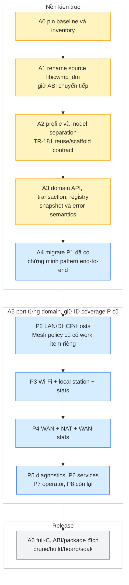

# Kế hoạch thực thi libicwmp_dm — kiến trúc nền, TR-098 C và TR-181 reuse/scaffold

> Snapshot: `src/2025q3`, thư viện hàm của `cwmpclient`
> (`tclinux_phoenix/apps/hni/cwmpclient/ext/openwrt/scripts/functions`), ngày trích 2026-09-23.
> Số liệu lấy tự động, không ước lượng: xem `tr098_coverage_matrix.tsv` (một dòng cho mỗi
> object/parameter, kèm getter, setter, type, forced-inform và file shell gốc). Sinh lại bằng
> `./gen-coverage-matrix.py <2025q3>/tclinux_phoenix/apps/hni/cwmpclient/ext/openwrt/scripts/functions
> > tr098_coverage_matrix.tsv` — chạy lại sau mỗi lần sản phẩm đổi thư viện hàm.

## Cách dùng kế hoạch này

**A1 đã implement trên working overlay, static PASS, chờ SDK build.** Xem
[a1-implementation.md](a1-implementation.md) và `./progress.py --watch` trong issue.

**§6 là kế hoạch thực thi mới**, bắt đầu từ overlay `cd93685` đã kiểm lại khi resume. §0–2 giữ inventory
và kết quả P1, P2–P8 là ID coverage cũ để không phá bảng TSV. Đã chạy lại extractor ngày
23/09 trên MTK `b207c4518`, và **sửa lại extractor 23/09 tối** (mục 0b): bảng hiện tại 968 dòng,
**783 param / 184 object**.

Đổi tên source thành `public/libs/libicwmp_dm/src/`, chia lớp theo
[design §12](../../docs/icwmp_multiplatform_tr098_design.md#12-source-layout-đề-xuất-và-bản-đồ-di-chuyển).
[Flow component](../../docs/icwmp_multiplatform_tr098_flow.md) chỉ rõ module/process/driver từng domain.
TR-098 implement thật, TR-181 BDK reuse, phần chưa có tạo mapping + callback TODO có kiểm soát.
Không buộc hoàn tất mọi backend TR-181 mới giao được phase TR-098.

## 0. Con số gốc

| Chỉ số | Giá trị | Cách lấy |
|---|---|---|
| Parameter TR-098 đang phục vụ | **783** | `common_execute_method_param` có thật (không tính dòng comment), path đã resolve biến shell |
| Object TR-098 | **181** | `common_execute_method_obj` |
| Parameter dùng `X_AIS_*` (của nhà mạng) | **235** | trong 783 ở trên |
| Parameter dùng `X_HNI_*` | **0** | toàn bộ file `tr098/x_hni_*` bị comment trong snapshot này — **đã kiểm lại từng file** |
| Getter là `$UCI_GET` thuần | 33 | phần còn lại đi qua **449 hàm shell** khác nhau |
| Dòng thư viện hàm | ~24 600 | `wc -l functions/{common,tr098,tr143}/*` |

Hệ quả quan trọng: **không sinh code tự động được.** Chỉ 33/783 tham số là ánh xạ UCI thẳng;
692 tham số còn lại nằm trong 449 hàm shell gọi ubus (`hni`, `hni.wan`, `hni.service`,
`network.interface.*`), `/proc`, `/sys`, `wlanconfig`, `iwpriv`, `ip`, `brctl` và các helper
`hni_*`. Mỗi phase phải đọc hàm shell tương ứng rồi viết lại bằng C, không có đường tắt.

> Đính chính so với bản phân tích 22/09: trước đó ghi "cây vendor `X_AIS_*` / `X_HNI_*` mà ACS đã
> provision". Kiểm lại từng file cho thấy **`X_HNI_*` hiện không được phục vụ** (entry function và
> `prefix_list` đều bị comment). Chỉ `X_AIS_*` là thật. Con số 824/204 của bản trước là đếm cả
> dòng trùng, số đúng sau khi khử trùng và sau khi sửa extractor (mục 0b) là **783/184**.

## 0b. Sửa extractor 23/09 — bảng cũ vừa thừa vừa thiếu

`gen-coverage-matrix.py` bản đầu gom hết phép gán biến của một file rồi mới bung, và dùng
`setdefault` nên **gán đầu tiên thắng**. Mọi path dựng từ biến cục bộ đặt lại trong từng hàm
(`local base="$DMROOT.LANDevice.1.LANEthernetInterfaceConfig.$inst."` chẳng hạn) do đó bung sai:

- **29 path bịa ra**: `base` của hàm WPS thắng, ghép với tên lá của hàm khác, sinh ra những path
  chưa từng tồn tại như `WLANConfiguration.{i}.WPSAlias`, `WPSStatus`, `WPS.Stats.BytesSent`.
- **61 path thật bị mất**: path không bung được thì không bắt đầu bằng `InternetGatewayDevice.`
  nên bị loại im lặng — 8 leaf mức port của `LANEthernetInterfaceConfig`, 17 leaf
  `WLANConfiguration.AssociatedDevice`, 36 leaf `Firewall.X_AIS_IPFilter` và
  `X_AIS_ServiceControl.IPV6ServiceControl`.
- Hai leaf `Prefix`/`PrefixLen` bị gán nhầm sang `IPV4ServiceControl`, trong source chúng chỉ có ở
  `IPV6ServiceControl` (`functions/tr098/firewall:422`).

Bản sửa quét **tuần tự, gán sau đè gán trước** — đúng ngữ nghĩa shell cho code thẳng hàng. Bảng
mới sinh lại khớp byte-for-byte. Con số phase đổi theo: P2 62 → **70**, P3 75 → **67**,
P6 63 → **97**, tổng 749 → **783**.

Bài học: đếm inventory từ thư viện shell phải mô phỏng thứ tự gán, không được gom biến theo file.
Bảng cũ **không được giữ lại** vì nó chứa path bịa; muốn dựng lại thì chạy chính script này.

## 1. Chia phase

Tiêu chí chia: **theo nhánh của cây**, không theo file shell — vì một file (`lan_device`) chứa cả
LAN lẫn Wi-Fi, và vì `mtk_native_objs`/claim list làm việc theo path. Một phase = một tập path
chuyển chủ sở hữu từ `sdk/mtk/compat/` sang `sdk/mtk/dm098/`.

| Phase | Nhánh | Param | Obj | File shell nguồn | Backend sản phẩm phải gọi | Trạng thái |
|---|---|---|---|---|---|---|
| **P1** | `DeviceInfo.`, `Time.`, `ManagementServer.` | 65 | 12 | `common/device_info`, `tr098/time`, `common/management_server` | UCI `easycwmp`, `pon`, `system`, `/proc`, `/sys`, `ponmgr` | **ĐÃ VIẾT, chưa build/board** — `deviceinfo_mtk.c`, `time_mtk.c`, `managementserver*_mtk.c` |
| **P2** | `LANDevice.{i}.` trừ Wi-Fi (`LANHostConfigManagement`, `DHCPStaticAddress`, `Hosts`, `LANEthernetInterfaceConfig`) | 70 | 14 | `tr098/lan_device`, `tr098/X_AIS_Mesh` | UCI `dhcp`, `network`, `lanhost`, `/proc/tc3162/gsw_stats`, `/sys`, `ethphxcmd`, `switchmgr` | **ĐÃ VIẾT, chưa build/board** — `lan_mtk.c`, `lanhosts_mtk.c`, `laneth_mtk.c`, `x_ais_mesh_mtk.c` (70/70 tên khớp) |
| **P3a** | `WLANConfiguration.{i}` phần radio: identity, kênh, công suất, chuẩn, MU-OFDMA, bộ đếm, `WPS`, `AssociatedDevice` | 54 | 12 | `tr098/lan_device` | UCI `wireless`, `mapd.*`, `ubus hni getChannelList/getCurrentChannel/getWlanDeviceList`, `/proc/net/dev` | **ĐÃ VIẾT, chưa build/board** — `wlan_mtk.c`, `wlanassoc_mtk.c` (54/54 tên khớp) |
| **P3b** | `WLANConfiguration.{i}` phần bảo mật: `BeaconType`, `Basic/WPA/IEEE11i` auth + encryption, `KeyPassphrase`, `PreSharedKey`, `WEP*` | 13 | 2 | `tr098/lan_device` | UCI `wireless.<iface>.{encryption,key}`, `mapd.*` PSK | **ĐÃ VIẾT, chưa build/board** — `wlansec_mtk.c` (P3 đủ 67/67) |
| **P4a** | `WANDevice.` khung + `WANCommonInterfaceConfig`, `WANEthernetInterfaceConfig`(+`Stats`), `WANDSLLinkConfig` | 22 | 8 | `tr098/wan_device` | UCI `clay.opermode.uplink`, `pon.xpon_link.trafficStatus`, `/sys/class/net/<uplink>/statistics` | **ĐÃ VIẾT, chưa build/board** — `wan_mtk.c`, `wan_mtk.h` (22/22 đường dẫn khớp) |
| **P4b** | `WANIPConnection.{i}` leaf lõi + `Stats` + `WANIPConnectionNumberOfEntries`, cả entry routed lẫn bridged | 35 | 2 | `tr098/wan_device` | UCI `wan`, `network`, `ubus hni.wan set`, `/sys/class/net`, `hni_wan_reload` | **ĐÃ VIẾT, chưa build/board** — `wanip_mtk.c` (35/35 đường dẫn khớp) |
| **P4c** | `WANPPPConnection.{i}` leaf lõi + `Stats` + `WANPPPConnectionNumberOfEntries` | 42 | 2 | `tr098/wan_device` | như trên + `ubus network.interface.<if> status` | chưa |
| **P4d** | `X_AIS_IPv6.` (+`Pd.`) và các leaf `X_AIS_IPv6*` phẳng của cả hai connection | 46 | 4 | `tr098/wan_device` | UCI `wan`, `network`, varstate IPv6 | chưa |
| **P4e** | `PortMapping.{i}` + `PortMappingNumberOfEntries` của cả hai connection | 26 | 2 | `tr098/wan_device` | UCI `firewall_clay`, `ubus hni reloadIpFilter2` | chưa |
| **P4f** | `X_AIS_ServiceList` của cả hai connection — setter là máy trạng thái trên `easycwmp.@acs[0].enablecwmp`, rule internet-access của firewall và cấu hình lại easycwmpd | 2 | 0 | `tr098/wan_device` | UCI `easycwmp`, `wan`, `hni.service` | chưa |
| **P5** | Diagnostics: `IPPing`, `TraceRoute`, `DNS`, `NSLookup`, `Download`, `Upload`, `Layer3Forwarding`, `WiFi.NeighboringWiFiDiagnostic` | 88 | 16 | `tr098/{ipping,traceroute,dns,nslookup}_diagnostic`, `tr143/*`, `tr098/layer3_forwarding` | UCI `network`, `hniwan`, `hni_wan_reload`, các binary đo | chưa |
| **P6** | `Firewall.`, `UserInterface.`, `CaptivePortal.`, `Account.`, `User.`, `XMPP.`, phần còn lại ở root | 97 | 33 | `tr098/firewall`, `tr098/userinterface`, `tr098/account`, `tr098/xmpp`, `tr098/root` | UCI `firewall_clay`, `ubus hni reloadIpFilter2`, `hni.service set/commit` | chưa |
| **P7** | Cây `X_AIS_*` ở root (17 object: `UplinkSetup`, `Logging`, `Conf`, `DDNS`, `SSH`, `Telnet`, `UPnP`, `WiFiStatus`, `MeshAPI`, `3rdAgent`, `CPEagent`, `AutoWifiScan`, `DHCPClient`, `DnsLandingPage`, `Isolation`, `CarrierLocking`, `WebUserInfo`) | 79 | 23 | `tr098/X_AIS_*` | tuỳ object, phần lớn UCI + `hni.service` | chưa |
| **P8** | `Services.StorageService.`, `Services.STBService.`, `DOCSIS.`, `LTE.`, và nhánh lai `InternetGatewayDevice.Device.*` (`IP`, `PPP`, `DHCPv6`, `RouterAdvertisement`, `DynamicDNS`) | 144 | 49 | `tr098/services_storage_service`, `tr098/docsis`, `tr098/device_*`, `tr098/ip_ipv4v6` | tuỳ object | chưa |

Tổng: **783 parameter / 184 object**. Đã sang C: P1 65 + P2 70 + P3 67 + P4a 22 + P4b 35 = **259 (33,1 %)**. Kế tiếp: P4c (`WANPPPConnection`).

> **Chữ cái sau số phase ở bảng này** (`P3a`, `P4b`, ...) là **bước port TR-098** — một lượt
> commit, một patch. Mục 6.7 cũng dùng `P2a`/`P3b`/`P4a` nhưng đó là **gói coverage của A5**,
> chia theo trách nhiệm chứ không theo nhánh cây, và hai cách chia **không trùng nhau**.

Thứ tự trên là thứ tự **rủi ro giảm dần cho phiên ACS**: P1 là mọi thứ Inform cần, P2-P4 là cái
ACS sửa hằng ngày, P5 là RPC chẩn đoán, P6-P8 ít bị đụng hơn.

## 2. P1 đã viết — bằng chứng giới hạn ở tập tên

So khớp tự động giữa cây C mới và cây cũ (đối chiếu theo tên tham số, không phải theo cảm tính):

```
P1 target params: 65 | C module params: 84
P1 params còn thiếu trong module C: (rỗng)
```

19 tham số dôi ra là của chính icwmp, không phải mất mát:

- 11 leaf `ManagementServer.*` mà module portable `tr098/managementserver.c` có thêm
  (`AliasBasedAddressing`, `InstanceMode`, `HTTPCompression*`, `SupportedConnReqMethods`,
  `LightweightNotificationProtocols*`, `UDPLightweightNotification*`, `ConnReqJabberID`,
  `ConnReqAllowedJabberIDs`) — chuẩn TR-098, client cũ thiếu.
- 8 leaf `X_HNI_Icwmp.*` là cấu hình riêng của icwmpd (log level, amendment, timeout, CR host/port,
  backend đang dùng).

**Cảnh báo về `AliasBasedAddressing`**: module portable quảng bá tham số này. Nếu ACS bật alias mà
backend không hỗ trợ thì hỏng. Kiểm `InstanceMode` trước khi cho lên field — xem
`knowledge/protocol/cwmp-reuse-shell-data-model-bridge.md`.

## 3. Quy trình cho mỗi phase domain — thay quy trình direct-helper trước review

1. Lọc path từ TSV theo ID P2–P8, đối chiếu source shell caller/callee và backend behavior.
2. Bổ sung mapping manifest hai model: semantic ID, path, type, permission, instance rule,
   operation và capability riêng từng SDK. `mapping_todo` nếu chưa có counterpart hợp lệ.
3. Implement service/backend C và facade TR-098, schema/bindings TR-181 reuse hoặc callback stub.
   Không viết thêm setter gọi thẳng UCI + append apply file ngoài transaction contract A3.
4. Update build/module manifest và owner map. Claim toàn subtree chỉ khi đầy đủ leaf/objects,
   nếu partial thì claim leaf/instance pattern chính xác, không cắt compat quá sớm.
5. Verify tên, type, permission, value, fault, notify, instance và side effect. Board đối chiếu
   client cũ ở cùng config/state, không chạy hai agent cùng lúc. Record backend errors tách khỏi 0.
6. Cập nhật status từng operation/model/SDK trong implementation manifest, giữ TSV inventory
   đầu vào ổn định. Chưa board-test thì không đánh complete chỉ vì getter đã compile.

## 4. Khi nào tắt được compat

Chỉ sau khi R3 đã sửa đủ compile/package/runtime gates, tất cả path baseline thuộc profile
có implementation C tương đương và phần tích hợp STUN/easycwmp không còn phụ thuộc DM shell.
Chọn compat-off rồi export/prune trên **release copy**, không xóa source development để test.
Clean configure/build/link/install/distribution của cả source đầy đủ và source đã bỏ compat.
Không dựa vào optimizer loại helper static còn reference dmscript. Xem A2 và A6 ở §6.

## 5. Rủi ro đã biết của từng phase

| Phase | Rủi ro chính | Cách giảm |
|---|---|---|
| P2 | `Hosts.Host.{i}` là bảng động đọc từ `dhcp`/`lanhost` + `ubus hni getWlanDeviceList`, số instance đổi liên tục | dùng `browseinstobj` + dmmap như `tr098/landevice.c` của cây uci, không tự đánh số |
| P3 | `wlanconfig`/`iwpriv` là lệnh ngoài, chậm và có thể treo | gom một lần gọi cho cả object, cache trong `struct dmctx`, không gọi lại cho từng leaf |
| P4 | 173 tham số, và `hni_wan_reload` làm rớt WAN nếu gọi sai lúc | mọi action đi qua transaction-local queue A3, chỉ publish sau commit, không gọi restart giữa SPV |
| P5 | Diagnostics là RPC bất đồng bộ (`DiagnosticsState`), engine có sẵn cơ chế | dùng `diagnostic.c` của icwmp, không tự dựng |
| P6 | `firewall_clay` là schema riêng của sản phẩm | đọc `ubus hni reloadIpFilter2` trước khi đụng |
| P7 | Nhà mạng provision theo đúng tên `X_AIS_*`, sai một ký tự là hỏng | copy tên từ `tr098_coverage_matrix.tsv`, không gõ tay |
| P8 | `InternetGatewayDevice.Device.*` là nhánh lai TR-181 trong cây TR-098 | giữ nguyên path lạ đó, **không** "sửa cho chuẩn" |


## 6. Kế hoạch thực thi từ source hiện tại — 23/09

### 6.1 Baseline và cách chia gói

- Baseline `cd93685` thay snapshot d3c82a4 ban đầu, delta chỉ guard compat R3.
  Working overlay nay có A1/patch 0034 chưa commit, xem hướng dẫn A1 ở đầu file.
  `0033`/tarball hiện tại sha256 `841b582c0f531b28…` làm baseline, không ghi đè khi refactor.
- MTK vendor `b207c4518`, BDK vendor `7f837f5f6`. Không tự apply vào `src/`, không commit.
- P1 MTK đã viết 65 param, mới chứng minh tập tên. BDK đã có mapping LAN/WAN/Wi-Fi/System và
  TR-181 proxy/local leaves, phải preserve, không làm lại từ đầu.
- Mỗi gói code có patch/README/validation manifest riêng, base là gói trước đã chốt. Số patch
  chỉ cấp khi thực thi sau khi kiểm artifact mới nhất, không mặc định số `0034` còn trống.
- Code staging có thể tiến lên khi thiếu board, nhưng stage `implemented/static-reviewed`,
  `build-verified`, `board-verified`, `release-ready` tách biệt. Không giả PASS build trong workspace.

**Chú thích màu:** vàng = phase kiến trúc MỚI, xanh = phase port BỊ SỬA theo contract, xám = gate release.
Tất cả là kế hoạch, chưa implement.



### 6.2 A0 — baseline và inventory (planning đã làm, build còn NOT RUN)

Đầu vào: overlay cũ + coverage TSV + source SDK. Giao: revision/hash, source/link/header/assets
inventory, baseline build commands, bảng known failures R1–R8, model/provider status BDK/MTK.
Lượt này đã check HEAD/status và re-extract inventory bằng memory buffer, không tạo copy source.

Gate trước thay semantics: baseline SDK build/log, GPN/GPV P1 + BDK 098/181 đã có. Nếu baseline
fail compile, sửa riêng trước rename để phân biệt lỗi sẵn với lỗi migration. Build chạy trên
máy SDK, chưa chạy trong workspace này.

### 6.3 A1 — đổi tên source, chưa trộn sửa behavior

1. Move `public/libs/libtr098/libtr098` → `public/libs/libicwmp_dm/src`, wrapper files lên
   `public/libs/libicwmp_dm/`. Không tạo hai bản source hoặc copy giữ engine cũ hoạt động song song.
2. Sửa wrapper `Makefile/Bcmbuild.mk/autodetect/Manifest`, source root trong installer/export,
   OpenWrt feed `PKG_SOURCE` và source directory mapping, SDK prune root script, app include paths.
3. Public include canonical `<icwmp_dm/...>`, header legacy forwarding chỉ khi có consumer cũ.
   Tên C symbol legacy giữ được ở gói này, API mới dùng prefix trung lập. Không mass rename mọi
   chuỗi `tr098` vì nhiều chuỗi là ACS schema/state có ý nghĩa.
4. Build transitional package có thể vẫn `libtr098.so` và dependency package cũ, ghi rõ trong
   resolved manifest. Chính source đã mang tên mới, không phải đợi A6 mới move source.
5. Gate: không còn build reference path cũ, tập modules/exported symbols và GPN không đổi do
   rename. Clean staging build app/lib cả BDK và MTK, source SDK khác prune vẫn kiểm riêng.

A1 không đổi notification filename, UCI package `cwmp`, TR-098 paths hay persistent instance
map. Đổi SONAME/package ở A6 hoặc gói riêng sau A1 khi đã rebuild toàn consumer, không lẫn vào
model semantic change.

### 6.4 A2 — profile, shared services và model separation

Gói A2a: profile resolver chung app/lib/package, enable models/default/runtime switch, feature
compat/proxy/sample, source availability, resolved fingerprint, unknown option/dependency errors.
Đóng R1/R4/R8 và hoàn tất gate release R3 (guard source đã sửa trong cd93685): header/call sites/SDK init/assets install đều theo profile. Invalid model config
fail trước ACS session. Empty model registry không là fallback hợp lệ.

Gói A2b: tách `managementserver.c` service khỏi table TR-098, `icwmpcfg` shared logic, MLO/sample
shared implementation khỏi `dm098`; move root181/provider sang `models/tr181`, backend BDK
không gọi register-all TR-098 vô điều kiện. Vendor proxy 098 là feature riêng. Common UCI store
được giữ. Không xóa backend MDM của BDK khi xóa facade ACS TR-181.

Gói A2c: manifest mapping/status và generator scaffold TR-181. Mỗi mapping có body callback
thật hoặc bind reused BDK provider. Stub `DM_ERR_NOT_IMPLEMENTED` không tạo tác dụng phụ,
production không enumerate; development expose có diagnostic/fault, release bị chặn nếu bật.
Không generate path khi `mapping_todo`. Không coi generator là bộ tự dịch semantics.

Gate: BDK 098-only / 181-only / dual, MTK 098 compat-on và compat-off partial development,
UCI reference; mỗi profile kiểm source còn/off và source xóa/off. MTK full TR-181 production
phải fail nếu chưa có coverage, skeleton development kiểm CLI/harness trước khi được mở session.

### 6.5 A3 — hợp đồng service, registry và transaction

- `services/` contracts typed cho identity/settings/time và domain DTO WAN/LAN/Wi-Fi/host/stats.
  Không để SDK pointer hoặc memory allocator vượt API boundary. Chuẩn hóa error/status/unit.
- Context giữ selected model, request arena, snapshot cache, generation và pending writes/actions.
  Ban đầu serialized DM access, chưa làm đồng thời nhiều RPC trên global engine cũ.
- Registry owner/override validation, init failure/OOM không publish partial tree, kiểm provider
  dynamic và compat cùng schema ownership. Registry chưa bắt buộc thay constructor ngay nếu
  linker test giữ module, nhưng khuyến nghị explicit generated registration.
- Mutation transaction-local, commit mới publish action, abort không xóa action RPC trước đã
  commit. Backend không có atomic multi-store phải ghi giới hạn và reconciliation, không fake rollback.
- Instance key khác display instance, MAC link/MLD khác IP, counter domain/epoch khác nhau.

Gate: test fault VALUECHECK/VALUESET thứ N/commit/timeout/OOM; failed RPC không restart service,
ParameterKey đúng, duplicate path bị phát hiện, unsupported khác zero. Review source + host/mock
harness khi môi trường có compiler, SDK/board test tiếp theo. Đây là test contract, không test
lặp lại từng dòng implementation.

### 6.6 A4 — migrate P1 để chốt pattern (65 param đã có)

Refactor có giới hạn P1 hiện có sang identity/time/agent-config services, bindings 098 và 181.
Giữ names/type/access/forced Inform, timezone table đã sinh. BDK reuse handlers/MDM và field
ownership hiện tại, MTK giữ `easycwmp` config of record, app-private `cwmp` mirror rõ chiều.
TR-181 MTK operation chưa có làm TODO theo A2c, operation dùng chung được thì bind thật.

Gate: so với easycwmp từng giá trị/fault và deferred action, ACS Inform/CR/reload/WebUI/STUN,
P1-only test profile nói rõ partial, không thay full product chỉ bằng 65 tham số. Kết thúc A4
mới nhân rộng service pattern sang P2–P8.

### 6.7 A5 — domain implementation, mỗi gói có TR-181 disposition

| Gói coverage | Công việc C TR-098 | TR-181 trong cùng gói | Acceptance đặc thù |
|---|---|---|---|
| P2a LAN/DHCP | Interface/bridge config, pools/reservations, Ethernet status/stats | Reuse BDK `Ethernet/IP/DHCPv4`, MTK corresponding bindings, TODO backend nếu thiếu | Stable instance, Add/Del, DHCP pool bounds, config/network apply |
| P2b Hosts | `lan_host` adapter, host identity, optional station enrichment | `Device.Hosts.Host` binding hoặc BDK provider | Host không có IP/expired lease không làm mất station, lifecycle/reboot |
| P2c Mesh policy cũ | Bốn leaf `LANDevice.1.X_AIS_Mesh`, tách service khỏi schema AIS | Counterpart đã duyệt hoặc vendor extension/mapping_todo | Mode/role và wireless/mapd/1905 config ownership, không bật full topology ngầm |
| P3a Wi-Fi config | Radio/BSS, SSID/security/WPS, conversion | BDK mappings reuse, MTK Radio/SSID/AP split | Roundtrip enums/keys, không lưu credential vào log, reload đúng service |
| P3b Station + Wi-Fi stats | Raw STA + optional IP, MLD/link identity, signed RSSI, BSS/radio/STA counters | AP.AssociatedDevice/Stats tương ứng, feature thiếu dùng stub | Scope/direction/unit/width/reset, no duplicate MLD, chưa IP vẫn là STA |
| P4a WAN read/identity | IP/PPP/Bridge enumerate/status, lower-layer references, IP/DNS getters | Reuse BDK IP/PPP graph, MTK facade 181 | Không lấy ordinal làm stable connection ID, reconnect giữ identity |
| P4b WAN write/NAT/stats | WAN lifecycle, credentials, PortMapping, connection counters | Mapping IP/PPP/NAT, reuse hoặc callback TODO | Không rớt WAN giữa SPV, transaction/error propagation, offload counter scope |
| P5 diagnostics | Async job API, launch/result/completion | Reuse BDK diag MDM/CMS, TR-143 profile thiếu có TODO | Correlation ID, cancel/restart, đúng completion event, timeout |
| P6 firewall/UI/account | Service adapters theo owner config | BDK/provider có thì reuse, mapping rõ hoặc TODO | Không chuyển policy operator thành generic SDK default |
| P7 operator extensions | `X_AIS_*` dưới root, chia nhỏ từng service | Extension counterparts duyệt riêng, không ép vào standard leaf | Tên/side-effect đúng ACS hiện tại, profile operator on/off |
| P8 còn lại | Storage/STB/DOCSIS/LTE/hybrid `IGD.Device.*`, đánh dấu điều kiện sản phẩm | Schema counterpart có bằng chứng hoặc TODO | Giữ hybrid paths đã provision, không tuyên bố phần cứng không có |

P2a+b+c cộng lại vẫn **62**, P3a+b vẫn **75**, P4a+b vẫn **173** theo TSV, không cộng số mới
cho mỗi gói. *(Hai số đầu là của inventory cũ 749 — TSV sửa ngày 23/09 cho **70** và **67**,
xem mục 0b. Chưa map lại được vì cách gộp của gói A5 khác cách chia theo nhánh ở mục 1, nên
để nguyên và ghi rõ là lệch, không đoán.)* Mesh full topology, remote STA/link metrics hoặc stats ngoài inventory hiện tại
là **extension work items** riêng sau P2c/P3b, dùng contract mesh/stats và reuse BDK DataElements.
Không chặn 749 baseline bởi extension mới chưa được sản phẩm yêu cầu cụ thể.

Mỗi gói giao kèm manifest trạng thái theo SDK/model/operation, diff schema, evidence nguồn,
callback TR-181 implemented/reused/stub, instructions test, regression BDK và release subset.
Không cần viết lại provider BDK để làm nó giống implementation MTK.

### 6.8 A6 — bỏ compat, ABI/package đích và release

- Đủ 749 baseline hoặc subset sản phẩm được khai báo tường minh và đối chiếu, không mất path âm
  thầm. Loại shell DM, còn script hệ thống hợp lệ để restart/apply SDK không đồng nghĩa còn shell DM.
- Tách dependency STUN/WebUI/DHCP43 vào integration assets, không giữ một thư viện DM shell chỉ
  vì service khác còn sed vào nó. Nếu chưa xử lý, chưa đánh full-C release-ready.
- Đổi SONAME/package sang `libicwmp_dm` trong gói riêng, rebuild app + consumers, validate DT_NEEDED,
  header/pkg-config/install, OpenWrt dependencies và BDK integration. ABI break → version phù hợp,
  không alias symlink giả. Existing state migration/backward compatibility có test riêng.
- Export một SDK/một model, prune đầy đủ cả SDK-model bindings/assets, clean build/link/install/
  distribution. Không ship `EXPOSE_DM_STUBS=y`; có thể ship source TODO bị gate off.
- Board smoke cho BDK 098/181/dual và MTK 098 target, ACS sessions, WebUI concurrent config,
  firmware/reboot/CR/notify, performance GPV full tree và soak. Kết quả chưa có phải ghi NOT RUN.

### 6.9 Trạng thái và bước code tiếp theo

| Phase | Trạng thái sau lượt này |
|---|---|
| A0 inventory/source snapshot | Đã đối chiếu, baseline build/board còn NOT RUN |
| A1 rename source | Implemented, static/fixture/patch replay PASS, SDK build/board NOT RUN |
| A2 model/profile/scaffold | Planned |
| A3 contracts/transaction/registry | Planned |
| A4 P1 migration | Planned, reuse 65 param hiện có |
| A5 P2–P8 | Planned |
| A6 release | Planned |

Bước tiếp theo: clean SDK build A1 từ bundle mới và xử lý error log nếu có, sau gate triển khai A2a.
A1 đã đổi source/wrapper/feed/installer, không làm lại rename. Không mở P2 trước khi A2–A4 có
pattern đã kiểm. Trước mỗi phase đọc lại git status và handoff để không ghi đè thay đổi mới.

```sh
git -C projects/brcm_ap_wifi7_mvn/issues/20260916_tr069_app_use_icwmp/sdk-overlay/userspace status --short
git -C projects/brcm_ap_wifi7_mvn/issues/20260916_tr069_app_use_icwmp/sdk-overlay/userspace rev-parse HEAD
```

Cập nhật thực thi: rename A1 đã có patch 0034 và bundle, chưa SDK build. Các tên API/options/
manifest của A2–A6 vẫn là đặc tả chưa implement, không phải CLI đã có trong baseline.
