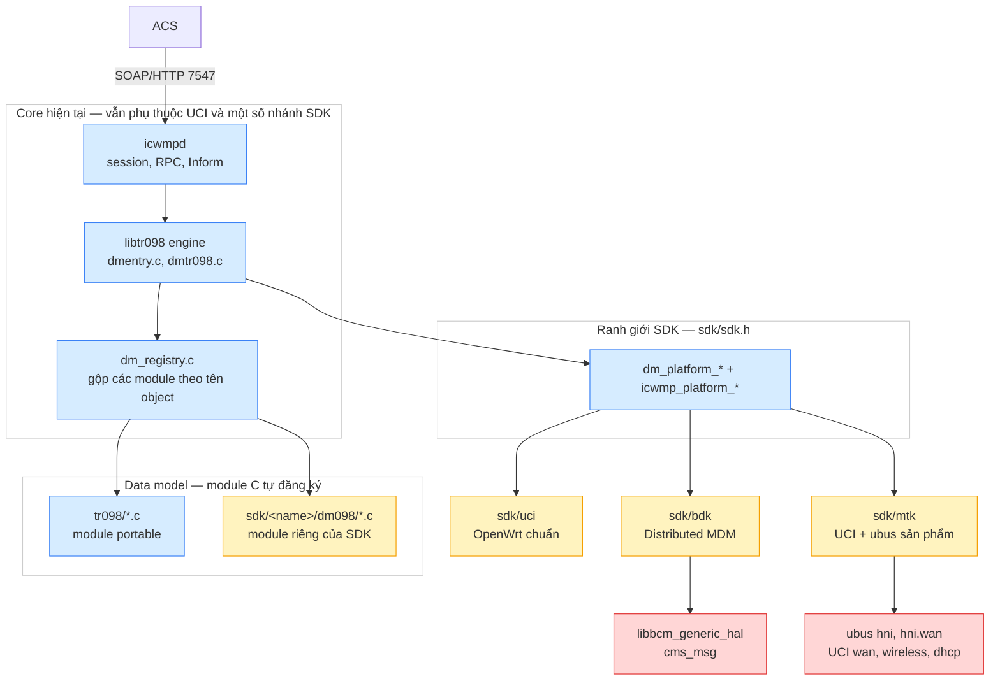
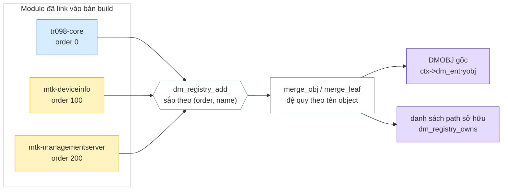
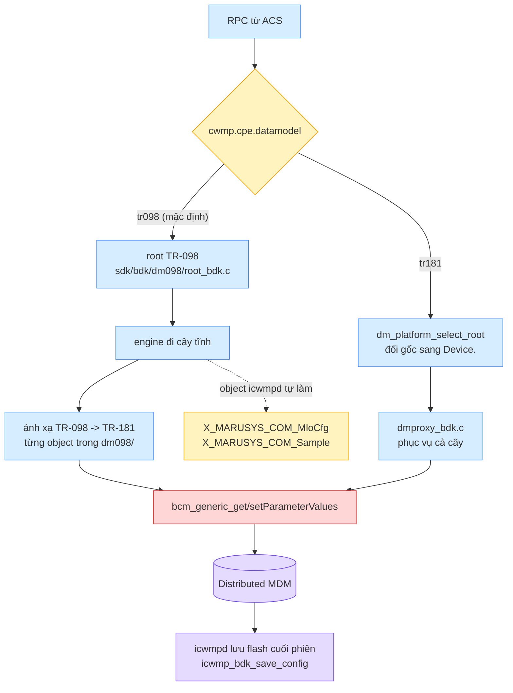
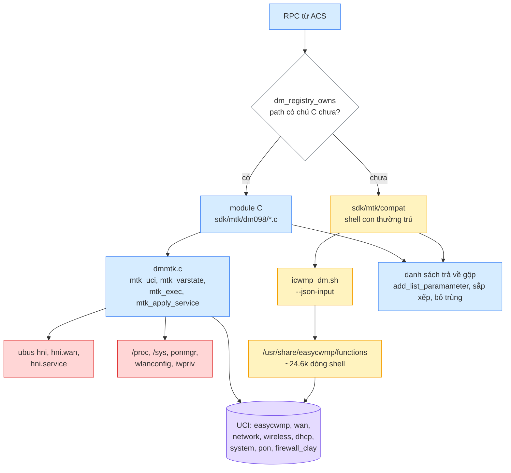
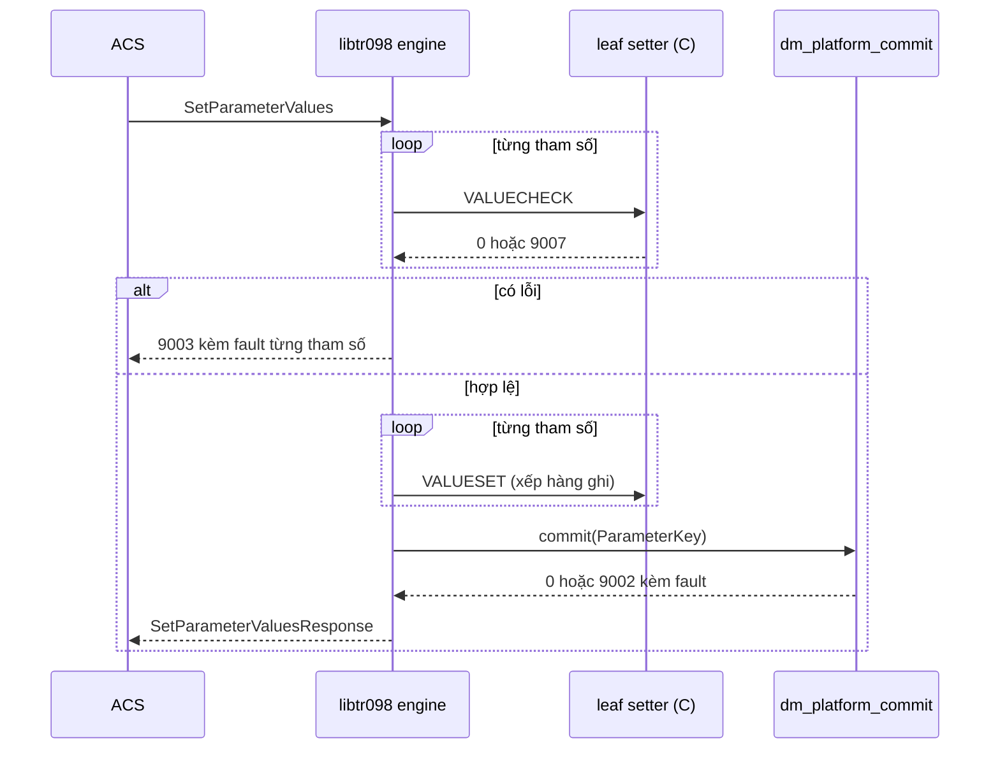
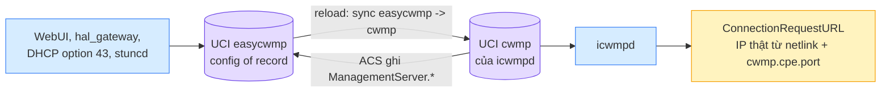
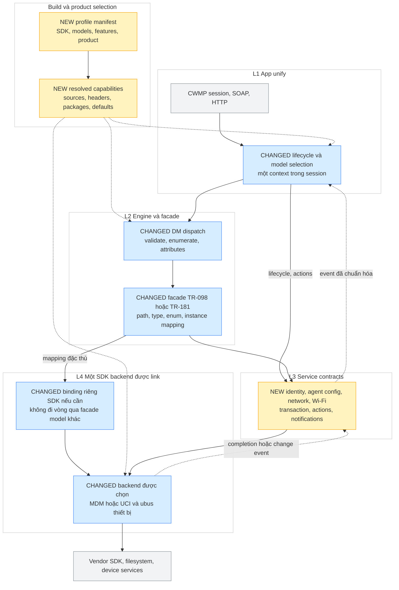
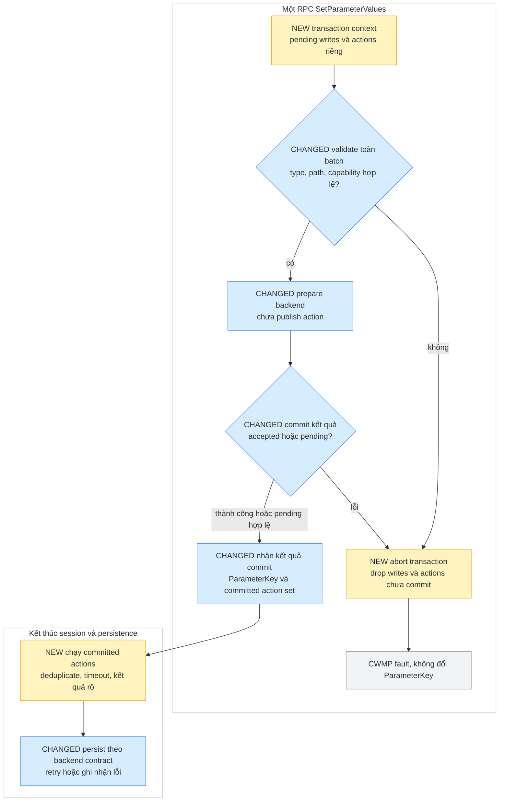

# icwmp + libtr098 — kiến trúc nhiều SDK, TR-098/TR-181 và release theo profile

> Phạm vi: một cây source duy nhất build được cho Broadcom BDK và MediaTek/Airoha OpenWrt, và
> hướng tới xóa bớt SDK/model và release theo profile. Hiện MTK mới có P1 bằng C, phần còn lại
> còn shell compat. Build sau prune chưa được chứng minh bằng compiler.
> Snapshot: overlay `sdk-overlay/userspace` commit `cd93685`, `src/2025q3`, `src/bcm963xx`
> nhánh `bringup`, 2026-09-23. Số dòng trích dẫn là anchor của snapshot này.
>
> Thuật ngữ: tài liệu này dùng **SDK** cho cái trước đây gọi là "platform" (cờ build cũ
> `--with-platform` vẫn còn nhận, là alias của `--with-sdk`).

> **Thực thi A1:** working overlay trên cd93685 đã rename source `libicwmp_dm/src`, public
> include `<icwmp_dm/...>`, wrapper/feed/installer đồng bộ. ABI vẫn libtr098. Static PASS,
> SDK build/board NOT RUN. [Hướng dẫn và trạng thái](../issues/20260922_icwmp_multiplatform_tr098/a1-implementation.md).
> §1–9 giữ trace baseline 0033 trước rename, đổi prefix source khi tra file. A2–A6 vẫn Proposed.

## START HERE — flow một màn hình

**Review 23/09: code hiện tại mới tách thư mục SDK, chưa hoàn tất phân lớp và single-model release.**
Các mục 1–9 mô tả baseline `0033`, đọc cùng các đính chính bên dưới. **Kiến trúc đích và hợp đồng
release ở §10–17 là Proposed, chưa implement.** Findings có caller/callee và anchor tại
[analysis §10](../issues/20260922_icwmp_multiplatform_tr098/analysis.md#10-review-kiến-trúc-2309--codex-snapshot-d3c82a4).
PDF cùng tên là bản trước review, chưa cập nhật theo Markdown này.

Luồng đích ngắn: **profile → app unify → DM facade đã chọn → service contract → SDK backend**.
SDK build-time và datamodel ACS là hai lựa chọn độc lập, product profile là trục thứ ba.

### Current Flow — baseline `0033`

**Conditional:** flow dưới áp dụng khi link đúng SDK, còn MTK cần compat để đủ cây cũ.
Khối core hiện vẫn dùng UCI/ubus trực tiếp và còn CLI riêng BDK, chưa phải core thuần độc lập SDK.

**Chú thích màu**: xanh = code dùng chung mọi SDK · vàng = thư mục của một SDK (xoá được) ·
tím = dữ liệu/cấu hình · đỏ = ranh giới ra ngoài tiến trình.



## 1. Hai trục, đừng trộn vào nhau

| Trục | Câu hỏi nó trả lời | Nằm ở đâu | Thêm cái mới thế nào |
|---|---|---|---|
| **Data model** | Cây tham số trông thế nào | `tr098/` (portable), `sdk/<name>/dm098/` (riêng SDK), sau này `tr181/` | thêm một file `.c` có `DM_MODULE_REGISTER()` |
| **SDK** | Giá trị thật nằm ở đâu, ghi bằng cách nào | `sdk/<name>/` | thêm một thư mục, chạy `tools/sdk-scan.sh` |

Trước đây hai trục này dính nhau: `tr098/bdk/`, `platform/bdk/`, `platform/mtk/`, `scripts/mtk/`,
`files/mtk/` nằm rải rác ở 5 chỗ, và `configure.ac` + `Makefile.am` liệt kê cứng tên từng SDK.
Xoá một SDK phải sửa 6 file và vẫn còn sót tham chiếu.

Baseline đã gom phần lớn code backend và mảnh build vào `sdk/<name>/` của từng component.
CLI trong app, wrapper SDK và package recipe vẫn còn lựa chọn SDK bên ngoài thư mục này (R5/R8).

## 2. Layout và luật "xoá được"

```
libs/libtr098/libtr098/            apps/icwmp/icwmp/
├── dm_registry.c/.h               ├── sdk/
├── tr098/          portable       │   ├── sdk.h        hợp đồng
├── sdk/                           │   ├── enabled.m4   (sinh ra)
│   ├── sdk.h       hợp đồng       │   ├── enabled.mk   (sinh ra)
│   ├── enabled.m4  (sinh ra)      │   ├── bdk/  mtk/  uci/
│   ├── enabled.mk  (sinh ra)      │   └──    sdk.m4 sdk.mk *.c scripts/ files/ README.md
│   ├── uci/  bdk/  mtk/           └── tools/sdk-scan.sh, sdk-prune.sh
│   └──   sdk.m4 sdk.mk *.c dm098/ compat/ README.md
└── tools/sdk-scan.sh, sdk-prune.sh, gen-tz-table.sh
```

Ba quy tắc làm cho việc xoá an toàn:

1. **Mục tiêu giảm tham chiếu SDK trong entry build chung**, chưa đúng cho toàn bộ source. `configure.ac` có
   `m4_include([sdk/enabled.m4])`, `bin/Makefile.am` chỉ có `include $(top_srcdir)/sdk/enabled.mk`.
2. **Hai file `enabled.*` là file sinh ra**, `tools/sdk-scan.sh` dựng lại từ các thư mục đang có.
   Cả hai `Makefile` build (BDK) đều gọi `sdk-scan.sh` trước `autoreconf`.
3. **Mỗi `sdk.m4` được include vô điều kiện** và tự bảo vệ bằng `$with_sdk`. Lý do: `AM_CONDITIONAL`
   phải được chạy qua trong **mọi** lần configure, nếu không `config.status` từ chối thay thế nó.

```sh
./sdk-prune.sh mtk        # giữ mtk, xoá bdk và uci ở cả hai component
./sdk-prune.sh --list
# rồi:  autoreconf -fi && ./configure --with-sdk=mtk
```

Đã kiểm trên một bản copy: sau khi prune, mọi source mà fragment tham chiếu đều tồn tại, không còn
tham chiếu source SDK đã bỏ trong phạm vi kiểm trước đó. Đây là kiểm tĩnh, không phải
configure/build/install PASS. Wrapper/package chưa có contract xóa model (R1–R3/R8).

## 3. Registry — cây gốc không được viết ở đâu cả

**Chú thích màu**: xanh = module portable · vàng = module của SDK · tím = kết quả gộp.



Luật gộp:

- Hai module khai cùng tên object → **gộp con và lá đệ quy**. Nhờ vậy `mtk-managementserver` thêm
  `EnableCWMP` và `UpgradesManaged` vào object `ManagementServer` của module portable mà không
  phải sửa file portable.
- Module có `.order` lớn hơn **thắng** ở trường mà cả hai cùng đặt → đó là cách một SDK ghi đè một
  getter của object portable.
- Một lá khai hai lần → giữ của module sau.
- Cây gộp dựng **một lần**, bằng `calloc()` thường (không phải `dmcalloc()`: bộ nhớ dm chết theo
  dm context), bảo vệ bằng `pthread_mutex` vì icwmpd đụng data model từ cả thread session lẫn
  thread value-change.

`.paths` là **khai báo claim prefix** dùng để lọc compat. **Verified:** registry hiện không
kiểm overlap hay duplicate owner, leaf trùng bị ghi đè theo order. Khẳng định cũ "một path chỉ có
một chủ" chưa được code bảo đảm. Xem R6 và contract đích ở §14.

## 4. Đi sâu — SDK Broadcom BDK

**Chú thích màu**: xanh = luồng chính · vàng = cảnh báo/điều kiện · đỏ = ra ngoài tiến trình ·
tím = dữ liệu bền.



| Đặc thù | Chi tiết |
|---|---|
| Nguồn giá trị | MDM phân tán qua `libbcm_generic_hal`, đúng đường mà `tr69c` đi |
| Hai data model một bản build | `cwmp.cpe.datamodel=tr181` đổi gốc sang `Device.`, registry trả module TR-181. Cả hai được đăng ký lúc khởi động, mỗi phiên chỉ đi một cây |
| Notification | nằm trong MDM (attributes), không nằm trong UCI — giống `tr69c`, nên WebUI nhìn thấy |
| Rootfs read-only | mọi thứ bền ghi vào `/data/icwmp`, đường dẫn do `sdk/bdk/sdk.mk` truyền bằng `-D` (đã từng crash vì `fopen()` `/etc/icwmpd` thất bại, 19/09) |
| Thư viện thêm | `$(BDK_LIBS)`: cms_core, `mdm_cbk_tr69`, `bcm_generic_hal`, `cms_msg` |
| Prefix vendor | `X_MARUSYS_COM_` |
| Object mẫu để copy | `sdk/bdk/dm098/sample_bdk.c` — 7 kiểu tham số, gate bằng `-DBDK_SAMPLE_OBJECT` + `cwmp.sample.enable` |

Điều cần nhớ khi port thêm object cho BDK: **tên hàm trong MDM không nói lên hành vi**, phải đọc
`bcm_generic_hal` xem object đó có `OGF_OMIT_HIDDEN_OBJ_PARAM` và tham số `isPassword` hay không —
giá trị password được trả về `""` chứ không phải giá trị thật.

## 5. Đi sâu — SDK MediaTek/Airoha OpenWrt

**Chú thích màu**: xanh = luồng C (đích cuối) · vàng = phần compat còn lại, sẽ biến mất ·
đỏ = ra ngoài tiến trình · tím = cấu hình.



| Đặc thù | Chi tiết |
|---|---|
| Nguồn giá trị | UCI theo schema của sản phẩm + ubus `hni*`, `/proc`, `/sys`, `ponmgr`, `wlanconfig` |
| Config of record | UCI `easycwmp` — WebUI, `hal_gateway`, DHCP option 43 và `stuncd` đều ghi vào đó. icwmpd giữ UCI `cwmp` riêng và mirror hai chiều 16 option |
| Prefix vendor | `X_HNI_` của ta, `X_AIS_` của nhà mạng (281 tham số đang chạy) |
| Data model | **đích là C hoàn toàn**. `compat/` chỉ phục vụ path chưa có chủ C, và biến mất bằng `--disable-dm-script-compat` |
| Trạng thái | P1 xong (65/749 tham số). Lộ trình: `issues/20260922_icwmp_multiplatform_tr098/tr098_c_port_phases.md` |

### Vì sao `compat/` tồn tại chứ không viết một phát

Đếm được, không ước lượng: **749 tham số / 181 object**, trong đó chỉ **34** tham số là `uci get`
thuần; **692** tham số đi qua **449 hàm shell** khác nhau, tổng ~24 600 dòng. Không sinh code tự
động được. `compat/` giữ thiết bị chạy đúng như cũ trong lúc từng phase chuyển sang C, và mỗi lần
một object sang C thì chỉ cần **một dòng** `.paths` là nó rời khỏi `compat/`.

### Bẫy đã xử lý ở lớp compat

| Bẫy | Xử lý |
|---|---|
| Thư viện hàm gọi `exit` giữa chừng | bọc mọi handler trong subshell |
| `uci_change_packages` không sống qua subshell | ghi ra `/tmp/.icwmp_dm_changed_pkgs` |
| Getter/setter treo giữ cả phiên CWMP | timeout 240 s, SIGKILL, lần gọi sau spawn lại |
| Shell con giữ socket của agent | đóng mọi fd ≥ 3 sau `fork` |
| Hai thread cùng đụng data model | mutex quanh transport |

Các helper C trong `dmmtk.c` cũng đóng fd ≥ 3 vì lý do thứ tư.

## 6. SetParameterValues — hai pha ở engine, semantics commit khác nhau giữa SDK

**Chú thích màu**: xanh = pha kiểm tra · vàng = pha ghi · đỏ = lỗi.



Ánh xạ sang từng SDK:

| SDK | VALUECHECK | VALUESET | commit |
|---|---|---|---|
| uci | validate | `dmuci_set_value` | engine `dmuci_commit()` |
| bdk | validate | xếp vào batch | một `bcm_generic_setParameterValues` cho cả RPC |
| mtk (C) | validate | `dmuci_set_value` + `mtk_apply_service()` cho lệnh nặng | engine commit UCI, cuối phiên chạy hàng đợi apply-service |
| mtk (compat) | `set_check` của shell = validate + xếp hàng | không làm gì (đã xếp hàng) | `set_apply <ParameterKey>` = chạy setter, `uci commit` |

**Giới hạn review:** diagram trên chỉ mô tả validate/apply, chưa chứng minh rollback xuyên
store hoặc atomicity. BDK có setter/HAL áp runtime ngay, MTK C xếp action trước khi RPC commit,
queue chưa gắn transaction (R7).

MTK C: **lệnh restart trong các setter đã đọc được xếp hàng để chạy cuối session**. `mtk_apply_service()` ghi vào
`/tmp/.easycwmp_apply_service`, `dm_platform_restart_services()` chạy cuối phiên — đúng chỗ mà
`easycwmpd` cũ chạy "apply service".

## 7. Cấu hình và chiều mirror (MTK)



Ba thứ **không** để script/WebUI tự quản, vì chỉ agent mới biết đúng:

| Hạng mục | Lý do |
|---|---|
| `ManagementServer.ConnectionRequestURL` | script dựng từ một biến UCI ghi lúc boot, IP WAN đổi là ACS giữ URL sai. Agent biết IP thật qua netlink và biết cổng nó đang nghe |
| Notification / `DM_ENABLED_NOTIFY` | chỉ một nguồn duy nhất, của engine. Hai danh sách sẽ lệch |
| `ParameterKey` | agent ghi khi kết thúc SPV/Add/Delete, rồi mirror ngược cho WebUI thấy |

## 8. Thêm một SDK mới

```sh
cp -r sdk/uci sdk/<new>                 # sdk/uci là bản cài đặt hợp đồng ngắn nhất
# sửa sdk/<new>/sdk.m4, sdk.mk, dmplatform_<new>.c (libtr098) / icwmp_<new>.c (icwmp)
./tools/sdk-scan.sh
./configure --with-sdk=<new>
```

Bắt buộc trong `sdk/<new>/README.md`: nguồn giá trị, config of record, thư viện phụ thuộc, prefix
vendor, đường dẫn bền, và cách xoá SDK đó.

## 9. Chưa chứng minh được

| Mục | Vì sao chưa chắc | Cách làm cho chắc |
|---|---|---|
| Toàn bộ code mới | **chưa build lần nào** — workspace không có toolchain | build trên máy có SDK, gửi lỗi đầu tiên |
| Thời gian GPV cả cây bằng C so với qua shell | chưa đo | `time ubus call tr069 dm '{"cmd":"get","path":"InternetGatewayDevice.","file":"/tmp/x"}'` trước và sau |
| ACS có dùng alias-based addressing không | module portable quảng bá `AliasBasedAddressing` | kiểm `InstanceMode` trên board trước khi lên field |
| Giá trị của 65 tham số P1 có khớp client cũ không | mới so **tên**, chưa so **giá trị** trên board | quy trình §3 trong `tr098_c_port_phases.md` |
| `X_HNI_*` có thật sự không dùng không | file shell bị comment trong snapshot này, nhưng entry function vẫn được khai báo | hỏi lại chủ sản phẩm trước khi bỏ hẳn |

## 10. Kết quả review và mục tiêu kiến trúc

Đề xuất giữ nền `0033`, sửa theo từng boundary. Không viết lại SOAP/session engine.
**Cập nhật theo yêu cầu tiếp theo 23/09:** đổi tên source thành `libicwmp_dm`, tên này mô tả
engine data model của icwmp và không buộc vào TR-098. Tên ABI/package cũ chỉ là compatibility
trong giai đoạn chuyển tiếp, không phải tên kiến trúc đích. "Chuẩn" trong phạm vi này có tiêu chí
kiểm được: dependency một chiều, API có ownership/error contract, lựa chọn build tường minh,
source bỏ được và runtime không quảng bá capability không hiện hữu.

| Trục | Lựa chọn | Quy tắc |
|---|---|---|
| SDK backend | `bdk`, `mtk`, `uci` | Chính xác một implementation cho mỗi binary |
| Model ACS được compile | `tr098`, `tr181`, hoặc cả hai | Ít nhất một, phải có binding/provider phù hợp SDK |
| Model active | Một trong tập được compile | Cố định trong session, không đổi giữa chừng RPC |
| Product profile | Board + operator + feature set | Chọn extension, default, storage path, service và package assets |
| Engine DM | `libtr098` hiện tại | Không đồng nhất với tên model, bbfdm upstream là engine khác |

**Điểm đặc biệt BDK:** backend có thể luôn đọc `Device.*` của Distributed MDM, ngay cả khi
ACS chỉ thấy `InternetGatewayDevice.*`. "Xóa TR-181" trong release ở đây nghĩa là xóa facade
TR-181 hướng ACS. Không xóa CMS headers, HAL hoặc backend MDM mà facade TR-098 còn dùng.

**Phân biệt SDK và sản phẩm:** `X_AIS_*`, ACS defaults và chính sách operator không phải đặc tính
của mọi chip MTK. Profile HP2236B/AIS bật chúng. Cùng SDK có thể có profile khác không có AIS.
Nơi cài wrapper `easycwmpd`, config of record và tích hợp STUN cũng thuộc product integration.

## 11. Proposed Flow — phân lớp app unify và SDK specific

**Chú thích màu: nền vàng = thành phần MỚI, nền xanh = thành phần BỊ SỬA, nền xám = giữ nguyên.**
Mọi node NEW/CHANGED là đề xuất, chưa phải flow runtime đã verify.



| Layer | Sở hữu | Không được phụ thuộc |
|---|---|---|
| L1 app | ACS session, auth, RPC orchestration, retry, Inform, lifecycle | Tên section thiết bị, `cms_*`, `iwpriv`, tên board |
| L2 engine | Tree traversal, validation, fault mapping, registry, attributes | Runtime chọn SDK theo tên vendor |
| L2 facade | TR-098/TR-181 paths, access/type, value conversion, links, instance projection | Include file implementation của facade kia |
| L3 services | Identity, agent config, request snapshot, transaction/action context | ACS path là khóa duy nhất cho mọi device operation |
| L4 SDK | CMS/MDM, schema UCI thiết bị, ubus hni, driver API, flash/service integration | Gọi ngược protocol/XML/session code |
| Common support | Allocator, string, clock, logging, transport UCI/ubus nếu cần | Bảng root TR-098/TR-181 hoặc product defaults |
| Product profile | Chọn extension và policies, config defaults, package/init | Patch core chỉ để đổi operator hoặc board |

Không bắt buộc tạo một HAL rất lớn ngay. Bắt đầu bằng service contract nhỏ cho Identity,
ManagementServer và Time đã port. WAN/Wi-Fi cần contract theo domain khi đến P2–P4. Một hàm
`get(path_string)` đổi tên từ UCI sang HAL chưa tách semantics giữa hai model.

Với BDK, giữ API private cho bulk MDM subtree/attributes để TR-181 proxy hiệu quả, không ép
chuyển từng tham số thành hàng trăm wrapper. Facade/provider chịu trách nhiệm lọc quyền, field
local, error, instance identity và batch. Đây là extension có ranh giới, không cho core tự gọi HAL.

## 12. Source layout đề xuất và bản đồ di chuyển

**Tên source đích: `public/libs/libicwmp_dm/`.** Bỏ cấu trúc lặp
`libtr098/libtr098/`, dùng `src/` dưới package wrapper. Không chọn tên `libdatamodel` quá chung,
vì contract/context/attributes vẫn phục vụ icwmp. App vẫn là `public/apps/icwmp`.

Phân biệt ba lần đổi tên:

| Hạng mục | Đích | Cách chuyển |
|---|---|---|
| Source/package directory | `public/libs/libicwmp_dm/src/` | A1 đổi ngay, wrapper `SRC_DIR := src`, feed lấy đúng autotools root |
| Include/API canonical | `<icwmp_dm/...>`, API `icwmp_dm_*` cho contracts mới | Đổi consumer in-tree, header legacy forwarding khi thật sự cần, không đổi hàng loạt mọi symbol cũ |
| Library/package ABI | Đích `libicwmp_dm.so`, package `libicwmp_dm` | A1 có thể vẫn output `libtr098.so` để cô lập rename, chỉ đổi ABI/package ở gate riêng có rebuild app+lib và migration dependency |

Không dùng symlink SONAME để giả vờ ABI tương thích khi struct/signature đã đổi. Không tạo hai
bản engine cùng state được load trong một process. Tên state persistent `/data/icwmp/tr098`
được giữ tạm cho nâng cấp, việc rename source không tự di chuyển file notification/instance map.

Flow chi tiết tới process/driver và module từng domain:
[icwmp_multiplatform_tr098_flow.md](icwmp_multiplatform_tr098_flow.md).
Lộ trình thực thi từ HEAD hiện tại:
[tr098_c_port_phases.md](../issues/20260922_icwmp_multiplatform_tr098/tr098_c_port_phases.md#6-kế-hoạch-thực-thi-từ-source-hiện-tại--2309).

Layout đích (A1 đã move package/source root, phần phân lớp bên trong vẫn Proposed):

```text
public/apps/icwmp/icwmp/
  core/                         session, RPC, HTTP, lifecycle (có thể giữ file gốc giai đoạn đầu)
  config/                       app-private settings và persistence
  sdk/sdk.h                     lifecycle/action/event contracts
  sdk/<sdk>/                    glue, SDK CLI, firmware/reboot, product integration
  features/<feature>/           XMPP, STUN, bulkdata... có manifest riêng
  tools/                        scan và validate cấu hình

public/libs/libicwmp_dm/
  Makefile, Bcmbuild.mk           wrapper SDK, SRC_DIR := src
  src/                            autotools root, các mục dưới thuộc src/
    engine/                       dm context, traversal, registry (giữ ABI cũ)
    include/icwmp_dm/             public contracts, không expose vendor header
    common/                       utilities và shared DTO/type
    services/                     implementation dùng chung, không chứa ACS root table
    models/tr098/                 descriptor, schema, projection portable
    models/tr181/                 descriptor, schema, projection portable
    sdk/sdk.h                     backend contracts
    sdk/<sdk>/backend/            MDM/UCI/ubus access, dùng cho cả hai model
    sdk/<sdk>/models/tr098/       mapping TR-098 đặc thù SDK
    sdk/<sdk>/models/tr181/       provider/proxy TR-181 đặc thù SDK
    sdk/<sdk>/extensions/         dịch vụ vendor chung, bảng model nằm trong models tương ứng
    sdk/<sdk>/compat/             shell DM tạm thời, chỉ dùng migration profile

release/                          vị trí mới đề xuất trong overlay root
  profiles/<product>.conf         nguồn chọn chung app + lib + package
  tools/                          resolve profile, export và prune release
  packaging/<sdk>/                wrapper BDK/OpenWrt và asset rules
```

`core/`, `engine/`, `config/` là ranh giới logic trước, chỉ move file khi có lợi cho việc xóa
model/SDK. Không cần refactor cơ học hàng trăm file để đạt profile đầu tiên.

| Source hiện tại | Đích / thay đổi bắt buộc |
|---|---|
| `tr098/managementserver.c` | Tách agent setting implementation sang `services/agent_config`, bảng `tManagementServerParams` sang `models/tr098`, bảng 181 sang model 181 |
| `tr098/common/icwmpcfg.c` | Shared settings service, facade mỗi model chỉ bind path, DataModel kiểm capability |
| `tr098/softwaremodules.c` | Backend `swmodules` có capability, schema theo model, không compile vô điều kiện chỉ vì ở common source list |
| `sdk/bdk/dm098/root181_bdk.c` | `sdk/bdk/models/tr181/`, common MLO/sample service chuyển ra khỏi `dm098` trước |
| `sdk/bdk/dm098/root_bdk.c` | `sdk/bdk/models/tr098/`, init model chỉ gọi khi model được chọn, backend không gọi ngược register-all TR-098 |
| `sdk/bdk/dmproxy_bdk.c` | Chia transport MDM chung và projection TR-181 / vendor proxy TR-098 có feature gate riêng |
| `sdk/mtk/dm098/*.c` | Giữ tạm, dần tách UCI/device access vào backend, model giữ conversion và schema |
| `dmmtk.c` apply queue | Transaction-owned actions, backend nhận action đã commit thay vì append file trong leaf |
| `A/config.c` CLI BDK | Hook parse/options của SDK, giữ tương thích `-S/-X` cho supervisor |
| Public header install `*.h` glob | Manifest headers API thực sự cần, không cài toàn private header của mọi model |

**Xóa SDK:** phải bỏ `sdk/<sdk>` trong cả app/lib và packaging/profile không dùng. **Xóa model:**
phải bỏ `models/<model>` và `sdk/*/models/<model>` cùng assets riêng model. Một lệnh export/prune
nên xử lý cả tập này. Không thể đạt hai chiều xóa độc lập chỉ bằng một cây thư mục nếu có code
ở giao điểm SDK × model. Manifest mô tả giao điểm giúp người giao code không phải sửa C thủ công.

Common/backend được giữ lại là hợp lệ, kể cả tên ABI `libtr098`, enum model hoặc backend path
`Device.*`. Điều kiện: không include/source/install/reference symbol từ model đã xóa và không
cho model đó active. Không bắt buộc grep xóa sạch mọi chữ `tr181` trong release TR-098-only.

## 13. Build profile và hợp đồng xóa source

### 13.1 Options đích — chưa có trong `0033`

Ví dụ dưới là **đặc tả profile đề xuất**, không phải lệnh configure hiện đã chạy được:

```text
SDK=mtk
PRODUCT=hp2236b_ais
DM_ENGINE=icwmp_dm
MODEL_TR098=y
MODEL_TR181=n
DEFAULT_MODEL=tr098
RUNTIME_MODEL_SWITCH=n
DM_SCRIPT_COMPAT=y
VENDOR_TR181_PROXY=n
SAMPLE_OBJECT=n
XMPP=n
STUN_AGENT=n
BULKDATA=n
TR064=n
```

`DM_ENGINE=icwmp_dm` là tên engine đích trong resolver, tách khỏi SONAME/package chuyển tiếp
`libtr098`. Cờ legacy vẫn map vào engine này.

`STUN_AGENT=n` chỉ tắt daemon icwmp STUN, không tự tắt `stuncd` đang có trong sản phẩm. Trước
khi bỏ function library phải xử lý dependency của `stuncd` vào file `management_server`.
`DM_SCRIPT_COMPAT=y` là profile migration hiện tại. Profile C-only chỉ được chấp nhận cho
phạm vi coverage đã khai báo, chưa được gọi là thay thế đầy đủ 749 tham số.

Profile resolver sinh một header/config summary chung, ví dụ `ICWMP_HAVE_MODEL_TR098`,
`ICWMP_HAVE_MODEL_TR181`, capability mask và fingerprint. Các configure entry nhận cùng
resolved profile. Có thể cung cấp alias `--enable-model-tr098`, `--disable-model-tr181`,
`--with-default-model=tr098`, nhưng không cho app/lib tự suy luận khác nhau. Cờ cũ
`--enable-icwmp_tr098` giữ alias chọn engine, ghi rõ deprecated meaning.

Quy tắc validation bắt buộc:

1. Chọn chính xác một SDK còn source, ít nhất một model. Model enabled nhưng thiếu source hoặc
   binding → lỗi configure có tên module, không âm thầm tự tắt.
2. Model disabled và thư mục đã xóa → không đọc manifest/source/header/assets của model đó.
   Disabled mà thư mục còn → không compile/link/install/activate phần model đó.
3. Default nằm trong enabled set. Runtime switch chỉ bật khi có ít nhất hai model đủ provider.
4. MTK × TR-181 production hiện **unsupported** → báo lỗi sớm. Profile development skeleton
   chỉ bật sau khi có root descriptor + identity/ManagementServer tối thiểu, callback TODO và
   nhãn partial-support, không được coi là release hỗ trợ TR-181 đầy đủ.
5. Feature yêu cầu model/provider/service không có → lỗi rõ. Ví dụ bulkdata hiện link bbfdm,
   không bật trong profile libtr098 nếu chưa có adapter được xác minh.
6. `VENDOR_TR181_PROXY=y` đòi TR-098 facade và MDM provider, không bắt buộc facade ACS TR-181.
7. Sample/debug default off ở release. Với TR-064 chưa xác minh, profile sản phẩm để off.
8. Thay fingerprint SDK/model/feature phải reconfigure/rebuild, không dùng generated Makefile
   cũ chỉ vì file vẫn tồn tại. App/library báo mismatch trước khi mở session ACS.

**Autotools:** scan source còn tồn tại trước `autoreconf`, sinh include/manifest deterministically.
`AM_CONDITIONAL` phải có định nghĩa cho mọi lần configure của cây còn lại. Không để `_SOURCES`,
`EXTRA_DIST`, `AC_CONFIG_FILES`, install hook hoặc included `.mk/.m4` trỏ thư mục đã xóa, kể cả
branch runtime đã off. Scan availability khác với resolve selection, thư mục tồn tại không có
nghĩa phải enable. Kiểm cả `make dist`/đóng tarball, không chỉ `make`.

### 13.2 Gate phải đồng bộ từ profile đến runtime

| Boundary | Khi off hoặc source bị xóa |
|---|---|
| Configure/scanner | Không include m4/mk đã mất, reject requested-but-missing |
| Source/header | Không có active include hoặc reference symbol của module disabled |
| Link | Không kéo thư viện SDK/model/feature ngoài selected dependency closure |
| Headers/install | Không copy glob vào thư mục đã xóa, không lộ private headers vô ích |
| Package/assets | Không install script/data/init/conffile model đã tắt |
| Boot/runtime | Không start helper vắng, không fallback sang model rỗng |
| Schema/ACS | GPN/GPV/Inform/attributes/reference path khớp model và feature thực có |
| Persistence | Reject/migrate config cũ có model đã bỏ, namespace instance/notify theo model |

### 13.3 Ma trận release cần hỗ trợ

| Profile đích | Model compile | Xóa được | Giữ lại / điều kiện |
|---|---|---|---|
| MTK migration | 098 | SDK BDK/UCI, facade 181 | Compat còn cần P2–P8, integration easycwmp |
| MTK C-only | 098 | Như trên + compat sau gate | Coverage đủ sản phẩm, STUN/integration đã tách |
| BDK 098-only | 098 | Facade 181, SDK khác | MDM TR-181 backend, common services, vendor proxy optional |
| BDK 181-only | 181 | Facade 098, SDK khác | MDM backend + services, bỏ register-all 098 |
| BDK dual | 098 + 181 | SDK khác | Một model active/session, migration state đã test |
| UCI reference | 098 | SDK khác, facade 181 | Schema/services stock cần được mô tả, không coi là generic mọi OpenWrt |
| MTK 181 | 181 | Chưa phát hành | Fail configure cho tới khi có provider/binding và coverage |

**Quy trình bàn giao đích:** export vào release directory mới → resolve profile → prune SDK/model
không dùng → regenerate build metadata → clean configure/build/link/install → kiểm symbol/assets
và board smoke → đóng tarball kèm manifest/hash/known limitations. Giữ nguyên cây development để
lần sau release SDK khác. Có thể xóa tay cùng tập directory rồi chạy bootstrap với profile tường
minh, nhưng script export tránh bỏ sót giao điểm SDK × model. Chưa có tool model-prune trong `0033`.

## 14. Contracts quan trọng hơn tên thư mục

### Model descriptor và registry

Descriptor mỗi model cần `id`, `root_name`, version/profile, modules/providers, required
capabilities, forced Inform và notification/instance namespace. Common engine chỉ nhận descriptor
đã resolve. Không mặc định dựng TR-098 rồi để SDK đổi root về sau.

Registry compile-time/generated explicit registration được khuyến nghị cho embedded C:
manifest → `dm_register_selected_modules()` gọi trực tiếp entry từng module. Nếu giữ constructor
hiện tại phải kiểm static archive/LTO/linker retention khi build profile thật. Không khẳng định
constructor hiện đang mất module, vì baseline compile sources trực tiếp vào shared library.

Registry cần validate trước publish: duplicate owner bị lỗi, override phải chỉ rõ module/leaf
bị thay và tương thích type/access. Phân biệt subtree ownership với extension leaf. Một SDK
thêm getter không được vô tình kế thừa browse/add/delete không tương thích. Sau init thành công,
schema immutable; thiếu capability hoặc allocation fail → lỗi init rõ, không publish cây thiếu.

Một owner map đã resolve nên dùng chung cho static walk, proxy và compat. GPN parent, GPV root,
Inform và notification đều đi qua cùng router, không giữ danh sách path riêng viết tay trong
proxy và danh sách khác trong registry. Claim có instance cần segment/pattern semantics rõ,
không coi `{i}` là wildcard chỉ bằng `strncmp`.

### Service API và lifetime

- Facade truyền request context + instance identity chuẩn hóa, typed value, desired operation.
  Không đưa `struct uci_section *`, `BcmGenericParamInfo *` hoặc CMS allocator qua public API.
- Caller sở hữu buffer hoặc request arena sở hữu kết quả đến khi context đóng. SDK copy dữ liệu
  trước khi free bằng allocator vendor. Callback async không giữ pointer của RPC đã kết thúc.
- Provider trả `not_supported`, `not_found`, `invalid_value`, `read_only`, `resource_error`,
  `backend_error`, `pending/reboot_required`; facade/engine map thành CWMP fault/status phù hợp.
  Không biến lỗi backend thành giá trị rỗng/0 giống dữ liệu hợp lệ.
- Bulk read có snapshot/request cache để nhiều leaf không gọi lại ubus/MDM, invalidate sau set.
  Logical instance identity phải ổn định qua reboot, không lấy index enumeration làm identity.
- Hợp đồng capability có scope profile và runtime. Unsupported feature không quảng bá leaf
  writable rồi mới trả lỗi chung, còn temporary backend failure phải báo lỗi hoặc trạng thái
  unavailable nhất quán, không tự xóa object identity.

### Config of record, concurrency và model switch

App-private UCI `cwmp` có thể giữ làm dependency chung. Tách device config backend khỏi app
config API. Với MTK, `easycwmp` tiếp tục config of record của các field sản phẩm; BDK dùng MDM
cho field tương ứng. Bảng ownership chỉ rõ field nào app-owned, field nào mirror, chiều sync
ở init/reload/SPV/end-session và cách xử lý writer khác cập nhật đồng thời.

Dùng một model selection resolved cho app/lib, latch vào session context. Sau RPC yêu cầu đổi
model, chờ session kết thúc, khóa DM, migrate/invalidate notification và instance cache có
namespace model, reload rồi thiết lập phiên mới theo policy BOOTSTRAP đã kiểm trên ACS. Không
thay `dmroot` global trong lúc thread khác đang dùng. Giai đoạn đầu giữ serialized DM access
cho mọi entry (ACS, ubus debug, value-change, config reload), chưa tuyên bố reentrant chỉ vì
registry có mutex.

Single-model build: config thiếu model dùng default của profile. Config chỉ rõ model khác →
báo lỗi và không mở phiên ACS với root sai. Upgrade có migration được khai báo riêng có thể
chuyển sang model mới và xử lý state, phải ghi log quyết định đó. Không có fallback im lặng.

## 15. Proposed transaction và deferred actions

**Chú thích màu: nền vàng = thành phần MỚI, nền xanh = thành phần BỊ SỬA, nền xám = giữ nguyên.**
Flow thể hiện hợp đồng đích, không khẳng định mọi backend hiện có khả năng rollback.



Đây là orchestration logic. Thứ tự persist/apply cụ thể phải do backend contract quy định:
BDK có thể đã áp runtime trong HAL commit rồi persist flash cuối session; MTK có thể commit
UCI trước khi restart service. Không trì hoãn mọi write tới end-session vì GPV sau SPV cần
thấy trạng thái đã được chấp nhận.

- `begin/validate/prepare/commit/abort` có transaction ID, per-parameter faults, affected
  services và persistence result. Action queue chuyển sang session queue **sau** commit.
- SPV lỗi ở tham số thứ N, allocation fail hoặc backend timeout phải bỏ action của RPC đó,
  không bỏ action từ RPC trước đã commit. Không chạy shell restart từ VALUECHECK.
- Không hứa distributed transaction MDM + UCI bằng cách đặt tên `commit()`. Liệt kê domain
  atomicity được backend hỗ trợ, prevalidate cả batch, rollback/compensation khi có thể,
  báo lỗi và reconciliation khi không thể hoàn tác. Cần test fault tại từng boundary.
- Tách lỗi persist cuối session khỏi thành công áp runtime trước đó. Log/trạng thái retry
  phải tồn tại, không sửa ngược RPC response đã gửi. Action reboot/install cần ordering và
  persistence bảo đảm theo contract vendor.
- Migration C + shell phải chia ownership của pending writes, UCI delta và actions rõ ràng.
  C-only không có nghĩa là không được gọi một service/helper hệ thống bằng exec, nhưng model
  schema, validation và routing không còn phụ thuộc function library shell.

## 16. Thứ tự triển khai và rủi ro

| Bước | Phạm vi | Gate trước khi sang bước sau |
|---|---|---|
| A0 | Đóng băng `0033`, inventory dependency, giữ baseline BDK/MTK | Build baseline trên máy SDK, ghi lỗi thật và coverage, không coi static audit là build |
| A1 | Rename source `libicwmp_dm/src`, sửa wrapper/feed/installer/header paths, giữ ABI chuyển tiếp | Tập source/symbol/coverage không đổi do rename, clean package build trên SDK |
| A2 | Profile/capability, model separation, common services, BDK proxy, compat-off gates | BDK 098-only, 181-only, dual và MTK 098, không reference model đã xóa |
| A3 | Transaction-local actions, init/error propagation, registry ownership và schema failure | Fault injection commit/abort/OOM, GPN unique, disabled path không hiện |
| A4 | Service contracts cho P1, SDK CLI/config seam, product extensions | Giá trị/range/fault P1 khớp baseline, reload/WebUI/STUN không regression |
| A5 | Port P2–P8 theo contract đã ổn định | Mỗi domain có coverage/instance/SPV/notify tests, board verify |
| A6 | Tắt compat cho profile full-C, export/prune release | Đủ coverage sản phẩm, không helper/library ngầm, clean release build + soak |

Kế hoạch chi tiết và checklist từng gói nằm trong `tr098_c_port_phases.md` §6, mục này là
tóm tắt. A1–A3 ưu tiên trước khi nhân rộng getter mới. Build phải thực hiện ở môi trường SDK của người
dùng, workspace này chỉ review/source/patch. Không tự apply thay đổi vào vendor source.

Rủi ro chính: schema GPN/permission thay đổi sau tách root, instance bị đánh số lại, config
mirror ghi đè WebUI, notification cache còn path model cũ, linker giữ/mất registration, staging
header cũ che lỗi prune, pending actions sống qua failed RPC, và giữ nhầm default profile.
Giảm rủi ro bằng từng bước nhỏ, giữ ABI/file persistence khi chưa có migration, clean staging
khi verify release và diff danh sách tham số theo profile. Không gộp đổi layout, behavior và
coverage 749 tham số vào một lần refactor.

## 17. Validation và điều kiện chấp nhận

Phải chạy cùng profile với **hai trạng thái source**: đầy đủ nhưng option off, và đã xóa
thực sự SDK/model/feature off. Trạng thái thứ nhất không chứng minh trạng thái thứ hai.

1. Bootstrap/autoreconf/configure/build/link/install/distribution từ clean output cho từng
   profile trong §13.3. Thiếu enabled source, default sai, zero model, SDK/model unsupported,
   app/lib mismatch phải fail sớm với diagnostic cụ thể.
2. Inspect source list, generated config, public headers, symbol/needed libraries và rootfs
   assets. Không còn dependency vào file/model đã xóa. Profile đổi phải rebuild đúng.
3. Single-model: start với config default và config cũ trái model, GPV/GPN/Inform/attributes
   đúng root, yêu cầu root bị tắt không được phục vụ, không chạy helper feature disabled.
4. BDK TR-098-only vẫn đọc/ghi MDM, vendor TR-181 proxy chỉ hiện khi option riêng bật. BDK
   TR-181-only không init model TR-098. Dual switch không đổi model giữa session/thread.
5. Compare cả **tên, type, quyền, giá trị, fault và side effect**, không chỉ tên 65 tham số P1.
   Bảo toàn stable instance, Add/Delete, references, notify, ParameterKey và state sau reboot.
6. Fault injection: validate fail, VALUESET thứ N fail, HAL/UCI commit fail, persist fail,
   timeout, OOM khi build registry, process chết trước action. Không publish partial schema,
   không chạy action của failed RPC, không tuyên bố rollback nếu backend không làm được.
7. Regression MTK: ACS/WebUI/DHCP43/STUN writer, CR URL, session reload, firmware/reboot/reset.
   BDK: supervisor `-S/-X`, MDM attach, saveConfig, rootfs read-only và ACS session đang chạy.
8. Đo GPV full-tree, số IPC/exec, RAM/RSS và action latency. Soak nhiều ngày cho notification,
   reconnect và đổi cấu hình. Target số liệu hiệu năng sẽ chốt từ baseline đo thật.

**Trạng thái hiện tại:** A1 source/include rename đã implement, static checks PASS, chưa build-test.
A2–A6 chưa implement, chưa chứng minh atomicity, single-model release hoặc full-C MTK.

## Patch/debug artifact liên quan

- Issue và lộ trình: [../issues/20260922_icwmp_multiplatform_tr098/](../issues/20260922_icwmp_multiplatform_tr098/)
  — `README.md`, `analysis.md`, `tr098_c_port_phases.md`, `tr098_coverage_matrix.tsv`,
  `debug-commands.md`, `install-mtk.sh`, `icwmp_mtk_port.tar.gz`
- Source overlay: `projects/brcm_ap_wifi7_mvn/issues/20260916_tr069_app_use_icwmp/sdk-overlay/`
- Kiến thức tái sử dụng: [../../../knowledge/protocol/cwmp-reuse-shell-data-model-bridge.md](../../../knowledge/protocol/cwmp-reuse-shell-data-model-bridge.md),
  [../../../knowledge/protocol/portable-cwmp-agent-platform-boundary.md](../../../knowledge/protocol/portable-cwmp-agent-platform-boundary.md)


## 18. TR-098-first, TR-181 reuse hoặc scaffold có callback TODO

Yêu cầu 23/09: implement TR-098 thật theo inventory sản phẩm. TR-181 đã có trên BDK phải giữ
và dùng lại. Khi thêm domain/parameter chưa có TR-181, làm đủ mapping/schema/callback để phát
triển tiếp, cho phép implementation backend còn TODO. Không lấy TODO của MTK làm lý do hạ
cấp provider BDK đã có.

Mỗi parameter/nhóm mapping cần manifest: `semantic_id`, path/schema revision TR-098 và TR-181,
instance rule, type/unit, access, conversion, service op, SDK capability, trạng thái riêng từng
operation và SDK, test/acceptance. Trạng thái dùng `implemented`, `reused`, `stub`,
`not_applicable`, `mapping_todo`. Đây là các trục riêng, tên hàm đã tồn tại không đồng nghĩa
Get/Set/Add/Delete/Notify đã hoạt động.

- Cả hai facade gọi service/domain trung lập, **không** để facade 181 gọi getter có path TR-098.
- Chỉ sinh descriptor/table/prototype/callback boilerplate từ mapping đã duyệt. Không tự sinh
  semantics bằng thay `InternetGatewayDevice` → `Device`, không giả định instance 1:1.
- Stub có function body thật trả `DM_ERR_NOT_IMPLEMENTED`, không return success/value rỗng/0,
  không ghi config hoặc xếp action. Tên lỗi này là contract mới đề xuất.
- Production ẩn leaf/object chưa implement, không publish trong GPN/Inform/notify và từ chối
  path không có bằng 9005. Provider dynamic BDK phải dùng cùng ownership/capability filter.
- Development có thể bật `EXPOSE_DM_STUBS=y` để kiểm routing/callback: stub trả fault 9002 kèm
  log `semantic_id` và SDK, không ghi value/credential. Profile này bị chặn ở release gate.
- Nếu getter đã có nhưng setter TODO, mặc định chưa công bố leaf RW. Chỉ công bố RO nếu schema
  cho phép và profile quyết định rõ, không âm thầm đổi quyền so với ACS contract.
- Không có counterpart chuẩn (ví dụ vendor Mesh policy) → `mapping_todo` hoặc vendor extension
  có namespace đã chốt, không tự đặt vào một path chuẩn gần giống. Không đưa param chưa định
  nghĩa path vào tree. TODO mapping khác với TODO backend đã có path đúng.
- Counterparts xác minh trước từ XML/model schema pin theo SDK và bảng BDK đã có, không suy từ
  tên leaf. Coverage 749 TR-098 giữ riêng với coverage TR-181 reuse/implemented/stub.

Chi tiết domain, ví dụ WAN/Wi-Fi nhiều object và boundary callback ở flow §6–7. Một phase chỉ
đạt khi TR-098 chạy đúng và phần TR-181 có trạng thái/mapping/handler rõ, không buộc đợi toàn
bộ MTK TR-181 hoạt động mới giao phase TR-098.
