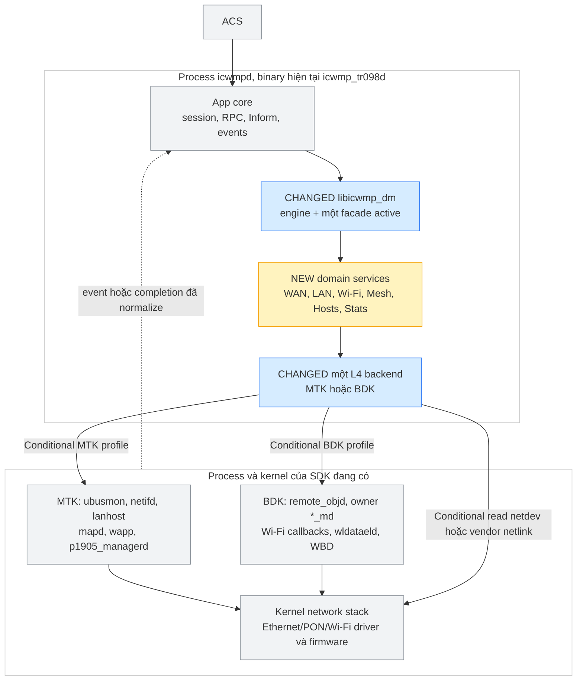
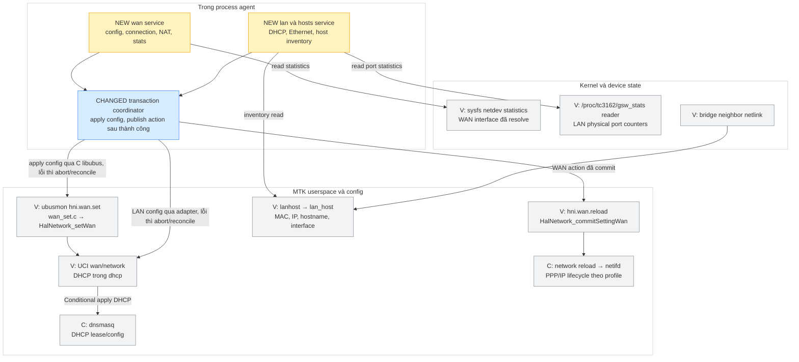
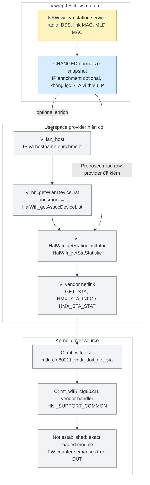
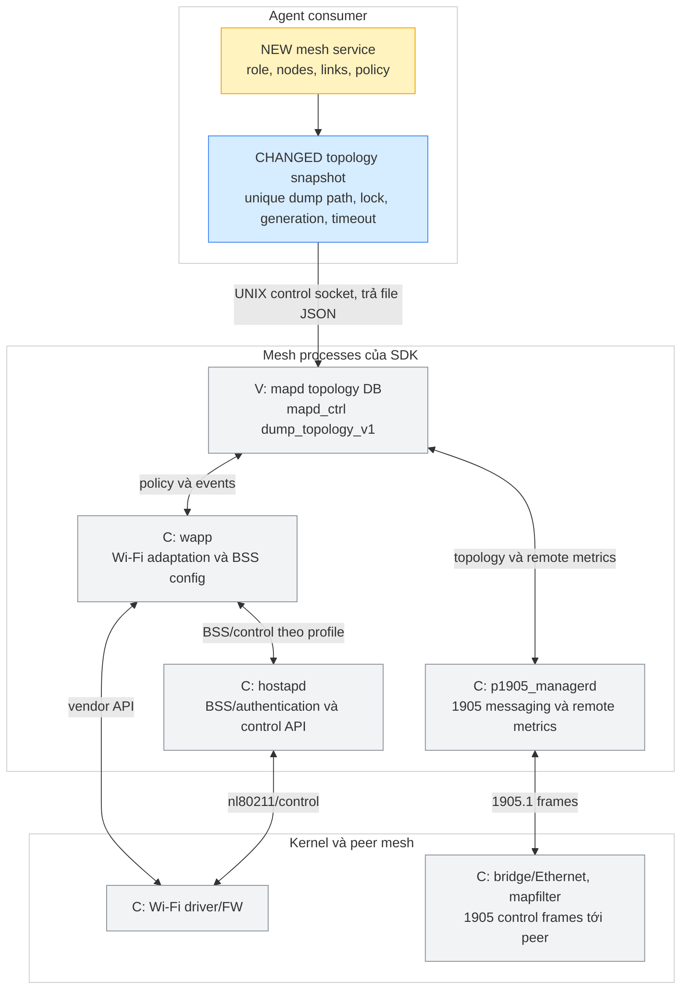
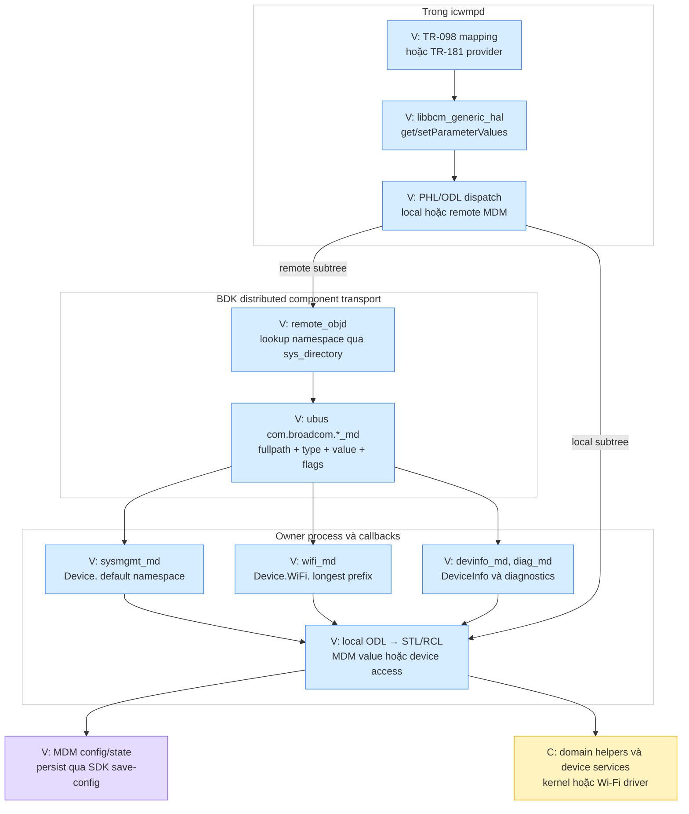
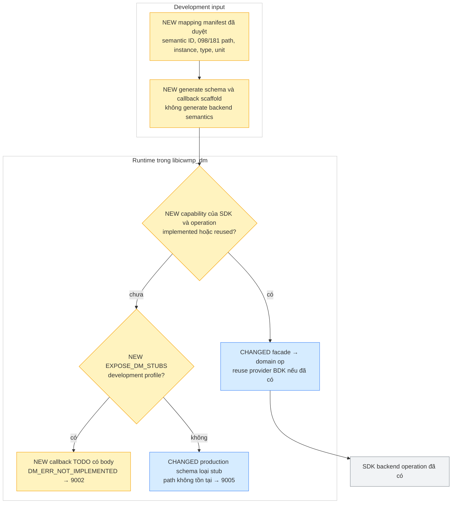

# icwmp — component, process và SDK flow cho WAN, LAN, Wi-Fi, Mesh, station và statistics

> Snapshot 23/09/2026: overlay `cd93685` đã kiểm lại khi resume, MTK `src/2025q3` HEAD
> `b207c4518`, BDK `src/bcm963xx` HEAD `7f837f5f6`, tracked worktree sạch. Delta overlay từ
> `d3c82a4` chỉ guard compat R3, không đổi boundary SDK dưới đây. Overlay chưa cài vào vendor tree.
> A1 working overlay đã đổi source thành `libicwmp_dm/src` và include namespace, ABI vẫn libtr098.
> Service contracts/domain modules trong diagram vẫn **Proposed**. A1 chưa SDK build/board.
> `Verified` = đọc caller/callee và dữ liệu tại boundary, `Conditional` = phụ thuộc profile/nhánh,
> không phải board-test. Anchor là snapshot này, tìm lại symbol khi SDK đổi.

## START HERE — flow một màn hình

**Một process agent, một thư viện DM, một backend SDK được link.** Không thêm daemon chỉ để
phân lớp. UCI/ubus/CMS là transport/storage, tên domain WAN/LAN/Wi-Fi là contract nghiệp vụ.

**Chú thích màu:** vàng = NEW, xanh = CHANGED, xám = component SDK giữ nguyên. Diagram Proposed.

Các mũi tên xuống kernel ở overview là nhóm dependency, không khẳng định mọi GPV đều gọi driver.
Config có thể trả từ store, live value có thể đi IPC/STL, telemetry có thể từ cache. Chi tiết
và giới hạn từng nhánh ở §2–5. [Design](icwmp_multiplatform_tr098_design.md#12-source-layout-đề-xuất-và-bản-đồ-di-chuyển)
giữ quyết định layout/API, [phase plan](../issues/20260922_icwmp_multiplatform_tr098/tr098_c_port_phases.md#6-kế-hoạch-thực-thi-từ-source-hiện-tại--2309)
giữ thứ tự thực thi.

## 1. Component không đồng nghĩa process

| Component | Chạy ở đâu | Trách nhiệm, status |
|---|---|---|
| `icwmpd` / `icwmp_tr098d` | Process agent | Session thread, uloop/ubus/netlink, notify thread hiện có, phải serialize DM global state |
| `libicwmp_dm` | Shared library trong agent | Source rename A1 đã có, ABI vẫn libtr098, không phải daemon |
| `services/{wan,lan,wifi,mesh,hosts,stats}` | Module C trong library | Proposed typed contract, snapshot, identity, transaction và errors |
| `sdk/mtk/backend` | Module C trong agent | Proposed adapter dùng product APIs đã kiểm, không reimplement netifd/mapd |
| `libhalunify` | Library trong caller, hiện có trong ubusmon/backend | Device operations, không phải process HAL độc lập |
| `ubusmon` | Process MTK | Owner ubus `hni`, `hni.wan`, `hni.service`; gọi HAL |
| `netifd`, `dnsmasq`, PPP helper | Process MTK theo profile | Network lifecycle, DHCP server, PPP session, không đặt chúng vào DM library |
| `lanhost` | Process MTK | Nhận neighbor event, materialize `lan_host`, cung cấp IP/hostname enrichment |
| `mapd`, `wapp`, `p1905_managerd` | Các process MTK riêng | Mesh policy/topology, Wi-Fi adaptation, IEEE 1905 messaging |
| `libbcm_generic_hal`, PHL/ODL | Library BDK trong component | Đọc/ghi MDM, dispatch local/remote, gọi STL/RCL |
| `remote_objd`, `*_md`, `bcm_msgd`, `sys_directory` | Các process BDK | Distributed MDM transport, namespace owner, message bus |
| Wi-Fi OSAL/driver, Ethernet/PON driver | Kernel, firmware ngoài process | Execute hardware operations, counters. Exact binary/runtime profile phải kiểm trên DUT |

**Khuyến nghị L4 MTK:** dùng libubus C gọi service owner đã có cho mutation WAN/service.
Read-only dùng HAL/vendor netlink khi contract rõ. Không vừa link HAL rồi ghi UCI trực tiếp,
vừa gọi ubus cho cùng một mutation mà không chỉ định một owner. Reuse `hal_unify` chọn lọc,
không coi mọi API HAL là canonical hoặc có rollback.

## 2. MTK WAN và LAN — config khác runtime, runtime khác counter

**Chú thích màu:** vàng = NEW adapter, xanh = CHANGED deferred orchestration, xám = code có sẵn.
Phần NEW/CHANGED là Proposed, nhãn V/C dưới SDK lần lượt là Verified/Conditional trên source.

Boundary đã đối chiếu:

- **Verified:** shell `wan_device` gọi `hni.wan set` với `{index,action,param,value}`;
  ubusmon đăng ký `set` → `wan_set()` → `HalNetwork_setWan()`. Helper `hni_wan_reload.sh`
  gọi `hni.wan reload` → `wan_reload()` → `HalNetwork_commitSettingWan()` → `network_reload()`
  chạy `/etc/init.d/network reload &`. Đây là mẫu boundary cho C adapter, không phải lời gọi
  generic `uci set network` thay được mọi side effect.[^wan]
- **Verified:** HAL modify có bước delete/add instance, update binding và pending events.
  Vì vậy VALUECHECK tuyệt đối không gọi mutation này. **Not established:** atomic rollback
  cho batch nhiều WAN field. A3/P4 phải prevalidate và chốt compensation/transaction contract.
- **Conditional:** OpenWrt init network start `/sbin/netifd`, DHCP init chọn dnsmasq. Chuỗi
  netifd → PPP helper → kernel/PON service cụ thể theo connection/profile cần trace tiếp
  từng mode IPoE/PPPoE/Bridge ở P4, không coi là đã verify toàn bộ tới hardware.[^netifd]
- **Verified:** counter WAN shell đọc netdev sysfs; LAN có reader GSW port. Đơn vị, reset epoch,
  HW-offload inclusion của các counter chưa đồng nhất và cần board check.[^counters]
- **Verified:** `HalGateway_getConnectedDevicesList()` đọc `lan_host`, không trực tiếp quét
  station driver. Flow neighbor → lanhost → UCI đã có trong
  [topology trace](p_cpe10_topology_trace.md#51-lan_host-inventory-local-có-ip-và-interface),
  kiểm lại getter hiện ở `hal_gateway.c:975`.

PON object/driver riêng không cần bị gọi cho mọi WAN leaf. `WANAccessType`, physical link,
IP status, PPP credentials, NAT mapping và counters là các operation khác nhau. Các chip/SDK
khác có thể trả `not_supported` cho PON trong cùng service contract.

## 3. MTK Wi-Fi, station information và statistics

### 3.1 Đường station hiện có và adapter đích

**Chú thích màu:** vàng = NEW canonical adapter, xanh = CHANGED ownership/enrichment, xám = có sẵn.
Các boundary lower có nhãn theo source, full image linkage chưa board-verify.

**Verified:** `hni.getWlanDeviceList` trả `infor[]` gồm MAC, Interface, RSSI, rate, Tx/Rx
bytes/packets/errors. Caller `lan_device:3053` đọc JSON đó. Callee ubusmon gọi
`HalWifi_getAssocDeviceList()`, hàm này lấy station list + `HalGateway` enrichment + per-STA
statistics. **Nó bỏ entry khi IP rỗng** và dùng helper chọn interface đầu tiên tồn tại để lấy
station list. Không được suy rằng API này là inventory đầy đủ mọi associated station.
Phạm vi driver trả list theo BSS/radio/toàn chip cần xác minh thêm.[^station]

**Conditional:** HAL → nl80211 vendor GET_STA và driver OSAL cùng attr HMX_STA_INFO/HMX_STA_STAT;
OSAL dispatch qua `mt_cfg80211_vndr_cmd_get_handler()`, mt_wifi7 xử lý sub-id dưới
`HNI_SUPPORT_COMMON`. Source path chứng minh cơ chế vendor API, không chứng minh tên `.ko`
và version struct thực được load. Cần đối chiếu build flags, module manifest và reply length
trước khi cho backend tin payload driver.[^station-driver]

Adapter đích phải trả raw associated station ngay cả chưa DHCP. `Hosts` mới là inventory host
có L3 enrichment. Model TR-098 `AssociatedDevice` và TR-181 `AccessPoint.AssociatedDevice`
project từ station service; `Hosts.Host` project từ host service. Không join bằng IP làm identity.
MLO giữ MLD + affiliated link identities, tránh cộng trùng counter MLD và link.

### 3.2 Config/apply Wi-Fi và Mesh không đi qua station query

- **Verified:** `HalWifi_applySetting()` gọi `/sbin/wifi reload`. Đây là action có thể làm
  rớt client, không gọi trong getter hay VALUECHECK. Proposed action queue chạy sau commit
  và deduplicate theo radio/service.[^wifi-apply]
- **Conditional:** pipeline product `wireless/mapd/1905d_cfg` → script `uci2map.lua`,
  `wifi_services.lua`, EasyMesh → wapp/p1905/mapd/hostapd theo MapMode. Dùng lại
  [flow config đã trace](wifi_config_flow/easymesh-openwrt-script-flow.md), không bỏ qua
  supervisor và tự restart riêng một daemon từ setter.
- **Verified:** HAL có BSS/radio/STA statistics vendor subcommands riêng. Shell legacy còn
  đọc `br-lan` cho một số Wi-Fi counter. Giữ compatibility của parameter đã provision bằng
  mapping profile tường minh nếu cần, không gắn counter bridge vào canonical BSS stats.[^counters]

## 4. MTK Mesh topology — process graph và nguồn dữ liệu

**Chú thích màu:** vàng = NEW consumer adapter, xanh = CHANGED snapshot handling, xám = SDK hiện có.
Liên kết mesh process lấy từ trace hiện có, runtime role/profile là Conditional.

**Verified:** HAL topology gọi mapd control client, mapd xử lý `dump_topology_v1` và ghi JSON
vào path được truyền. Legacy dùng `/tmp/dump.txt` chung. Proposed dùng path riêng cho request,
serialize refresh, last-known-good + freshness metadata, không coi dump timeout là topology
rỗng thành công. Chưa thêm daemon `hni_topologyd`: các phương án topology ở issue khác là
reference, chưa có bằng chứng đã tích hợp vào snapshot này.[^mesh]

`3rdpartyagent` và backend WebUI là **consumer ngang hàng**. Không cho agent CWMP đọc
`/tmp/P_CPE10` làm source of truth: đó là projection khác, có join/filter và synthetic fields.
Remote station/metrics đến từ topology peer có freshness khác local vendor counter. Không
đồng nhất remote mesh client với associated station trên radio local.

**Coverage:** bốn leaf `LANDevice.1.X_AIS_Mesh` trong inventory hiện nằm P2. Chúng chỉ là
MeshEnabled/HopNumber/MaximumHop/Mode, chưa phải toàn bộ graph/data-elements. Full topology
và station telemetry mới phải có inventory extension riêng, không cộng nhầm vào 749 baseline.

## 5. Broadcom BDK — giữ Distributed MDM làm backend

### 5.1 Định tuyến component chủ

**Chú thích màu:** xanh = Verified source path, vàng = Conditional/profile, tím = state,
xám = boundary chưa truy vết hết. Không có daemon DM mới.

Dùng lại [BDK request trace](../../brcm_ap_wifi7_mvn/docs/tr069_cwmp_request_flow.md) và
[icwmp runtime flow](../../brcm_ap_wifi7_mvn/docs/icwmp_bdk_runtime_flow.md). Đã đối chiếu lại
`generic_hal.c:132`, namespace `wifi_md.c:77`, `sysmgmt_md.c:75` và overlay backend/proxy.
Tên file overlay cũ `platform/bdk` trong tài liệu trước nay là `sdk/bdk`.[^bdk]

WAN/LAN/Hosts chủ yếu resolve về sysmgmt/default namespace, Wi-Fi thuộc wifi_md, nhưng
ownership cuối phải theo directory lookup, không hardcode mọi `Device.*` vào một component.
Không suy một HAL batch là atomic xuyên các owner process: trace PHL hiện chưa chứng minh
rollback component đã commit khi component kế tiếp thất bại.

### 5.2 Wi-Fi counters, station và Mesh phía dưới MDM

| Đường | Bằng chứng và giới hạn |
|---|---|
| `WiFi.Radio.Stats` → STL → `rutWifi_getRadioCounters()` | **Verified:** helper chạy `wlctl -i <if> counters/status`, parse các field, không phải mọi leaf chỉ đọc cached MDM |
| `WiFi.SSID.Stats` → STL → `rutWifi_getSSIDCounters()` | **Verified:** gọi `wlctl counters`, cần giữ scope/unit của từng field |
| `AccessPoint.AssociatedDevice` → STL → `rutWifi_getAssocDevCounters()` | **Verified:** chạy `wlctl sta_info <MAC>`, parse rate/RSSI/counters |
| `wldataeld` local telemetry | **Verified:** `lcwl_update_sta_info()` gọi `wlgetStationInfo/Stats`; các utility có wl ioctl/iovar. **Not established:** toàn bộ callback→driver implementation cho từng leaf trong lượt này |
| `wldataeld` multi-AP | **Verified:** `Collect_NFM_Multi()` gửi JSON `Cmd=dataelms, SubCmd=de_tr-181` qua TCP loopback WBD master CLI, parse rồi cache DB. **Conditional:** role, enable flag, profile, pipeline publish MDM từng leaf phải xác minh thêm |
| BDK `Device.WiFi.DataElements.*` | Provider/proxy sẵn có được reuse nếu backend/profile hỗ trợ, không dựng một bản mesh controller trong icwmp |
| Wi-Fi driver/firmware | **Not established:** exact wl module/firmware của board hiện tại và counter offload semantics, cần manifest + runtime capture |

Anchors STL/counter/collector ở [^bdk-wifi]. WAN/LAN callbacks xuống Linux/vendor driver phải
trace riêng theo parameter trước khi đánh Verified, không điền mũi tên vào driver chỉ từ tên
TR-181 object. BDK MLO extension hiện có đường NVRAM riêng trong `mlo_bdk.c`, giữ boundary này
trong extension service, không trộn vào mọi setter Wi-Fi.

## 6. Module domain đích và mapping hai facade

Các tên `.c`/API dưới đây là **Proposed**, relative `public/libs/libicwmp_dm/src/`.
`services/` giữ contract/domain orchestration, implementation MTK/BDK ở `sdk/<sdk>/backend/`.

| Module | Operation/DTO đề xuất | TR-098 | TR-181 counterpart hoặc việc còn thiếu |
|---|---|---|---|
| `services/wan.c` | enumerate connections, read status, prepare config, add/delete, stable connection key | `WANDevice.*.WANIPConnection`, `WANPPPConnection` | `IP.Interface`, `PPP.Interface`, `Ethernet.Link`, VLAN/lower-layer references, không map 1 object↔1 object |
| `services/lan.c`, `dhcp.c` | bridge/port/address config, DHCP pool/reservation | `LANHostConfigManagement`, `LANEthernetInterfaceConfig` | `DHCPv4.Server.Pool`, `StaticAddress`, `Ethernet.Interface`, `IP.Interface` |
| `services/wifi.c` | radio/BSS/AP descriptors, security/WPS operations | `WLANConfiguration`, `WPS`, keys | `WiFi.Radio`, `SSID`, `AccessPoint.Security/WPS`, enum/value converter |
| `services/station.c` | associated stations, link/MLD identity, association epoch | `WLANConfiguration.AssociatedDevice` | `WiFi.AccessPoint.AssociatedDevice` và stats, link/MLD extension cần schema pin |
| `services/hosts.c` | local L2/L3 inventory, optional DHCP/IP enrich | `Hosts.Host` | `Hosts.Host`, không dùng IP làm primary identity |
| `services/mesh.c` | role, topology graph, nodes/BSS/link/remote station, policies | Bốn leaf `X_AIS_Mesh` đã có, extension mới cần inventory | DataElements phần BDK đã có dùng lại, policy không có counterpart chuẩn để mapping_todo/vendor extension |
| `services/stats.c` | typed counter snapshot theo scope, width, unit, epoch, validity | WAN/LAN/WLAN Stats và station metrics | Các `.Stats` tương ứng, không đổi direction Tx/Rx theo tên gần giống |
| `services/identity.c`, `agent_config.c`, `time.c` | P1 hiện có, shared state owner và deferred actions | DeviceInfo/ManagementServer/Time | Reuse BDK + common implementation, MTK tạo bindings/callbacks cần thiết |
| `services/diagnostics.c` | start/cancel/result, completion event, correlation ID | IPPing/TraceRoute/TR-143 | BDK existing mapping/event reuse, phần thiếu có stub, không báo DiagnosticsComplete giả |

Canonical structs cần dùng integer đủ rộng, signed RSSI, enum rõ, string ownership theo request
arena, `valid_mask`, `source`, timestamp, generation/reset epoch. Counter zero hợp lệ khác với
không đọc được. Rate phải phân biệt PHY negotiated rate với throughput đo từ delta byte/time.
Bản đồ TR-098→TR-181 lấy từ [matrix BDK hiện có](../../brcm_ap_wifi7_mvn/docs/icwmp_tr098_bdk_mapping_matrix.md)
và schema pin, không coi mọi extension AIS có sẵn counterpart chuẩn.

Ví dụ `WLANConfiguration.Channel` cần radio key, `SSID` cần BSS key, `BeaconType` cần security
conversion, `AssociatedDevice` cần station key. Bốn leaf trong một TR-098 subtree có thể đi
bốn provider operation, không dùng chung một phép thay chuỗi root.

## 7. TR-181 reuse/stub và error flow

**Chú thích màu:** vàng = NEW descriptor/callback/capability, xanh = CHANGED dispatch, xám = backend giữ lại.
Tất cả NEW/CHANGED là Proposed.

Callback TODO phải compile/link được, có test chứng minh dispatcher gọi tới body và trả lỗi
đúng, không mutate backend. Không phải chỉ khai prototype rồi để unresolved symbol. Nếu chưa
biết path/counterpart (`mapping_todo`), chỉ có manifest record, **chưa generate param công khai**.
TR-181 hiện chạy trên BDK không bị che bởi TODO cho cùng semantic ID ở MTK.

Schema/handler TR-181 scaffold chưa đủ để mở ACS session TR-181: phải có identity, root,
ManagementServer, Inform, capabilities và notify policy tối thiểu. Trước gate đó kiểm qua
harness/CLI development, production MTK vẫn TR-098. Không đánh dấu toàn bộ TR-181 supported
vì registry có root `Device.`.

## 8. Phạm vi chưa chứng minh và acceptance

- A1 đã rename source/include và đồng bộ build/install, static PASS. Chưa SDK build/board,
  chưa tạo domain implementation A2–A6.
- Các diagram Proposed không mô tả code đã tồn tại. Source lower verified là dependency có thể
  reuse, cần runtime test profile thực tế để chốt behavior.
- Exact driver/FW ABI, PON/Ethernet offload counter semantics, cache freshness remote mesh và
  batch rollback qua nhiều owner vẫn cần dữ liệu SDK/board trong phase domain.
- Re-run inventory trên MTK `b207c4518`: **749 param/181 object, 930 dòng giống bảng hiện có**.
  Đây là inventory tĩnh của script extractor, không phải test mọi runtime condition.
- Gate mỗi domain: TR-098 tên/type/access/value/fault/side-effect, stable instance, stats scope,
  app/WebUI concurrency, callback TODO không success giả, BDK existing behavior không regression.

## Source anchors đã đối chiếu

[^wan]: MTK [cwmpclient/ext/openwrt/scripts/functions/tr098/wan_device:438](../src/2025q3/tclinux_phoenix/apps/hni/cwmpclient/ext/openwrt/scripts/functions/tr098/wan_device:438), [ubusmon/wan/wan.c:15](../src/2025q3/tclinux_phoenix/apps/hni/ubusmon/wan/wan.c:15), [ubusmon/wan/wan_set.c:209](../src/2025q3/tclinux_phoenix/apps/hni/ubusmon/wan/wan_set.c:209), [ubusmon/wan/wan_reload.c:11](../src/2025q3/tclinux_phoenix/apps/hni/ubusmon/wan/wan_reload.c:11), [hal_unify/src/hal_network.c:5131](../src/2025q3/tclinux_phoenix/apps/hni/hal_unify/src/hal_network.c:5131), [hal_unify/src/hal_network.c:5246](../src/2025q3/tclinux_phoenix/apps/hni/hal_unify/src/hal_network.c:5246), [hal_unify/src/hal_network.c:337](../src/2025q3/tclinux_phoenix/apps/hni/hal_unify/src/hal_network.c:337). Symbols: wan_modify, HalNetwork_setWan, HalNetwork_commitSettingWan, network_reload.
[^netifd]: MTK [package/network/config/netifd/files/etc/init.d/network:56](../src/2025q3/openwrt-21.02/openwrt-21.02.1_dev/package/network/config/netifd/files/etc/init.d/network:56), [package/network/services/dnsmasq/files/dnsmasq.init:7](../src/2025q3/openwrt-21.02/openwrt-21.02.1_dev/package/network/services/dnsmasq/files/dnsmasq.init:7).
[^counters]: MTK [cwmpclient/ext/openwrt/scripts/functions/tr098/wan_device:3166](../src/2025q3/tclinux_phoenix/apps/hni/cwmpclient/ext/openwrt/scripts/functions/tr098/wan_device:3166), [cwmpclient/ext/openwrt/scripts/functions/tr098/lan_device:174](../src/2025q3/tclinux_phoenix/apps/hni/cwmpclient/ext/openwrt/scripts/functions/tr098/lan_device:174), [cwmpclient/ext/openwrt/scripts/functions/tr098/lan_device:4314](../src/2025q3/tclinux_phoenix/apps/hni/cwmpclient/ext/openwrt/scripts/functions/tr098/lan_device:4314), [hal_unify/src/hal_wifi.c:4420](../src/2025q3/tclinux_phoenix/apps/hni/hal_unify/src/hal_wifi.c:4420), [hal_unify/src/hal_wifi.c:4498](../src/2025q3/tclinux_phoenix/apps/hni/hal_unify/src/hal_wifi.c:4498), [hal_unify/src/hal_wifi.c:4809](../src/2025q3/tclinux_phoenix/apps/hni/hal_unify/src/hal_wifi.c:4809). Lần lượt WAN sysfs, wlan_prepare_br_lan_stats_cache, LANEthernet_Stats_build_all_cache, BSS/radio/STA counters.
[^station]: MTK [ubusmon/ubus.c:532](../src/2025q3/tclinux_phoenix/apps/hni/ubusmon/ubus.c:532), [ubusmon/ubus.c:1123](../src/2025q3/tclinux_phoenix/apps/hni/ubusmon/ubus.c:1123), [hal_unify/src/hal_wifi.c:3935](../src/2025q3/tclinux_phoenix/apps/hni/hal_unify/src/hal_wifi.c:3935), [hal_unify/src/hal_wifi.c:4809](../src/2025q3/tclinux_phoenix/apps/hni/hal_unify/src/hal_wifi.c:4809), [hal_unify/src/hal_wifi.c:4894](../src/2025q3/tclinux_phoenix/apps/hni/hal_unify/src/hal_wifi.c:4894), [hal_unify/src/hal_wifi.c:4917](../src/2025q3/tclinux_phoenix/apps/hni/hal_unify/src/hal_wifi.c:4917), [hal_unify/src/hal_gateway.c:975](../src/2025q3/tclinux_phoenix/apps/hni/hal_unify/src/hal_gateway.c:975), [cwmpclient/ext/openwrt/scripts/functions/tr098/lan_device:3053](../src/2025q3/tclinux_phoenix/apps/hni/cwmpclient/ext/openwrt/scripts/functions/tr098/lan_device:3053). Symbols: HalWifi_getAssocDeviceList, HalWifi_getStationListInfor, HalWiFi_GetStaInfoList, HalGateway_getConnectedDevicesList.
[^station-driver]: MTK [hal_unify/src/hal_wifi.c:4333](../src/2025q3/tclinux_phoenix/apps/hni/hal_unify/src/hal_wifi.c:4333), [mtk/mt_wifi_osal/wifi_osal/mt_osal_cfg80211_vndr.c:7272](../src/2025q3/tclinux_phoenix/apps/hni/mtk/mt_wifi_osal/wifi_osal/mt_osal_cfg80211_vndr.c:7272), [mtk/mt_wifi7/mt_wifi/os/linux/cfg80211/cfg80211_vndr_cmm.c:6806](../src/2025q3/tclinux_phoenix/apps/hni/mtk/mt_wifi7/mt_wifi/os/linux/cfg80211/cfg80211_vndr_cmm.c:6806). Full runtime dispatch/loaded binary là Conditional.
[^wifi-apply]: [hal_unify/src/hal_wifi.c:3000](../src/2025q3/tclinux_phoenix/apps/hni/hal_unify/src/hal_wifi.c:3000) (HalWifi_applySetting), gọi /sbin/wifi reload tại dòng 3005.
[^mesh]: MTK [hal_unify/src/hal_mesh.c:499](../src/2025q3/tclinux_phoenix/apps/hni/hal_unify/src/hal_mesh.c:499), [mtk/mapd/mapd_interface/mapd_interface_ctrl.c:258](../src/2025q3/tclinux_phoenix/apps/hni/mtk/mapd/mapd_interface/mapd_interface_ctrl.c:258), [mtk/mapd/mapd_interface/ctrl_iface.c:1153](../src/2025q3/tclinux_phoenix/apps/hni/mtk/mapd/mapd_interface/ctrl_iface.c:1153), [mtk/mapd/src/topologySrv/topologySrv.c:4535](../src/2025q3/tclinux_phoenix/apps/hni/mtk/mapd/src/topologySrv/topologySrv.c:4535). HalMesh_getTopologyLength → dump_topology_v1. Rủi ro shared dump ở [topology trace](p_cpe10_topology_trace.md#52-mapd-topology-easymesh-live-được-chuyển-qua-file), process graph ở [EasyMesh architecture](easymesh-map-architecture.md).
[^bdk]: BDK [packages/common/mgmt/bcm_generic_hal/generic_hal.c:132](../../brcm_ap_wifi7_mvn/src/bcm963xx/packages/common/mgmt/bcm_generic_hal/generic_hal.c:132), [packages/common/mgmt/cms_core/phl.c:1560](../../brcm_ap_wifi7_mvn/src/bcm963xx/packages/common/mgmt/cms_core/phl.c:1560), [userspace/private/apps/remote_objd/remote_zbus.c:239](../../brcm_ap_wifi7_mvn/src/bcm963xx/userspace/private/apps/remote_objd/remote_zbus.c:239), [userspace/private/apps/wifi_md/wifi_md.c:77](../../brcm_ap_wifi7_mvn/src/bcm963xx/userspace/private/apps/wifi_md/wifi_md.c:77), [userspace/private/apps/sysmgmt_md/sysmgmt_md.c:75](../../brcm_ap_wifi7_mvn/src/bcm963xx/userspace/private/apps/sysmgmt_md/sysmgmt_md.c:75). Full caller/callee/message trong [CWMP request flow](../../brcm_ap_wifi7_mvn/docs/tr069_cwmp_request_flow.md).
[^bdk-wifi]: BDK [userspace/private/libs/mdm_cbk_wifi/stl2_unfwifi.c:259](../../brcm_ap_wifi7_mvn/src/bcm963xx/userspace/private/libs/mdm_cbk_wifi/stl2_unfwifi.c:259), [userspace/private/libs/mdm_cbk_wifi/stl2_unfwifi.c:454](../../brcm_ap_wifi7_mvn/src/bcm963xx/userspace/private/libs/mdm_cbk_wifi/stl2_unfwifi.c:454), [userspace/private/libs/mdm_cbk_wifi/stl2_unfwifi.c:529](../../brcm_ap_wifi7_mvn/src/bcm963xx/userspace/private/libs/mdm_cbk_wifi/stl2_unfwifi.c:529), [userspace/private/libs/mdm_cbk_wifi/rut2_wifi.c:309](../../brcm_ap_wifi7_mvn/src/bcm963xx/userspace/private/libs/mdm_cbk_wifi/rut2_wifi.c:309), [userspace/private/libs/mdm_cbk_wifi/rut2_wifi.c:349](../../brcm_ap_wifi7_mvn/src/bcm963xx/userspace/private/libs/mdm_cbk_wifi/rut2_wifi.c:349), [userspace/private/libs/mdm_cbk_wifi/rut2_wifi.c:417](../../brcm_ap_wifi7_mvn/src/bcm963xx/userspace/private/libs/mdm_cbk_wifi/rut2_wifi.c:417), [userspace/private/apps/wlan/wldataeld/local_wl_util.c:1904](../../brcm_ap_wifi7_mvn/src/bcm963xx/userspace/private/apps/wlan/wldataeld/local_wl_util.c:1904), [userspace/private/apps/wlan/wldataeld/collection.c:153](../../brcm_ap_wifi7_mvn/src/bcm963xx/userspace/private/apps/wlan/wldataeld/collection.c:153), [userspace/private/apps/wlan/wldataeld/collection.c:191](../../brcm_ap_wifi7_mvn/src/bcm963xx/userspace/private/apps/wlan/wldataeld/collection.c:191). Symbols: rutWifi_getRadioCounters/getSSIDCounters/getAssocDevCounters, lcwl_update_sta_info, get_wbd_master_dataelms_data, Collect_NFM_Multi.
