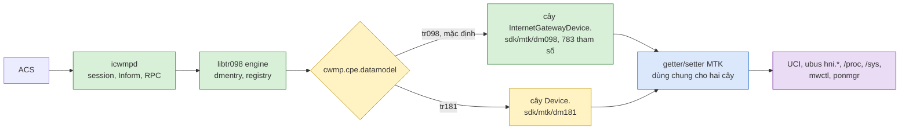

# TR-181 trên MTK: thiết kế và kế hoạch (branch `dev_181`)

Phạm vi: thêm data model TR-181 (`Device.`) cho icwmp trên MTK/Airoha 2025Q3 (HP2236B), bên cạnh TR-098 đã giao ở
`release/mtk-20261008`. Branch `dev_181` tách từ `dev` tại `dc3d7f7` (08/10/2026).

## START HERE — một màn hình

Chú thích màu: xanh lá = có sẵn, dùng chung, vàng = mới cho TR-181, xanh dương = backend dùng chung (không viết lại),
tím = kho dữ liệu của sản phẩm.

## Quyết định đã chốt

| Ngày | Ai | Quyết định |
|---|---|---|
| 08/10 | user (chatlog 89) | TR-098 bản giao là đủ khi phần tham số/xử lý là C. Chẩn đoán và script hành động giữ shell. Làm TR-181 trên branch mới `dev_181` |
| 08/10 | user (chatlog 90) | Phạm vi: **trước hết TR-181 tương đương TR-098** (783 tham số). Sau đó tham khảo TR-181 của BDK (`projects/brcm_ap_wifi7_mvn/src/bcm963xx`, issue 20260914, 20260916) và **chỉ thêm tham số cần và được dùng**, không làm tất cả |
| 09/10 | user (chatlog 97) | `LowerLayers` và các tham số TR-181 **làm đúng chuẩn**. Tham số đến từ TR-098 mà không dùng hoặc không đúng chuẩn thì **bỏ khỏi cây TR-181, hoặc thay bằng tham số chuẩn tương đương**. Chưa có dữ liệu nhà mạng: làm một bản hỗ trợ theo chuẩn, cập nhật theo yêu cầu thực tế sau. Tạo kết nối IPoE qua TR-181: để sau |

## Nguyên tắc

1. **Một backend.** Không viết lại logic đọc/ghi sản phẩm. Bảng TR-181 của một domain nằm ngay trong file backend
   của domain đó (`sdk/mtk/dm098/<domain>_mtk.c`), cạnh bảng TR-098. Getter/setter vẫn `static`, một bản cho cả hai
   model. Phần riêng TR-181 chỉ là bảng DMOBJ/DMLEAF, cách đánh instance và phần dịch ngữ nghĩa (ví dụ `LocalTimeZone`
   của TR-181 là chuỗi POSIX). `sdk/mtk/dm181/` chỉ chứa gốc `Device.` (`root181_mtk.c`).
2. **Chọn model lúc chạy** bằng `cwmp.cpe.datamodel` (`tr098` mặc định, `tr181`), giống BDK. Mỗi lúc chỉ một model.
   Build không có module TR-181 thì giữ TR-098 và ghi lỗi vào log, không im lặng.
3. **Tên, kiểu, quyền ghi theo chuẩn BBF.** Từ 09/10, nguồn chuẩn là XML của Broadband Forum (TR-181 2.19.1,
   TR-135 1.4.1 STBService, TR-140 1.3.1 StorageService), đọc lúc chạy, không chép vào repo. Kiểm bằng
   `docs/issue/tr181-bbf-check.py <bbf-dir> <gpn.json> <gpv.json>`: tên không chuẩn, quyền ghi lệch, tên đã bị
   xoá/lỗi thời, kiểu lệch. `tr181-schema.py` (bảng tra BDK) chỉ còn để đối chiếu BDK.
4. **Bằng chứng tương đương.** Mỗi cặp TR-098 ↔ TR-181 trong bảng ánh xạ phải đọc ra cùng giá trị trên cùng board,
   vì chúng đi qua cùng một getter. Test board mới: dump cả hai model, so từng cặp.
5. **Extension của nhà mạng.** `X_AIS_*` giữ nguyên tên lá, đặt dưới `Device.` ở vị trí tương ứng.

## Nguồn tham chiếu

| Nguồn | Dùng để |
|---|---|
| `docs/issue/tr098_coverage_matrix.tsv` (783 tham số, 184 object) | danh sách đích "tương đương TR-098" |
| BDK `projects/brcm_ap_wifi7_mvn/docs/icwmp_tr098_bdk_mapping_matrix.md` | ánh xạ ngữ nghĩa TR-098 ↔ TR-181 đã làm cho BDK (LAN, DHCP, WAN, WiFi, hệ thống) |
| BDK `src/bcm963xx/data-model/cms-dm-tr181-*.xml` qua `tr181-schema.py` | tên, kiểu, RW chuẩn (512 object, 4206 tham số) |
| easycwmp `functions/tr181` của sản phẩm (upstream PIVA, 297 tham số, không build, không theo schema HNI) | chỉ để tham khảo tên |
| BDK issue 20260914, 20260916 | sau phase tương đương: tham số TR-181 nào ACS thật sự dùng |

## Ánh xạ object (đề xuất; chốt từng domain khi làm)

Loại: **A** = cùng ngữ nghĩa, chỉ đổi root (dùng lại bảng/getter); **B** = dựng lại theo cấu trúc TR-181 (dùng lại
getter); **C** = extension `X_AIS_*`/sản phẩm; **D** = không áp dụng cho TR-181.

### Hệ thống

| TR-098 (`InternetGatewayDevice.`) | TR-181 (`Device.`) | Loại | Ghi chú |
|---|---|---|---|
| (root) `DeviceSummary`, `LANDeviceNumberOfEntries`, `WANDeviceNumberOfEntries` | `RootDataModelVersion`, `InterfaceStackNumberOfEntries` | B/D | Inform TR-181 dùng `RootDataModelVersion` |
| `DeviceInfo.` + `MemoryStatus`, `ProcessStatus.Process`, `TemperatureStatus.TemperatureSensor`, `X_AIS*` | `DeviceInfo.` cùng object con | A | bỏ lá chỉ có ở TR-098 (`SpecVersion`, `ModemFirmwareVersion`, `EnabledOptions`, `DeviceLog`) |
| `ManagementServer.` | `ManagementServer.` | A | gần như trùng tên lá |
| `Time.` | `Time.` | A/B | `LocalTimeZone` TR-181 = chuỗi POSIX (TR-098 `LocalTimeZoneName`); `LocalTimeZone` kiểu offset của TR-098 không có |
| `UserInterface.` (+`CarrierLocking`, `X_AIS_WebUserInfo`) | `UserInterface.` | A/C | |
| `User.` | `Users.User.{i}` | B | |
| `Account.`, `Account.Web.` (sản phẩm, không prefix) | `Device.Account.` (giữ tên, T1) | C | ACS đang biết tên này |
| `XMPP.Connection.{i}.Server.{i}` | `XMPP.Connection.{i}.Server.{i}` | A | |
| `BulkData.Profile` | `BulkData.Profile` | A | |
| `FaultMgmt.CurrentAlarm` | `FaultMgmt.CurrentAlarm` | A | |
| `SoftwareModules.DeploymentUnit` | `SoftwareModules.DeploymentUnit` | A | |
| `Services.STBService`, `Services.StorageService` | như cũ | A | |
| `CaptivePortal.`, `FAP.GPS` | như cũ | A | |
| `USBHosts.Host` | `USB.USBHosts.Host` | A | khác vị trí cha |
| `LTE.` | `Cellular.` | B | chốt khi làm |
| `DOCSIS.*` | không có trong TR-181 | D | sản phẩm chỉ có giá trị tĩnh |
| `X_AIS_*` ở root (3rdAgent, AutoWifiScan, Conf, CPEagent, DDNS, DHCPClient, DnsLandingPage, Isolation, Logging, MeshAPI, MLO, SSH, Telnet, UplinkSetup, UPnP, WiFiStatus) | `Device.X_AIS_*` cùng tên | C | |

### LAN

| TR-098 | TR-181 | Loại |
|---|---|---|
| `LANDevice.{i}.LANHostConfigManagement.` (DHCP server) | `DHCPv4.Server.Pool.{i}` | B |
| `LANHostConfigManagement.DHCPStaticAddress.{i}`, `DHCPOption.{i}` | `DHCPv4.Server.Pool.{i}.StaticAddress.{i}`, `Option.{i}` | B |
| `LANHostConfigManagement.IPInterface.1` | `IP.Interface.{lan}.IPv4Address.{i}` | B |
| `LANEthernetInterfaceConfig.{i}` (+`Stats`) | `Ethernet.Interface.{i}` (`Upstream=false`) (+`Stats`) | B |
| `Hosts.Host.{i}` | `Hosts.Host.{i}` | B |
| `Layer2Bridging.Bridge`, `AvailableInterface` | `Bridging.Bridge.{i}.Port.{i}` | B |

### Wi-Fi

| TR-098 | TR-181 | Loại |
|---|---|---|
| `LANDevice.{i}.WLANConfiguration.{i}` | `WiFi.Radio.{r}`, `WiFi.SSID.{i}`, `WiFi.AccessPoint.{i}` | B |
| `WLANConfiguration.{i}.WEPKey`, `PreSharedKey`, `WPS` | `AccessPoint.{i}.Security`, `AccessPoint.{i}.WPS` | B |
| `WLANConfiguration.{i}.AssociatedDevice.{i}` (+`Stats`) | `AccessPoint.{i}.AssociatedDevice.{i}` (+`Stats`) | B |
| `WLANConfiguration.{i}.Stats` | `SSID.{i}.Stats` | B |
| `LANDevice.{i}.X-AIS_2-4GHzTransmitPower`, `X-AIS_5GHzTransmitPower` | `WiFi.Radio.{r}.TransmitPower` | B |
| `LANDevice.{i}.X_AIS_Mesh` | `Device.WiFi.X_AIS_Mesh` | C |
| `WiFi.NeighboringWiFiDiagnostic` | `WiFi.NeighboringWiFiDiagnostic` | A |

### WAN

| TR-098 | TR-181 | Loại |
|---|---|---|
| `WANDevice.{i}.WANCommonInterfaceConfig`, `WANEthernetInterfaceConfig` (+`Stats`) | `Ethernet.Interface.{u}` (`Upstream=true`) / `Optical.Interface` (GPON), `IP.Interface.{w}.Stats` | B |
| `WANConnectionDevice.{i}.WANIPConnection.{i}` (+`Stats`) | `IP.Interface.{w}` + `IPv4Address` + `DHCPv4.Client` + `NAT.InterfaceSetting` + `Routing.Router.1.IPv4Forwarding` + `DNS.Client.Server` + `Ethernet.VLANTermination` | B |
| `WANPPPConnection.{i}` (+`Stats`) | `PPP.Interface.{p}` (+`IPCP`, `PPPoE`, `Stats`) + `IP.Interface` trên nó | B |
| `WANIPConnection`/`WANPPPConnection.{i}.X_AIS_IPv6` (+`Pd`) | `IP.Interface.{w}.IPv6Address`/`IPv6Prefix`, `DHCPv6.Client` | B |
| `…PortMapping.{i}` | `NAT.PortMapping.{i}` (`Interface`) | B |
| `Layer3Forwarding.Forwarding.{i}` | `Routing.Router.1.IPv4Forwarding.{i}` | B |
| `WANDSLLinkConfig` | không áp dụng (GPON) | D |
| `InternetGatewayDevice.Device.{IP,PPP,DHCPv6,DynamicDNS,RouterAdvertisement}.*` (102 tham số đã viết theo TR-181) | `Device.` cùng tên | A, gộp với IP/PPP dựng ở trên |

### Chẩn đoán và firewall

| TR-098 | TR-181 | Loại |
|---|---|---|
| `IPPingDiagnostics` | `IP.Diagnostics.IPPing` | B |
| `TraceRouteDiagnostics` (+`RouteHops`) | `IP.Diagnostics.TraceRoute` (+`RouteHops`) | B |
| `DownloadDiagnostics`, `UploadDiagnostics` | `IP.Diagnostics.DownloadDiagnostics`, `UploadDiagnostics` | B |
| `NSLookupDiagnostics` (+`Result`) | `DNS.Diagnostics.NSLookupDiagnostics` (+`Result`) | B |
| `DNSDiagnostics` (sản phẩm) | chốt khi làm | C |
| `SelfTestDiagnostics` | `SelfTestDiagnostics` | A |
| `Firewall.X_AIS_*` | `Firewall.X_AIS_*` | C |

## Instance và tham chiếu

- Instance TR-181 của `IP.Interface`, `Ethernet.Interface`, `WiFi.Radio/SSID/AccessPoint`, `PPP.Interface`,
  `NAT.PortMapping` lưu bằng option UCI riêng của TR-181, không dùng lại số của TR-098, để hai model không ghi đè
  nhau.
- Tham chiếu (`Interface`, `LowerLayers`, `Layer1Interface`…) luôn là path TR-181 (`Device.IP.Interface.2`).
- `Alias`: chỉ làm khi ACS dùng (`AliasBasedAddressing` = false như hiện tại).

## Inform ở TR-181

Forced-inform: `Device.RootDataModelVersion`, `Device.DeviceInfo.HardwareVersion`, `SoftwareVersion`,
`ProvisioningCode`, `Device.ManagementServer.ParameterKey`, `ConnectionRequestURL`, cộng địa chỉ IP WAN chính (chốt ở
phase WAN). DeviceId (OUI, ProductClass, SerialNumber, Manufacturer) không đổi giữa hai model.

## Các phase

| Phase | Nội dung | Xong khi |
|---|---|---|
| T0 Nền — **xong** (`tr181-0001`, analysis §67) | chọn model trên MTK (`cwmp.cpe.datamodel`), root `Device.` + `RootDataModelVersion`, thư mục `sdk/mtk/dm181`, công cụ `tr181-schema.py`, test host `run.sh tr181` | đổi model bằng UCI + reload, GPN `Device.` chạy, Inform có `Device.*`, TR-098 không đổi (`run.sh all` PASS) |
| T1 Hệ thống (loại A) — **xong trên host** (`tr181-0002`, analysis §67) | DeviceInfo, ManagementServer, Time, UserInterface, Users, XMPP, BulkData, FaultMgmt, SoftwareModules, Services, CaptivePortal, FAP, USB, `X_AIS_*` ở root, nhánh `Device.*` của sản phẩm (IP, PPP, DHCPv6, DynamicDNS, RouterAdvertisement, TraceRoute) | `tr181-map.py check` thiếu 0; `run.sh tr181`: 306 cặp bằng, 0 tên TR-181 thiếu cặp |
| T2 LAN — **xong trên host** (`tr181-0003`, analysis §68) | DHCPv4.Server.Pool.1, IP.Interface LAN IPv4Address.1, Ethernet.Interface 1..4 (+Stats), Hosts.Host; Bridging: sản phẩm không có tham số (D) | `check` thiếu 0; `run.sh tr181`: 482 cặp bằng + 2 bằng theo tham chiếu, ghi qua tên TR-181 vào đúng option |
| T3 Wi-Fi — **xong trên host** (`tr181-0005`, analysis §69) | WiFi.Radio 1..2, SSID/AccessPoint 1..12 (số của WLANConfiguration), Security.ModeEnabled, WPS, AssociatedDevice (+Stats), `WiFi.X_AIS_Mesh`, `WiFi.X-AIS_*` | `check` thiếu 0; `run.sh tr181`: 884 cặp bằng, ghi qua tên TR-181 vào đúng option |
| T4 WAN | T4a **xong trên host** (`tr181-0006`, §70): cổng WAN `Ethernet.Interface.5`, `Optical.Interface.1`, `Routing.Router.1.IPv4Forwarding`. T4b **xong trên host** (`tr181-0007`, §71): kết nối → IP.Interface, IPv4Address, DHCPv4.Client, NAT.InterfaceSetting, DNS.Client.Server, route mặc định, PPP.Interface. T4c + T4d **xong trên host** (`tr181-0008`, §72): `X_AIS_*`/`X_AIS_IPv6`/ServiceList trên IP.Interface, `NAT.PortMapping` (+Add/Delete). Add/Delete kết nối: `PPP.Interface` AddObject (T1) tạo `wan.@entry` PPPoE; **IPoE chưa tương đương**: `IP.Interface` AddObject của sản phẩm chỉ tạo section `network`, không gọi `hni.wan add` như `WANIPConnection` AddObject (T7) | như trên + `hni.wan` thật trên board |
| T5 Chẩn đoán, firewall — **xong trên host** (`tr181-0009`, analysis §73) | IP.Diagnostics.IPPing/TraceRoute/Download/Upload, DNS.Diagnostics.NSLookupDiagnostics, `Device.DNSDiagnostics`, `Device.Firewall` (path interface → tham chiếu), `Device.LTE` | `check` thiếu 0; `run.sh tr181`: 1224 cặp bằng, không còn phase chờ |
| T6 Board — **xong** (`tr181-0010`, analysis §74) | so cặp TR-098 ↔ TR-181 trên board (`tests/board/tr181_window.sh`, ACS bị chặn suốt cửa sổ), phiên ACS thật ở chế độ `tr181` | 0 cặp lệch không giải thích được: đạt trên board (1272 bằng, 0 tên thiếu cặp, TR-098 parity với shell PASS); phiên GenieACS chế độ `tr181` success, 0 fault |
| T7 Theo BDK — **đang làm**: `tr181-0011` (§77: `AddressingType` PPP = `IPCP`, `Radio.Channel`/`AutoChannelEnable` theo TR-181), `tr181-0012` (§78: `Interface` của TraceRoute/Download/Upload/NSLookup là tham chiếu, tên thiết bị vẫn nhận); cả hai đạt trên board; `LowerLayers` chờ quyết định | tham số TR-181 mà ACS dùng trên BDK nhưng chưa có ở đây (không làm tất cả) | danh sách chốt với user |

## Công cụ

| Công cụ | Làm gì |
|---|---|
| `docs/issue/tr181_mapping.tsv` | quy tắc TR-098 → TR-181 (prefix/leaf/new), loại A/B/C/D, phase chờ |
| `docs/issue/tr181-map.py check` | mọi tên A/B/C mong đợi có trong cây C, mọi tên cây C có quy tắc |
| `docs/issue/tr181-map.py equiv <tr098.json> <tr181.json>` | giá trị từng cặp trên hai bản dump thật (host `run.sh tr181`, board sau) |
| `docs/issue/tr181-schema.py <bcm963xx>/data-model --check <file>` | tên có trong TR-181 chuẩn (bảng tra BDK); tên BBF mà XML Broadcom không có thì xét tay |
| `docs/issue/verify-dm-paths.py --model tr181 --dump` | cây TR-181 build khai báo |
| `docs/issue/tr181-bbf-check.py <bbf-dir> <gpn.json> <gpv.json>` | đối chiếu dump TR-181 với XML BBF (TR-181 2.19.1, TR-135, TR-140, đọc lúc chạy): tên không chuẩn, quyền ghi, kiểu, tên đã xoá |
| `tests/board/tr181_window.sh` (chạy trên board) | dump TR-098 rồi TR-181 của cùng board, ACS bị chặn suốt lúc ở `tr181`, trả model và trạng thái agent trước khi mở ACS (T6) |

Số phủ sau T5 (hết phần tương đương TR-098): nguồn TR-098 (ma trận + tên chỉ có ở C, 800 tên) theo loại: A 458, B 34, C 218,
D 90, không còn mục chờ. Tên TR-181 trong cây C: 651.

## T4b–T4d: đề xuất (08/10, user đồng ý ở chatlog 92; T4b đã làm, điều chỉnh ở analysis §71)

Mỗi kết nối WAN (`WANIPConnection.{id+1}`/`WANPPPConnection.{id+1}`, `wan.@entry` có `id`) neo vào `Device.IP.Interface`
của section `network.if<id>` (bridge: `if_wanbr<id>`), đánh số bằng `ip_int_instance` như từ T1. Hướng theo ma trận BDK.

| TR-098 | TR-181 đề xuất | Ghi chú |
|---|---|---|
| `ExternalIPAddress`, `SubnetMask`, `AddressingType` | `IP.Interface.{n}.IPv4Address.1.` | mở rộng browse `IPv4Address` của T2 sang WAN |
| `NATEnabled` | `NAT.InterfaceSetting.{id+1}.Enable` (+`Interface`) | số theo kết nối, không trùng giữa IP và PPP vì `id` duy nhất |
| `DNSServers` | `DNS.Client.Server.{k}` mỗi địa chỉ một instance (+`Interface`, `Type`) | TR-181 `DNSServer` là một địa chỉ; loại B |
| `DefaultGateway` | `Routing.Router.1.IPv4Forwarding.{64+id+1}` (`StaticRoute` false, `Origin`) | **đã chỉnh:** số cố định ngoài dải route tĩnh, không trượt khi thêm/xoá route tĩnh |
| `Enable`, `ConnectionStatus`, `Alias`, `Stats.*`, `MaxMTUSize` | lá của `IP.Interface.{n}` | `Enable` TR-098 đọc `wan.@entry.active`, TR-181 đọc `network.<sec>.auto`: kiểm trên board |
| `Username`, `Password`, `MaxMRUSize`, `CurrentMRUSize`, `RemoteIPAddress`… (PPP) | `PPP.Interface.{p}` (đã có từ T1) + `IPCP` | |
| `X_AIS_*` (VLAN, IPMode, DefaultRoute, LanInterface, ServiceList, `X_AIS_IPv6.*`) | `IP.Interface.{n}.X_AIS_*`, cùng tên lá (nguyên tắc 5) | rỗng ở instance không phải WAN |
| `PortMapping.{j}` | `NAT.PortMapping.{k}` (+`Interface`) | T4d |
| `Name` (tên hiển thị của sản phẩm), `Uptime`, `PossibleConnectionTypes`, `ConnectionType` | D, hoặc `X_AIS_` nếu ACS cần | TR-181 không có tương ứng trực tiếp |

## T7: chuẩn hoá theo TR-181 2.19 (09/10, user chốt ở chatlog 97)

Kiểm kê ban đầu (`tr181-bbf-check.py` trên dump host tại `tr181-0012`): 597 tham số, 374 chuẩn, 190 vendor (`X_<id>_`),
**33 không chuẩn**; trong số tên chuẩn: quyền ghi lệch 24, kiểu lệch 49, **10 tên đã bị xoá khỏi 2.19**.

| Bước | Nội dung | Xong khi |
|---|---|---|
| S1 tên — **xong** (`tr181-0013`, analysis §79) | Bỏ khỏi cây TR-181: `WiFi.X-AIS_*TransmitPower` (tên sai dạng, đã có `Radio.TransmitPower`), `DNSDiagnostics` (object không tiền tố, đã có `DNS.Diagnostics.NSLookupDiagnostics`), `LTE` và `XMPP` (giữ chỗ: sản phẩm không có modem LTE, không có XMPP client, giá trị cố định, ghi không có tác dụng), các lá `Hosts.Host` đã bị xoá. Đổi sang dạng chuẩn: `DeviceInfo.X_AIS.PonPassword` → `XPON.ONU.1.ANI.1.TC.Authentication.Password`, `PonPasswordState` → `…TC.ONUActivation.ONUState`; `Time.NTPServer1..5` → `Time.Client.1` (`Servers`); `UserInterface.CarrierLocking` → `UserInterface.X_AIS_CarrierLocking`; `Account.Web.SessionMaxTime` → lá vendor dưới `UserInterface.X_AIS_WebUserInfo`; `STBService.ServiceMonitoring.Enable/ServiceType` → tên TR-135 | `tr181-bbf-check` unknown 0, status 0 |
| S2 kiểu — **xong** (`tr181-0014`, analysis §80) | Bảng TR-181 riêng với kiểu chuẩn: bộ đếm `unsignedLong`, mốc thời gian `dateTime`, `TransmitPower` `int`, khoá `hexBinary`… (bảng TR-098 không đổi) | type 0, hoặc lệch có lý do ghi trong bảng ánh xạ |
| S3 quyền ghi — **xong** (`tr181-0015`, analysis §81) | Lá chuẩn `readWrite` thì ghi được (`Alias`, `Enable`…): giá trị sản phẩm không hỗ trợ trả 9007 thay vì từ chối cả lá | access 0 |
| S4 tầng interface — **xong phần stack** (`tr181-0016`, analysis §82); `PPP.` gốc và lá `NumberOfEntries` còn lại là S4b | `Ethernet.Link` (LAN `br-lan`, link WAN trên `pon`/cổng Ethernet WAN), `Ethernet.VLANTermination` (mỗi kết nối có VLAN), `Bridging.Bridge` (LAN, port quản lý + cổng Ethernet + SSID), `LowerLayers` là tham chiếu và ghi được (đặt VLAN qua `VLANTermination.VLANID`), `InterfaceStack` sinh từ `LowerLayers`; `PPP.` gốc; lá `NumberOfEntries` của mọi bảng | stack đọc ra đúng trên board, `InterfaceStack` khớp |
| S4b lá đếm — **xong** (`tr181-0017`, analysis §83) | Mọi `…NumberOfEntries` bằng số dòng bảng của nó; thêm lá đếm còn thiếu (DHCPv6 Pool, RA, PPP + `SupportedNCPs`, TemperatureSensor, StorageService), bỏ lá đếm của bảng không có | kiểm chung dump: 0 lệch |
| S4c IPv6 | `IP.Interface.{i}.IPv6Address.{i}` / `IPv6Prefix.{i}` từ netifd (đang có lá đếm mà chưa có bảng) | lá đếm = số dòng trên board |
| S4d DynamicDNS | `DynamicDNS.Server.{i}` từ danh sách nhà cung cấp, `Client.{i}.Server` là tham chiếu | bỏ miễn trừ trong kiểm chung |
| S5 profile | Lá bắt buộc của các profile khai báo (Baseline...) | danh sách thiếu = 0 |

Để sau: tạo kết nối IPoE qua TR-181 (user, chatlog 97). Nếu ACS nhà mạng cần lại object đã bỏ (ví dụ XMPP giữ chỗ),
thêm lại theo yêu cầu thực tế.

## Quy ước trên `dev_181`

- Commit code: `[icwmp tr181-NNNN] <phạm vi>: <việc>`, chuỗi số riêng từ `0001`, để không trùng `[icwmp NNNN]` của
  `dev` khi gộp nhánh. Docs không đánh số.
- Cổng trước mỗi commit: như `sync-main-dev.md` §6.3, cộng `run.sh tr181`.
- Sửa `tr181_mapping.tsv` thì sinh lại `sdk/mtk/shelltypes_mtk.h` (`docs/issue/gen-shell-types.py`): bảng kiểu shell
  mang cả tên TR-181 của các cặp A/C, để SPV qua `Device.*` bị kiểm như qua `InternetGatewayDevice.*` (analysis §68).
- Bằng chứng ghi vào `docs/issue/analysis.md` (mục mới), trạng thái vào `implementation-status.json`.

## Chưa chứng minh được

- Giá trị `RootDataModelVersion`: đang đặt `2.19` (`MTK_TR181_ROOT_VERSION`), GenieACS nhận không lỗi. Chưa đối chiếu
  từng lá với đúng phiên bản TR-181 đó (T7).
- ACS lab (GenieACS) ở chế độ `tr181`: Inform/InformResponse/GetRPCMethods đạt, 0 fault (analysis §74). ACS chủ động
  GPN/GPV/SPV qua `Device.*` chưa thử (preset lab không đòi, tạo task là ghi phía ACS).
- Danh sách tham số TR-181 ACS thật sự dùng trên BDK: chưa trích (T7).
- `AssociatedDevice` (`ubus hni`): lúc T6 không có client Wi-Fi, instance chưa được thử trên board. `ChannelsInUse`,
  `PossibleChannels` đúng trên board (§74).
- Ngữ nghĩa TR-181 mà so cặp không bắt được vì giá trị bằng TR-098 của sản phẩm (§74): `AddressingType` của PPP và
  `WiFi.Radio.Channel` khi auto đã sửa (§77). `LowerLayers` vẫn là tên netdev: `PPP.Interface.LowerLayers` ghi được và là
  nút đặt VLAN WAN của sản phẩm (`pon.<vid>`); đổi sang tham chiếu cần cả tầng `Ethernet.Link`/`VLANTermination` và cần
  biết ACS của nhà mạng có ghi lá đó không (§77).
- Tạo kết nối IPoE từ ACS ở chế độ `tr181`: `IP.Interface` AddObject không tạo `wan.@entry` qua `hni.wan` (analysis §72). Cần
  quyết định cách làm cùng ACS (T7).
- `MruEnable` (tên sản phẩm không tiền tố vendor) chưa có chỗ trong TR-181: cần tên `X_AIS_`/`X_HNI_` thống nhất với nhà
  mạng (T7).
